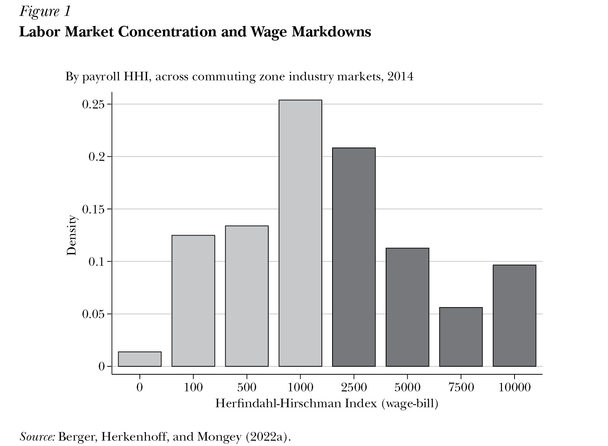
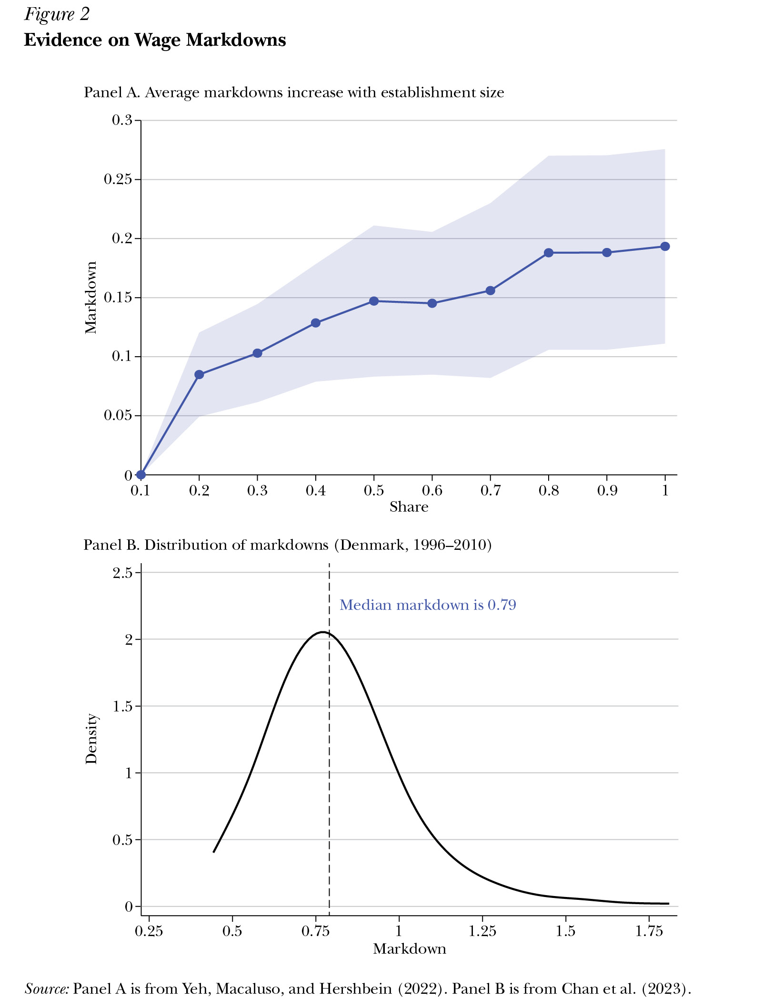

*David Berger, Kyle Herkenhoff, and Simon Mongey*

```json
{
"article_id": "20251456",
"title": "Labor Market Power: From Micro Evidence to Macro Consequences",
"type": "Symposium",
"symposium_name": "Labor Markets",
"authors": [
	"David Berger (Duke U)",
	"Kyle Herkenhoff (U of Minnesota Twin Cities)",
	"Simon Mongey (Federal Reserve Bank of Minneapolis)"
],
"pages": "93–114",
"doi": "https://doi.org/10.1257/jep.20251456",
"miniabstract": "A macro approach that models large employers' strategic wage-setting behavior—calibrated with micro-level policy estimates—reveals how monopsony generates aggregate misallocation and informs optimal minimum wage and antitrust policies.",
"figures_titles": [
	"Figure 1: Labor Market Concentration and Wage Markdowns",
	"Figure 2: Evidence on Wage Markdowns"
],
"abstract_url": "https://liegroup-dartmouth.github.io/working-aea-jep/papers/v40n1/berger-herkenhoff-mongey/abstract.html",
"paper_url": "https://liegroup-dartmouth.github.io/working-aea-jep/papers/v40n1/berger-herkenhoff-mongey/paper.xhtml",
"figures": [
	"https://liegroup-dartmouth.github.io/working-aea-jep/papers/v40n1/berger-herkenhoff-mongey/image/21.jpg",
	"https://liegroup-dartmouth.github.io/working-aea-jep/papers/v40n1/berger-herkenhoff-mongey/image/22.jpg"
],
"figures_data": [
	"https://liegroup-dartmouth.github.io/working-aea-jep/papers/v40n1/berger-herkenhoff-mongey/image-data/21.csv",
	"https://liegroup-dartmouth.github.io/working-aea-jep/papers/v40n1/berger-herkenhoff-mongey/image-data/22.csv"
]
}
```

In a textbook model of perfect competition in labor markets, workers' wage compensation is determined by the interaction of demand from atomistic firms and supply of individual workers. But in real-world labor markets, employment and compensation are often determined in a setting where the demand-side of a local labor market for a certain industry is dominated by a few large local employers—or sometimes, even a single large employer. According to the US Bureau of Labor Statistics (2025), out of 132 million private industry workers in March 2025, 16 million worked at establishments with 1,000 or more workers, another 8 million at establishments with 500–999 workers, and 12 million more at establishments with 250–499 workers. (Remember, an establishment is a physical location where a business operates and hires; a large firm will consist of multiple establishments.) A substantial and growing body of recent research has examined the microeconomic and macroeconomic implications of the way these large firms exercise their labor market power.

This essay argues that understanding labor market power requires a macro perspective. Well-identified micro estimates are indispensable for documenting wage-setting power and pinning down key elasticities. But labor market power is concentrated among large employers in local markets that are themselves highly concentrated, and in these settings micro evidence alone is not sufficient. Once dominant employers are present, three mechanisms amplify the aggregate consequences of monopsony. *Granularity* (or the pure largeness of the firm) means that their wage and hiring decisions mechanically move market-wide averages because these firms account for a large share of employment. *Strategic interaction* arises because dominant employers internalize their outsized footprint and understand that their choices directly shift wages and employment in the broader market. *Misallocation* follows when the largest and most productive employers restrict hiring, pushing workers toward less efficient firms and thereby magnifying welfare losses.

These macro channels pose significant challenges to existing theoretical and empirical "micro approaches" that rely on small, atomistic firm behavior. Yet, the markets in which the assumptions underpinning the micro approach fail are precisely the markets that motivate the most pressing policy debates—noncompetes, no-poach agreements, and merger enforcement—and in which scope for monopsony is most severe. To make progress, we propose a macro approach in which researchers build and estimate theoretical models of granular firms harnessing both aggregate data and micro empirical estimates. We argue that the macro channels invert conventional policy prescriptions. The most effective interventions directly target dominant employers—through antitrust enforcement, limits on restrictive contracting such as noncompete clauses, and related tools—while broad-based policies like minimum wages are often poorly aimed at the firms exercising the most market power.

We begin by defining concentration in labor markets using the Herfindahl-Hirschman Index (HHI) and documenting the extent to which workers face concentrated employer demand. We then examine evidence that in concentrated labor markets, workers are paid significantly less than their marginal product—across different approaches and data sources, the median firm pays its workers between 70 and 80 percent of their marginal product. We discuss how the three macro mechanisms propagate these wage markdowns into aggregate welfare losses: across a range of methodologies, these losses total more than 7.6 percent of a typical household's lifetime consumption, and wage gains from eliminating labor market power can exceed 30 percent in the most concentrated markets (Berger, Herkenhoff, and Mongey 2022a; Jarosch, Nimczik, and Sorkin 2024). We then discuss the conceptual limitations of the traditional theoretical and empirical micro approach, which requires an assumption of small, atomistic firms. We outline the macro approach to monopsony, explaining how to harness both aggregate and identified micro elasticities to learn about spillovers and granular firm behavior. Finally, we examine the policy implications of this macro perspective, emphasizing how concentration among large employers changes which interventions are most effective.

## Measuring Labor Market Concentration

To define a labor market, we start with the idea that these markets happen within the geographic area in which people live and work (Berger, Herkenhoff, Mongey 2022a). We use the idea of a "commuting zone" developed by researchers at the US Department of Agriculture (USDA Economic Research Service 2025), who use county-level data to divide the US economy into 592 commuting zones, which as the name suggests are determined by the extent of actual commuting patterns within these areas. In addition, most workers have a degree of industry-specific knowledge and thus tend to look for jobs within a certain industrial sector. Here, we focus on 96 industries as classified at the three-digit level in the North American Industry Classification System (NAICS), which is meant to strike a balance between the more general classification of 20 sectors at two-digit level and the 1,012 sectors at the highly detailed six-digit level.

To measure concentration across labor markets, we adopt the well-known Herfindahl-Hirschman Index. In the labor market context, the HHI is computed by determining the market share of each company in a labor market—that is, their payroll divided by the total payroll of their competitors in that three-digit industry sector in a given commuting zone—then squaring and summing those shares. In several theories of noncompetitive labor markets, HHIs emerge as a sufficient statistic for a market's competitiveness. For example, Berger, Herkenhoff, and Mongey (2022a) show that because wage-setting power in oligopsony models is a direct function of a firm's share of total payroll, the correct statistic is a wage-bill-weighted HHI. At an intuitive level, when a few firms dominate employment and hiring in a certain commuting zone and industry labor market, job-seeking workers repeatedly encounter these same employers, and what matters is how much of total wages they are paying. Jarosch, Nimczik, and Sorkin (2024) provide a complementary micro foundation for the HHI, showing that the HHI is a natural summary of labor market competitiveness when workers search for jobs in concentrated market.

[Figure 1](#_idTextAnchor025) shows that many US labor markets, as defined by commuting zone and three-digit industry sector, are quite concentrated. Each bar shows the share of total labor income in the economy paid in markets with particular concentration levels. For example, the tallest bar shows that 25 percent of total labor income is paid in local labor markets with an Herfindahl-Hirschman Index of around 1000, which corresponds to the level of competition generated by ten equally-sized firms. While the average labor market has more than 100 firms, employment and wage payments are highly concentrated among dominant firms. The US antitrust authorities at the Federal Trade Commission and the Antitrust Division of the US Department of Justice often use an HHI of 2500 as a rough rule-of-thumb for whether they should be concerned about the effects of a proposed merger. As the dark gray bars show, approximately 40 percent of total wage payments in the US economy are made in labor markets that are at or above this threshold.

<a id="_idTextAnchor025"></a>



Similar measures of concentration emerge with other measurement approaches. Azar, Marinescu, and Steinbaum (2022) compute Herfindahl-Hirschman Indexes using job postings rather than wage payments, defining market share as the share of vacancies or applications received in local markets. Despite these methodological differences, they find approximately 40 percent of markets are highly concentrated, in the sense that they exceeding the commonly used HHI threshold of 2500. A high degree of labor market concentration appears to be a robust empirical phenomenon.

## Labor Market Power at the Firm Level

### Traditional Sources of Labor Market Power

Real-world labor markets are far from a textbook example of supply and demand for a homogeneous product being traded in a frictionless and full-information market. As a result, there are several reasons why employers have a degree of market power even without raising issues related to large or concentrated employers.

First, jobs differ in amenities, tasks, schedules, and workplace conditions, and workers place heterogeneous value on these characteristics. As a result, no two firms are perfect substitutes from the workers' perspective, giving even atomistic firms a degree of wage-setting power. Because workers sort toward employers whose characteristics they value, each firm faces its own upward-sloping labor supply curve, rather than competing in a common spot market. Several issues are interrelated here: worker sorting, compensating differentials, rent sharing, and imperfect competition, but the key point is that differentiation across jobs gives firms market power. Recent papers support the quantitative importance of this mechanism. Lamadon, Mogstad, and Setzler (2022) estimate a model using matched US worker-employer tax data from 2001 to 2015 that allows workers to differ in their preferences over employers and firms to differ in productivity and hiring behavior. They show that these forms of heterogeneity are not enough to replicate the observed wage and mobility patterns unless firms also have market power in setting wages. Similarly, Card, Heining, and Kline (2013) document large firm-specific wage components in West Germany, underscoring the central role of employers in wage determination.

Second, a job search requires time and effort, and mobility to new jobs is often costly (buying or selling a home, changing children's schools, and other costs), so workers cannot move seamlessly between jobs—even when those jobs are otherwise functionally identical. The canonical search model of Burdett and Mortensen (1998) demonstrates how these frictions naturally generate labor market power. Firms recognize that workers cannot instantly switch employers, creating room for monopsonistic wage-setting below competitive levels. Some firms choose to pay higher wages to attract workers more quickly, while other firms opt for lower wages, accepting higher turnover and slower hiring. Search frictions effectively create bilateral monopoly situations and generate the kind of firm-level wage-setting power emphasized in Manning's (2003) synthesis of the modern monopsony literature.

These search frictions provide a micro-foundation for why the labor supply curve facing each is upward sloping, even when firms are small. Our focus in this essay is on how these traditional sources of monopsony interact with granularity and market structure when some firms are very large. Recent work such as Jarosch, Nimczik, and Sorkin (2024) explicitly combines frictional search with big firms in concentrated labor markets, showing how granular employers use their position in the job ladder to shape wages. Our "macro approach" can be viewed as building on this search tradition—using rich worker-firm data and models with large employers to measure the resulting wedges and trace out their aggregate consequences.

Third, workers will have incomplete information about their "outside options"—that is, the alternative jobs that are available to them in the labor market and how much those jobs would pay. For a review of early theoretic foundations for monopsony power that stem from incomplete information about job offers, a useful starting point is Mortensen and Pissarides (1999). Recent incarnations appeal to the theory of "rational inattention" to motivate monopsony power—that is, a typical worker will not find it worthwhile to spend the ongoing time and energy needed to gather information on evolving "outside options" (Cheremukhin, Restrepo-Echavarria, and Tutino 2020; Cheremukhin and Restrepo-Echavarria 2025). In a survey of German workers, Jäger et al. (2024) find that most workers wrongly believe that alternative wages are very close to present wages. For example, "workers that would experience a 10% wage change if switching to their outside option only expect a 1% change." Such biased and limited information about outside options exacerbates labor market power for employers.

### Quantitative Measures of Labor Market Power

In product markets, a firm with market power may choose to reduce its output, increase prices, and reap higher profits. Similarly, a firm with labor market power may strategically decide to reduce its labor demand in order to pay lower wages. Recent quantitative theories of labor market power focus on how large firms in concentrated markets can exploit labor market imperfections to extract worker rents through monopsony power. For example, Berger, Herkenhoff, and Mongey (2022a) study oligopsonistic competition and show that larger, more granular firms as measured by market share will markdown wages much more than smaller atomistic firms.

However, measuring these markdowns—that is, the gap between wages and the marginal revenue product of workers—is not straightforward. Marginal revenue is almost never directly observable; instead, it must be estimated from production functions.

In one prominent study of markdowns, Yeh, Macaluso, and Hershbein (2022) use data on US manufacturing firms from the Census of Manufactures (comprehensive coverage every five years) and the Annual Survey of Manufactures (partial coverage, not including all small firms, but available annually). With data on revenue and inputs of labor, materials, capital, and energy, they estimate plant-level production functions from 1976 to 2014, which in turn allows them to calculate the marginal revenue product of labor. They find that workers are paid about 65–73 percent of their marginal output. This markdown varies substantially across firms. As [Figure 2](#_idTextAnchor026) shows in panel A, when the plants with larger shares of local employment (measured at the county by three-digit industry level), the markdown is systematically greater. In another study of markdowns, Chan et al. (2023) use Danish data and a model to estimate firm-level distributions of productivity, worker ability, markdowns, pass-through, and labor-supply elasticities. They find that the median worker receives about 79 percent of their marginal product in pay as shown in Figure 2, panel B.

<a id="_idTextAnchor026"></a>



When workers have limited outside options, firms gain bargaining power. In frictional labor markets, this power is amplified for large employers who control a substantial share of available jobs. Jarosch, Nimczik, and Sorkin (2024) formalize this mechanism using Austrian data: larger firms that dominate local job listings can credibly threaten to exclude workers from future job opportunities if they reject the firm's terms. This gives granular employers leverage to markdown wages more aggressively than atomistic firms.

This essay is not a literature review. But across these studies—and the broader literature they cite—a consistent pattern emerges: workers in concentrated labor markets typically receive 70–80 percent of their marginal product, with the largest markdowns occurring at the biggest firms.

## When Labor Market Power Cascades to the Macroeconomy

When large employers dominate labor markets, their decisions do not just affect markdowns paid to their own workers. Their actions may cascade through entire economies. In this section, we argue that dominant firms' actions propagate through the economy via three mechanisms: granularity, strategic actions, and misallocation. For each mechanism, we discuss its theoretical basis and supporting empirical evidence.

### Granularity

In common usage, "granular" refers to something small or divided into many parts. However, in the research on labor market power, "granular" is in contrast to the idea of truly atomistic markets—in other words, "granular" means big enough for individual actions to matter. This difference is not just a theoretical curiosity: as Figure 1 shows, in 11 percent of US labor markets, a single employer accounts for at least 11 percent of the wage bill, and the average labor market has concentration equivalent to just nine equally-sized firms. When firms are this large, their actions—or shocks and policies that affect them—can influence market-, state-, and even national-level aggregates.

What does it mean to be a granular firm in a labor market? Formally, if firm *i* commands wage-bill share *s*<sub>i</sub>, then a 1 percent wage change at that granular firm moves the average market wage by *s*<sub>i</sub> percent, regardless of any strategic considerations. Consider an average labor market in which the Herfindahl-Hirschman Index corresponds to nine equally-sized firms, each hypothetically controlling 11 percent of the market. If, say, Amazon employs 11 percent of the "Warehousing and Storage" workers in a commuting zone (a three-digit industrial code), its wage decisions mechanically move the market average wage by 11 percent.

The pure granularity effect has a long and well-explored literature in product markets. For example, Gabaix (2011) argued that idiosyncratic shocks to the 100 largest US firms explain one-third of variation in output growth. The same logic applies to labor markets. Kovalenko, Schnabel, and Stüber (2022) adapted the approach of Gabaix (2011) to show that the largest firms in Germany are the main drivers of aggregate employment dynamics. Esquierro and da Silva (2024) provide a similar analysis for Brazil, finding that public firms are important in understanding granularity in that context.

### Strategic Interaction

In an extreme example with identical workers and a single firm, the monopsony firm will set wages to the workers' common outside option and extract all rents from workers. Early theoretical models of oligopsony labor markets (Bhaskar, Manning, and To 2002; Boal and Ransom 1997) showed how to apply the intuition of this extreme example to markets with a handful of nonatomistic firms that compete strategically for labor. More recent research brings this core oligopsony idea to the data by creating quantitative models that capture key features of high-quality microdata, including rich heterogeneity across firms, workers, and labor markets. When a granular firm competes against other granular firms, these strategic actions are anticipated and responded to. Through this process of market level interaction, the labor market inherently begins to become coordinated around these actions.

A large firm—one that accounts for a meaningful share of local job opportunities—can shape outcomes through several strategic channels. Because its hiring moves the market as a whole, it may choose to restrain its employment in order to keep wage pressure down. This strategic use of hiring to influence market-wide conditions is a core mechanism emphasized in oligopsonistic competition models such as Berger, Herkenhoff, and Mongey (2022a). Understanding that workers' outside options are limited, a granular firm may bargain more aggressively to reduce pay. Jarosch, Nimczik, and Sorkin (2024) show that in frictional labor markets, larger firms controlling a greater share of job listings can credibly threaten to exclude workers from future job opportunities if they reject the firm's wage offers. Finally, because their actions affect policy and other economic actors, granular firms can take indirect actions to suppress wages, including confronting unions (Azkarate-Askasua and Zerecero 2025) or engaging in tacit or explicit collusion (Brooks et al. 2019; Gottfries and Jarosch 2025b).

Whether firms take strategic actions in labor markets is hotly debated. A first approach points to patterns in markdowns as evidence of strategic interactions. Using a structural model and empirical tools, based on comparing the employment and wage responses of firms that have experienced changes in state-level corporate tax laws to those that have not, Berger, Herkenhoff, and Mongey (2022a) find that larger firms within local labor markets have wider markdowns. Our structural model interprets this as evidence of strategic actions. If large firms were not taking strategic actions to exploit their granular role in the labor market, then they would have the same markdown as small firms. On the other hand, a study of a job board for high-paid tech workers rejects strategic oligopsonistic competition in favor of straightforward monopsonistic competition (Roussille and Scuderi 2023). This finding may be surprising, given that high-paid tech workers are a segment of the labor market that has been explicitly subject to anticompetitive behavior between its largest firms via collusive nonpoaching agreements (Posner and Zheng 2025). The tension between these results demands further advances in measurement.

A second approach to testing for strategic actions is to examine spillovers in local labor markets. In an influential study, Staiger, Spetz, and Phibbs (2010) show that strategic responses are large following legislated wage increases at a big firm in the labor market for nurses: Veterans' Administration (VA) hospitals. For every 10 percent increase in wages at a VA hospital, nearby non-VA hospitals increase their wages by 1.28 percent. More recently, Derenoncourt et al. (2021) examined strategic responses to Amazon's 2018 introduction of a $15 voluntary minimum wage. They document that large national competitors quickly followed suit, entirely consistent with large firms best-responding to each other. However, the authors find limited evidence of local wage spillovers to smaller competitors. In contrast, Ashenfelter and Jurajda (2025) study the same Amazon wage shock but focus on McDonald's restaurants—workers in entry-level, high-turnover jobs with little firm-specific skill. They find that McDonald's restaurants within 10 kilometers of Amazon fulfillment centers raised wages significantly in response to Amazon's policy, with larger increases in highly concentrated and low-wage local labor markets.

Some of this tension may stem from differences in how labor markets are defined. Strategic interaction only makes sense relative to a clearly defined labor market—the set of employers who actually compete for the same workers. In empirical work, this situation is typically approximated by geographic-industry or geographic-occupation cells, but competitive boundaries vary substantially across settings. Hospitals compete locally; large retailers set wages nationally; tech firms compete for specialized workers across broad geographies. The mixed spillover evidence may reflect this heterogeneity. Understanding when and where strategic interactions matter requires careful attention to market definition and the degree of substitutability among competing employers. More work is needed to understand when and where strategic interactions drive wage setting, particularly across different types of labor markets and worker skill levels.

A third empirical approach studies events that exogenously increase employer concentration, most notably mergers, on firms' actions in a direct way. While these settings do not directly test strategic wage setting, they offer credible evidence on how firms respond when their labor market power expands. Arnold (2020) analyzes mergers across the entire US economy using Census data and finds that consolidation reduces wages, with larger effects in markets that were already concentrated. Prager and Schmitt (2021) examine hospital mergers and similarly document wage declines for hospital workers following consolidation. These results demonstrate that when concentration rises, firms strategically act to cut wages—behavior inconsistent with a competitive model where employers are atomistic price-takers.

A fourth approach directly analyzes legal agreements, case studies, and rulings to argue that strategic actions are important. Posner (2021) reviews a number of influential cases brought against employers over the last century, while also highlighting a number of ways in which antitrust enforcement has ignored arguably per se illegal strategic behavior on the side of employers. In particular, Starr and Smith (2019) discuss the prevalence of firms that require employees to sign noncompetes and no-poach agreements (a topic Starr explores in greater depth in his paper in this symposium). By 2014 roughly 50 percent of workers earning above $150,000 were bound by noncompetes, while 14 percent of those earning below $40,000 were likewise bound. By 2016, 60 percent of large firms were using no-poach agreements, including the Apple and Google agreements mentioned earlier. Regardless of their legality, the law and economics literature provides complementary evidence on widespread strategic actions by firms in concentrated labor markets.

### Misallocation

In an efficient economy, high-productivity firms will attract additional productive resources—like labor, capital, and land—allowing these firms to expand. Relative to this efficient allocation of resources, if large, productive firms take actions to reduce employment and wages in labor markets, efficiency will be reduced as resources are misallocated.

Consider a local economy in which the engineering productivity of large Tech Firm G is twice that of small startups. In a competitive market, Firm G would continue hiring engineers until wages equal their marginal product. But with market power, profit-maximizing Firm G will restrict hiring to keep wages low. The talented engineers that would work at Firm G in an efficient economy instead work for lower wages at less productive startups, where their skills generate half the value. Overall economic productivity is lower as a result.

Large markdowns at the most productive firms are especially distorting. The studies mentioned earlier, including Yeh, Macaluso, and Hershbein (2022) on US manufacturing plants, establish that large firms have larger markdowns. This result holds true in a number of different countries and industries, suggesting wide scope for reallocation to improve economic efficiency.

Do policies that reduce monopsony power actually induce such reallocation? Dustmann et al. (2022) document strong patterns of reallocation from small to large firms in Germany following their large minimum wage hike in 2008. Workers moved toward more productive employers, suggesting that reallocation may be an important source of gains from minimum wages and other policies that address monopsony. More broadly, Carlsson, Messina, and Skans (2021) demonstrate that policies affecting firm-level shocks can drive substantial reallocation in the Swedish labor market, underscoring that labor market frictions shape how workers sort across firms of varying productivity.

## Measuring the Aggregate Effects of Labor Market Power

The evidence reviewed above shows that workers in concentrated labor markets are typically paid well below their marginal product, with the largest markdowns occurring at the biggest firms. But the implications of labor market power extend well beyond direct pay suppression. When large employers dominate local labor markets, their decisions reshape outside options throughout the market and affect how labor is allocated across firms. We previously documented empirical patterns consistent with granularity, strategic interaction, and misallocation. In this section, we examine how incorporating these three mechanisms into quantitative models substantially amplifies the estimated aggregate costs of labor market power compared to models with atomistic firms.

A natural benchmark comes from a model that captures direct wage suppression, but without strategic interaction among large firms. In a study mentioned earlier, Lamadon, Mogstad, and Setzler (2022) estimate such a structural model using matched US worker-firm tax records from 2001 to 2015. In their model, workers differ in their preferences over employers and firms differ in productivity and hiring behavior. This rich heterogeneity generates meaningful wage dispersion and sorting, but firms behave as atomistic wage-takers: even large employers take market wages as given rather than recognizing their ability to influence them. Using this framework, they estimate that eliminating labor market frictions and distortions would raise output by 3 percent and welfare by 5 percent. These losses reflect direct markdowns—firms paying workers less than their marginal product—but not the amplification that arises when dominant firms can move market wages or strategically suppress hiring. Lamadon, Mogstad, and Setzler therefore provide a lower bound on the aggregate costs of monopsony power.

Allowing for granular firms that recognize their influence on market conditions substantially increases the implied macro losses. Berger, Herkenhoff, and Mongey (2022a) develop a general-equilibrium model in which large, granular employers internalize that their wage and hiring decisions affect market wages—and anticipate the responses of other large firms. Using variation from state corporate tax changes to discipline the model, they find that eliminating distortions raises output by 20.9 percent and welfare by 7.6 percent. Output gains are seven times larger than the Lamadon, Mogstad, and Setzler (2022) benchmark, while welfare gains are 50 percent larger. This gap captures the contribution of strategic interaction: if large firms behaved like atomistic competitors, their markdowns would resemble those of small firms rather than being systematically wider.

A major reason the aggregate losses rise so sharply in the Berger, Herkenhoff, and Mongey (2022a) framework is misallocation. When dominant firms restrict hiring to keep wages low, workers who would be most productive at those firms end up at less productive employers. The empirical patterns documented earlier—larger markdowns at the largest and most productive firms—mirror this mechanism. In this paper, we show that misallocation accounts for about 60 percent of the output gap between the efficient allocation and the observed allocation with monopsony power. In other words, much of the aggregate cost arises not from the lower wages themselves but from the fact that workers end up in the wrong jobs.

Labor market power also shapes the wage distribution. In a model in which granular firms in a concentrated local market do not compete against themselves to offer higher wages, Jarosch, Nimczik, and Sorkin (2024) find based on Austrian data that eliminating labor market power would raise wages by 2.6 percent on average, and 30 percent in the most concentrated markets. High earners gain the most from eliminating monopsony, because they are disproportionately employed at the largest firms with the widest markdowns. These distributional effects run counter to the view that monopsony primarily hurts the lowest paid, highlighting significant policy implications that differ markedly from standard competitive models.

Finally, interactions across sources of monopsony power and the aforementioned macro propagation mechanisms may also be nonlinear. In Berger et al. (2024), we develop and estimate a model in which three sources of labor market monopsony interact: traditional (based on heterogeneous preferences of workers and search costs) and new (granular employers). Using estimates based on Norwegian data, we infer an average markdown of 21 percent, suggesting significant labor market power. Policy experiments reveal strong complementarities: removing search frictions narrows markdowns by 60 percent and significantly improves the allocation of workers to firms. In particular, many more workers reach the highest productivity firm at the top of the job ladder. Increasing competition in the bargaining process—shifting from duopsony to triopsony during wage renegotiations—narrows markdowns by 50 percent. Removing preference-based sources of monopsony narrows markdowns by 30 percent. That these numbers sum to greater than 100 percent indicates significant nonlinearities in how sources of monopsony power interact.

## Implications of Large Firms for Micro Methods

When large firms affect the economy through granularity, strategic actions, and misallocation, then the microeconomic methods of analyzing labor market power face fundamental challenges. The core problem is that the conventional micro methods rely on atomistic firm behavior, but granular firms create spillover effects that contaminate standard identification strategies.

As an example, suppose Firm A pays wages of $100 and after being the only firm in the market to receive a new patent, it expands its employment from 100 to 110 workers. How can we tell whether Firm A has labor market power? If Firm A was competitive, and thus faces a perfectly elastic supply curve of workers, it would expand its employment at the market wage—remember, the positive shock only affects Firm A. However, if Firm A has labor market power, then it faces an upward-sloping supply curve of potential workers, and expanding employment will require increasing wages, say to $110. In a micro empirical approach, Firm A's labor market power can be inferred from how much wages increase in order to increase employment, using other firms as a control group to estimate the treatment effect of the patent on wages and employment at Firm A.

This distinction between treatment and control fails in the setting of concentrated labor markets with a handful of dominant large employers. Suppose that the labor market has another large firm, Firm B, that also pays $100 and employs 100 workers. Both firms are granular. In equilibrium, Firm A's 10 new hires all come from Firm B. Comparing employment changes at the treated Firm A to the control Firm B delivers a swing in employment of 20 workers for a $10 wage increase. This contaminated estimate, which includes spillover effects to other firms, is what we call an *empirical elasticity*. It exceeds the true responsiveness of employment to wages at Firm A: an increase of 10 workers for a $10 wage increase. This true responsiveness, purged of spillovers, is what we call a *structural elasticity*. If Firm B responds by increasing its wages—that is, if Firm B takes a strategic action in response to Firm A's wage increase—the empirical elasticity becomes even more contaminated by general equilibrium effects and the picture gets murkier still.

What we will call the *macro approach* explicitly accounts for spillovers from treated firms to control firms that naturally occur in concentrated labor markets. By explicitly modeling the spillovers between Firm A and Firm B, researchers using the macro approach can recover the true responsiveness of employment to wages. This yields accurate estimates of the structural labor market power of firms, and accurate evaluations of policies that interact with labor market power.

### Regression-Based Methods

The micro approach we just described is a difference-in-differences design, one of a family of regression-based methods that offer transparent identification and easy interpretation. The seminal Card and Krueger (1994) study of the effects of New Jersey's minimum wage on fast-food restaurant employment exemplifies this approach. Employment changes at treated establishments in New Jersey (which raised its minimum wage) are compared to a control group of establishments in Pennsylvania (which did not). This design has been enormously influential, particularly in the study of labor markets—for example, in comparing wages in local areas that have experienced a merger that led to an increase in labor market concentration to those that had not (Arnold 2020); in comparing wages of workers with industry-specific skills in areas that had a substantial rise in labor market concentration from hospital mergers to areas that did not (Prager and Schmitt 2021); and in comparing how states that have seen a change in enforcement levels for noncompete agreements have lower wage increases than those that have not seen such a change (Johnson, Lavetti, and Lipsitz 2025).

However, these approaches rest on what researchers call the Stable Unit Treatment Value Assumption, which means that treating one group does not affect the control group. In fast food markets, what happens in New Jersey stays in New Jersey. This assumption holds under the traditional micro-based view of monopsony power in which firms are atomistic. But when labor markets are dominated by large employers, this assumption can fail in ways that create challenges for these research designs.

Consider three concrete ways the Stable Unit Treatment Value Assumption may fail in concentrated markets with dominant employers. First, large firms often operate across borders. When Walmart faces higher minimum wages in New Jersey, it might shift hours to Pennsylvania stores, contaminating the control group. Second, spillovers occur when large employers in Pennsylvania preemptively raise wages to retain workers who might otherwise cross the border to New Jersey for higher pay. Third, in other contexts, supply chain connections mean that when a major employer like Amazon adjusts wages in one state, its suppliers and competitors across state lines respond.

In short, markets with dominant employers—where economic policy would presumably have its largest effects—are also the settings that violate the Stable Unit Treatment Value Assumption.

### Industrial Organization Methods

Common industrial organization methods measure labor market power by comparing a direct estimate of a worker's contribution to value-added to their current wage, as discussed earlier. But this computation of labor market power typically assumes that today's wage is all that workers and firms care about.

But this assumption may not hold true. In models by Jungerman (2023), Berger et al. (2024), and very recently Agostinelli et al. (2025), granular firms recognize how they influence not only current wages, but also the entire time path of compensation. Workers may accept lower current wages in exchange for training or higher future pay, making current wage comparisons misleading. Using data from Norway that allow them to separate the heterogeneous values that workers place on nonwage amenities, firm granularity, and search frictions, Berger et al. (2024) find that wage backloading accounts for 70 percent of markdowns measured from current wages. Under these alternative theories, the current wage at a granular firm is an inappropriate benchmark for computing labor market power.

### The Macro Approach: A Symbiosis of Theory and Micro Estimates

Once researchers recognize the presence of granular employers, strategic actions, and their equilibrium spillovers, how can they proceed? The macro approach offers one path forward by embedding the *empirical elasticities* we described earlier within general equilibrium models that account for spillovers and strategic interaction (Berger, Herkenhoff, and Mongey 2022a). This approach produces quantitative models that capture granularity, strategic actions, and misallocation, while being disciplined by micro data.

The macro approach consists of four steps. First, write down a theory of large firms in concentrated markets, capturing granular firms, strategic actions, and general equilibrium effects (as discussed earlier). Second, choose parameters of the model to ensure that it produces the same *empirical elasticities*, estimated from micro methods, when subjected to the same shock (say, it replicates the employment responses of firms in New Jersey following a large increase in the minimum wage). Third, because the *empirical elasticities* are contaminated by spillovers (as just noted), use the model to compute the sought-after *structural elasticities,* which are purged of spillovers. Fourth, use the framework to conduct counterfactuals that measure the positive and normative properties of alternative policies.

The key conceptual advance is in steps 2 and 3. The model can be disciplined by empirical elasticities, which are contaminated, and then produce structural elasticities, which are not. This approach produces a "big tent": micro empirical methods to inform macro model-based counterfactuals.

Amodio, Medina, and Morlacco (2025) provide a clear illustration. First, they write down a general equilibrium model where large manufacturing firms in concentrated local labor markets compete oligopsonistically for workers, while workers can choose between wage employment and self-employment. Second, they use the staggered rollout of Peru's rural electrification program for causal identification, allowing them to estimate how electrification differentially affects employment at firms with varying constraints in accessing electricity. They calibrate their model parameters so that when electrification occurs in the model, it replicates these empirical elasticities, while also matching cross-sectional correlations between market concentration and labor market outcomes. These correlations directly discipline the magnitude of general equilibrium spillovers by capturing how workers sort between sectors in response to market structure changes. Third, they use the model to recover structural elasticities that account for general equilibrium spillovers, including how electrification affects the sorting of workers between wage employment and self-employment, which changes the labor supply elasticity and amplifies or dampens the policy effects. Fourth, they use these structural elasticities to evaluate how labor market power affects the success of industrial development policies, finding that policies are only effective when they directly address the concentration of labor market power among large firms.

Of course, the macro approach typically requires stronger modeling assumptions than reduced-form micro evidence. However, it also provides an internally consistent way to measure labor market power among dominant employers and to evaluate policy counterfactuals. And it is precisely in markets with large firms and high concentration—where labor market power is most severe—that such macro tools are most informative and where policy interventions may be most needed. This makes the macro approach a valuable complement to existing micro methods.

## Implications for Labor Market Policies

The macro approach gives a new perspective on policies designed to counteract firms' labor market power. In markets with large firms and substantial concentration, it qualifies the standard view of minimum wages as a primary tool against monopsony power. We then discuss more promising policies—such as antitrust enforcement and noncompete bans—that more directly target dominant employers in concentrated markets.

### The Promise and Limitations of Minimum Wages

Minimum wages have long been viewed as the natural policy response to monopsony power. Joan Robinson's (1933) classic analysis showed that a monopsonist hiring below the competitive wage could be induced to raise wages to the competitive level through a binding minimum wage, increasing both wages and employment while eliminating the deadweight loss from labor market distortions. This insight has motivated decades of minimum wage advocacy as a remedy for labor market power.

However, this analysis assumes a single dominant employer, whereas in reality labor markets contain multiple firms of varying productivities. As we documented earlier, large firms have systematically larger markdowns. The presence of large firms in concentrated markets taking strategic actions fundamentally changes the picture, requiring a macro approach to understand minimum wage effects. Minimum wages now operate through three channels: direct effects on constrained firms, spillovers to unconstrained competitors, and reallocation from small to large establishments.

In Berger, Herkenhoff, and Mongey (2025), we ask: how well does a national minimum wage eliminate the deadweight loss from labor market power in the face of these realities? We develop a model that captures all three channels, while remaining consistent with well-identified empirical evidence from recent minimum wage increases in Seattle, Minneapolis, Brazil, and Germany (Jardim et al. 2022; Karabarbounis, Lise, and Nath 2022; Engbom and Moser 2022; Dustmann et al. 2022). Following the macro approach, we use these *empirical elasticities* to recover the *structural elasticities* governing monopsony power, then conduct general equilibrium policy analysis. We compute an optimal minimum wage of $8, generating welfare gains equivalent to 0.2 percent of lifetime consumption.

These modest gains emerge entirely through channels absent in traditional models. Granularity drives a beneficial reallocation mechanism: higher minimum wages constrain small, low-productivity firms, inducing workers to move toward large, high-productivity employers. However, the optimal minimum wage remains modest because spillovers—while present—are not strong enough to substantially reduce markdowns at the biggest firms, which have the most market power and generate the largest deadweight losses. Raising the minimum wage too high rations workers out of employment at small firms without meaningfully constraining the dominant employers responsible for most welfare losses. Under a counterfactual assumption that firms are atomistic, the optimal minimum wage collapses to just $0.70, with essentially zero welfare gains because the reallocation channel shuts down entirely.

Our macro approach also explains why micro empirical studies of different labor markets often find conflicting results. As we discussed earlier, there is considerable heterogeneity across the concentration of labor markets. In our model, minimum wages are more likely to generate positive employment effects via general equilibrium spillovers in the labor markets that are concentrated. However, in the unconcentrated markets that are closer to the textbook theory of competitive markets, minimum wages primarily generate negative employment effects. This is consistent with empirical evidence (for example, Azar et al. 2024; Popp 2024). The heterogeneity in empirical findings about minimum wages thus reflects real differences in market structure rather than methodological inconsistencies or identification failures.

The macro approach also reveals fundamental limitations of minimum wage policy for addressing labor market power. Recall that 40 percent of wage payments occur in highly concentrated markets where large firms dominate, as shown earlier in Figure 1. Because the large firms that have the most labor market power typically pay above minimum wage, broad-based minimum wage policies miss the core of the problem facing low-wage workers. The minimum wage has no direct effect on the large firms in concentrated labor markets, which are the firms responsible for welfare losses under the macro approach. In our model, an optimally chosen minimum wage captures only about 3 percent of the potential efficiency gains available from eliminating labor market power entirely. These calculations highlight that, while such a minimum wage raises welfare, it leaves most of the efficiency losses from monopsony power untouched, especially in concentrated markets dominated by large firms.

### Noncompete Clauses and Antitrust

Unlike minimum wages that primarily constrain smaller firms with limited labor market power, several policies directly target dominant employers.

One such policy would be to ban firms from including noncompete clauses in employment contracts. Between 36 and 60 million US workers are bound by these agreements (Colvin and Shierholz 2019). Using a macro approach with granular firms and search frictions, Gottfries and Jarosch (2025a) find that banning noncompetes raises wages by 4 percent. However, the direct effects—in this case, the higher wages of individual workers whose noncompetes are lifted—are small. However, the *spillover effects* of higher wages of all workers as competition increases are large, highlighting the importance of modeling macro effects. (In this symposium, the essay by Evan Starr focuses on the economics of noncompete agreements.)

Another possible policy is greater antitrust enforcement in labor markets. By modeling granularity explicitly, the macro approach can be used to study how mergers of large firms are likely to affect wages and employment. In Berger et al. (2025), we adopt this approach and develop a macro model of multi-plant ownership and mergers. We estimate the model on US Census data and show that it reproduces the effects of actual mergers on workers and firms. We then show that stricter antitrust enforcement in labor markets yields large welfare gains for households and mitigates labor market power. This is consistent with the recent direction of US policy; specifically, the 2023 Merger Guidelines promulgated by the Federal Trade Commission and the US Department of Justice explicitly states that the agencies will consider worker harm on a stand-alone basis as a rationale for blocking proposed mergers. (The paper in this symposium by Elena Prager delves more deeply into labor market antitrust issues.)

### Further Extensions and Open Questions

The key insight here is that micro empirical methods measure *direct effects*, but noncompete labor agreements and mergers can lead to aggregate harms for workers that extend far beyond workers directly bound by such agreements. While new models of large firms in concentrated labor markets are a useful starting point, further advances can help to understand trade-offs that these models have so far omitted.

As one example, the existing macro models of labor market power do not weigh welfare gains from reduced labor market power against the potential for noncompete bans and stricter antitrust laws to reduce innovation, investment, research and development, and growth (for example, Cavenaile, Celik, and Tian 2021; Phillips and Zhdanov 2024). Some promising work links labor market power that firms have over narrowly specialized inventors to growth and innovation. For example, incumbent granular firms may engage in defensive hiring of researchers to hinder new competition (Fernández-Villaverde, Yu, and Zanetti 2025; Babalievsky 2022). Other key aspects of labor market power are not yet incorporated into macro models either. What if incumbent granular firms manipulate or control the conditions for occupation licensing, or lobby for nonenforcement of noncompetes?

An overall message emerging from this literature is that because labor market power is concentrated among the largest firms in concentrated labor markets, the most effective interventions in this particular setting will seek to target the source of the largest wage markdowns directly, rather than using broad-based policies that potentially target competitive, low markdown firms as well.

## Conclusion

Evidence for granular firms with monopsonistic labor market power is now substantial. However, the possible ways in which dominant firms shape aggregate labor market outcomes are far from fully explored. How do wage-setting decisions by major employers cascade through regional labor markets? What are the innovation consequences when a handful of firms control access to top talent? How does monopsony power by large retailers affect the allocation of production across supply chains? These questions put dominant firms at the heart of both labor economics and macroeconomic policy.

Our article puts forth three main arguments. First, the presence of large firms in concentrated markets poses challenges for micro approaches to measure labor market power, as these approaches typically rely on the assumption of atomistic firm behavior. Second, once one recognizes the presence of dominant employers, three interconnected mechanisms drive aggregate effects: granularity makes individual firm actions matter for entire markets, which enables strategic interactions that amplify market power, which in turn generates misallocation as productive firms restrict hiring. These mechanisms can reinforce each other. Large firms use their granular position to act strategically, and this strategic behavior pushes workers toward less productive employers. Third, the macro approach of directly modeling and estimating the strength of these mechanisms fundamentally alters policy advice and welfare losses from market power. Because labor market power is concentrated among the largest firms in concentrated markets, effective interventions must target the source of the largest wage markdowns directly rather than broad-based policies that treat all firms equally.

Understanding how dominant firms shape aggregate labor market outcomes is not just an academic exercise. Instead, it is essential for designing labor market policy that puts workers and firms on a more equal footing. The welfare and output losses documented across the research on labor market power are comparable to estimates of those from product market distortions. (As a product market example, Edmond, Midrigan, and Xu (2023) estimate welfare costs of heterogeneous firms and endogenous markups, estimated with US Census of Manufactures data.) The similar magnitude of welfare losses from labor and product market power implies that, for researchers, policymakers, and antitrust authorities, addressing employers' market power in the labor market should be a priority comparable to the study of imperfect competition in product markets.

■  We thank Timothy Taylor for detailed editoral comments. We also thank Gabe Chodorow-Reich, Pat Kline, Jeffrey Kling, Jonathan Parker, Ben Schoefer, Isaac Sorkin, and Daniel Xu for helpful comments on an earlier draft.

## References

**Agostinelli, Francesco, Domenico Ferraro, Giuseppe Sorrenti, and Leonard Treuren.** 2025. "Employment Relationships, Wage Setting, and Labor Market Power." NBER Working Paper 34439.

**Amodio, Francesco, Pamela Medina, and Monica Morlacco.** 2025. "Labor Market Power, Self-Employment, and Development." *American Economic Review* 115 (9): 3014–57.

**Arnold, David.** 2020. "Mergers and Acquisitions, Local Labor Market Concentration, and Worker Outcomes." Preprint, SSRN. [http://dx.doi.org/10.2139/ssrn.3476369](http://dx.doi.org/10.2139/ssrn.3476369).

**Ashenfelter, Orley, and Štěpán Jurajda.** 2025. "McMonopsony." Unpublished.

**Azar, José A., Steven T. Berry, and Ioana Marinescu.** 2022. "Estimating Labor Market Power." NBER Working Paper 30365.

**Azar, José, Emiliano Huet-Vaughn, Ioana Marinescu, Bledi Taska, and Till von Wachter.** 2024. "Minimum Wage Employment Effects and Labor Market Concentration." *Review of Economic Studies* 91 (4): 1843–83.

**Azar, José, Ioana Marinescu, and Marshall Steinbaum.** 2022. "Labor Market Concentration." *Journal of Human Resources* 57 (S), S167–99.

**Azkarate-Askasua, Miren, and Miguel Zerecero.** 2025. "Union and Firm Labor Market Power." Preprint, SSRN. [http://dx.doi.org/10.2139/ssrn.4323492](http://dx.doi.org/10.2139/ssrn.4323492).

**Babalievsky, Fil.** 2022. "Misallocation in the Market for Inventors." Unpublished.

**Bagga, Sadhika.** 2023. "Firm Market Power, Worker Mobility, and Wages in the US Labor Market." *Journal of Labor Economics* 41 (S1): S205–56.

**Belot, Michèle, Philipp Kircher, and Paul Muller.** 2022. "How Wage Announcements Affect Job Search—A Field Experiment." *American Economic Journal: Macroeconomics* 14 (4): 1–67.

**Berger, David, Thomas Hasenzagl, Kyle Herkenhoff, Simon Mongey, and Eric A. Posner.** 2025. "Merger Guidelines for the Labor Market." *Journal of Monetary Economics* 153: 103785.

**Berger, David, Kyle Herkenhoff, Andreas R. Kostøl, and Simon Mongey.** 2024. "An Anatomy of Monopsony: Search Frictions, Amenities, and Bargaining in Concentrated Markets." In *NBER Macroeconomics Annual*, Vol. 38, edited by Martin Eichenbaum, Erik Hurst, and Valerie Ramey, 1–47. University of Chicago Press.

**Berger, David, Kyle Herkenhoff, and Simon Mongey.** 2022a. "Labor Market Power." *American Economic Review* 112 (4): 1147–93.

**Berger, David, Kyle F. Herkenhoff, and Simon Mongey.** 2022b. "Minimum Wages, Efficiency and Welfare." NBER Working Paper 29662.

**Berger, David, Kyle Herkenhoff, and Simon Mongey.** 2025. "Minimum Wages, Efficiency, and Welfare." *Econometrica* 93 (1): 265–301.

**Bhaskar, V., Alan Manning, and Ted To.** 2002. "Oligopsony and Monopsonistic Competition in Labor Markets." *Journal of Economic Perspectives* 16 (2): 155–74.

**Bils, Mark, Barış Kaymak, and Kai-Jie Wu.** 2025. "Robinson Meets Roy: Monopsony Power and Comparative Advantage." NBER Working Paper 34165.

**Bloesch, Justin, Birthe Larsen, and Anders Yding.** 2025. "Monopsony with Recruiting." Preprint, SSRN. [http://dx.doi.org/10.2139/ssrn.5020154](http://dx.doi.org/10.2139/ssrn.5020154).

**Boal, William M., and Michael R. Ransom.** 1997. "Monopsony in the Labor Market." *Journal of Economic Literature* 35 (1): 86–112.

**Brooks, Wyatt J., Joseph P. Kaboski, Yao Amber Li, and Wei Qian.** 2019. "Exploitation of Labor? Classical Monopsony Power and Labor's Share," NBER Working Paper 25660.

**Brooks, Wyatt J., Joseph P. Kaboski, Yao Amber Li, and Wei Qian.** 2021. "Exploitation of Labor? Classical Monopsony Power and Labor's Share." *Journal of Development Economics* 150: 102627.

**Burdett, Kenneth, and Kenneth L. Judd.** 1983. "Equilibrium Price Dispersion." *Econometrica* 51 (4): 955–69.

**Burdett, Kenneth, and Dake T. Mortensen.** 1998. "Wage Differentials, Employer Size, and Unemployment." *International Economic Review* 39 (2): 257–73.

**Caldwell, Sydnee, Ingrid Haegele, and Jörg Heining.** 2025. "Bargaining and Inequality in the Labor Market." NBER Working Paper 33396.

**Card, David, Jörg Heining, and Patrick Kline.** 2013. "Workplace Heterogeneity and the Rise of West German Wage Inequality." *Quarterly Journal of Economics* 128 (3): 967–1015.

**Card, David, and Alan B. Krueger.** 1994. "Minimum Wages and Employment: A Case Study of the Fast-Food Industry in New Jersey and Pennsylvania." *American Economic Review* 84 (4): 772–93.

**Carlsson, Mikael, Julián Messina, and Oskar Nordström Skans.** 2021. "Firm-Level Shocks and Labour Flows." *Economic Journal* 131 (634): 598–623.

**Cavenaile, Laurent, Murat Alp Celik, and Xu Tian.** 2021. "The Dynamic Effects of Antitrust Policy on Growth and Welfare." *Journal of Monetary Economics* 121: 42–59.

**Chan, Mons, Elena Mattana, Sergio Salgado, and Ming Xu.** 2023. "Wage Setting and Passthrough: The Role of Market Power, Production Technology and Adjustment Costs." [http://dx.doi.org/10.2139/ssrn.4544524](http://dx.doi.org/10.2139/ssrn.4544524).

**Cheremukhin, Anton, and Paulina Restrepo-Echavarria.** 2025. "An Information-Based Theory of Monopsony Power." Federal Reserve Bank of Dallas Working Paper 2518.

**Cheremukhin, Anton, Paulina Restrepo-Echavarria, and Antonella Tutino.** 2020. "Targeted Search in Matching Markets." *Journal of Economic Theory* 185: 104956.

**Clemens, Jeffrey, and Michael R. Strain.** 2021. "The Heterogeneous Effects of Large and Small Minimum Wage Changes: Evidence over the Short and Medium Run Using a Pre-analysis Plan." NBER Working Paper 29264.

**Colvin, Alexander J. S., and Heidi Shierholz.** 2019. *Noncompete Agreements: Ubiquitous, Harmful to Wages and to Competition, and Part of a Growing Trend of Employers Requiring Workers to Sign Away Their Rights*. Economic Policy Institute Report.

**Derenoncourt, Ellora, Clemens Noelke, David Weil, and Bledi Taska.** 2021. "Spillover Effects from Voluntary Employer Minimum Wages." NBER Working Paper 29425.

**Dobbelaere, Sabien, Jordi Jaumandreu, and Jacques Mairesse.** 2025. "Market Power and Technology in US Manufacturing." Unpublished.

**Dobbelaere, Sabien, and Jacques Mairesse.** 2013. "Panel Data Estimates of the Production Function and Product and Labor Market Imperfections." *Journal of Applied Econometrics* 28 (1): 1–46.

**Dube, Arindrajit, Jeff Jacobs, Suresh Naidu, and Siddharth Suri.** 2020. "Monopsony in Online Labor Markets." *American Economic Review: Insights* 2 (1): 33–46.

**Dube, Arindrajit, Suresh Naidu, and Adam D. Reich.** 2022. "Power and Dignity in the Low-Wage Labor Market: Theory and Evidence from Wal-Mart Workers." NBER Working Paper 30441.

**Dustmann, Christian, Attila Lindner, Uta Schönberg, Matthias Umkehrer, and Philipp vom Berge.** 2022. "Reallocation Effects of the Minimum Wage." *Quarterly Journal of Economics* 137 (1): 267–328.

**Edmond, Chris, Virgiliu Midrigan, and Daniel Yi Xu.** 2023. "How Costly Are Markups?" *Journal of Political Economy* 131 (7): 1619–75.

**Engbom, Niklas, and Christian Moser.** 2022. "Earnings Inequality and the Minimum Wage: Evidence from Brazil." *American Economic Review* 112 (12): 3803–47.

**Esquierro, Leon, and Sergio da Silva.** 2024. "Is the Brazilian Labor Market Granular?" *Economics Bulletin* 44 (2): 576–85.

**Faberman, R. Jason, Andreas I. Mueller, Ayşegül Şahin, and Giorgio Topa.** 2022. "Job Search Behavior among the Employed and Non-employed." *Econometrica* 90 (4): 1743–79.

**Fernández-Villaverde, Jesús, Yang Yu, and Francesco Zanetti.** 2025. "Defensive Hiring and Creative Destruction." NBER Working Paper 33588.

**Gabaix, Xavier.** 2011. "The Granular Origins of Aggregate Fluctuations." *Econometrica* 79 (3): 733–72.

**Gottfries, Axel, and Gregor Jarosch.** 2025a. "Dynamic Monopsony with Granular Firms." NBER Working Paper 31965.

**Gottfries, Axel, and Gregor Jarosch.** 2025b. "Wage Fixing." NBER Working Paper 33501.

**Hall, Robert E., and Alan B. Krueger.** 2012. "Evidence on the Incidence of Wage Posting, Wage Bargaining, and On-the-Job Search." *American Economic Journal: Macroeconomics* 4 (4): 56–67.

**Hasenzagl, Thomas.** 2024. "Scaling Up: How Technology and Policy Shape Firm Dynamics." Unpublished.

**Holmes, Thomas J., and James A. Schmitz, Jr..** 1994. "Resistance to Technology and Trade between Areas." Federal Reserve Bank of Minneapolis Research Department Staff Report 184.

**Jäger, Simon, Christopher Roth, Nina Roussille, and Benjamin Schoefer.** 2024. "Worker Beliefs about Outside Options." *Quarterly Journal of Economics* 139 (3): 1505–56.

**Jardim, Ekaterina, Mark C. Long, Robert Plotnick, Emma van Inwegen, Jacob Vigdor, and Hilary Wething.** 2022. "Minimum-Wage Increases and Low-Wage Employment: Evidence from Seattle." *American Economic Journal: Economic Policy* 14 (2): 263–314.

**Jarosch, Gregor, Jan Sebastian Nimczik, and Isaac Sorkin.** 2024. "Granular Search, Market Structure, and Wages." *Review of Economic Studies* 91 (6): 3569–607.

**Johnson, Matthew S., Kurt Lavetti, and Michael Lipsitz.** 2025. "The Labor Market Effects of Legal Restrictions on Worker Mobility." *Journal of Political Economy* 133 (9): 2735–93.

**Jungerman, William.** 2023. "Dynamic Monopsony and Human Capital." Unpublished.

**Karabarbounis, Loukas, Jeremy Lise, and Anusha Nath.** 2022. "Minimum Wages and Labor Markets in the Twin Cities." NBER Working Paper 30239.

**Kleiner, Morris M., and Evan J. Soltas.** 2023. "A Welfare Analysis of Occupational Licensing in US States." *Review of Economic Studies* 90 (5): 2481–516.

**Kline, Patrick, Neviana Petkova, Heidi Williams, and Owen Zidar.** 2019. "Who Profits from Patents? Rent-Sharing at Innovative Firms." *Quarterly Journal of Economics* 134 (3): 1343–404.

**Kovalenko, Tim, Claus Schnabel, and Heiko Stüber.** 2022. "Is the German Labour Market Granular?" *Applied Economics Letters* 29 (1): 41–48.

**Kroft, Kory, Yao Luo, Magne Mogstad, and Bradley Setzler.** 2025. "Imperfect Competition and Rents in Labor and Product Markets: The Case of the Construction Industry." *American Economic Review* 115 (9): 2926–69

**Lamadon, Thibaut, Magne Mogstad, and Bradley Setzler.** 2022. "Imperfect Competition, Compensating Differentials, and Rent Sharing in the US Labor Market." *American Economic Review* 112 (1): 169–212.

**Lehr, Nils H.** 2023. "Does Monopsony Matter for Innovation?" Unpublished.

**Manning, Alan.** 2003. *Monopsony in Motion: Imperfect Competition in Labor Markets*. Princeton University Press.

**Mortensen, Dale T., and Christopher A. Pissarides.** 1999. "New Developments in Models of Search in the Labor Market." In *Handbook of Labor Economics*, Vol. 3, edited by Orley C. Ashenfelter and David Card, 2567–627. North-Holland.

**Neumark, David, and Peter Shirley.** 2022. "Myth or Measurement: What Does the New Minimum Wage Research Say about Minimum Wages and Job Loss in the United States?" *Industrial Relations* 61 (4): 384–417.

**Phillips, Gordon M., and Alexei Zhdanov.** 2013. "R&D and the Incentives from Merger and Acquisition Activity." *Review of Financial Studies* 26 (1): 34–78.

**Phillips, Gordon M., and Alexei Zhdanov.** 2024. "Venture Capital Investments, Merger Activity, and Competition Laws around the World." *Review of Corporate Finance Studies* 13 (2): 303–34.

**Popp, Martin.** 2024. "Minimum Wages in Concentrated Labor Markets." IZA Discussion Paper 17357.

**Posner, Eric A.** 2021. *How Antitrust Failed Workers*. Oxford University Press.

**Posner, Eric A., and Ruth Zheng.** 2025. "The Silicon Valley No-Poach Conspiracy." Preprint, SSRN. [http://dx.doi.org/10.2139/ssrn.5245922](http://dx.doi.org/10.2139/ssrn.5245922).

**Prager, Elena, and Matt Schmitt.** 2021. "Employer Consolidation and Wages: Evidence from Hospitals." *American Economic Review* 111 (2): 397–427.

**Robinson, Joan.** 1933. *The Economics of Imperfect Competition*. Macmillan.

**Roussille, Nina, and Benjamin Scuderi.** 2023. "Bidding for Talent: A Test of Conduct in a High-Wage Labor Market." NBER Working Paper 33848.

**Rubens, Michael, Yingjie Wu, and Mingzhi Xu.** 2025. "Estimating Factor Price Markdowns Using Production Models." *International Journal of Industrial Organization* 102: 103177.

**Schmitz, James A., Jr.** 2020. "Monopolies Inflict Great Harm on Low- and Middle-Income Americans." Federal Reserve Bank of Minneapolis Staff Report 601.

**Schmitz, James A., Jr.** 2005. "What Determines Productivity? Lessons from the Dramatic Recovery of the US and Canadian Iron Ore Industries Following Their Early 1980s Crisis." *Journal of Political Economy* 113 (3): 582–625.

**Seegmiller, Bryan.** 2021. "Valuing Labor Market Power: The Role of Productivity Advantages." Unpublished.

**Shi, Liyan.** 2023. "Optimal Regulation of Noncompete Contracts." *Econometrica* 91 (2): 425–63.

**Staiger, Douglas O., Joanne Spetz, and Ciaran S. Phibbs.** 2010. "Is There Monopsony in the Labor Market? Evidence from a Natural Experiment." *Journal of Labor Economics* 28 (2): 211–36.

**Starr, Evan P., J. J. Prescott, and Norman D. Bishara.** 2021. "Noncompete Agreements in the US Labor Force." *Journal of Law and Economics* 64 (1): 53–84.

**Starr, Evan, and Robert H. Smith.** 2019. *The Use, Abuse, and Enforceability of Noncompete and No-Poach Agreements*. Economic Innovation Group Report.

**Trottner, Fabian.** 2025. "A Matter of Taste: A Unified Approach to Modeling Monopsony." Unpublished.

**US Bureau of Labor Statistics.** 2025. *Graphics for Economic News Releases: Employment by Size of Establishment, Private Industry*. [https://www.bls.gov/charts/county-employment-and-wages/employment-by-size.htm](https://www.bls.gov/charts/county-employment-and-wages/employment-by-size.htm) (accessed December 23, 2025).

**USDA Economic Research Service.** 2025. "Commuting Zones and Labor Market Areas." September 4. [https://www.ers.usda.gov/data-products/commuting-zones-and-labor-market-areas](https://www.ers.usda.gov/data-products/commuting-zones-and-labor-market-areas).

**Volpe, Oscar.** 2024. "Job Preferences, Labor Market Power, and Inequality." Unpublished.

**Webber, Douglas A.** 2016. "Firm-Level Monopsony and the Gender Pay Gap." *Industrial Relations* 55 (2): 323–45.

**Yeh, Chen, Claudia Macaluso, and Brad Hershbein.** 2022. "Monopsony in the US Labor Market." *American Economic Review* 112 (7): 2099–138.

■  David Berger is Professor of Economics. Duke University, Durham, North Carolina. Kyle Herkenhoff is Associate Professor of Economic, University of Minnesota, Minneapolis, Minnesota. Simon Mongey is Monetary Advisor, Federal Reserve Bank of Minneapolis, Minneapolis, Minnesota. Their email addresses are [david.berger@duke.edu](mailto:david.berger@duke.edu), [kyle.herkenhoff@gmail.com](mailto:kyle.herkenhoff@gmail.com), and [simon.mongey@frb.mpls.org](mailto:simon.mongey@frb.mpls.org). The views in this paper do not represent those of the Federal Reserve Bank of Minneapolis or the Federal Reserve System.

For supplementary materials such as appendices, datasets, and author disclosure statements, see the article page at [https://doi.org/10.1257/jep.20251456](https://doi.org/10.1257/jep.20251456).