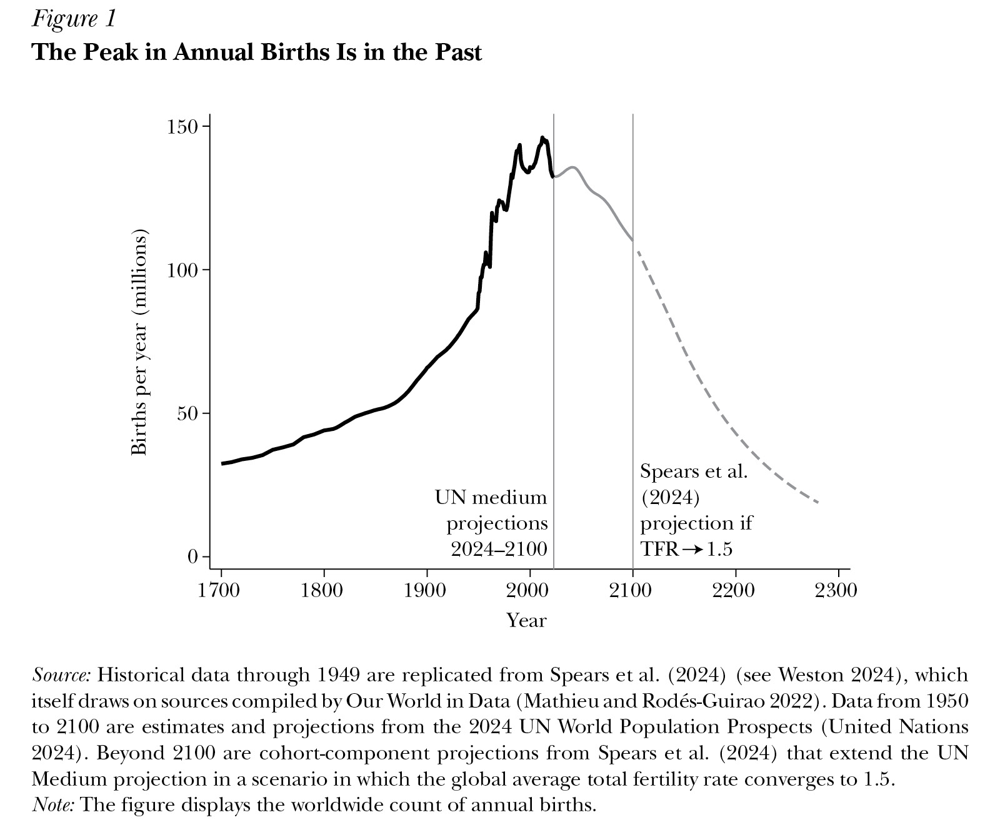
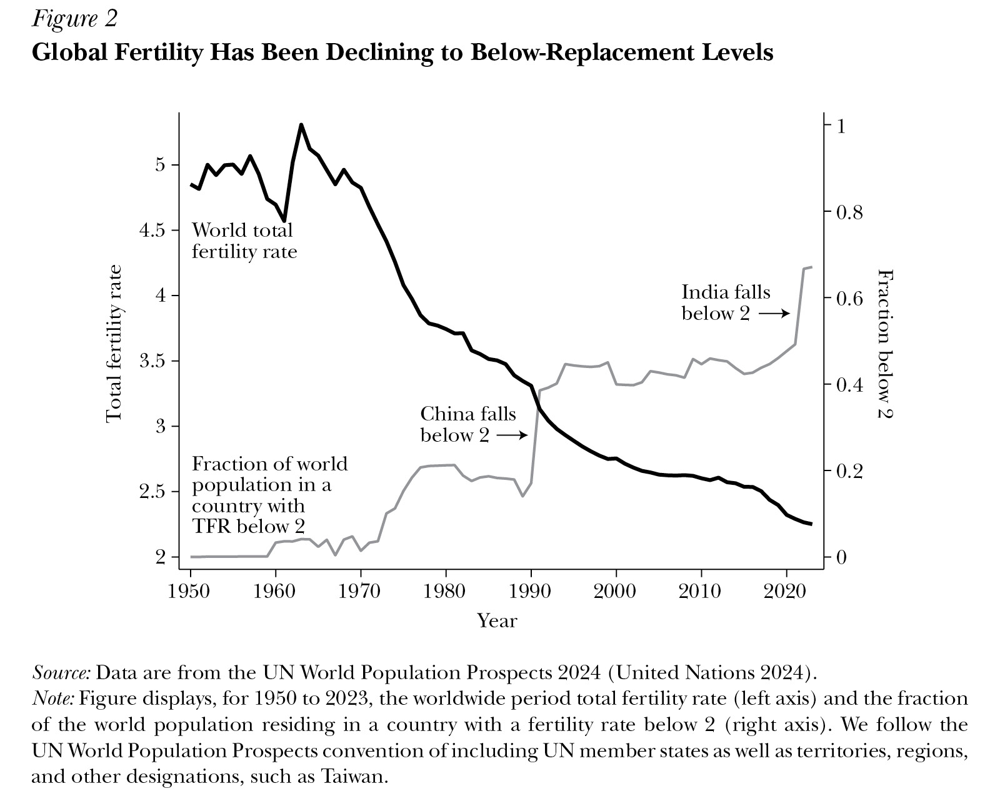
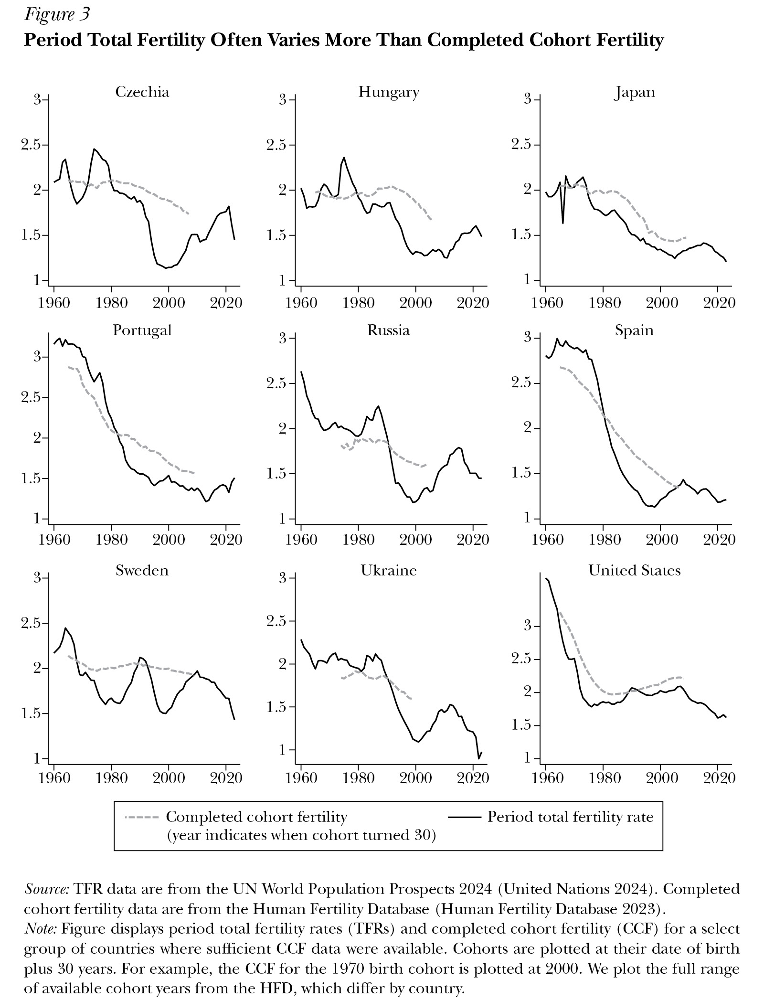
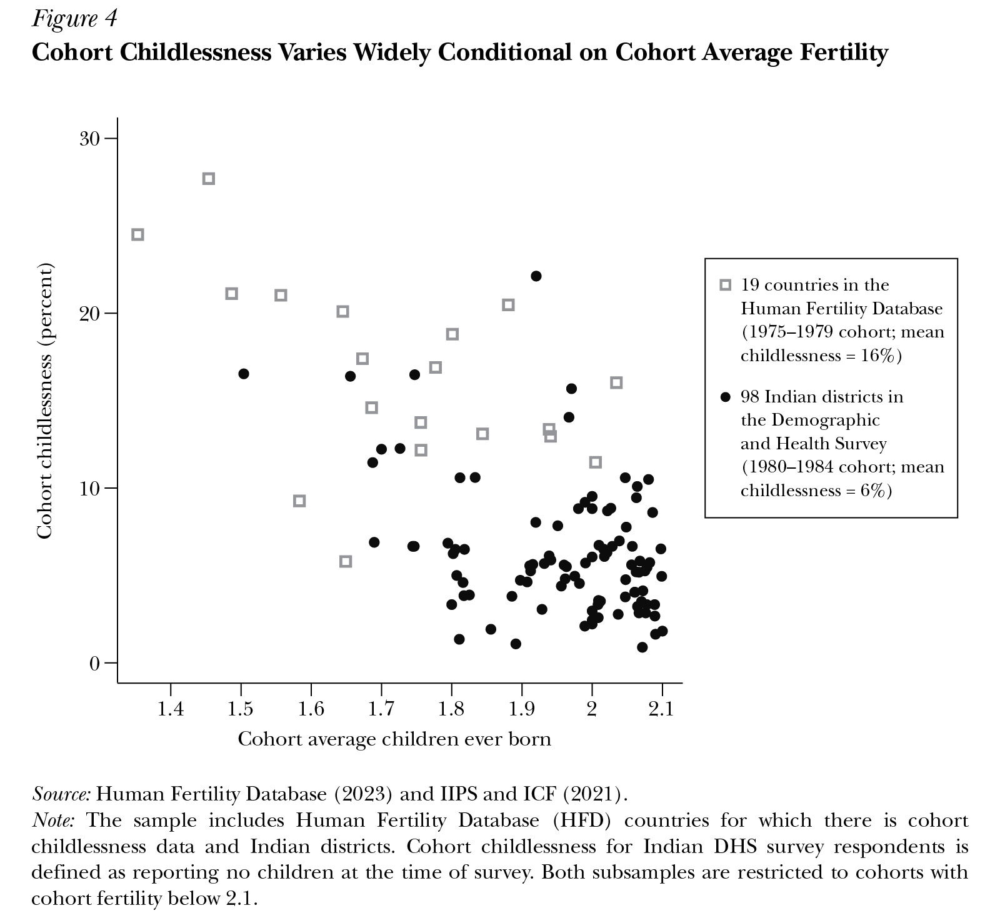
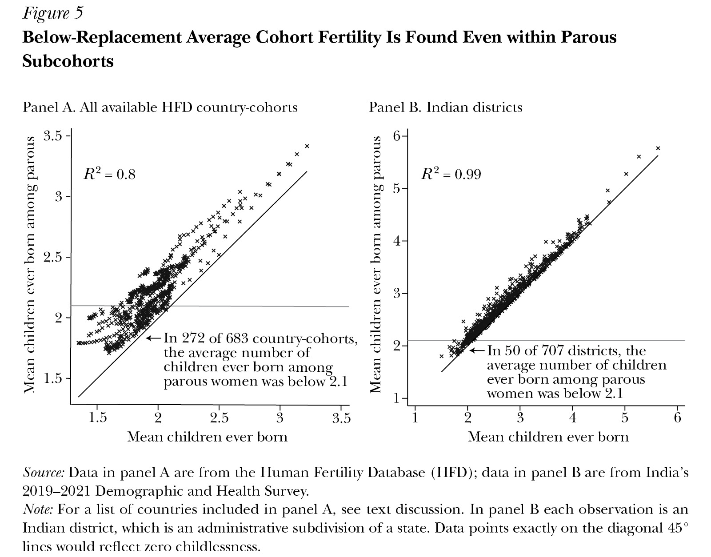
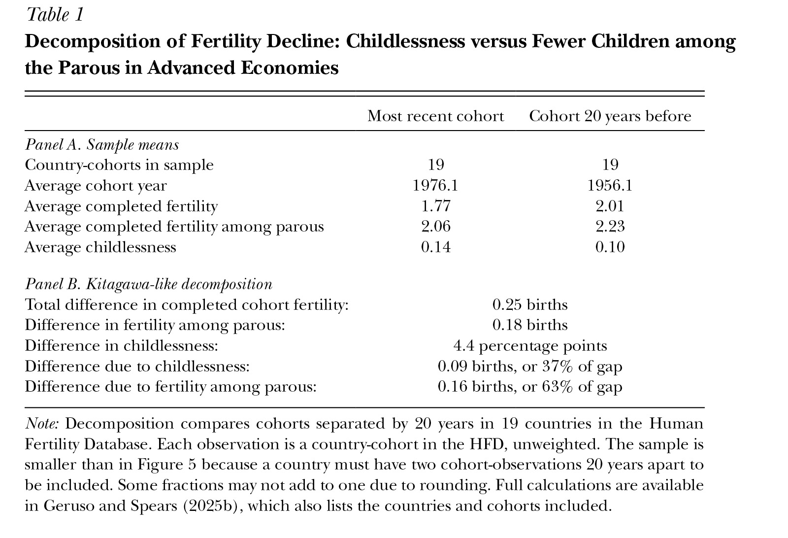
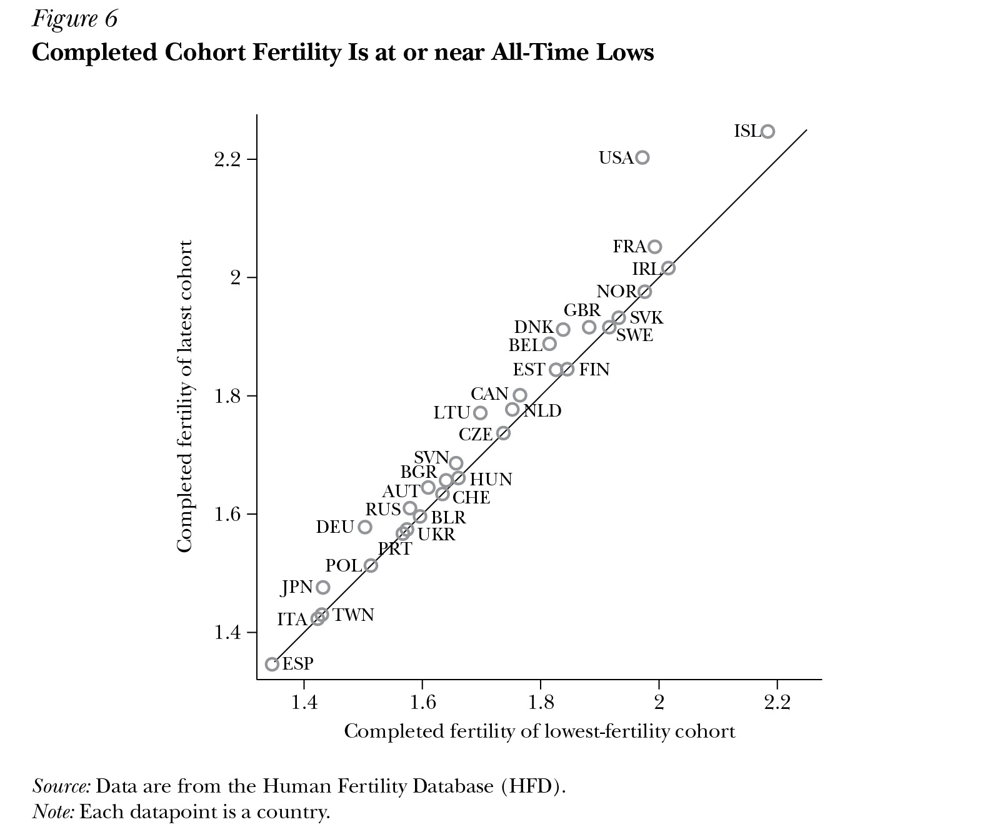
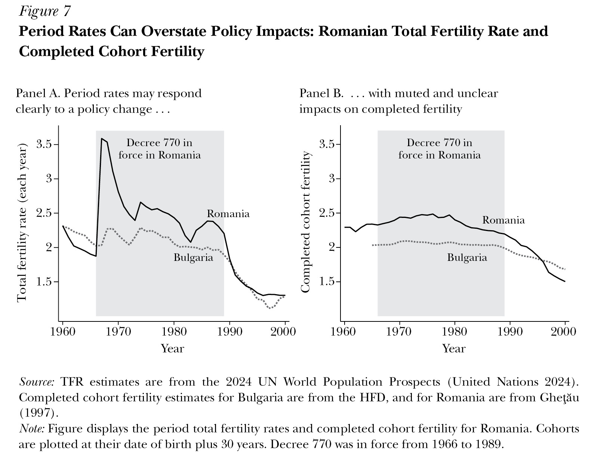

# The Likelihood of Persistently Low Global Fertility

*Michael Geruso and Dean Spears*

```json
{
		"article_id": "20251463",
		"title": "The Likelihood of Persistently Low Global Fertility",
		"type": "Symposium",
		"symposium_name": "Fertility",
		"authors": [
			"Michael Geruso (U of Texas at Austin)",
			"Dean Spears (U of Texas at Austin and IZA, Bonn)"
		],
		"pages": "3–26",
		"doi": "https://doi.org/10.1257/jep.20251463",
		"miniabstract": "Global birth rates have fallen below replacement level for two-thirds of the world's population, and evidence from cohort fertility data—showing that low fertility, once established, does not rebound—suggests persistent sub-replacement fertility is the most likely long-run outcome.",
		"figures_titles": [
			"Figure 1: The Peak in Annual Births Is in the Past",
			"Figure 2: Global Fertility Has Been Declining to Below-Replacement Levels",
			"Figure 3: Period Total Fertility Often Varies More Than Completed Cohort Fertility",
			"Figure 4: Cohort Childlessness Varies Widely Conditional on Cohort Average Fertility",
			"Figure 5: Below-Replacement Average Cohort Fertility Is Found Even within Parous Subcohorts",
			"Table 1: Decomposition of Fertility Decline: Childlessness versus Fewer Children among the Parous in Advanced Economies",
			"Figure 6: Completed Cohort Fertility Is at or near All-Time Lows",
			"Figure 7: Period Rates Can Overstate Policy Impacts: Romanian Total Fertility Rate and Completed Cohort Fertility"
		],
		"abstract_url": "https://liegroup-dartmouth.github.io/working-aea-jep/papers/v40n1/geruso-spears/abstract.html",
		"paper_url": "https://liegroup-dartmouth.github.io/working-aea-jep/papers/v40n1/geruso-spears/paper.xhtml",
		"figures": [
			"https://liegroup-dartmouth.github.io/working-aea-jep/papers/v40n1/geruso-spears/image/1.jpg",
			"https://liegroup-dartmouth.github.io/working-aea-jep/papers/v40n1/geruso-spears/image/2.jpg",
			"https://liegroup-dartmouth.github.io/working-aea-jep/papers/v40n1/geruso-spears/image/3.jpg",
			"https://liegroup-dartmouth.github.io/working-aea-jep/papers/v40n1/geruso-spears/image/4.jpg",
			"https://liegroup-dartmouth.github.io/working-aea-jep/papers/v40n1/geruso-spears/image/5.jpg",
			"https://liegroup-dartmouth.github.io/working-aea-jep/papers/v40n1/geruso-spears/image/6.jpg",
			"https://liegroup-dartmouth.github.io/working-aea-jep/papers/v40n1/geruso-spears/image/7.jpg",
			"https://liegroup-dartmouth.github.io/working-aea-jep/papers/v40n1/geruso-spears/image/8.jpg"
		],
		"figures_data": [
			"https://liegroup-dartmouth.github.io/working-aea-jep/papers/v40n1/geruso-spears/image-data/1.csv",
			"https://liegroup-dartmouth.github.io/working-aea-jep/papers/v40n1/geruso-spears/image-data/2.csv",
			"https://liegroup-dartmouth.github.io/working-aea-jep/papers/v40n1/geruso-spears/image-data/3.csv",
			"https://liegroup-dartmouth.github.io/working-aea-jep/papers/v40n1/geruso-spears/image-data/4.csv",
			"https://liegroup-dartmouth.github.io/working-aea-jep/papers/v40n1/geruso-spears/image-data/5.csv",
			"https://liegroup-dartmouth.github.io/working-aea-jep/papers/v40n1/geruso-spears/image-data/6.csv",
			"https://liegroup-dartmouth.github.io/working-aea-jep/papers/v40n1/geruso-spears/image-data/7.csv",
			"https://liegroup-dartmouth.github.io/working-aea-jep/papers/v40n1/geruso-spears/image-data/8.csv"
		]
		}
```

Fertility is low or falling across the world: among high-, middle-, and ­low-income countries; among secular and religious populations; and in economies where the state is large and where it is small. Birth rates have been falling not only for decades, but for centuries. They have been falling for as long as there are good historical records to document them. Occasional bumps—even big ones like the ­mid-twentieth-century Baby Boom—have been temporary variations around this ­long-term global trend.

Even as population sizes have been soaring upwards, from a global one billion around 1800 to over eight billion today, birth rates have been declining. The global population has grown over recent centuries mainly because of falling mortality rates—particularly child mortality rates (Notestein 1945; Fogel 2004; Deaton 2013). Mortality rates fell earlier and faster than fertility rates, so the global population climbed rapidly, despite that family sizes were becoming smaller. The latest continuation of this long trend has attracted new attention from researchers, ­policymakers, and the general public.

A core summary measure of birth rates in a population is the total fertility rate (TFR), which captures the number of children that a representative woman would have over her lifetime if she followed the ­age-specific patterns of childbirth in a particular place and time (usually a calendar year). The TFR has fallen from a global average that was a little under five in 1950 to a global average that is a little over two in 2025. If the fertility rate for the world as a whole falls below two and stays below two, then there would be fewer than two children in each next generation to replace two adults in each previous generation.

To understand the pace of potential change, consider a total fertility rate that held at 1.0, which is not far from the 2025 statistics for Chile, China, Puerto Rico, and Singapore. If in a first generation there were a hypothetical 100 people, then a fertility rate of 1.0 would imply that, in the second generation, these 100 would have 50 children. That is, an average of one child per woman—or alternatively an average of one child per two adults. In the third generation, those 50 would produce 25 children. In this way, progressing from a grandparent’s generation to a grandchild’s, the size of a generation would shrink by 75 percent. Even at birth rates greater than 1.0, the decline would be fast. The 115 richest countries in the world together have an average total fertility rate of 1.5 (United Nations 2024). A birth rate of 1.5 would lead to a decline of 44 percent in generation size over two generations.<sup><a id="footnote-011-backlink" href="#footnote-011">1</a></sup> With a birth rate of 0.7 children per two adults—approximately South Korea’s 2025 total fertility rate—a similar calculation would yield 12 grandchildren per 100 people in a grandparents’ generation.

In some large countries and regions—notably, China, Russia, and Europe—populations have already begun shrinking. Over the long run and globally, a worldwide average birth rate below two would imply that global birth cohorts—meaning, the groups of people born each year—would shrink decade by decade. In another article in this symposium, Lant Pritchett discusses the possibilities and challenges for labor mobility across borders to ease the strains of population aging and a declining share of the population in the labor force. Here we consider the world as a whole. From that perspective, immigration merely changes the geographic distribution of the global population, not its size.

Global change could come rapidly if birth rates remain low. In [Figure 1](#_idTextAnchor001), we plot estimates and projections of the annual count of worldwide births, tracing back several hundred years into the past and projecting over 200 years into the future. Projections from the present to 2100 are the “Medium” projection of the 2024 UN World Population Prospects (United Nations 2024). Beyond 2100 (where the UN projection ends), Spears et al. (2024) generate a ­cohort-component projection for a scenario in which the global average fertility rate converges to 1.5. There is no reason to expect convergence to exactly 1.5 (or to any other number, in particular); this hypothetical merely illustrates the pace of population change in a scenario in which fertility remains low where it is low today and continues falling where it is falling today.<sup><a id="footnote-010-backlink" href="#footnote-010">2</a></sup>

<a id="_idTextAnchor001"></a>


At the start of Figure 1, in 1700, there were perhaps about 30 million births annually. For comparison, estimates from Kaneda and Haub (2022) indicate that there were perhaps 18 million births per year globally 2000 years ago. In 2012, at the peak, there were 146 million births worldwide. Annual births have been falling since. In the hypothetical scenario in which the world converged to an average total fertility rate of 1.5 and held at that level, then by 2300, annual global births would have fallen back down below 16 million. Thus, birth rates that are already common today in most of the world would lead to a decline in the number of global births that could be more rapid than the increase of recent centuries. Moreover, notice that the decline does not end where the graph does: As long as birth rates hold at any level below two children per two adults—even at some steady, unchanging level—the slide down would continue indefinitely.

These projections raise the questions that are the focus of this article: Is this sort of future, in fact, likely? Could low birth rates persist? The facts and evidence that we present here indicate that sustained global depopulation is a likely possibility.

## Fertility Trends in Periods and Cohorts

### The Total Fertility Rate: Births in a Period

To shed light on the future of birth rates, we begin by reviewing the evidence on global birth rates over the past 75 years. The United Nations Population Division (United Nations 2024) has compiled ­country-level estimates of total fertility rates back to 1950. Drawing on these data, [Figure 2](#_idTextAnchor002) plots the total fertility rate as a global average since 1950. The total fertility rate is a measure that aggregates ­information on ­age-specific fertility rates in a given year—for example, the rate of births to women 20–24 years old in 2023, to women 25–29 years old in 2023, to women 30–34 years old in 2023, and so on—into a summary measure that describes fertility at that point in time. This construction yields the answer to the question of how many children a representative woman would have over a lifetime if she experienced exactly the average ­age-specific birth rates of some snapshot in time.

<a id="_idTextAnchor002"></a>


The total fertility rate, as a summary statistic describing a time period, is analogous to life expectancy, which aggregates the information contained in a set of ­time-period-specific and ­age-specific mortality rates. Just as life expectancy is not a forecast of the expected longevity of someone born today, the total fertility rate is not a forecast of the expected childbearing of someone born today (or entering adulthood today, or having a first child today). Instead, it offers a readily-calculable summary of ­age-specific fertility rates during some period—typically a calendar year.

Figure 2 shows that the global average of the total fertility rate has been falling for most of the past 75 years: from 4.85 in 1950 to 2.25 in 2023 (the most recent estimate). Although there is important geographic heterogeneity, all regions of the world have experienced fertility declines over this long window: Europe fell from 2.7 to 1.4, North America from 3.1 to 1.6, and South America from 5.6 to 1.7. The two most populous countries also declined dramatically. China’s TFR declined from 5.8 to 1.0. India—once the center of fear-mongering about overpopulation (for example, Ehrlich 1968)—fell from 5.7 to a little below 2.0. ­Sub-Saharan Africa, where fertility today remains highest among any region in the world, has fallen to 4.3 in the most recent estimate, after remaining high and largely stable (in a range from 6.3 to 6.8) from 1950 to 1990.

The apparent trend break in 1970, where the total fertility rate begins falling in Figure 2, is in fact a resumption of a much ­longer-term decline. Estimates of a global average fertility rate extend back decades, not centuries. But for individual countries with longer histories of reliable data, fertility by 1950 was far below its 1850 levels (for examples from Europe, see Doepke et al. 2023). Coale (1986, Figure 1.4) reports that the total fertility rate in France fell from about four in 1800 to below three by 1910 and in Sweden from above four in 1800 to near two in 1930. Temporary bumps like the ­mid-twentieth-century Baby Boom—the peak and end of which is captured in Figure 2—have been fluctuations around this ­long-term trend. Indeed, even during the year when the world’s population growth rate was at its highest, 1968, global fertility was falling.

Fertility rates have fallen below two in many countries. A second trace in Figure 2 shows that in 1950, almost nobody lived in a country with a fertility rate below two. In 1975, about 15 percent of people did. By 2000, 40 percent of people did. And in the most recent estimates (for 2023), 67 percent of people in the world lived in a country with a fertility rate below two. Each of the three most populous countries—India, China, and the United States—is now below this threshold.

The threshold of two is important because it means that fertility is below the “replacement level.” ­Below-replacement fertility at a national level does not necessarily imply a shrinking national population: National populations can grow, despite ­below-replacement fertility, due to migration. Even absent positive net migration, population sizes can continue increasing for a short period after birth rates fall below the ­two-for-two replacement rate because of improvements in mortality or because of the echoes of large cohorts from past decades. But over the long-term, populations with ­below-replacement fertility would shrink absent net ­in-migration.

­Replacement-level fertility is not exactly 2.0. Instead, it is a variable that depends on ­context-specific facts about mortality and must account for the slightly unequal proportion of males and females born (Espenshade, Guzman, and Westoff 2003; ­Gietel-Basten and Scherbov 2019). Despite this complexity, it is common to read that ­replacement-level fertility is 2.1.<sup><a id="footnote-009-backlink" href="#footnote-009">3</a></sup> Here, we sometimes simplify the discussion by discussing “two” as a focal threshold. Although the exact replacement rate varies by context, if fertility rates are below 2.0, then they are below the replacement rate specific to any time and place.

### Completed Cohort Fertility: Births to a Cohort

The total fertility rate is a useful summary statistic, but it does not perfectly capture whether a population will grow or shrink over the long term. That is because TFR is a period rate—it depends only on what happens in a given year. ­Long-term population change depends on how many children parents have over their ­lifetimes. Period fertility can change without lifetime fertility changing if the ages of childbearing shift.

The ages of childbearing have indeed been changing. Since the mid-twentieth century, the average age at motherhood has been increasing in many places (Lesthaeghe 1995). In the United States, the mean age of childbearing rose from 24.6 in 1970 to 27.5 in 2023 (Mathews and Hamilton 2002; Brown et al. 2025). Birth rates at earlier ages have been declining, and birth rates at later ages have been increasing, especially births to women above 35 in ­low-fertility countries (Sobotka and Beaujouan 2017). Such changes can complicate the interpretation of period fertility rates, like those shown in Figure 2. As a simplified illustration, consider a shift from a scenario in which a mother in an earlier cohort had a first child at 25 and a second child at 27 to a scenario in which a mother from a later cohort had a first child at 34 and a second child at 38. An effect of this relative delay and longer birth spacing among later cohorts would be that period total fertility rates would first decline and then increase, yet such a shift would have no impact on the number of children born to each family.

Period total fertility rates are sensitive to such “tempo” shifts—meaning shifts in the age-patterns of childbearing—because these measures combine ­age-specific fertility rates of different birth cohorts at a point in time. For example, the TFR in France in 1990 would combine information on age-35 fertility among women born in 1955 with information on age-36 fertility among women born in 1954, and so on. Completed cohort fertility (CCF), in contrast, captures lifetime births to the cohort of women born in some place and time—for example, the average number of children born to women who themselves were born in France in 1950. Therefore, to get a fuller picture of the long term trends in declining fertility, it is useful to examine CCF as well.<sup><a id="footnote-008-backlink" href="#footnote-008">4</a></sup>

The data requirements necessary to calculate completed cohort fertility are more exacting, typically requiring either a representative sample of retrospective birth histories collected after childbearing is completed or detailed information on ­age-specific fertility rates covering all of the years in which the cohort was aged 15–49. For some countries, this information is available: The Human Fertility Database aggregates historical information on cohort fertility rates for a set of relatively rich countries for which high-quality vital statistics data have been consistently collected (Human Fertility Database 2023).

In [Figure 3](#_idTextAnchor003), we compare period total fertility rates from the UN World Population Prospects with completed cohort fertility data from the Human Fertility Database for a select group of countries. Each panel is a country. To compare period and cohort rates on a common timescale, cohort data are plotted in the figure according to the year in which that cohort turned 30. We plot the maximal extent of available ­country-specific data on cohort rates from the Human Fertility Database, alongside the total fertility rate data from 1960 to 2023. Figure 3 shows that CCF has followed a downward trend that is similar, though not identical, to period TFR. For the countries and time periods available, CCF has tended to lag TFR and to be less steeply sloped. The time span over which there is overlapping support for the two measures was a period during which TFR was falling and average ages at birth were rising. In all cases, CCF has fallen, though the United States presents a contrast to the global pattern over these years, a point we return to below. Both TFR and CCF in the United States were fairly stable, and even rose slightly, for three decades spanning 1980 to 2010.

<a id="_idTextAnchor003"></a>


Completed cohort fertility tends to evolve more smoothly than period fertility rates, so the two measures can diverge significantly over the short run of a decade or two—as the panels of Czechia, Sweden, and Russia show. This contrast between CCF and TFR reveals something critical in assessing policies that may impact fertility: If a policy change causes some mothers to choose childbearing earlier than they otherwise would have, but does not affect the total children ever born to those women, then it will influence TFR and yet have no impact on the outcomes that matter for long-run population trends—and no influence on CCF. We return to this point later in our discussion of how policies have been shown to affect fertility.

## Child-less or Child-fewer?

Recent popular and research attention has focused on the role of childlessness in accounting for patterns of low fertility in the United States and around the world (for example, Stone 2020; Kearney, Levine, and Pardue 2022; Doepke et al. 2023; Wolfe 2024; ­Lewis-Kraus 2025; Ermisch 2025). Both the total fertility rate and completed cohort fertility are averages, and so they are not informative on the question of whether falling birth rates have been driven primarily by changes in the probability of ever giving birth. They do not distinguish, for example, between a scenario in which two women in the age range 30 to 34 each had one child and a scenario in which one of these women had two children over these ages and the other had none.

Characterizing childlessness matters because ­long-term depopulation may be especially plausible if both high rates of childlessness and low birth rates among parents are each contributing factors. In this section, we decompose changes in cohort fertility into two components: an increase in childlessness (lifetime nulliparity) versus fewer children being born among women who do have children (completed cohort fertility among the parous subcohort).<sup><a id="footnote-007-backlink" href="#footnote-007">5</a></sup>

We focus, necessarily, on the countries and cohorts for which high-quality parity data are available. We use two datasets. The first is all of the country-cohorts with available childlessness data in the Human Fertility Database. This includes 683 cohorts of women from 25 countries in eastern and western Europe, North America, and Asia.<sup><a id="footnote-006-backlink" href="#footnote-006">6</a></sup>

To examine this question in the context of low- and ­middle-income populations, we also draw on a second sample: birth histories in India’s most recent Demographic and Health Survey (2019–2021), known as the NFHS-5 in India, which collects data on children ever born from interviews of women aged 15 to 49 (IIPS and ICF 2021). The survey is representative of what has become the largest national population on Earth, about 1.4 billion people. India’s emerging status as a ­below-replacement population has attracted recent notice: for useful starting points, see ­Gietel-Basten and Scherbov (2019), ­Gietel-Basten, Spears, and Visaria (2022), Visaria (2022), and Park et al. (2023), as well as the extended discussion in Spears and Geruso (2025). However, it remains uncommon to include India in comparative studies of low fertility. We examine geographic heterogeneity in fertility across Indian districts, which are administrative subdivisions of states. The average Indian district population size in 2021 was about two million people, which would be comparable to the country population of Slovenia or the size of a small US state, such as Idaho or Nebraska.

Our analysis of data from India focuses on a single pooled cohort (born 1980–1984) and draws insights by comparing higher- and ­lower-fertility districts within India. We compute cohort fertility among the parous (that is, those who have given birth) as a simple sample mean, conditional on ever having given birth at time of survey. These women would have been observed at ages 35 to 41. This restriction balances a desire to focus attention on the most recent cohorts against the limitation that some survey respondents will not have completed their lifetime childbearing at the time of survey.<sup><a id="footnote-005-backlink" href="#footnote-005">7</a></sup> The Human Fertility Database, in contrast, measures completed cohort fertility and includes both ­cross-sectional variation and variation over time, with dozens of birth cohorts per country.

We begin by showing geographic heterogeneity in childlessness and cohort fertility. In [Figure 4](#_idTextAnchor004), each data point is an Indian district or the most recent country cohort from an advanced economy in the Human Fertility Database.<sup><a id="footnote-004-backlink" href="#footnote-004">8</a></sup> Restricting attention to geographies with cohort fertility below 2.1, the figure shows that lower fertility is associated with a greater cohort share that is childless. But the figure also shows that there is significant variation in childlessness for a given level of cohort fertility. In other words, two places with the same cohort fertility might show very different fractions childless. In some ­low-fertility cohorts, childlessness is common—in excess of 25 percent. In others, childlessness is below 5 percent. There is a clear, visible difference in the figure between ­low-fertility populations in India and ­low-fertility cohorts in advanced economies elsewhere. Even at the same overall cohort birth rate, childlessness is less common in India than in the advanced economies in the plot (although in some Indian districts, cohort childlessness exceeds 15 percent).<sup><a id="footnote-003-backlink" href="#footnote-003">9</a></sup>

<a id="_idTextAnchor004"></a>


A complementary approach to understanding the role of childlessness in overall completed fertility is to focus on the average lifetime fertility among parous women (again, the nonchildless). [Figure 5](#_idTextAnchor005) compares this statistic, which excludes nulliparous women, against simple cohort fertility, which includes nulliparous women. In panel A, each data point is a cohort from an advanced economy.<sup><a id="footnote-002-backlink" href="#footnote-002">10</a></sup> In panel B, each data point is the cohort outcome from an Indian district. If there were no childlessness, all points would lie on a 45-degree line. In the other extreme, if all variation in completed cohort fertility arose from difference in childlessness, points would lie along the same horizontal line.

<a id="_idTextAnchor005"></a>


As Figure 5 shows, average cohort fertility among parous women is highly correlated with unrestricted completed cohort fertility for both country-cohorts and Indian districts. Most of the variation across the country cohorts in panel A—which in this figure includes ­cross-country comparisons and comparisons within countries over time—is explained by fertility among the parous (*R*<sup>2</sup> = 0.80), which means that it is not explained by childlessness. Childlessness explains even less in India: In panel B, the variation in childlessness explains almost none of the variation in cohort fertility across 707 Indian districts in the 1980–1984 cohort. There, fertility among the parous explains essentially all of the variation (*R*<sup>2</sup> = 0.99). In panel A, despite data points further from the 45-degree line, indicating a larger role of childlessness in determining overall birth rates, there are many country-cohorts for which the average number of children ever born among parous women was below 2.1: 272 of 683 country-cohorts fell below this threshold. In these places, cohort fertility would be below replacement even in a counterfactual thought experiment in which nulliparous women instead had birth rates that exactly matched their parous cohort peers. Even excluding childless cohort members, all of the available birth cohorts in Russia and Spain, and many in Japan, Portugal, and Taiwan, have ­below-replacement fertility.

To more precisely quantify the role of childlessness in accounting for ­below-replacement fertility, we conduct a decomposition in the spirit of Kitagawa’s (1955) exact decomposition of a weighted average of subgroup means into the component due to weights and the component due to ­within-subgroup means. In our application, the two subgroups are the parous and nulliparous. The ­within-subgroup means are average cohort fertility among the parous and average cohort fertility among the nulliparous (which is zero by definition). The aim of the decomposition is to compare two cohorts, such as an earlier and later cohort of the same country, and evaluate the relative importance of increasing childlessness versus a change in the fertility rate among the parous in accounting for overall cohort fertility decline across the cohorts.

[Table 1](#_idTextAnchor006) reports the results, using data from the advanced economies in the Human Fertility Database. As the top panel shows, the average early cohort is born in 1956, while the average later cohort is born in 1976—that is, just old enough for members to have completed, or nearly completed, their childbearing years by 2025. The bottom panel shows the results of the decomposition. The average decline in fertility among these recent cohorts relative to the cohorts preceding them by 20 years was 0.25 births. Of this decline, 0.09 births, or 37 percent of the gap, is statistically accounted for by increased childlessness in the later cohort. The remaining 0.16 births, or 63 percent of the gap, is accounted for by declines in fertility among the parous.

<a id="_idTextAnchor006"></a>


A similar analysis can be used to decompose differences across districts in India, where the difference to be decomposed is across districts for women born in the same set of years, with two groups of districts defined by having the lowest and highest cohort fertility rates. Unsurprisingly, given panel B of Figure 5, almost all of this difference—94 percent—is accounted for by the difference in fertility among the parous. Differing patterns of childlessness account for only 6 percent of the gap between ­high-fertility and ­low-fertility districts.

These results complement a prior literature decomposing changes in cohort fertility with attention to parity within countries of Pacific Asia, Europe, and the United States (Zeman et al. 2018; ­Gietel-Basten 2019; Beaujouan, Zeman, and Nathan 2023). Other papers study childlessness or decompose fertility changes by parity with a smaller geographic focus on one or a few countries. These include Ermisch (2025), which finds that changes in childlessness were important to changes in English cohort fertility earlier in the twentieth century; Hellstrand et al. (2021) and Hellstrand, Nisén, and Myrskylä (2022), which study Nordic Europe; Hwang (2023), a study of South Korea; Sobotka (2021) on East Asia; and Aaronson, Lange, and Mazumder (2014) on Black women in the US South.

Our finding that changes in childlessness are an important—but not the primary—driver of falling fertility in many country contexts provides an informative contrast with recent ­US-centered narratives that attribute ­below-replacement birth rates primarily to increasing childlessness (as one example, Stone 2020). Childlessness is indeed more important to recent changes in cohort fertility in the United States than in the other advanced economies we examine here. The United States is somewhat of an outlier in cohort fertility trends, as shown above in Figure 3. Further, Kearney and Levine (2025) show that the most recent cohorts of US women are meaningfully more likely to be childless at 25 and 30 than earlier cohorts.

Overall, both increasing childlessness and smaller families among the parous are important—even though the contribution of each factor differs across England, India, the United States, and elsewhere. Fertility among parents in many countries is already low enough to lead to depopulation, even without childlessness. In short, sub-replacement fertility results from two strengthening trends: both greater childlessness and smaller family sizes among people who are parents.

## Prospects for a Reversal

We opened this article by considering a scenario for the future of the global population if birth rates remained low where they are low and continued falling where they have been falling. What are the prospects for a reversal? Answering this question is complicated by the fact that ­below-replacement fertility—for any extended time, in any large national or subnational population—is a relatively new phenomenon, and therefore evidence on possible reversals is limited. Yet, we can examine what evidence there is.

### Reversals to Date

A total fertility rate that is substantially below replacement is new to the United States, emerging over the past 15 years. But other countries crossed the threshold a ­half-century ago. Figure 2 showed that already by 1980, more than one in five people worldwide lived in a country with a TFR below two. Europe overall, as well as Japan, Australia, and Cuba, fell below two in the mid-1970s. These countries have not, so far, experienced a rebound to ­above-replacement levels. In terms of cohort fertility, where it is observable among the advanced economies represented in the Human Fertility Database, there have been 24 countries in which cohort fertility ever fell below 1.9. In none of these cases have subsequent cohorts from the same country ever had fertility as high as 2.1.<sup><a id="footnote-001-backlink" href="#footnote-001">11</a></sup>

Beyond the stark binary of whether a rebound to replacement fertility has ever occurred, what about the question of whether cohort birth rates are rebounding to levels that are at least higher than their historical lows? In [Figure 6](#_idTextAnchor007), we compare the latest cohort to the ­lowest-fertility cohort from each country. The latest cohorts in the figure are born in 1979 or earlier, and so are at least 45 by 2025. Dots in the figure exactly along the 45-degree line would indicate that the most recent cohort with completed fertility data is also the ­lowest-fertility cohort on record. This is the case for 15 of the 31 countries in the figure. This distance from the 45-degree line to any dot above it indicates the extent to which rates have dipped and then recovered. In nearly all cases where the most recent cohort is not the lowest fertility cohort, fertility nonetheless remains close to the lowest historical value. In fact, if one were in search of a good predictor of the most recent cohort’s fertility, simply predicting it with the fertility of the ­lowest-fertility cohort ever recorded in the country would be an excellent guide: The lowest cohort fertility within each country explains nearly all of the ­cross-country variation in recent fertility rates (*R*<sup>2</sup> = 0.96). This pattern is not evidence that a rebound to replacement fertility could never occur, but it does suggest that a ­long-term, global future of low fertility is enough of a possibility to warrant attention.

<a id="_idTextAnchor007"></a>


The United States is a notable outlier in Figure 6—both in terms of having recent cohort fertility that is furthest from its lowest level and in having higher cohort fertility than other countries in the sample—even though cohort fertility in the United States is low from a world historical perspective. The 1953 US cohort experienced the lowest completed cohort fertility to date (Human Fertility Database 2023; Kirmeyer and Hamilton 2011). From that low of 2.0, fertility among US cohorts rose slightly to 2.2 for women born through the 1970s. The most recent US fertility data, however, suggest a reversal to lower fertility among more recent cohorts. Since around 2010 (when women born after 1980 were 30 or younger), US fertility has been falling rapidly (in this journal, Kearney, Levine, and Pardue 2022), possibly representing a delayed US convergence to the pattern of lower fertility found in most other advanced economies.

But what about increases in cohort fertility that started from levels higher than those we consider: Have there ever been notable increases from levels well above two to even higher levels? The twentieth-century Baby Boom is one example. Period fertility began rising in the 1930s and 1940s in many Western countries, including the United States, both as women became more likely to marry and as birth rates rose within marriages. This persisted in cohort birth rates so, as Van Bavel and Reher (2013) summarize, “[C]ohort fertility started to rise in most Western countries among the generations who began having children between the end of the Great Depression and the conclusion of World War II.”

Although there have been many studies evaluating hypothesized causes of the Baby Boom—for example, see Bailey and Collins (2011) on improvements in household technology, Dettling and Kearney (2025) on the role of expanded ­mortgage access and housing supply, Albanesi and Olivetti (2014) on improvements in maternal mortality, and Doepke, Hazan, and Maoz (2015) on the role of World War II—there is no consensus on the relative contribution of these and other factors. The historical episode, despite its obvious importance, remains somewhat of a mystery from the perspective of social science. As a result, it is also an open question how much can be extrapolated from this episode (a temporary increase from ­above-replacement levels of fertility to even higher levels) that would speak to the possibility of future reversals from ­below-replacement starting points. And a narrower question also remains open: What sort of deliberate policy interventions (as opposed to broad but undirected social, technological, and economic changes) might be effective at generating a reversal?

### Microeconometric Evidence and the Challenge of Identification

Another approach to assessing the likelihood of a fertility rebound is to consider the evidence on what policies, programs, and social and economic changes have been shown to increase fertility in ­low-fertility societies. By 2015, there were 55 country governments with explicitly ­pro-natal policy goals (Sobotka, Matysiak, and Brzozowska 2019; United Nations 2015). In other countries with low birth rates, changes in economic or social conditions have occurred that could matter for family formation, such as rising incomes or changes that affected the supply or prices of housing, education, or childcare. But the ­clear-cut bottom line is that whatever impacts pro-natal policies and broader changes might have caused, none has caused low birth rates to reverse enduringly back to replacement levels.

What about more modest effects? Might ­pro-child, ­pro-parent, or ­pro-family policies raise birth rates on the margin or slow their decline, even if these effects fall short of generating ­replacement-level fertility? Most ­pro-fertility policies in advanced economies primarily involve spending money: on childcare subsidies or ­government-run childcare centers, on paid parental leave, on targeted tax credits, or on cash for families. Several recent reviews survey the evidence of the effects of government spending in its various forms (Sobotka, Matysiak, and Brzozowska 2019; Doepke et al. 2023; Gauthier and ­Gietel-Basten 2025; Kearney and Levine 2025; and in this journal, Olivetti and Petrongolo 2017). We refer the reader to these for an ­in-depth discussion. Although ­cross-country comparisons often find positive correlations between fertility and public spending on children and families, studies evaluating particular national or sub-national policy changes have less consistently estimated positive effects across policy contexts. Where effects are positive, they tend to be small. The evidence for the ­long-term fertility impacts of parental leave is similarly mixed. Kearney and Levine (2025) conclude: “[O]ur read of the relevant evidence is that efforts that incrementally affect the ability to combine market work and parenthood—namely paid leave and expanded access to childcare—have at best only a small effect on fertility outcomes.”

The microeconometric evidence on what policies may impact fertility is underdeveloped relative to the importance of these questions. One difficulty that researchers face is the distinction between period and cohort birth rates that is at the heart of this paper. Family formation is not a single decision at any one point in time. Rather, it is a series of choices that evolve over the life course and influence one another. Period fertility rates, which measure only the outcomes of choices at a particular point in time, can therefore importantly diverge from completed cohort fertility, which reflects influences over the entire life course. The difficulty has been recognized for decades (Hajnal 1947) and is well-studied in the population science literature (Bongaarts and Feeney 1998).

The upshot of this challenge is that a large effect on period fertility could have no effect on cohort fertility. If a new, generous childcare tax credit, for example, causes a pair of parents to have two children when the mother is age 29 and 31 instead of 33 and 36, then there could be a statistically detectable effect on period birth rates, but there would be no effect on cohort birth rates—and no effect on ­generation-to-generation population size. Several ­in-depth recent reviews have summarized the evidence in the literature with thoughtful attention to this difficulty. Sobotka, Matysiak, and Brzozowska (2019) explain: “­Large-scale expansions of family policies often have considerable ­short-term effects on fertility, leading to temporary baby booms and giving a ­time-limited boost to the period Total Fertility Rate.” In terms of effects on completed fertility, Gauthier and ­Gietel-Basten (2025) summarize the evidence as showing “a relatively weak direct link between family policy interventions and quantum changes in fertility in ­low-fertility settings.”

Estimating the effects of policies on completed cohort fertility—and not (only) on period, ­age-specific birth rates—is therefore important for understanding ­long-run effects. But in practice, this means studying cohort effects of policies and social changes that happened many decades in the past. For example, Dettling and Kearney (2025) study how variation in home loan availability and housing supply in the 1930s and 1940s affected fertility. This is far enough in the past to observe CCF. In contrast, it would be impossible, as of 2025, to observe CCF for cohorts born in the mid-1980s or later. Looking backward to social or economic changes that are now many decades in the past raises an external validity challenge: Because the social and economic environment today is so different from the mid- or late twentieth century (not least, because the level of fertility is lower), it is complicated to apply past results to today’s question of what may cause birth rates like 1.6 to rise to a level like 2.0.

A more subtle challenge arises as well. The past few decades have seen the rise of microeconometric identification strategies that isolate exactly one dimension of variation in order to cleanly trace an outcome to the effect of a specific cause. ­Difference-in-differences, regression discontinuities, and instrumental ­variable estimates of policy effects are often most convincing when making comparisons that rely on one way or another on sharp, ­shorter-term responses to changes in the policy environment. In other words, they often rely on timing. For example, how did annual birth rate outcomes change following the introduction of a paid leave policy, comparing more and less ­policy-exposed groups? If the result is that researchers provide sharp answers to questions about ­short-term period birth rates, then larger questions about cohort effects might remain unanswered—even if each study of period, ­age-specific outcomes is impeccable.

### An Illustrative Example: Coercion in Romania

To illustrate this challenge of measurement and inference, [Figure 7](#_idTextAnchor008) presents Romanian birth rates before, during, and after the imposition of an infamously coercive policy aimed at raising births. In 1966, a dictatorial government imposed Decree 770, which banned abortion and made modern contraception effectively inaccessible. The figure extends an idea from Sobotka, Matysiak, and Brzozowska  (2019), which compares cohort and period fertility rates in Romania over a similar evaluation window.<sup><a id="footnote-000-backlink" href="#footnote-000">12</a></sup> We add data from Bulgaria, Romania’s neighbor that was also communist during the time of the policy and that might plausibly serve as a control, shedding light on what course Romanian fertility might have followed after 1967 if not for the policy. Panel A plots period birth rates in the two countries and shows that Romania and Bulgaria had substantially similar trends and levels in period total fertility rates before and after the Romanian policy window. Focusing on panel A of Figure 7, it is clear that birth rates in Romania changed dramatically following the start of the policy, as families were taken by surprise. TFR nearly doubled in the year that followed. The sharp timing of this apparent impact following the policy change, together with the availability of data from neighboring Bulgaria to serve as a control, suggests the possibility of a ­difference-in-differences analysis comparing birth rates pre– and ­post–Decree 770 in Romania and Bulgaria.

<a id="_idTextAnchor008"></a>


But while such an analysis could answer the narrow question of the causal effect of Decree 770 on the total fertility rate in 1967, it may nonetheless reveal little in terms of the impact of the policy on the number of children Romanian women had over their lifetimes. After the initial rise in TFR, birth rates soon began falling quickly in Romania, as behavior adapted to the new policy regime. If, for example, an unexpected pregnancy results in a birth at a young age in 1968, a woman may choose and succeed at reducing the probability of a pregnancy in subsequent years, and still achieve the same lifetime count of children. For a discussion of the theoretically ambiguous impact of abortion restrictions on birth rates, see Lawson and Spears (2025). Of course, the extent of persistence from period fertility to completed fertility depends on the details: A shock that ­encourages ­earlier-than-desired births, as Romania’s might have, allows for adjustment later in life. But it may be harder, later in life, to adjust for a policy or event shock that leads to fewer births early in life.

Panel B of Figure 7 plots completed cohort fertility. As in earlier figures, cohorts are plotted along the horizontal axis according to the year in which they turned 30. Although Romanian completed cohort fertility began at a higher level than in Bulgaria over the available data series, completed cohort fertility in Romania did not maintain a sizable upward trend relative Bulgaria during the period that Decree 770 was in force. Importantly, there is no straightforward ­difference-in-differences specification that could be applied to the data in panel B: Even though we have arranged cohorts here to align with the year in which they turned 30, women who were, for example, 29 years-old at the date of the policy change would have been affected as well.

Over the period of the Decree 770 regime, cohort birth rates in Romania were never far from where they started. When the policy ended in 1989 with the ouster of Romania’s dictator (coincident with the international fall of communism in Central and Eastern Europe), cohort and period fertility began a period of decline. Decree 770 had many obvious and harmful effects. And yet, it is difficult in these data to establish exactly what quantitative impact Decree 770 had on completed cohort fertility. What is clear is that analyzing this extreme policy in terms of period total fertility rates would be substantially misleading in terms of its effects on lifelong birth rates.

There is no simple solution to the ­cohort-period challenge, though a deeper engagement with the tools of population science may aid researchers in developing a collage of evidence. For example, a middle ground between examining period total fertility rates and completed cohort fertility is to consider “­tempo-adjusted” period fertility rates, which attempt to account for how much of the movement in period fertility rates might be due to changes in timing of births (Bongaarts and Feeney 1998). As with any method of adjustment that relies on modeled assumptions, the quality of the assumption will influence the outcome. A related approach is that, rather than only quantifying effects on potential parents’ average number of children, researchers can study parity progression (meaning progression by birth order): Do parents with one child have a second? Do parents with two children have a third? Kearney and Levine (2025) take this approach in a recent study of US fertility and find that, even though it is too early to know younger cohorts’ completed birth rates, there is little age span left, on average, to achieve large family sizes.

Another research strategy uses survey questions that ask people how many children they want. To be sure, stated preferences must be interpreted with care. But evidence suggests that on average, populations do tend to have roughly the number of children that people in those populations report wanting (Pritchett 1994; ­Gietel-Basten et al. 2024). That certainly does not mean that individuals exercise perfect control over their fertility. But it is evidence that a rebound in birth rates is unlikely in populations where, on average, young adults do not report wanting a ­replacement-level number of children.

## Discussion

Birth rates have been falling. Not only for the past few years or decades, not only in a few countries, but worldwide and for as long as reliable data exist. There is no reason found in evidence to expect a certain, automatic reversal—not from the evidence in the ­discipline-spanning literature on ­long-run fertility trends and policy impacts, and not in the evidence presented in this article. To put it bluntly, history offers no examples of societies recognizing very low birth rates as a social priority and then responding with effective changes that restore, and sustain, ­replacement-level fertility. If changes that would bring global birth rates back to replacement after they fall below it are unlikely, then a long period of global depopulation would be a likely future. Our times, in which a large number of people exist on the planet, would be a historical anomaly that will come to an end.

These observations do not rule out the possibility of a rebound. Nor do they imply that researchers have hit a dead end, so nothing more can be learned about fertility decline or the potential for reversals. The problem of persistently low global fertility is new at a historical scale. From a scholarly perspective, it is understudied. From a practical perspective, no countervailing policies or social movements have arisen commensurate with the scale of this emergent challenge. It should not be surprising that packages of policies that amount to a few thousand dollars do not stack up as decisive in childbearing decisions when weighed against the ­life-defining choices about what sort of family to build.

What about much more transformative changes, larger than anything yet seen, that would make parenting more supported and valued, fairer, and more readily ­compatible with other aspirations for life—education, career, other relationships, and life projects? Could that avoid global depopulation? The econometric evidence cannot address this question because only small efforts have been tried, and this question is not about small efforts. Elsewhere, we have written: “Some policies have tweaked the edges of our societies and economies. But nobody has tried anything that would adequately challenge conventions, challenge social orders, and challenge what gets society’s attention, power, and investment. No revolution has yet envisioned a future in which everyone who benefits from a healthy, joyful childhood looks forward to sharing in the work of giving one to the next generation” (Spears and Geruso 2025). We hope such a change someday occurs. But choosing that sort of investment would involve a massive reorganization of social priorities—beyond an extension of parental leave, beyond a modest child tax credit, beyond subsidized childcare, and so on. There is no reason to assume that societies will choose to do so much, even if birth rates continue to hit new lows.

The possibility of a future in which the global population shrinks—generation by generation, with no definite end—suggests a further evaluative question which this paper has not addressed: Would ­long-term global depopulation be a future to welcome, or would it be better if the population stabilized, instead (perhaps at some smaller size than today’s)? Although this question is beyond our focus in this essay, we have considered it in depth in *After the Spike* (Spears and Geruso 2025), where we conclude that stabilization, someday, would be a better future from a social welfare perspective, rather than ongoing depopulation. Elsewhere in this symposium, David Weil makes a somewhat contrasting case, focusing on implications for US per capita incomes. We emphasize different consequences of depopulation than Weil does. One reason is that our focus is global and on a ­longer-term future. Another reason is that the social welfare evaluation we endorse assigns positive weight to both the quality and quantity of lives lived. We encourage readers to consider this ­long-term future, and—whatever their normative conclusions—to look ahead to the likely effects and consequences of an enduring, unprecedented change from global population growth to indefinite global population decline.

■ This research was supported by grant P2CHD042849 awarded to the Population Research Center at UT Austin by the Eunice Kennedy Shriver National Institute of Child Health and Human Development. The content is solely the responsibility of the authors and does not necessarily represent the views of the National Institutes of Health. The relevant section of this article subsumes the working paper “Childless or ­Child-fewer? Childlessness and Parity Progression where Fertility is Below Replacement” (Geruso and Spears 2025). We are grateful for comments from Diane Coffey and John Ermisch.

## References

**Aaronson, Daniel, Fabian Lange, and Bhashkar Mazumder.** 2014. “Fertility Transitions along the Extensive and Intensive Margins.” *American Economic Review* 104 (11): 3701–24.

**Albanesi, Stefania, and Claudia Olivetti.** 2014. “Maternal Health and the Baby Boom.” *Quantitative Economics* 5 (2): 225–69.

**Bailey, Martha J., and William J. Collins.** 2011. “Did Improvements in Household Technology Cause the Baby Boom? Evidence from Electrification, Appliance Diffusion, and the Amish.” *American Economic Journal: Macroeconomics* 3 (2): 189–217.

**Beaujouan, Éva, Kryštof Zeman, and Mathías Nathan.** 2023. “Delayed First Births and Completed Fertility across the 1940–1969 Birth Cohorts.” *Demographic Research* 48: 387–420.

**Bongaarts, John, and Griffith Feeney.** 1998. “On the Quantum and Tempo of Fertility.” *Population and Development Review* 24 (2): 271–91.

**Brown, Andrea D., Brady E. Hamilton, Dmitry M. Kissin, and Joyce A. Martin.** 2025. “Trends in Mean Age of Mothers: United States, 2016–2023.” *National Vital Statistics Reports* 74 (9): 1–6.

**Coale, Ansley Johnson.** 1986. “The Decline of Fertility in Europe since the Eighteenth Century as a Chapter in Human Demographic History.” In *The Decline of Fertility in Europe*, edited by Ansley Johnson Coale and Susan Cotts Watkins, 1–30. Princeton University Press.

**Deaton, Angus.** 2013. *The Great Escape: Health, Wealth, and the Origins of Inequality*. Princeton University Press.

**Dettling, Lisa J., and Melissa Schettini Kearney.** 2025. “Did the Modern Mortgage Set the Stage for the US Baby Boom?” NBER Working Paper 33446.

**Doepke, Matthias, Anne Hannusch, Fabian Kindermann, and Michèle Tertilt.** 2023. “The Economics of Fertility: A New Era.” In *Handbook of the Economics of the Family*, Vol. 1, edited by Shelly Lundberg and Alessandra Voena, 151–254. North-Holland.

**Doepke, Matthias, Moshe Hazan, and Yishay D. Maoz.** 2015. “The Baby Boom and World War II: A Macroeconomic Analysis.” *Review of Economic Studies* 82 (3): 1031–73.

**Ehrlich, Paul R.** 1968. *The Population Bomb*. Sierra Club and Ballantine Books.

**Ermisch, John.** 2025. “The Role of Childlessness in Changes in English Cohort Fertility.” Unpublished.

**Espenshade, Thomas J., Juan Carlos Guzman, and Charles F. Westoff.** 2003. “The Surprising Global Variation in Replacement Fertility.” *Population Research and Policy Review* 22 (5): 575–83.

**Fogel, Robert William.** 2004. *The Escape from Hunger and Premature Death, 1700–2100: Europe, America, and the Third World*. Cambridge University Press.

**Gauthier, Anne H., and Stuart Gietel-Basten.** 2025. “Family Policies in Low Fertility Countries: Evidence and Reflections.” *Population and Development Review* 51 (1): 125–61.

**Geruso, Michael, and Dean Spears.** 2025. “Childless or Child-fewer? Childlessness and Parity Progression Where Fertility Is Below Replacement.” NBER Working Paper 33913.

**Geruso, Michael, and Dean Spears.** 2026. *Data and Code for: “The Likelihood of Persistently Low Global Fertility.”* Nashville, TN: American Economic Association; distributed by Inter-university Consortium for Political and Social Research, Ann Arbor, MI. [https://doi.org/10.3886/E239496V1](https://doi.org/10.3886/E239496V1).

**Ghe****ţ****ă****u, Vasile.** 1997. “Evoluţia fertilităţii în România: De la transversal la longitudinal.” *Revista de Cercet*ă*ri Sociale* 1: 3–85.

**Gietel-Basten, Stuart.** 2019. *The “Population Problem” in Pacific Asia*. Oxford University Press.

**Gietel-Basten, Stuart, Melissa LoPalo, Dean Spears, and Sangita Vyas.** 2024. “Do Fertility Preferences in Early Adulthood Predict Later Average Fertility Outcomes of the Same Cohort?: Pritchett (1994) Revisited with Cohort Data.” *Economics Letters* 244: 111975.

**Gietel-Basten, Stuart, and Sergei Scherbov.** 2019. “Is Half the World’s Population Really Below ‘Replacement-Rate’?” *PLoS ONE* 14 (12): e0224985.

**Gietel-Basten, Stuart, Dean Spears, and Leela Visaria.** 2022. “Low Fertility with Low Female Labor Force Participation in South India.” Paper presented at the Population Association of America 2022 Annual Meeting, Atlanta, April 8.

**Hajnal, John.** 1947. “The Analysis of Birth Statistics in the Light of the Recent International Recovery of the Birth-Rate.” *Population Studies* 1 (2): 137–64.

**Hellstrand, Julia, Jessica Nisén, Vitor Miranda, Peter Fallesen, Lars Dommermuth, and Mikko Myrskylä.** 2021. “Not Just Later, but Fewer: Novel Trends in Cohort Fertility in the Nordic Countries.” *Demography* 58 (4): 1373–99.

**Hellstrand, Julia, Jessica Nisén, and Mikko Myrskylä.** 2022. “Less Partnering, Less Children, or Both? Analysis of the Drivers of First Birth Decline in Finland since 2010.” *European Journal of Population* 38 (2): 191–221.

**Human Fertility Database.** 2023. *Human Fertility Database*. Max Planck Institute for Demographic Research (Germany) and Vienna Institute of Demography (Austria). [https://www.humanfertility.org](https://www.humanfertility.org) (accessed February 2025).

**Hwang, Jisoo.** 2023. “Later, Fewer, None? Recent Trends in Cohort Fertility in South Korea.” *Demography* 60 (2): 563–82.

**IIPS (International Institute for Population Sciences) and ICF.** 2021. *India: Standard DHS, 2019–21* (*NFHS-5*). DHS Program, ICF. [https://dhsprogram.com/methodology/survey/survey-display-541.cfm](https://dhsprogram.com/methodology/survey/survey-display-541.cfm) (accessed March 2025).

**International Monetary Fund.** 2025. *World Economic Outlook: Global Economy in Flux, Prospects Remain Dim*. IMF.

**Kaneda, Toshiko, and Carl Haub.** 2022. “How Many People Have Ever Lived on Earth?” Population Reference Bureau, November 15. [https://www.prb.org/articles/how-many-people-have-ever-lived-on-earth/](https://www.prb.org/articles/how-many-people-have-ever-lived-on-earth/).

**Kearney, Melissa Schettini, and Phillip B. Levine.** 2025. “Why Is Fertility So Low in High Income Countries?” NBER Working Paper 33989.

**Kearney, Melissa S., Phillip B. Levine, and Luke Pardue.** 2022. “The Puzzle of Falling US Birth Rates since the Great Recession.” *Journal of Economic Perspectives* 36 (1): 151–76.

**Kirmeyer, Sharon E., and Brady E. Hamilton.** 2011. “Childbearing Differences among Three Generations of US Women.” NCHS Data Brief 68.

**Kitagawa, Evelyn M.** 1955. “Components of a Difference between Two Rates.” *Journal of the American Statistical Association* 50 (272): 1168–94.

**Lawson, Nicholas, and Dean Spears.** 2025. “Equilibrium Effects of Abortion Restrictions on Cohort Fertility: Why Restricting Abortion Access Can Reduce Human Capital, Social Welfare, and Lifetime Fertility Rates.” *Journal of Economic Behavior and Organization* 238: 107216.

**Lesthaeghe, R.** 1995. “The Second Demographic Transition in Western Countries: An Interpretation.” In *Gender and Family Change in Industrialized Countries*, edited by Karen Oppenheim Mason and An-Magritt Jensen, 17–62. Oxford University Press.

**Lewis-Kraus, Gideon.** 2025. “The End of Children.” *New Yorker*, February 24. [https://www.newyorker.com/magazine/2025/03/03/the-population-implosion](https://www.newyorker.com/magazine/2025/03/03/the-population-implosion).

**Mathews, T. J., and Brady E. Hamilton.** 2002. “Mean Age of Mother, 1970–2000.” *National Vital Statistics Reports* 51 (1): 1–16.

**Mathieu, Edouard, and Lucas Rodés-Guirao.** 2022. “What Are the Sources for Our World in Data’s Population Estimates?” Our World in Data. [https://ourworldindata.org/population-sources](https://ourworldindata.org/population-sources).

**Notestein, Frank W.** 1945. “Population—The Long View.” In *Food for the World*, edited by Theodore W. Schultz, 36–77. University of Chicago Press.

**Olivetti, Claudia, and Barbara Petrongolo.** 2017. “The Economic Consequences of Family Policies: Lessons from a Century of Legislation in High-Income Countries.” *Journal of Economic Perspectives* 31 (1): 205–30.

**Park, Narae, Sangita Vyas, Kathleen Broussard, and Dean Spears.** 2023. “Near-Universal Marriage, Early Childbearing, and Low Fertility: India’s Alternative Fertility Transition.” *Demographic Research* 48 (34): 945–56.

**Pritchett, Lant H.** 1994. “Desired Fertility and the Impact of Population Policies.” *Population and Development Review* 20 (1): 1–55.

**Sobotka, Tomáš.** 2021. “World’s Highest Childlessness Levels in East Asia.” *Population and Societies* 595: 1–4.

**Sobotka, Tomáš, and Éva Beaujouan.** 2017. “Late Motherhood in Low-Fertility Countries: Reproductive Intentions, Trends and Consequences.” In *Preventing Age Related Fertility Loss*, 11–29. Springer.

**Sobotka, Tomá****š****, Anna Matysiak, and Zuzanna Brzozowska.** 2019. “Policy Responses to Low Fertility: How Effective Are They?” UNFPA Technical Division Working Paper 1.

**Spears, Dean, and Michael Geruso.** 2025. *After the Spike: The Risks of Global Depopulation and the Case for People*. Simon and Schuster.

**Spears, Dean, Sangita Vyas, Gage Weston, and Michael Geruso.** 2024. “Long-Term Population Projections: Scenarios of Low or Rebounding Fertility.” *PLoS ONE* 19 (4): e0298190.

**Stone, Lyman.** 2020. “The Rise of Childless America.” Institute for Family Studies (blog), June 4. [https://ifstudies.org/blog/the-rise-of-childless-america](https://ifstudies.org/blog/the-rise-of-childless-america).

**United Nations.** 2024. *World Population Prospects 2024*. United Nations Department for Economic and Social Affairs, Population Division. [https://population.un.org/wpp/](https://population.un.org/wpp/) (accessed July 2025).

**United Nations, Department of Economic and Social Affairs, Population Division.** 2018. World Population Policies 2015 (ST/ESA/SER.A/374): p. 84.

**US Department of Health, Education, and Welfare.** 1973. *Fertility Tables for Birth Cohorts by Color: United States, 1917–73*. DHEW Publication (HRA) 76-1152.

**Van Bavel, Jan, and David S. Reher.** 2013. “The Baby Boom and Its Causes: What We Know and What We Need to Know.” *Population and Development Review* 39 (2): 257–88.

**Visaria, Leela.** 2022. “India’s Date with Second Demographic Transition.” *China Population and Development Studies* 6 (3): 316–37.

**Weston, Gage.** 2024. *PWI-Population-Projections (commit 4b31f25)*. Github repository. [https://github.com/gagemweston/PWI-Population-Projections/](https://github.com/gagemweston/PWI-Population-Projections/) (accessed July 20, 2025).

**Wolfe, Rachel.** 2024. “Why Americans Aren’t Having Babies.” *Wall Street Journal*, July 20. [https://www.wsj.com/lifestyle/relationships/americans-babies-childless-birthrate](https://www.wsj.com/lifestyle/relationships/americans-babies-childless-birthrate).

**Zeman, Kryštof, Éva Beaujouan, Zuzanna Brzozowska, and Tomáš Sobotka.** 2018. “Cohort Fertility Decline in Low-Fertility Countries: Decomposition Using Parity Progression Ratios.” *Demographic Research* 38: 651–90.

■ Michael Geruso and Dean Spears are both Associate Professors of Economics at the University of Texas at Austin. Geruso is also a Faculty Research Associate, National Bureau of Economic Research, Cambridge, Massachusetts. Spears is also a Research Fellow, Institute of Labor Economics (IZA), Bonn, Germany, and Founding Executive Director of r. i. c. e., Uttar Pradesh, India. Their email addresses are [mike.geruso@utexas.edu](mailto:mike.geruso@utexas.edu) and [dspears@utexas.edu](mailto:dspears@utexas.edu).

For supplementary materials such as appendices, datasets, and author disclosure statements, see the article page at [https://doi.org/10.1257/jep.20251463](https://doi.org/10.1257/jep.20251463).

## Footnotes

<p id="footnote-011"><sup><a href="#footnote-011-backlink">1</a></sup> The estimate of 44 percent equals the decline after two generations of shrinking at 25 percent per generation: 1 − (1.5/2.0)<sup>2</sup>. For simplicity, the calculations in this paragraph assume a replacement rate of 2.0, which is slightly lower than any true replacement rate, as we discuss in detail in the next section. Substituting a higher replacement rate assumption, such as 2.1 children per woman, would yield faster generational declines.</p>

<p id="footnote-010"><sup><a href="#footnote-010-backlink">2</a></sup> Spears and Geruso (2025) plot a related but distinct history and projection that focuses on population size rather than birth cohort size.</p>

<p id="footnote-009"><sup><a href="#footnote-009-backlink">3</a></sup> The replacement rate (or replacement TFR) is not 2.1 but covaries with female mortality, especially child female mortality. If female mortality before age 50 were zero, replacement TFR would be about 2.05 because, absent ­sex-selective abortion, about 105 males will be born for every 100 females. Therefore, 100 females reproducing 100 females would imply about 205 births, or 2.05 births per woman. The replacement rate rises with female mortality, as not all females will survive through all childbearing years. Male mortality does not enter the calculation.</p>

<p id="footnote-008"><sup><a href="#footnote-008-backlink">4</a></sup> Whereas a period TFR is calculated as TFR = Σ(age=15 to 49) ASFR(age, calendar year) completed cohort fertility could be calculated as CCF = Σ(age=15 to 49) ASFR(age, cohort) where *ASFR* is an ­age-specific fertility rate calculated with data from a calendar year or birth cohort, respectively.</p>

<p id="footnote-007"><sup><a href="#footnote-007-backlink">5</a></sup> This section of the paper subsumes and abridges the content of our working paper “Childless or Child- fewer? Childlessness and Parity Progression where Fertility is Below Replacement” (Geruso and Spears 2025). Contemporaneously, Ermisch (2025) conducted a complementary analysis of childlessness in England and similarly found that both factors contribute to cohort fertility decline.</p>

<p id="footnote-006"><sup><a href="#footnote-006-backlink">6</a></sup> Cohorts in the Human Fertility Database span the birth years 1935 to 1979. We drop subunits that are tallied separately within the database—East and West Germany, and England and Wales, Scotland, and Northern Ireland—while keeping Germany and the United Kingdom. This leaves 25 countries: Austria, Belarus, Bulgaria, Canada, Czechia, Denmark, Estonia, Finland, Hungary, Iceland, Ireland, Japan, Lithuania, Netherlands, Norway, Poland, Portugal, Russia, Slovakia, Slovenia, Spain, Sweden, Taiwan, Ukraine, and the United States.</p>

<p id="footnote-005"><sup><a href="#footnote-005-backlink">7</a></sup> That limitation is less quantitatively important in the modern Indian context than, for example, in the United States, because most marriages and births in India happen relatively young. It is especially immaterial given our focus is on the role of childlessness, because these data reveal that childlessness in India by age 35 is relatively rare: less than 4 percent overall for the 1980–1984 cohort and only 6 percent when conditioning on ­low-fertility Indian districts where cohort fertility is below 2.0.</p>

<p id="footnote-004"><sup><a href="#footnote-004-backlink">8</a></sup> For convenience, we sometimes refer to the countries in the HFD or subsets of them as “advanced economies,” but the International Monetary Fund (2025) classifies Belarus, Bulgaria, Hungary, Poland, Ukraine, and Russia as “emerging and developing.”</p>

<p id="footnote-003"><sup><a href="#footnote-003-backlink">9</a></sup> Formally, in a regression of childlessness on cohort fertility using the data points in the figure, we estimate a large and statistically significant effect on an indicator for being an Indian district cohort (rather than an HFD country cohort): At the same level of cohort fertility, Indian observations have 7 percentage points (standard error 1 percentage point) lower cohort childlessness. The estimating equation is *fraction childless* = β<sub>0</sub> + β<sub>1</sub> *cohort fertility*i + β<sub>2</sub> **1**[*India*i ] + ϵi , where cohorts are denoted by *i*, *India*i is an indicator for an Indian cohort, and β<sub>2</sub> is the coefficient of interest. The regression is available in Geruso and Spears (2025b).</p>

<p id="footnote-002"><sup><a href="#footnote-002-backlink">10</a></sup> Each country is represented multiple times in the figure. Average lifetime fertility among the parous in the HFD country-cohorts is calculated as completed cohort fertility divided by one minus the fraction childless. In the Indian DHS microdata, it is calculated as the simple mean of children ever born among women with one or more births.</p>

<p id="footnote-001"><sup><a href="#footnote-001-backlink">11</a></sup> This 0-for-24 statistic is not a claim that no substantial increase in cohort fertility has ever happened in any time or place. Completed cohort fertility in the United States rose, for example, from 2.5 for the cohort of women born in 1900 to 2.9 for the cohort of women born in 1925 (US Department of Health, Education, and Welfare 1973). Ours is a claim about more recent decades, recognizing that the factors that shape the decision to have two children rather than three or four are likely different from the factors that shape the decision to have one or zero rather than two. The Human Fertility Database includes East Germany, West Germany, Northern Ireland, Scotland, and together England and Wales as countries. If we count these separately (removing the United Kingdom and Germany as wholes) it is 0-for-26 instead of 0-for-24.</p>

<p id="footnote-000"><sup><a href="#footnote-000-backlink">12</a></sup> The figure is an attempt to replicate and build on Figure 18 from Sobotka, Matysiak, and Brzozowska (2019), using slightly different sources, and adding the comparison case of Bulgaria. For the Romanian total fertility rate, we use the same UN World Population Prospects data on period TFR used throughout this article (United Nations 2024), whereas the original figure draws on other sources. The Sobotka, Matysiak, and Brzozowska (2019) paper does not include the comparison to Bulgaria.</p>
