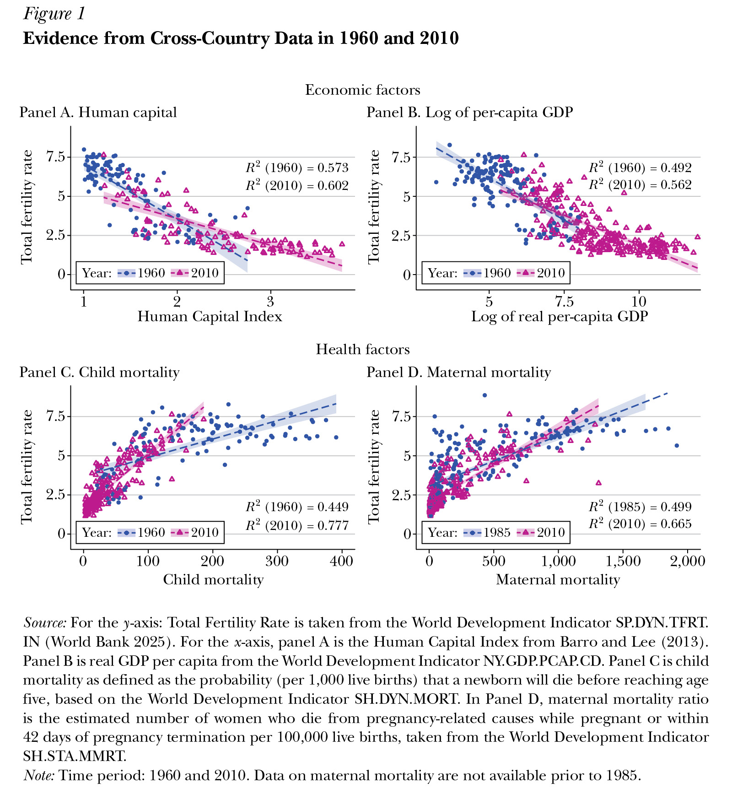
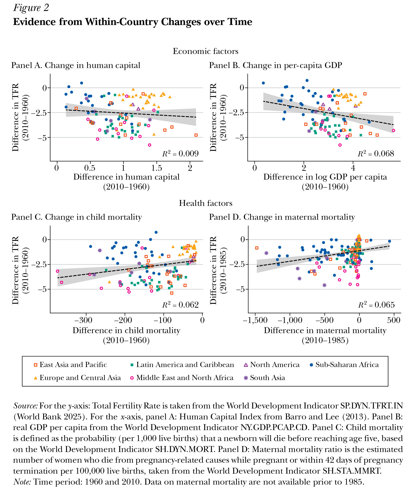
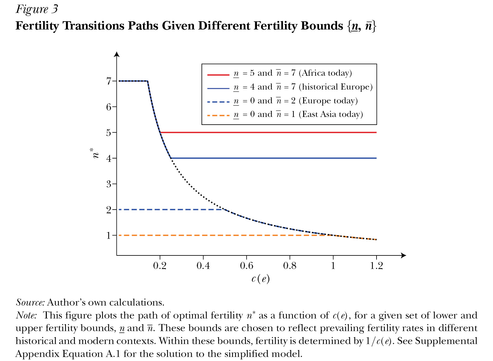
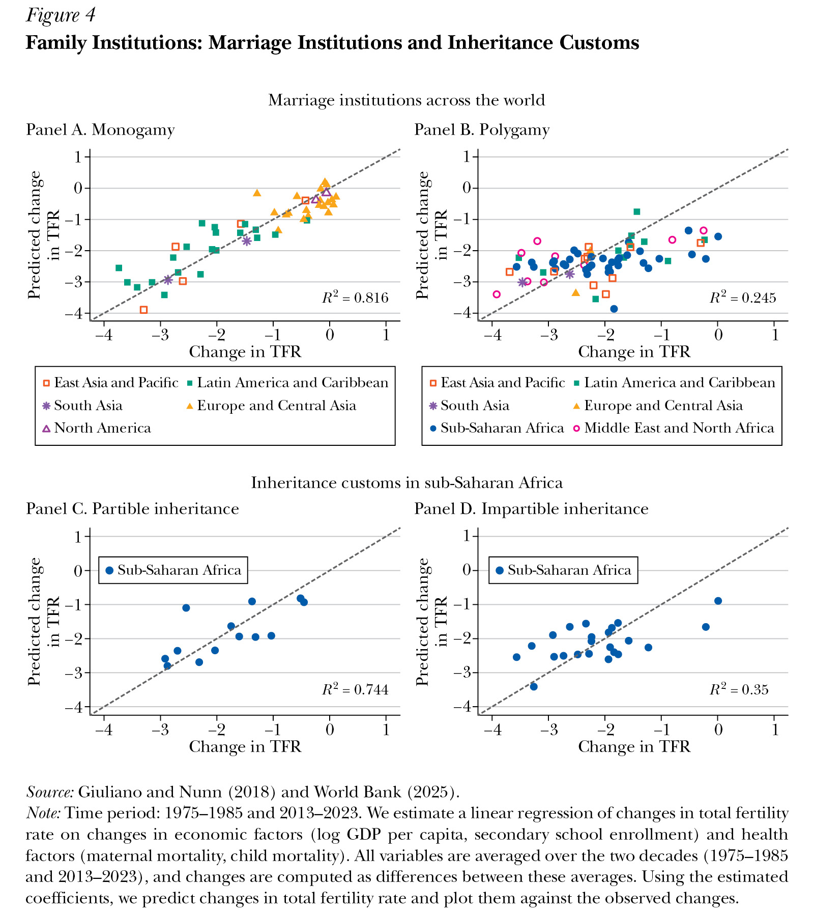

*Paula E. Gobbi, Anne Hannusch, and Pauline Rossi*

```json
{
"article_id": "20251460",
"title": "Family Institutions and the Global Fertility Transition",
"type": "Symposium",
"symposium_name": "Fertility",
"authors": [
	"Paula E. Gobbi (Universite Libre de Bruxelles)",
	"Anne Hannusch (U of Bonn)",
	"Pauline Rossi (CREST, Ecole Polytechnique, Paris)"
],
"pages": "47–70",
"doi": "https://doi.org/10.1257/jep.20251460",
"miniabstract": "Marriage customs, inheritance practices, and the diffusion of cultural norms mediate how economic development translates into fertility decline, explaining why within-country fertility changes over 60 years are only weakly tied to improvements in human capital, GDP, or survival rates.",
"figures_titles": [
	"Figure 1: Evidence from Cross-Country Data in 1960 and 2010",
	"Figure 2: Evidence from Within-Country Changes over Time",
	"Figure 3: Fertility Transitions Paths Given Different Fertility Bounds {n, n̄}",
	"Figure 4: Family Institutions: Marriage Institutions and Inheritance Customs"
],
"abstract_url": "https://liegroup-dartmouth.github.io/working-aea-jep/papers/v40n1/gobbi-hannusch-rossi/abstract.html",
"paper_url": "https://liegroup-dartmouth.github.io/working-aea-jep/papers/v40n1/gobbi-hannusch-rossi/paper.xhtml",
"figures": [
	"https://liegroup-dartmouth.github.io/working-aea-jep/papers/v40n1/gobbi-hannusch-rossi/image/14.jpg",
	"https://liegroup-dartmouth.github.io/working-aea-jep/papers/v40n1/gobbi-hannusch-rossi/image/15.jpg",
	"https://liegroup-dartmouth.github.io/working-aea-jep/papers/v40n1/gobbi-hannusch-rossi/image/16.jpg",
	"https://liegroup-dartmouth.github.io/working-aea-jep/papers/v40n1/gobbi-hannusch-rossi/image/17.jpg"
],
"figures_data": [
	"https://liegroup-dartmouth.github.io/working-aea-jep/papers/v40n1/gobbi-hannusch-rossi/image-data/14.csv",
	"https://liegroup-dartmouth.github.io/working-aea-jep/papers/v40n1/gobbi-hannusch-rossi/image-data/15.csv",
	"https://liegroup-dartmouth.github.io/working-aea-jep/papers/v40n1/gobbi-hannusch-rossi/image-data/16.csv",
	"https://liegroup-dartmouth.github.io/working-aea-jep/papers/v40n1/gobbi-hannusch-rossi/image-data/17.csv"
]
}
```

Much of the observed cross-country variation in fertility is consistent with the predictions of classic theories of the fertility transition. That is, countries with higher levels of human capital, higher GDP per capita, or lower child and maternal mortality rates tend to exhibit lower fertility. However, looking at fertility data within countries, larger declines in fertility over the last 60 years are, on average, not associated with greater improvements in human capital, real per capita GDP, or survival rates. Notably, most of sub-Saharan Africa experienced fertility declines smaller than predicted by economic and health progress, while parts of Asia and Latin America experienced declines larger than predicted, and some countries in East Asia even reached record low fertility levels.

To understand why economic and health progress alone fail to account for most of the observed change in fertility over the past half-century, we focus on the role of family institutions, particularly marriage and inheritance customs. We study whether the same institutions can help explain both the stalled fertility transitions in sub-Saharan Africa today as well as the variation in the timing of historical fertility declines across premodern European regions. We also explore whether the diffusion of cultural norms related to religion, educational aspirations, and gender roles can help explain heterogeneous trajectories in the speed and the magnitude of fertility transitions. We then benchmark the quantitative importance of institutional and cultural factors against the effect of economic and health factors. Finally, we investigate how these factors interact to shape fertility transitions. In particular, we analyze whether family institutions, in addition to their direct effect on fertility, also mediate the effect of economic and health factors.

Much of the existing literature examines each factor in isolation, yet no single factor can fully explain all observed fertility transitions or the entire trajectory of a given transition from start to finish. Understanding how these forces interact remains the central challenge. We propose a stylized framework that integrates these factors. As in standard economic models, economic conditions influence fertility decisions. However, these choices operate under constraints determined by the broader environment—health, institutional, and cultural factors—that determine the set of feasible fertility outcomes. We use the theory as a lens to address open questions in the literature: (1) Why does fertility within a country not exhibit a consistent relationship with economic factors over time? (2) Will fertility in sub-Saharan Africa eventually fall below replacement levels once economic forces become sufficiently strong, even without institutional or cultural change? (3) Can policies prevent further fertility decline in East Asia, absent institutional or cultural reform?

## What We Know: Economic and Health Factors Matter for Fertility Decline

### Cross-Country Evidence

The two most prominent explanations of the fertility transition are economic progress (in the economics literature) and health progress (in the demography literature).<sup><a id="footnote-024-backlink" href="#footnote-024">1</a></sup> [Figure 1](#_idTextAnchor016) shows that economic and health factors are indeed strongly associated with total fertility rates across countries at different points in time, where the total fertility rate is the number of children that would be born to a woman if she had children in accordance with age-specific fertility rates observed in a country at a given point in time.

<a id="_idTextAnchor016"></a>



Panels A and B of Figure 1 show that countries with higher levels of human capital and higher GDP per capita tend to exhibit lower fertility rates, both in 1960 and in 2010. In 2010, approximately 60 percent of the cross-country variation in total fertility rates is explained by differences in either human capital or real GDP per capita. Similarly, child and maternal mortality rates are strong predictors of fertility rates, as shown in Figure 1, panels C and D. These health variables account for two-thirds to three-quarters of the variation in fertility in the most recent period. High fertility and high mortality tend to coincide in countries with weak reproductive health systems. The effect of economic and health factors on fertility has been documented extensively in the literature; in the following sections, we review important studies that explain the main mechanisms.<sup><a id="footnote-023-backlink" href="#footnote-023">2</a></sup>

### Economic Factors

The central channel between economic growth and fertility is the quantity-quality trade-off (Becker and Lewis 1973; Galor and Weil 2000). Parents face a trade-off between the number of children they have (quantity) and the resources, such as time and money, they can devote to each child (quality). As the returns to education increase with economic development and the demand for skilled labor rises, parents respond by raising educational investments in each child while having fewer children. To quantify the magnitude of the trade-off, Becker, Cinnirella, and Woessmann (2010) and Bleakley and Lange (2009) exploit plausible exogenous variation in quality in two different contexts: an increase in school enrollment in Prussia in the mid-nineteenth century and an increase in the returns to schooling in the United States in 1910s, respectively. They come to the same conclusion: fertility drops by approximately 20 percent when schooling massively increases.

A second important channel is women's opportunity cost of time (Galor and Weil 1996). As economies develop and incomes rise, the cost of staying at home to raise children and produce domestic goods, rather than participating in the formal labor market, also increases. Using a life-cycle model, Caucutt, Guner, and Knowles (2002) show that US fertility declined by 0.15 children in response to a 12 percent increase women's wage over a decade between 1980 and 1992.

Beyond the well-studied quantity-quality trade-off and opportunity cost of time channels, other economic mechanisms play an important role in explaining why fertility tends to decline with economic development. In traditional economies, children are a source of income and insurance within the family; in modern economies, however, the returns to "quantity" decline for two main reasons.

First, the demand for unskilled child labor falls sharply when economies transition out of agriculture. The need for family labor is a main driver of high fertility in subsistence-farming economies, where child labor is not regulated (Doepke and Zilibotti 2005). For instance, in Burkina Faso, the sustained inflow of remittances from long-standing migration has reduced dependence on subsistence farming and, consequently, the need for child labor, leading to a decline in fertility of about 0.5 children in communities of origin (Dupas et al. 2023). Historically, in the United States in the 1890s, households that switched to manufacturing after an agricultural pest reduced fertility by around 0.25 children compared to those that stayed in agriculture (Ager, Herz, and Brueckner 2020).

Second, the introduction of formal social security systems reduces the need for children as a source of informal old-age insurance. The expansion of social pensions has been shown to substantially reduce fertility, by about 1 to 1.3 children, in contexts like an expansion of social pensions in Namibia in the 1990s (Rossi and Godard 2022) and an equalization of urban and rural pensions in Brazil in 1991 (Danzer and Zyska 2023). Historically, in much of the Western world, the decline in fertility coincided with the introduction of comprehensive social insurance schemes in the late nineteenth century (with the notable exceptions of France and the United States). In a more recent context, Boldrin, De Nardi, and Jones (2015) develop a macroeconomic model with children as a parental investment in old-age care to study the effect of US and European social security programs on fertility. They find that an increase in program size of 10 percent of GDP is associated with a reduction in fertility of between 0.7 and 1.6 children.

### Health Factors

For demographers, the decline in fertility is often seen as a response to the rapid decline in child mortality in the late nineteenth century in Western countries, and after World War II in the rest of the world (Notestein 1952; Preston 1978). There are two channels: the replacement effect captures responses of couples to the loss of a child, whereas the anticipatory or hoarding effect reflects strategies by couples to ensure surviving descendants. Strulik (2004, 2008) develops a theoretical framework in which high child mortality increases fertility, lowers resources per child, and slows human capital accumulation, trapping the economy in a high-fertility, low-education, low-growth equilibrium. Lower child mortality, by contrast, reduces incentives for additional births, raises educational investment per child, and fosters technological progress through human capital accumulation. Despite the prominence of this theory, the causal effect of child mortality remains theoretically and empirically contentious (Wolpin 1997; Doepke 2005; Bar and Leukhina 2010; Baudin 2012). Using a panel of countries from 1900 to 1999, Herzer, Strulik, and Vollmer (2012) find that a 1 percent decline in child mortality reduces fertility by only 0.14 percent in the long run. This modest elasticity implies that the decline in child mortality alone cannot account for the magnitude of the fertility transition.

Maternal mortality is another often-mentioned health factor. In theory, improvements in maternal health should raise fertility by reducing the physical cost of childbearing, but they may in fact lower fertility in the long run if they increase the returns to female human capital accumulation. The sharp reduction of maternal mortality in the United States between 1930 and 1950 led to a short-run increase in fertility, followed by a long-run decrease twice as large as the short-run response (Albanesi and Olivetti 2014).

More generally, child and maternal mortality rates can be seen as proxies for the quality of reproductive health systems and the availability of modern contraceptive methods. The effect of modern birth control on fertility is debated, given that traditional methods of contraception have long been available (for instance, Cinnirella, Klemp, and Weisdorf 2017), and that modern contraception historically followed, rather than preceded, fertility decline in the Western world (Pritchett 1994; Hartmann 1997). The contribution of family planning to contemporary fertility transitions in low- and middle-income countries varies across contexts. A review of the empirical evidence using the introduction of family planning programs as natural experiments reports reductions in fertility between 5 percent and 35 percent depending on the program (Miller and Babiarz 2016). The most impactful programs combine access to contraception, improvements in child health, and intensive communication campaigns.

## The Puzzle: Economic and Health Progress Are Not Enough to Account for All Fertility Transitions

### Within-Country Evidence

The correlation between economic and health factors weakens when analyzing changes within countries over time. [Figure 2](#_idTextAnchor017) uses the same data as Figure 1, but now focuses on within-country changes. Colors and shapes denote each country's region. Panels A and B of Figure 2 show that when looking at within-country data, larger declines in fertility between 1960 and 2010 are, on average, only weakly associated with greater improvements in human capital or real per capita GDP. Similarly, panels C and D of Figure 2 show no strong association between changes in child or maternal mortality and changes in fertility within countries over time. In fact, changes in economics and health variables alone explain at best 7 percent of the within-country variation in fertility over this period.

<a id="_idTextAnchor017"></a>



Many countries in East Asia and Pacific (□), South Asia (*), Latin America and the Caribbean (■), and Middle East and North Africa (○) experienced substantial fertility declines without corresponding increases in income, human capital, or health.

Conversely, most countries in sub-Saharan Africa (●) experienced significant health progress and to some extent economic progress without a substantial decline in fertility. European (▲) and North American countries (△) experienced strong economic progress and only limited fertility declines. Taken together, these results suggest that countries followed distinct fertility transition paths over the past 60 years.

### Heterogeneous Transition Paths

More generally, when examining fertility transition paths country by country, several puzzles emerge. The most debated case is that of France, the first country where fertility began to decline. The decline started in the mid-eighteenth century, one century before the rest of Europe and the United Kingdom, and well before the onset of modern economic growth and the decline in mortality. The French trajectory is therefore completely at odds with classic theories of the fertility transition. A similar puzzle arises in the United States, another well-known forerunner, where the initial trigger of the decline remains a subject of debate.

Other exceptional cases are East Asian countries, notably Japan, South Korea, and China, where fertility declined so rapidly in the second half of the twentieth century that they reached ultra-low levels of fertility. Fertility levels in East Asia not only converged toward Western levels but continued to fall even in countries, such as China, that had not yet caught up in terms of economic development. None of the classic theories of fertility transition can predict how low fertility will drop.

Finally, another frequently cited exception is sub-Saharan Africa, where the decline has been particularly late and slow, and future trajectories remain difficult to predict. For example, comparing the region's two largest countries, Nigeria and Ethiopia, the decline has been slower in Nigeria, despite its higher income level. This raises the question of whether sub-Saharan Africa is truly exceptional, and if so, what makes it so. To address this question, we turn to the role of family institutions and cultural norms.

## Missing Pieces: Family Institutions and Culture

How can we explain the circumstances under which economic and health factors alone fail to account for much of the observed change in fertility over the past half-century? We highlight one additional channel: the role of *family institutions*. We focus on two types of long-standing family institutions: marital structure, referring to the prevalence of monogamous versus polygamous marriage, and inheritance customs, namely partible versus impartible inheritance. Under impartible inheritance, property, assets, or wealth are passed on to a single heir, typically the eldest son. This system was common in historical England and in several regions of continental Europe before the adoption of harmonized national civil codes, and it still exists in parts of sub-Saharan Africa where family law falls under customary law. By contrast, partible inheritance divides property equally among multiple heirs.

### Family Institutions: Marriage and Inheritance

The role of family institutions in shaping aggregate fertility has long been discussed by historians, demographers, and sociologists (Todd 1984; Lesthaeghe 1989). In particular, customary law related to marriage and inheritance may help explain both pretransition differences in fertility within countries and variation in the timing of the transition's onset. Recent empirical studies have begun to shed light on the magnitude of these effects.

In Western Europe, both marriage and inheritance are shown to be quantitatively important in explaining why fertility was already low during Malthusian times, and why fertility began to decline before the transition to modern growth. The "European Marriage Pattern," characterized by late marriage and high rates of celibacy, implied for centuries that women typically married after age 23–24, and 10 to 15 percent never married at all. In contrast, female marriage was early and universal in most other parts of the world (Hajnal 2017). Because later marriage reduced the number of women exposed to pregnancy risk, the European Marriage Pattern is estimated to have reduced birthrates by 20 to 40 percent between the fourteenth and nineteenth centuries (Voigtländer and Voth 2013; Perrin 2022).

Customary inheritance laws, and in particular the equal division of land between children, created incentives to restrict fertility to avoid land fragmentation across generations. Regional variation in such laws is correlated with fertility differences between French regions during the early eighteenth century. The general adoption of equal partition after the French Revolution contributed to France's early fertility decline, reducing completed fertility by around 0.5 children (Gay, Gobbi, and Goñi forthcoming).<sup><a id="footnote-022-backlink" href="#footnote-022">3</a></sup>

In the same vein, marriage and inheritance institutions can explain the high levels of fertility and the stalled demographic transition in modern sub-Saharan Africa. The region exhibits persistently high rates of polygamy, which sustains a high level of fertility through several mechanisms. Polygamy is associated with (1) early and universal female marriage, which maximizes women's exposure to pregnancy; (2) high bride-price, which incentivizes parents to have many daughters (Tertilt 2005); and (3) rivalry between co-wives, which motivates each wife to have more children than the others (Rossi 2019). A quantitative model predicts that banning polygamy would reduce fertility by 40 percent (Tertilt 2005). Cousin marriage (also called within-kin or endogamous marriage), also a prevalent institution in parts of Africa and the Middle East, may also raise fertility by reducing search frictions in the marriage market and limiting wealth fragmentation from exogamous (that is, outside-group) unions (Lesthaeghe 1989).

The customary inheritance laws across countries of Africa tend to favor impartible inheritance, enabling the transfer of family land to a single heir and removing the incentives to limit the number of heirs. Today, belonging to an ethnic group with a tradition of impartible inheritance increases fertility by around one child compared to neighboring ethnic groups (Fontenay, Gobbi, and Goñi 2025). Moreover, customary laws excluding widows from inheritance rights increase women's reliance on their children for economic security. In these contexts, high fertility reflects women's strategies to mitigate risks related to divorce or widowhood. For example, Lambert and Rossi (2016) show that when women in Senegal are married to a man with children from previous wives, which reduces the probability of a substantial inheritance, they have more sons. As a consequence, granting widows a fair share of the husband's bequest should weaken these strategies. In Namibia, a 2008 reform improving widows' inheritance rights reduced the annual birthrate by 24 percent, equivalent to a reduction in completed fertility by one child (Sage 2025).

Recognizing that some institutional contexts can generate incentives for women to desire larger families is important for understanding recent empirical patterns that may otherwise seem puzzling. For example, experimental interventions aimed at promoting female economic and reproductive empowerment involving business training and land titling caused an *increase* in fertility in Togo, Ethiopia, Benin, and Ghana (Donald et al. 2024), as well as in Tanzania (Berge et al. 2022). Similarly, experimental evidence involving husbands in family planning interventions has been shown to reduce contraceptive take-up among monogamous households, but to *raise* contraceptive take-up in polygamous households in Burkina Faso (D'Exelle et al. 2023). These findings are consistent with the idea that women want many children, which makes sense when family law is designed to reward high fertility.

Other institutions play an important role at later stages of the fertility transition, in particular by shaping the career-family trade-off faced by mothers. This trade-off is absent when women's economic opportunities are limited by legal restrictions. As women's legal and economic rights expand, however, the trade-off becomes salient. When childcare institutions remain underdeveloped, fertility typically declines. For instance, comparisons of neighboring counties that have a state-level border running between them shows that the improvement in women's legal and economic rights in some states and not others during the late nineteenth century in the United States reduced fertility by around 7 percent or 0.2 children (Hazan, Weiss, and Zoabi 2023). In contemporary settings, the rapid improvement in female career prospects alongside a high burden of domestic work has been proposed as an explanation for East Asia's exceptionally low fertility levels (Goldin 2025). The emergence of childcare institutions, whether market- or state-based, eases the trade-off and women can combine having a family and a career, which implies both higher levels of fertility and higher levels of female labor force participation. This was shown by d'Albis, Gobbi, and Greulich (2017) using cross-sectional data for 2011 across European countries with different levels of childcare, by Bar et al. (2018) looking at the effect of marketization of childcare on high- and low-income US women from 1980 to 2010, and by Hazan, Weiss, and Zoabi (2021) using changes in relative childcare costs for US women with different levels of education from 1980 to 2020. In addition, labor market institutions can influence the career-family trade-off. Guner, Kaya, and Sánchez-Marcos (2024) develop a life cycle model to show that temporary contracts or split-shift jobs reduce fertility in Spain. Removing these features, in combination with childcare subsidies, could raise fertility in Spain by 0.22 children.

### Cultural Factors

Cultural factors, or norms, will also affect how fast and how low fertility drops, operating through two main mechanisms: (1) directly, by shaping norms about the ideal family size; and (2) indirectly, by influencing the acceptability of birth control and perceived costs of child rearing.

A central hypothesis in demography is that limiting births was a cultural innovation, first observed in France, that spread through social interactions across Europe and European offshoots (Coale and Watkins 1986; Bongaarts and Watkins 1996). Fertility declines often diffused to culturally or geographically close communities (Delventhal, Fernández-Villaverde, and Guner 2024). In France, the decline radiated from low-fertility regions, in particular Paris, to the rest of the country via internal migration (Daudin, Franck, and Rapoport 2019). Across Europe, the decline propagated from French-speaking regions to culturally similar communities before reaching more distant ones, again with migration playing a central role (Spolaore and Wacziarg 2022; Melki et al. 2024). In the English-speaking world, the sharp fertility decline in Britain in the late nineteenth century was mirrored among British migrants in Canada, the United States, and South Africa (Beach and Hanlon 2023). Among second-generation American women, higher ancestral-country fertility predicts about 0.4 more children (Fernández and Fogli 2009). Similarly, in China, fertility reductions imposed on the majority ethnic group, the Han Chinese, in the 1970s spilled over to culturally close minority groups, despite their exemption from birth quotas (Rossi and Xiao 2024).

At the start of the fertility transition, cultural attitudes toward the "morality" of birth control were pivotal. In France, where secularization was already advancing in the eighteenth century, weakening religious influence helps explain why the transition began there first. Within France, regions with high secularization experienced fertility transitions up to a century earlier and completed fertility about one child lower than fully religious areas (Murphy 2015; Blanc 2023), with similar patterns in Belgium (Lesthaeghe 1977). In addition, Perrin (2022) argues higher gender equality and women's agency, in combination with secularization, contributed to the decline. In Britain, the break in the fertility trend around 1877 coincided with a high-profile trial, in which Charles Bradlaugh and Annie Besant published a book making a case for the right to choose family size and offering some basic information about contraception. Bradlaugh and Besant knew they were very likely to be arrested for doing so, and then used their trial to publicize the benefits of birth control (Beach and Hanlon 2023). A modern parallel comes from Brazil, where the broadcast of soap operas (*novelas*) influenced fertility choices by promoting smaller family size norms (La Ferrara, Chong, and Duryea 2012). In the United States, Kearney and Levine (2015) show that a reality show on teenage childbearing led to a 4.3 percent reduction in teen births.<sup><a id="footnote-021-backlink" href="#footnote-021">4</a></sup>

This bottom-up spread of birth control norms sharply contrasts with the post–World War II transition in other parts of the world, where population control policies, ranging from mildly paternalistic to strongly coercive, were often imposed from the top down. Such policies are aimed at establishing a radically different family size norm over a short period of time (De Silva and Tenreyro 2017) and explain why post–World War II fertility declines were much faster than the gradual historical transitions. One exception is sub-Saharan Africa, where such policies often clashed with deep-rooted religious and traditional customs that emphasize the role of ancestral lineage and where extended family members often influence a couple's fertility decisions (Caldwell and Caldwell 1987). Today, ethnic groups placing high value on the perpetuation of family lineage have fertility rates higher by 0.5 to 1 child compared to others (Álvarez-Aragón 2025).

Toward the end of the fertility transition, cultural factors help explain the stark differences across modern economies. While many countries in East Asia have reached a "lowest-low" fertility level, several Western countries remain near replacement levels. In contexts with high labor market inequality or strong social norms around educational attainment, an "education fever" emerges, as parents compete in terms of resources spent per child (Mahler, Tertilt, and Yum forthcoming). This competition raises the cost of children and hence how many children can be afforded. Using a quantitative model calibrated to South Korea, Kim, Tertilt, and Yum (2024) show that fertility would be 28 percent higher absent status externalities in education. Rising education also affects the marriage markets. In much of East Asia, women marry later or remain unmarried if suitable partners are scarce, and given that out-of-wedlock births are rare, this trend amplifies fertility decline. In China, the growth in the educated population is estimated to explain half of the drop in marriage rates, partly because educated women rarely marry less-educated men (Rossi and Xiao 2026). Finally, Kearney and Levine (2025) attribute the fertility decline in high-income countries to rising childlessness among cohorts whose priorities shifted away from parenthood.

### New Lessons and Puzzles

There is considerable micro- and macroeconomic evidence on the quantitative importance of economic, health, institutional, and cultural factors in shaping fertility (for a summary of this literature, see Supplemental Appendix Table A1). Our reading of the literature is that the effects of family institutions and culture on fertility are comparable, and in some cases even larger, than the effect of economic and health factors that have been the main focus of the economics and demography literatures.

But how do all of these factors interact? Existing evidence suggests that the effects of economic and health factors depend on the social context. For instance, the magnitude of the quantity-quality trade-off is estimated to be much smaller in sub-Saharan Africa than it was historically in Western countries. Vogl (2025) shows that fertility decline is only weakly associated with the educational progress of children within countries or regions, while Collins, Guarnieri, and Rainer (2025) estimate that free primary education in recent decades reduced fertility by only 0.1 child, or 4 percent. The impact of family planning interventions appears similarly limited. Randomized controlled trials in three sub-Saharan African countries find that free access to contraception has a negligible effect on births (Desai and Tarozzi 2011; Ashraf, Field, and Leight 2013; Dupas et al. 2025).

Similarly, health factors interact with economic conditions. For example, Cervellati and Sunde (2011) exploit cross-country variation in mortality reductions due to epidemiological changes and find that a 1 percent increase in life expectancy is associated with a 1.4 percent reduction in fertility, but only after the onset of the demographic transition, not at earlier stages of economic development. Such findings suggest that we are still far from a unified theory of the fertility transition that fully captures the interactions between all factors. In the next section, we propose a first step in that direction.

## An Extended Model of Fertility Transitions

We develop a framework in which fertility choices respond to economic incentives. The influence of these economic incentives, however, can be mediated by prevailing family institutions, cultural norms, and health conditions. Institutions include marriage and inheritance. Culture relates directly to fertility through the ideal family size, and indirectly through religious beliefs, attitudes towards sex and contraception, educational expectations (for example, competitive schooling environments), or gender roles in society. Finally, health-related factors encompass child and maternal mortality, access to contraception, and the availability of infertility treatments. We illustrate the model with examples of settings where economic factors alone have had limited impact on fertility.<sup><a id="footnote-020-backlink" href="#footnote-020">5</a></sup>

### Fertility Transition Paths

[Figure 3](#_idTextAnchor018) illustrates different fertility transition paths captured by the model. The vertical axis shows the equilibrium fertility level in a given economy. The horizontal axis reflects the broad economic costs of having a child, which include the opportunity cost of child-rearing relative to being in the labor market, returns to human capital, the ability to accumulate assets, and the economic value of child labor (when children are young) and support from children (when the children have become adults) for parents in their old age. One can think of the horizontal axis as net costs, also taking into account the economic benefits of having children.

<a id="_idTextAnchor018"></a>



The transition paths highlight that fertility decisions are made within a broader societal context, shaped by factors that are often not fully incorporated into standard economic models. Specifically, a combination of family institutions, culture, and health technology impose bounds on fertility choices. Between these bounds, fertility responds to economic factors in the way predicted by standard economic theories of fertility. However, when fertility is constrained by prevailing family institutions, culture, or health factors, changes in economic incentives no longer influence fertility behavior.

This framework encompasses several classes of models that analyze fertility transitions. Demographers often focus on how upper and lower fertility bounds change over time when health factors, such as child mortality or the availability of contraception, vary. Social scientists typically stress the role of family institutions in shaping these fertility bounds. For example, institutions encouraging late female marriage tend to relax the lower bound and tighten the upper bound, because women are married during a shorter span of their reproductive years. Finally, diffusion models of the fertility transition focus on how changes in the bounds propagate through changes in cultural factors.

### Interpretation and Examples

To illustrate the intuition behind the model, we compare transitions in historical Europe and sub-Saharan Africa, as well as modern Europe and East Asia. We begin with a comparison of historical Europe and contemporary sub-Saharan Africa, which both represent early stages of fertility decline. We assume that both settings share the same upper bound on fertility, interpreted as the biological maximum number of children that a substantial population of women can have, set at $\overline{n} = 7$. The two settings differ, however, in their health environment, institutions, and norms that lead to different lower bounds: the minimum achievable number of children. For illustration, the lower bound is set to $\underline{n} = 4$ in historical Europe (blue solid line) and to $\underline{n} = 5$ in sub-Saharan Africa (red solid line). The higher $\underline{n}$ in sub-Saharan Africa may stem from family institutions such as polygamy or impartible inheritance, strong pronatalist norms, or higher mortality rates.

This comparison delivers several important insights. First, institutions can determine how low fertility falls, even in Malthusian, preindustrialized contexts. For example, the European Marriage Pattern and equal inheritance in early Europe facilitated lower fertility compared to regions at the same stage of economic development where these institutions were absent. Conversely, polygamy and impartible inheritance sustain higher fertility in some sub-Saharan African regions today, despite facing similar economic conditions.

Second, in preindustrial times, when the costs of raising children are relatively low, fertility oscillated between $\underline{n}$ and $\overline{n}$, as shown in Figure 3, in response to short-run fluctuations in economic conditions. If the environment shifts, due to changes in institutions, health conditions, or social norms, a lower $\underline{n}$ can be achieved, for instance, through the adoption of partible inheritance or monogamous marriage. Such a shift gives greater scope to economic factors in shaping fertility decisions.

Third, the timing of changes in the four factors affects fertility transition paths. Economic development leads to a sustained fertility decline only once institutional, health, or cultural constraints are not binding. A similar argument is put forward in Spolaore and Wacziarg (2022), who argue that economic forces reduce fertility only when the social stigma has declined enough to no longer anchor fertility. In France, although the transition to lower fertility spanned over two centuries (from the mid-eighteenth to early twentieth century), fertility was already low by the mid-nineteenth century, following deep cultural change through secularization and institutional shifts, such as the harmonization of legal institutions. In other words, the initial decline in fertility reflected a downward shift in $\underline{n}$. Once this constraint eased, economic factors related to industrialization drove the second stage of the transition, allowing $n*$ to move along the black dotted line as $c(e)$ increased. By contrast, in sub-Saharan Africa, rising $c(e)$ from investments in education and urbanization have yet to lower fertility. Here, cultural norms and institutional structures, such as legal pluralism and customary family law, form a tightly intertwined set of slow-changing constraints. Differences in the sequence of how the four factors change thus help explain timing differences in the onset of fertility decline.

We now turn to the interaction of these factors in the later stages of fertility decline by comparing fertility patterns in Europe and East Asia today. At the end of the fertility transition, the lower bound is no longer binding, $\underline{n} = 0$, because women can socially choose to remain childless. However, these regions differ in their upper bounds, interpreted as the maximum number of children achievable given, for example, the availability of suitable partners or access to infertility treatments. We assume $\overline{n} = 2$ in Europe (blue dashed line) and $\overline{n} = 1$ in East Asia (yellow dashed line). When the cost of children is moderately high (say, $c(e) < 0.5$ in Figure 3), each economy is capped at a different upper bound: 2 in Europe and 1 in East Asia. As the cost of children rises further, both economies converge toward zero fertility.

During the European fertility transition, social change was gradual and spontaneous, with norms around ideal family size evolving slowly, allowing labor and marriage markets time to adapt. As a result, women now combine careers with motherhood without excessive postponement, and when delays occur, they have access to subsidized assisted reproductive technology. Two children thus remains the ideal family size reported by most individuals in many, though not all, European countries.<sup><a id="footnote-019-backlink" href="#footnote-019">6</a></sup> These patterns can be interpreted as a downward shift in $\overline{n}$, followed by movement along the black dotted line, where $\overline{n}$ no longer binds. By contrast, a number of East Asian countries experienced strict population policies that imposed new family size norms, such as China's one-child family. This rapid, top-down social change coincided with worsening sex ratios, education levels that rose more quickly for women than for men, and persistent female hypergamy (women marrying men with higher socioeconomic status). These shifts had profound and lasting consequences for the marriage market. In this context, $\overline{n}$ in Figure 3 declined more rapidly than in the European case, constraining today's fertility at lower levels.

This conceptual framework offers a way of approaching several open questions in the fertility literature. Why is there no consistent relationship between declining fertility and rising human capital or per-capita GDP within countries over time? We argue that fertility responses can be constrained by institutional, health, and cultural factors that mitigate the effect of economic factors on fertility. Will fertility in sub-Saharan Africa eventually converge and drop below replacement levels once economic forces become strong enough? In the absence of institutional reforms related to land property, marriage, or inheritance customs, this appears unlikely. Can policy prevent fertility in East Asia from dropping below one child per woman? In the absence of institutional or cultural changes that raise $\overline{n}$, policies that only target the cost of having children are unlikely to succeed.

### Solving the Puzzle: Economic Development Matters, but under Specific Family Institutions

The model delivers one testable implication: economic development should matter more for fertility decline when family institutions are already favorable to small families. To identify prevailing family institutions, we use data from the Ancestral Characteristics database (Giuliano and Nunn 2018). These data provide worldwide country-level measures for the share of the current population that has a given preindustrial ancestral characteristic.<sup><a id="footnote-018-backlink" href="#footnote-018">7</a></sup> The Ancestral Characteristics database is based upon the Ethnographic Atlas, which is an ethnicity-level database covering over 1,200 preindustrial societies (Murdock 1967). This allows us to classify countries as either (historically) primarily monogamous or polygamous, and as adhering mainly to partible or impartible inheritance systems.<sup><a id="footnote-017-backlink" href="#footnote-017">8</a></sup>

To assess the explanatory power of economic and health factors conditional on family institutions, we focus on two time periods: 1975–1985 and 2013–2023. We average all annual country-level variables within each decade to account for data gaps and then compute the differences between periods. We regress changes in total fertility rate (TFR) on changes in economic variables (log of real per-capita GDP and secondary school enrollment) and health variables (maternal and child mortality). Using the estimated coefficients, we predict fertility changes and compare them to actual changes.

Panels A and B of [Figure 4](#_idTextAnchor019) show the results when we distinguish countries by marital institutions. Strikingly, economic and health factors explain a large share of the fertility changes over time within countries where monogamy is prevalent. In these settings, over 80 percent of the variation in fertility decline is accounted for by economic and health changes. This stands in stark contrast to our earlier findings in Figure 2, where no such association emerged when family institutions were not considered. Thus, when focusing exclusively on monogamous countries, the data appear largely consistent with classic theories of fertility decline. In contrast, in polygamous countries, the explanatory power of economic and health factors drops sharply, explaining less than 25 percent of the observed fertility changes.<sup><a id="footnote-016-backlink" href="#footnote-016">9</a></sup>

<a id="_idTextAnchor019"></a>



Panels C and D of Figure 4 focus on the second type of family institution: inheritance customs. Here, we focus our analysis on countries of sub-Saharan Africa, where the Ethnographic Atlas offers particularly rich data capturing ethnic variation in inheritance customs within countries. Outside the countries of Africa, most other countries harmonized their inheritance laws during the nineteenth and early twentieth centuries, meaning that ancestral practices no longer reflect the legal institutions in place during the second half of the twentieth century. Again, we observe that the explanatory power of economic and health factors depends on the underlying family institution. In countries where partible inheritance is the norm, these factors explain nearly 75 percent of fertility changes, a magnitude similar to monogamous countries. However, in countries with impartible inheritance, the explanatory power declines to around 35 percent.<sup><a id="footnote-015-backlink" href="#footnote-015">10</a></sup>

Altogether, Figure 4 highlights that the pace of fertility decline cannot be understood without reference to family institutions. Economic and health improvements predict fertility decline only in contexts where noneconomic factors already favor smaller families, such as monogamous marriage systems or partible inheritance. These results underscore that economic modernization alone is insufficient to trigger rapid fertility decline: its effects critically depend on preexisting social and institutional conditions that shape how families respond to economic incentives.

The evidence presented thus far is not intended to establish causality. Family institutions are shaped by deep-rooted determinants, such as climatic and geographic conditions as well as the characteristics of original tribes and early settlers,<sup><a id="footnote-014-backlink" href="#footnote-014">11</a></sup> and these determinants may also mediate the effect of economic development. The purpose of our analysis is to highlight the strong interplay between family institutions, health, and economic factors in shaping fertility outcomes. In the long-run, these interactions are even stronger than illustrated here, because institutions and culture are themselves endogenous to economic and health factors. For instance, the transition from polygamy to monogamy can be explained by changes in the distribution of income. With economic development, human capital accumulation, social mobility, and redistribution, monogamy becomes more attractive for both women and men, because the pool of marriageable men increases and the returns to large families decline (de la Croix and Mariani 2015). Another example involves the emergence of the European Marriage Pattern, which can be traced to a single dramatic event: the Black Death of the mid-fourteenth century. The resulting increase in the land-to-labor ratio is thought to have shifted agricultural production from grain to livestock, an activity in which women had a comparative advantage. This improved female employment prospects and contributed to later marriages (Voigtländer and Voth 2013). Institutional change may therefore result from the combination of health shocks and economic transformations.

## Conclusion and Policy Implications

Determining the optimal population size and growth rate is far from straightforward (Golosov, Jones, and Tertilt 2007; de la Croix and Doepke 2021), and some philosophers even argue it is impossible (Parfit 1984; Arrhenius 2000). Historically, fears of "population explosion" or "population decline" have motivated coercive antinatalist or pronatalist policies in many countries, though such approaches have increasingly come under criticism (Hartmann 1997; De Silva and Tenreyro 2017). Today, most state interventions instead focus on narrowing the gap between desired and actual fertility. The United Nations, for example, has recommended investing in reproductive health and family planning to "enable women and couples to achieve their desired family size" (United Nations 2020). In practice, governments typically aim to keep fertility close to the replacement rate, around two children per woman.

Given the complex interplay among economic, health, institutional, and cultural factors highlighted in this essay, interventions targeting any single dimension seem unlikely to generate large changes in fertility. Mitigation policies aimed at directly influencing fertility—whether to reduce it in high-fertility countries or raise it in low-fertility ones—tend to have only modest effects. In high-fertility settings, current strategies focus on improving access to contraception; as discussed earlier, such measures have limited impact when desired fertility remains high, though they are essential to facilitate the decline once couples are willing to control births. In low-fertility contexts, policies such as financial incentives, childcare provision, and infertility treatments have similarly modest effects (see the review by Bergsvik, Fauske, and Hart 2021), but can help slow the pace of decline.

Addressing multiple contributing factors simultaneously poses a major challenge, and there is little knowledge on when it is optimal to push one factor versus another, making a policy-induced global-fertility rebound improbable in the near future. In light of this, adaptation policies—those aimed at managing the wide array of consequences of ongoing fertility decline—seem unavoidable.

■ This research was cofunded by the German Research Foundation (CRC-TR-224 project A3) and by the European Union (ERC projects IDED and P3OPLE). Views and opinions expressed are those of the authors only and do not necessarily reflect those of the European Union or the European Research Council. Neither the European Union nor the granting authority can be held responsible for them. We are grateful to the Managing Editor, Timothy Taylor, the Editor, Heidi Williams, and Coeditors Jeffrey Kling and Jonathan Parker for detailed feedback on our first draft. We also thank participants to the conference on fertility and demographic change at UCLA, as well as Philip Ager, David de la Croix, Claudia Goldin, Joanne Haddad, Juliana Jaramillo Echeverri, Michèle Tertilt, Tom Vogl, Romain Wacziarg, Minchul Yum, and Anson Zhou for helpful comments.

## References

**Ager, Philipp, Benedikt Herz, and Markus Brueckner.** 2020. "Structural Change and the Fertility Transition." *Review of Economics and Statistics* 102 (4): 806–22.

**Akerlof, George A.** 1997. "Social Distance and Social Decisions." *Econometrica* 65 (5): 1005–27.

**Albanesi, Stefania, and Claudia Olivetti.** 2014. "Maternal Health and the Baby Boom." *Quantitative Economics* 5 (2): 225–69.

**Álvarez-Aragón, Pablo.** 2025. "Paths *to* the Rainforests: Ancestral Beliefs and Fertility in Sub-Saharan Africa." Unpublished.

**Arrhenius, Gustaf.** 2000. "An Impossibility Theorem for Welfarist Axiologies." *Economics and Philosophy* 16 (2): 247–66.

**Ashraf, Nava, Erica Field, and Jessica Leight.** 2013. "Contraceptive Access and Fertility: The Impact of Supply-Side Interventions." Unpublished.

**Bailey, Martha J.** 2010. "'Momma's Got the Pill': How Anthony Comstock and *Griswold v. Connecticut* Shaped US Childbearing." *American Economic Review* 100 (1): 98–129.

**Bar, Michael, Moshe Hazan, Oksana Leukhina, David Weiss, and Hosny Zoabi.** 2018. "Why Did Rich Families Increase Their Fertility? Inequality and Marketization of Child Care." *Journal of Economic Growth* 23 (4): 427–63.

**Bar, Michael, and Oksana Leukhina.** 2010. "Demographic Transition and Industrial Revolution: A Macroeconomic Investigation." *Review of Economic Dynamics* 13 (2): 424–51.

**Barro, Robert J. and Jong Wha Lee.** 2013. *Data for: "A New Data Set of Educational Attainment in the World, 1950–2010".* [https://doi.org/10.1016/j.jdeveco.2012.10.001](https://doi.org/10.1016/j.jdeveco.2012.10.001).

**Baudin, Thomas.** 2012. "The Optimal Trade-Off between Quality and Quantity with Unknown Number of Survivors." *Mathematical Population Studies* 19 (2): 94–113.

**Beach, Brian, and W. Walker Hanlon.** 2023. "Culture and the Historical Fertility Transition." *Review of Economic Studies* 90 (4): 1669–700.

**Becker, Gary S., and H. Gregg Lewis.** 1973. "On the Interaction between the Quantity and Quality of Children." *Journal of Political Economy* 81 (2): S279–88.

**Becker, Sascha O., Francesco Cinnirella, and Ludger Woessmann.** 2010. "The Trade-Off between Fertility and Education: Evidence from Before the Demographic Transition." *Journal of Economic Growth* 15 (3): 177–204.

**Berge, Lars Ivar Oppedal, Kjetil Bjorvatn, Fortunata Makene, Linda Helgesson Sekei, Vincent Somville, and Bertil Tungodden.** 2022. "On the Doorstep of Adulthood: Empowering Economic and Fertility Choices of Young Women." Unpublished.

**Bergsvik, Janna, Agnes Fauske, and Rannveig Kaldager Hart.** 2021. "Can Policies Stall the Fertility Fall? A Systematic Review of the (Quasi-) Experimental Literature." *Population and Development Review* 47 (4): 913–64.

**Blanc, Guillaume.** 2023. "The Cultural Origins of the Demographic Transition in France." Unpublished.

**Bleakley, Hoyt, and Fabian Lange.** 2009. "Chronic Disease Burden and the Interaction of Education, Fertility, and Growth." *Review of Economics and Statistics* 91 (1): 52–65.

**Boldrin, Michele, Mariacristina De Nardi, and Larry E. Jones.** 2015. "Fertility and Social Security." *Journal of Demographic Economics* 81 (3): 261–99.

**Bongaarts, John, and Susan Cotts Watkins.** 1996. "Social Interactions and Contemporary Fertility Transitions." *Population and Development Review* 22 (4): 639–82.

**Caldwell, John C., and Pat Caldwell.** 1987. "The Cultural Context of High Fertility in Sub-Saharan Africa." *Population and Development Review* 13 (3): 409–37.

**Caucutt, Elizabeth M., Nezih Guner, and John Knowles.** 2002. "Why Do Women Wait? Matching, Wage Inequality, and the Incentives for Fertility Delay." *Review of Economic Dynamics* 5 (4): 815–55.

**Cervellati, Matteo, and Uwe Sunde.** 2011. "Life Expectancy and Economic Growth: The Role of the Demographic Transition." *Journal of Economic Growth* 16 (2): 99–133.

**Cinnirella, Francesco, Marc Klemp, and Jabob Weisdorf.** 2017. "Malthus in the Bedroom: Birth Spacing as Birth Control in Pre-transition England." *Demography* 54 (2): 413–36.

**Coale, Ansley J., and Susan Cotts Watkins, eds.** 1986. *The Decline of Fertility in Europe: The Revised Proceedings of a Conference on the Princeton European Fertility Project*. Princeton University Press.

**Collins, Matthew, Eleonora Guarnieri, and Helmut Rainer.** 2025. "Fertility in Sub-Saharan Africa: The Interplay between Policy, Culture, and Intra-household Bargaining." CESifo Working Paper 11994.

**d'Albis, Hippolyte, Paula E. Gobbi, and Angela Greulich.** 2017. "Having a Second Child and Access to Childcare: Evidence from European Countries." *Journal of Demographic Economics* 83 (2): 177–210.

**Danzer, Alexander M., and Lennard Zyska.** 2023. "Pensions and Fertility: Microeconomic Evidence." *American Economic Journal: Economic Policy* 15 (2): 126–65.

**Daudin, Guillaume, Raphaël Franck, and Hillel Rapoport.** 2019. "Can Internal Migration Foster the Convergence in Regional Fertility Rates? Evidence from 19th Century France." *Economic Journal* 129 (620): 1618–92.

**de la Croix, David, and Matthias Doepke.** 2021. "A Soul's View of the Optimal Population Problem." *Mathematical Social Sciences* 112: 98–108.

**de la Croix, David, and Fabio Mariani.** 2015. "From Polygyny to Serial Monogamy: A Unified Theory of Marriage Institutions." *Review of Economic Studies* 82 (2): 565–607.

**De Silva, Tiloka, and Silvana Tenreyro.** 2017. "Population Control Policies and Fertility Convergence." *Journal of Economic Perspectives* 31 (4): 205–28.

**Delventhal, Matthew J., Jesús Fernández-Villaverde, and Nezih Guner.** 2024. "Demographic Transitions across Time and Space." NBER Working Paper 29480.

**Desai, Jaikishan, and Alessandro Tarozzi.** 2011. "Microcredit, Family Planning Programs, and Contraceptive Behavior: Evidence from a Field Experiment in Ethiopia." *Demography* 48 (2): 749–82.

**D'Exelle, Ben, Aurélia Lépine, Richard Bakyono, and Ludovic D. G. Tapsoba.** 2023. "Fertility and Polygyny: Experimental Evidence from Burkina Faso." *Journal of Development Economics* 164: 103134.

**Doepke, Matthias.** 2005. "Child Mortality and Fertility Decline: Does the Barro-Becker Model Fit the Facts?" *Journal of Population Economics* 18 (2): 337–66.

**Doepke, Matthias, Anne Hannusch, Fabian Kindermann, and Michèle Tertilt.** 2023. "The Economics of Fertility: A New Era." In *Handbook of the Economics of the Family*, Vol. 1, edited by Shelly Lundberg and Alessandra Voena, 151–254. North-Holland.

**Doepke, Matthias, and Fabrizio Zilibotti.** 2005. "The Macroeconomics of Child Labor Regulation." *American Economic Review* 95 (5): 1492–524.

**Donald, Aletheia, Markus Goldstein, Tricia Koroknay-Palicz, and Mathilde Sage.** 2024. "The Fertility Impacts of Development Programs." IZA Discussion Paper 17500.

**Dupas, Pascaline, Camille Falezan, Marie Christelle Mabeu, and Pauline Rossi.** 2023. "Long-Run Impacts of Forced Labor Migration on Fertility Behaviors: Evidence from Colonial West Africa." NBER Working Paper 31993.

**Dupas, Pascaline, Seema Jayachandran, Adriana Lleras-Muney, and Pauline Rossi.** 2025. "The Negligible Effect of Free Contraception on Fertility: Experimental Evidence from Burkina Faso." *American Economic Review* 115 (8): 2659–88.

**Fernández, Raquel, and Alessandra Fogli.** 2006. "Fertility: The Role of Culture and Family Experience." *Journal of the European Economic Association* 4 (2–3): 552–61.

**Fernández, Raquel, and Alessandra Fogli.** 2009. "Culture: An Empirical Investigation of Beliefs, Work, and Fertility." *American Economic Journal: Macroeconomics* 1 (1): 146–77.

**Fontenay, Sébastien, Paula Eugenia Gobbi, and Marc Goñi.** 2025. "Fertility in Sub-Saharan Africa: The Role of Inheritance." CEPR Discussion Paper 20275.

**Galor, Oded.** 2012. "The Demographic Transition: Causes and Consequences." *Cliometrica* 6 (1): 1–28.

**Galor, Oded, and David N. Weil.** 1996. "The Gender Gap, Fertility, and Growth." *American Economic Review* 86 (3): 374–87.

**Galor, Oded, and David N. Weil.** 2000. "Population, Technology, and Growth: From Malthusian Stagnation to the Demographic Transition and Beyond." *American Economic Review* 90 (4): 806–28.

**Gay, Victor, Paula Eugenia Gobbi, and Marc Goñi.** Forthcoming. "Revolutionary Transition: Inheritance Change and Fertility Decline." *Journal of Political Economy*.

**Giuliano, Paola and Nathan Nunn.** 2018. *Data for: "Ancestral Characteristics of Modern Populations."* [https://doi.org/10.1080/20780389.2018.1435267](https://doi.org/10.1080/20780389.2018.1435267).

**Gobbi, Paula E., and Marc Goñi.** 2021. "Childless Aristocrats: Inheritance and the Extensive Margin of Fertility." *Economic Journal* 131 (637): 2089–118.

**Gobbi, Paula E., Anne Hannusch, and Pauline Rossi.** 2026. *Data and Code for: "Family Institutions and the Global Fertility Transition."* Nashville, TN: American Economic Association; distributed by Inter-university Consortium for Political and Social Research, Ann Arbor, MI. [https://doi.org/10.3886/E239791V1](https://doi.org/10.3886/E239791V1).

**Goldin, Claudia.** 2025. "Babies and the Macroeconomy." *Economica* 92 (367): 675–700.

**Golosov, Mikhail, Larry E. Jones, and Michèle Tertilt.** 2007. "Efficiency with Endogenous Population Growth." *Econometrica* 75 (4): 1039–71.

**Guinnane, Timothy W.** 2011. "The Historical Fertility Transition: A Guide for Economists." *Journal of Economic Literature* 49 (3): 589–614.

**Guner, Nezih, Ezgi Kaya, and Virginia Sánchez-Marcos.** 2024. "Labor Market Institutions and Fertility." *International Economic Review* 65 (3): 1551–87.

**Haddad, Joanne.** 2023. "Settlers and Norms." Unpublished.

**Hajnal, John.** 2017. "European Marriage Patterns in Perspective." In *Population in History: Essays in Historical Demography*, edited by D. V. Glass and D. E. C. Eversley, 101–44. Routledge.

**Hartmann, Betsy.** 1997. "Population Control I: Birth of an Ideology." *International Journal of Social Determinants of Health and Health Services* 27 (3): 523–40.

**Hazan, Moshe, David Weiss, and Hosny Zoabi.** 2021. "Marketization and the Fertility of Highly Educated Women Along the Extensive and Intensive Margins." CEPR Discussion Paper 16647.

**Hazan, Moshe, David Weiss, and Hosny Zoabi.** 2023. "Highly Educated Women Are No Longer Childless: The Role of Marketization." *Economics Letters* 230: 111226.

**Herzer, Dierk, Holger Strulik, and Sebastian Vollmer.** 2012. "The Long-Run Determinants of Fertility: One Century of Demographic Change 1900–1999". *Journal of Economic Growth* 17 (4): 357–85.

**Jaeger, David A., Theodore J. Joyce, and Robert Kaestner.** 2020. "A Cautionary Tale of Evaluating Identifying Assumptions: Did Reality TV Really Cause a Decline in Teenage Childbearing?" *Journal of Business and Economic Statistics* 38 (2): 317–26.

**Jones, Eric.** 2003. *The European Miracle: Environments, Economies and Geopolitics in the History of Europe and Asia*. 3rd ed. Cambridge University Press.

**Kearney, Melissa S., and Phillip B. Levine.** 2015. "Media Influences on Social Outcomes: The Impact of MTV's *16 and Pregnant* on Teen Childbearing." *American Economic Review* 105 (12): 3597–632.

**Kearney, Melissa Schettini, and Phillip B. Levine.** 2025. "Why Is Fertility So Low in High Income Countries?" NBER Working Paper 33989.

**Kim, Seongeun, Michéle Tertilt, and Minchul Yum.** 2024. "Status Externalities in Education and Low Birth Rates in Korea." *American Economic Review* 114 (6): 1576–611.

**La Ferrara, Eliana, Alberto Chong, and Suzanne Duryea.** 2012. "Soap Operas and Fertility: Evidence from Brazil." *American Economic Journal: Applied Economics* 4 (4): 1–31.

**Lambert, Sylvie, and Pauline Rossi.** 2016. "Sons as Widowhood Insurance: Evidence from Senegal." *Journal of Development Economics* 120: 113–27.

**Lesthaeghe, Ron J.** 1977. *The Decline of Belgian Fertility, 1800–1970*. Princeton University Press.

**Lesthaeghe, Ron J.** 1989. *Reproduction and Social Organization in Sub-Saharan Africa*. University of California Press.

**Mahler, Lukas, Michèle Tertilt, and Minchul Yum.** Forthcoming. "Policy Concerns in an Era of Low Fertility: The Role of Social Comparisons and Intensive Parenting." *Brookings Papers on Economic Activity*.

**Melki, Mickael, Hillel Rapoport, Enrico Spolaore, and Romain Wacziarg.** 2024. "Cultural Remittances and Modern Fertility." NBER Working Paper 32990.

**Miller, Grant, and Kimberly Singer Babiarz.** 2016. "Family Planning Program Effects: Evidence from Microdata." *Population and Development Review* 42 (1): 7–26.

**Murdock, George Peter.** 1967. *Data for: "Ethnographic Atlas: A Summary."* [https://doi.org/10.2307/3772751](https://doi.org/10.2307/3772751).

**Murphy, Tommy E.** 2015. "Old Habits Die Hard (Sometimes): Can *département* Heterogeneity Tell Us Something about the French Fertility Decline." *Journal of Economic Growth* 20 (2): 177–222.

**Notestein, Frank Wallace.** 1952. *Economic Problems of Population Change*. Oxford University Press.

**Parfit, Derek.** 1984. *Reasons and Persons*. Oxford University Press.

**Perrin, Faustine.** 2022. "On the Origins of the Demographic Transition: Rethinking the European Marriage Pattern." *Cliometrica* 16 (3): 431–75.

**Preston, Samuel H.** 1978. *The Effects of Infant and Child Mortality on Fertility*. Academic Press.

**Pritchett, Lant H.** 1994. "Desired Fertility and the Impact of Population Policies." World Bank Policy Research Working Paper 1273.

**Rossi, Pauline.** 2019. "Strategic Choices in Polygamous Households: Theory and Evidence from Senegal." *Review of Economic Studies* 86 (3): 1332–70.

**Rossi, Pauline, and Mathilde Godard.** 2022. "The Old-Age Security Motive for Fertility: Evidence from the Extension of Social Pensions in Namibia." *American Economic Journal: Economic Policy* 14 (4): 488–518.

**Rossi, Pauline, and Yun Xiao.** 2024. "Spillovers in Childbearing Decisions and Fertility Transitions: Evidence from China." *Journal of the European Economic Association* 22 (1): 161–99.

**Rossi, Pauline, and Yun Xiao.** 2026. "Left Over or Opting Out? Squeeze, Mismatch and Surplus in Chinese Marriage Markets." *Journal of Development Economics* 179: 103629.

**Sage, Mathilde.** 2025. "Children Are a Poor Women's Wealth: How Inheritance Rights Affect Fertility." Louvain Institute of Data Analysis and Modeling in Economics and Statistics Discussion Paper 2025/04.

**Spolaore, Enrico, and Romain Wacziarg.** 2022. "Fertility and Modernity." *Economic Journal* 132 (642): 796–833.

**Strulik, Holger.** 2004. "Child Mortality, Child Labour and Economic Development." *Economic Journal* 114 (497): 547–68.

**Strulik, Holger.** 2008. "Geography, Health, and the Pace of Demo-economic Development." *Journal of Development Economics* 86 (1): 61–75.

**Tertilt, Michéle.** 2005. "Polygyny, Fertility, and Savings." *Journal of Political Economy* 113 (6): 1341–71.

**Todd, Emmanuel.** 1984. *L'enfance du Monde: Structures Familiales et Développement*. Seuil.

**United Nations.** 2020. *World Fertility and Family Planning 2020: Highlights*. UN Department of Economic and Social Affairs, Population Division.

**Vogl, Tom.** 2025. "Fertility Decline and Educational Progress among African Women and Children." *Demography* 62 (5): 1581–1606.

**Voigtländer, Nico, and Hans-Joachim Voth.** 2013. "How the West 'Invented' Fertility Restriction." *American Economic Review* 103 (6): 2227–64.

**Wolpin, Kenneth I.** 1997. "Determinants and Consequences of the Mortality and Health of Infants and Children." In *Handbook of Population and Family Economics*, Vol. 1A, edited by Mark R. Rosenzweig and Oded Stark, 483–557. Elsevier.

**World Bank.** 2025. *Data for: "World Development Indicators."* World Bank. [https://databank.worldbank.org/source/world-development-indicators](https://databank.worldbank.org/source/world-development-indicators) (accessed June–July 2025).

■ Paula E. Gobbi is Professor of Economics, Université Libre de Bruxelles, Brussels, Belgium. Anne Hannusch is Associate Professor of Economics, University of Bonn, Bonn, Germany. Pauline Rossi is Professor of Economics, Ecole Polytechnique-CREST, Paris, France. All three authors are Research Affiliates, Centre for Economic Policy Research, London, United Kingdom. Their email addresses are [paula.eugenia.gobbi@ulb.be](mailto:paula.eugenia.gobbi@ulb.be), [anne.hannusch@uni-bonn.de](mailto:anne.hannusch@uni-bonn.de), and [pauline.rossi@ensae.fr](mailto:pauline.rossi@ensae.fr).

For supplementary materials such as appendices, datasets, and author disclosure statements, see the article page at [https://doi.org/10.1257/jep.20251460](https://doi.org/10.1257/jep.20251460).

## Footnotes

<p id="footnote-024"><sup><a href="#footnote-024-backlink">1</a></sup> See Doepke et al. (2023) for a discussion of economic theories of fertility and Guinnane (2011) and Galor (2012) for reviews on demographic transitions.</p>

<p id="footnote-023"><sup><a href="#footnote-023-backlink">2</a></sup> For a summary of research studies considering these quantitative effects, see Supplemental Appendix Table A.1.</p>

<p id="footnote-022"><sup><a href="#footnote-022-backlink">3</a></sup> Similarly, in the seventeenth and eighteenth centuries, the British nobility often used marriage settlements to entail land and thus prevent the (solo) heir from breaking up the family estate. These inheritance practices increased fertility through a reduction in childlessness (Gobbi and Goñi 2021).</p>

<p id="footnote-021"><sup><a href="#footnote-021-backlink">4</a></sup> However, see Jaeger, Joyce, and Kaestner (2020) for a critique of Kearney and Levine (2015)'s findings.</p>

<p id="footnote-020"><sup><a href="#footnote-020-backlink">5</a></sup> For an algebraic presentation of the model, please refer to Supplemental Appendix A.1.</p>

<p id="footnote-019"><sup><a href="#footnote-019-backlink">6</a></sup> See Mahler, Tertilt, and Yum (forthcoming) for a recent discussion on the determinants of ultra-low fertility in OECD countries.</p>

<p id="footnote-018"><sup><a href="#footnote-018-backlink">7</a></sup> Giuliano and Nunn (2018) link ancestral characteristics to contemporary countries by assigning ethnographic traits to language groups and combining their geographic distribution with high-resolution population data. The resulting spatial distribution of ancestral traits is aggregated using modern country borders to construct country-level measures of average ancestral characteristics.</p>

<p id="footnote-017"><sup><a href="#footnote-017-backlink">8</a></sup> Specifically, we use the variables v9 and v75 for the prevalence of monogamous versus polygamous marriages and for partible versus impartible inheritance rules, respectively. We categorize a country as having monogamous or partible ancestral institutions if more than 50 percent of its population descends from groups that historically practiced monogamous marriage or partible inheritance.</p>

<p id="footnote-016"><sup><a href="#footnote-016-backlink">9</a></sup> The detailed presentation of the regression findings in Supplemental Appendix Figure A.1 further shows that most of the explanatory power comes from economic variables, with health variables contributing little in polygamous contexts.</p>

<p id="footnote-015"><sup><a href="#footnote-015-backlink">10</a></sup> Supplemental Appendix Figure A.2 further distinguishes the effect of economic and health factors.</p>

<p id="footnote-014"><sup><a href="#footnote-014-backlink">11</a></sup> See Fernández and Fogli (2006) and Haddad (2023) on cultural persistence and Jones (2003, pp. 15–21) on geographic conditions: comparing the European Marriage Pattern with Asian societies, Jones argues that the recurrence of natural disasters in the Indian subcontinent encouraged early marriage as a strategy to achieve high birthrates, providing demographic insurance against recurring environmental shocks.</p>