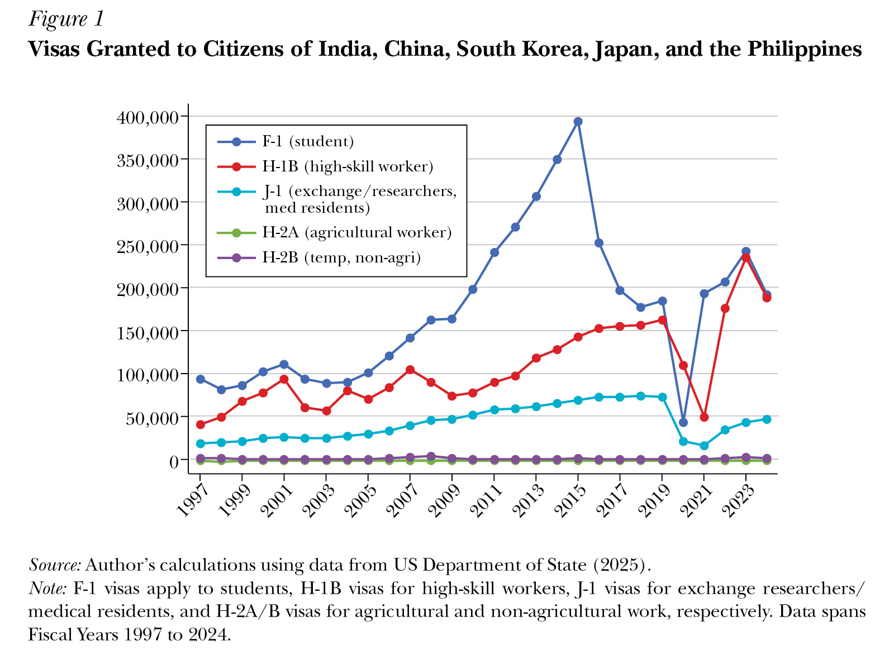
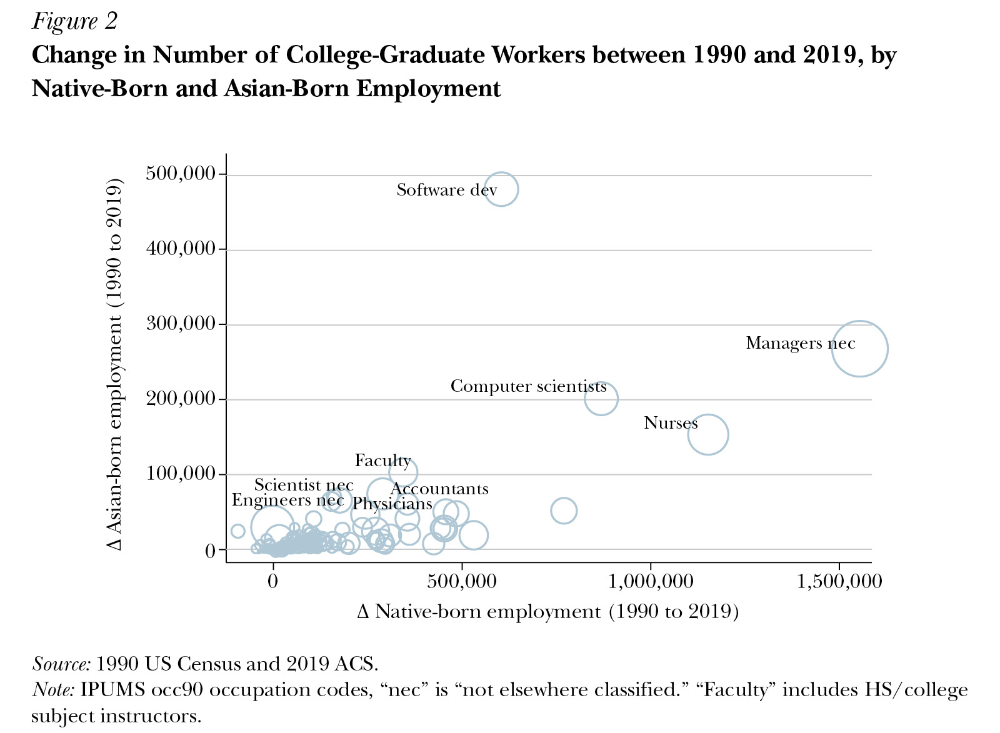
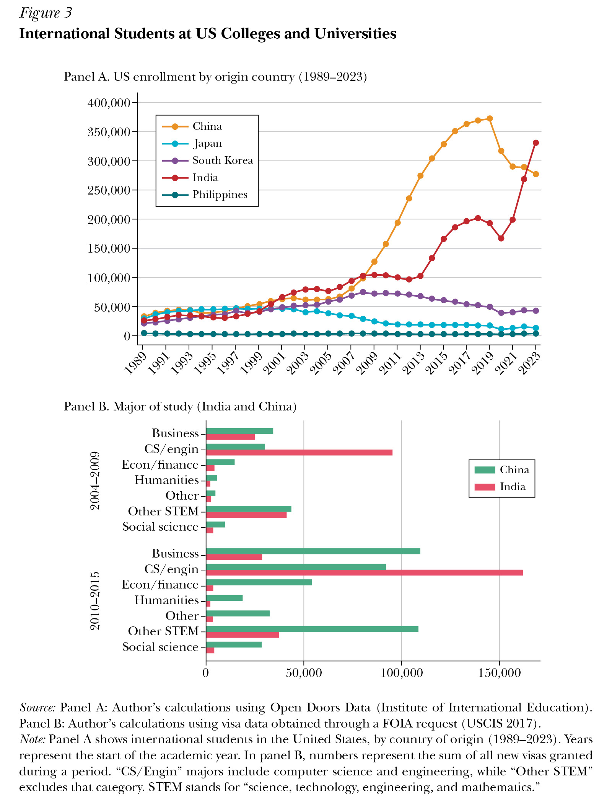
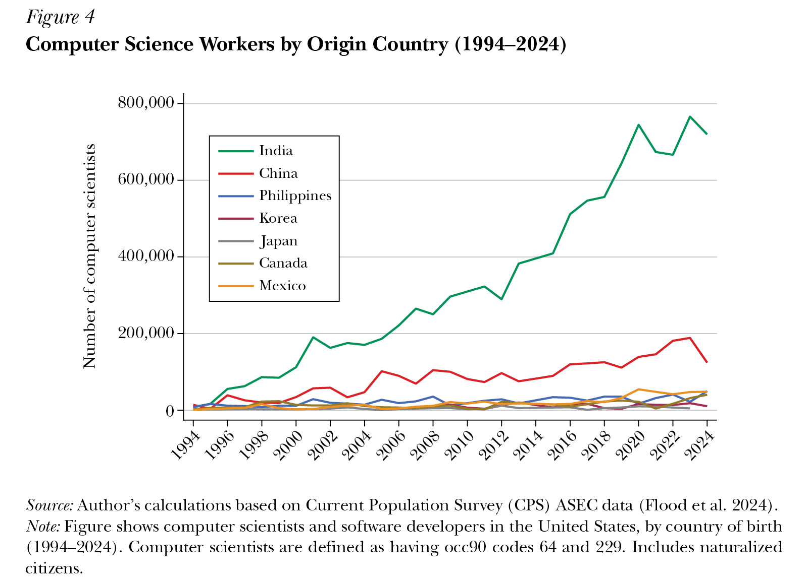
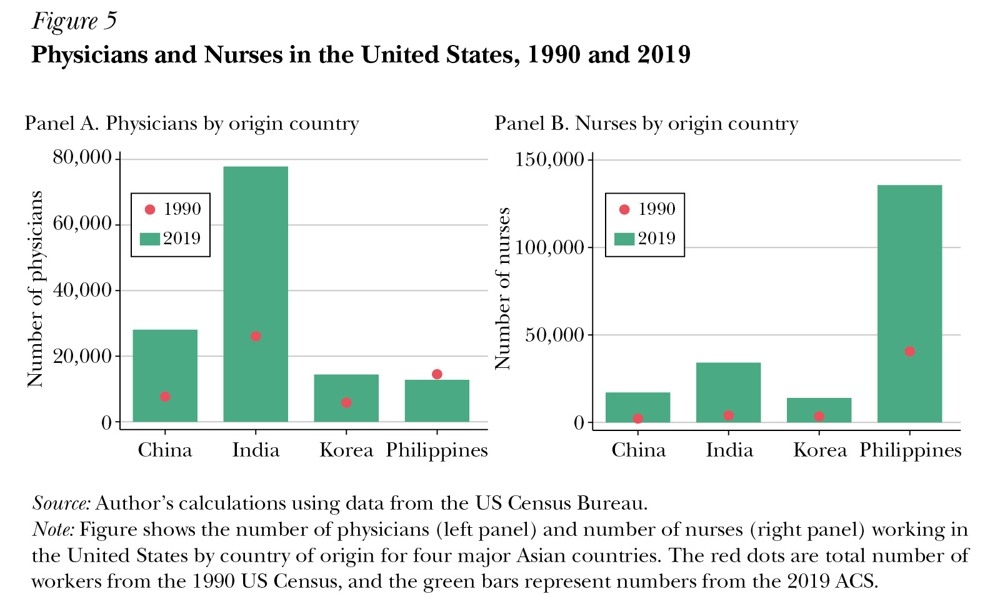

*Gaurav Khanna*

```json
{
"article_id": "20251454",
"title": "From Asia, with Skills",
"type": "Symposium",
"symposium_name": "Asian Immigration",
"authors": [
	"Gaurav Khanna (U of California, San Diego)"
],
"pages": "215–240",
"doi": "https://doi.org/10.1257/jep.20251454",
"miniabstract": "Since 1990, Asian immigrants have supplied over a third of US growth in software developers and a quarter of new scientists, engineers, and physicians, driven by H-1B and student visa demand alongside Asia's educational expansion and diaspora networks, yielding innovation gains in the US and brain-circulation benefits in Asia.",
"figures_titles": [
	"Figure 1: Visas Granted to Citizens of India, China, South Korea, Japan, and the Philippines",
	"Figure 2: Change in Number of College-Graduate Workers between 1990 and 2019 by Native-Born and Asian-Born Employment",
	"Figure 3: International Students at US Colleges and Universities",
	"Figure 4: Computer Science Workers by Origin Country (1994–2024)",
	"Figure 5: Physicians and Nurses in the United States 1990 and 2019"
],
"abstract_url": "https://liegroup-dartmouth.github.io/working-aea-jep/papers/v40n1/khanna/abstract.html",
"paper_url": "https://liegroup-dartmouth.github.io/working-aea-jep/papers/v40n1/khanna/paper.xhtml",
"figures": [
	"https://liegroup-dartmouth.github.io/working-aea-jep/papers/v40n1/khanna/image/33.jpg",
	"https://liegroup-dartmouth.github.io/working-aea-jep/papers/v40n1/khanna/image/34.jpg",
	"https://liegroup-dartmouth.github.io/working-aea-jep/papers/v40n1/khanna/image/35.jpg",
	"https://liegroup-dartmouth.github.io/working-aea-jep/papers/v40n1/khanna/image/36.jpg",
	"https://liegroup-dartmouth.github.io/working-aea-jep/papers/v40n1/khanna/image/37.jpg"
],
"figures_data": [
	"https://liegroup-dartmouth.github.io/working-aea-jep/papers/v40n1/khanna/image-data/33.csv",
	"https://liegroup-dartmouth.github.io/working-aea-jep/papers/v40n1/khanna/image-data/34.csv",
	"https://liegroup-dartmouth.github.io/working-aea-jep/papers/v40n1/khanna/image-data/35.csv",
	"https://liegroup-dartmouth.github.io/working-aea-jep/papers/v40n1/khanna/image-data/36.csv",
	"https://liegroup-dartmouth.github.io/working-aea-jep/papers/v40n1/khanna/image-data/37.csv"
]
}
```

Migration from countries in Asia in the last three decades or so—and especially China and India, as well as South Korea, the Philippines, and Japan—has occurred with unprecedented scale and impact. This wave of migration to the United States has been predominantly high-skill. In 2019, among working adults in the US labor force, 78 percent of Indian-born and 63 percent of Chinese-born workers held at least a four-year college degree, compared to 39 percent of US-born workers (ACS 2019). Between 1990 and 2019, the share of college-educated workers in the United States from these five Asian countries doubled to 7.3 percent. Over this period, migration from these countries contributed to over 38 percent of the growth in US employment of software developers, 25 percent of the increase in scientists and engineers, and 21 percent of the growth in physicians (ACS 2019).

In this article, I examine the rise in high-skill migration from Asia. I begin with an investigation of broader trends, and how we got here. It focuses on the underlying reasons for migration from five Asian countries: India, China, South Korea, Japan, and the Philippines. I discuss the existing literature and use census data, visa records, patent counts, and surveys to explore both US demand-side factors and Asian supply-side dynamics that contribute to these trends. Concurrently, I examine the broader economic impacts of this migration on the US economy—particularly on key sectors such as information technology, which play a disproportionate role in driving innovation and growth both directly and mediated through downstream industries like manufacturing that rely on these technologies as inputs.

Together, these findings underscore the significance of visa policies, the student-to-skilled worker pipeline, and the contributions of Asian-born professionals to innovation and productivity. I conclude by looking ahead at several factors that will determine whether the United States can continue to attract and utilize talent from Asia in the face of increasing competition from the rest of the world, which in turn will shape the countries in which the next technological innovations, in sectors from artificial intelligence to pharmaceuticals, are most likely to occur.

## Economic and Policy Drivers of Skilled Migration

I begin by documenting the major trends in high-skill immigration from Asia and the push and pull factors that facilitated them. I start with US economic and policy changes, and then explain why Asian migrants were particularly well-positioned to address these changes.

### A Shifting Need for Skills in the US Economy

Domestic policy, market forces, and demographic pressures have changed the need for skills across the US economy. The information technology sector is a primary example, in which the US economy experienced a surge in demand for skilled labor in the 1990s. Nationwide commercial traffic on the internet surged in the mid-1990s, especially following the decommissioning of the National Science Foundation Network in April 1995 (Leiner et al. 1997). The entry and growth of tech firms, like Yahoo, Amazon, and eBay, contributed to the information technology boom of the 1990s. This boom dramatically increased the demand for software developers and computer scientists.

While overall US employment grew by about 28 percent between 1990 and 2019, computer science workers grew fourfold from about 1 million workers in 1990 to 4.34 million in 2019 (ACS 2019). These increases in employment were concurrent with substantive increases in wages, which suggests increased demand for computer science and information technology workers. This was likely driven by the rapid rise in internet usage for commercial purposes and immigrant-led innovation or labor market complementarities that amplified demand in the sector.

Technological innovation and entrepreneurship in the information technology sector had broader impacts on tech-adjacent industries as well. The National Science Foundation (2019) estimates that in the 2000s, computer technology patents were the largest contributor to US patenting activity (followed by patents in digital communication), and the fastest-growing. Much of the value-added growth in the early 2000s was driven by industries using information technology (Jorgenson, Ho, and Samuels 2016). US firms increasingly sought scientists and engineers—whether trained domestically or internationally—to drive innovation in a wide range of industries.

At the same time, the US higher education sector underwent some dramatic changes over the last few decades. State appropriations for public universities had been declining since the 1980s, with particularly dramatic decreases during the recessions in the early 1990s, the dot-com bust in 2001, and the Great Recession in 2008. In this setting, the availability of international students changed the revenue model of US higher education, as the US higher education sector shifted to "exporting services" to an international consumer base. One especially visible manifestation was the introduction of many new master's programs in fields related to science, technology, engineering, and mathematics (STEM) (Bound et al. 2020, 2021). The rise in students from China was particularly pronounced at public research universities between 2005 and 2016, after which there was a rapid growth in students from India. As US universities catered to student demand from abroad, there was a concurrent increase in demand for foreign-born faculty. In turn, many of these international students would transition into the US labor force, particularly in high-tech sectors.

Concurrently, demographic aging in the United States has sharply increased healthcare utilization over the last few decades, placing sustained pressure on the supply of physicians, nurses, and long-term care providers (De Nardi et al. 2015; Jung, Tran, and Chambers 2017; Auerbach, Buerhaus, and Staiger 2020). Yet, the United States has also simultaneously imposed policy restrictions on the production of US-educated medical professionals, including a moratorium on new medical schools, fixing class size, capping federal funding for residencies, and freezing residency positions (Orr 2020). By the early 2000s, US healthcare establishments perceived a shortfall of physicians and nurses (AAMC 2021) and increased their demand for medical residents, physicians, and nurses from abroad. Changes in US immigration policy that facilitated the migration of physicians, particularly for residency programs, then established a pathway to the US labor force.

### US Immigration Policy

The history of migration from Asia was marked by exclusionary laws and systematic barriers (as Postel discusses in this issue). This situation began to change with the 1965 Immigration and Nationality Act and the removal of country-specific barriers. The post-1965 system emphasized family sponsorship, but generations of historical Asian exclusion meant few family sponsors. Thus, between 1965 and 1990, many immigrants entering the US labor market were originally granted entry via permanent residency or "green card" provisions. Employment-based green cards require US firms to petition to hire an immigrant worker and certify that they cannot hire a US citizen for the particular position. Most employment-based green cards, which are still primarily governed by the 1965 Act, are currently granted through an adjustment of status for individuals already in the United States.

But starting in the early 1990s, US immigration policy shifted to attracting high-skill immigrants under "temporary" status. As a result, most of the new high-skill migrants from Asia initially entered under temporary work status with the H-1B visa, under student status with the F visa, or as exchange visitors (including scholars and physicians) with a J-1 visa. As a result, entering on a temporary work or student visa is the first step to entry for most high-skill migrants from Asia. In 2010, temporary work visas accounted for 39 percent of the first visa status of information technology workers aged 25–34, and student visas accounted for about 35 percent (Bound et al. 2015b). In contrast, older cohorts were more likely to have entered through permanent residency.

[Figure 1](#_idTextAnchor042) shows visas granted to individuals from the five Asian countries. Several factors stand out. First, visas are predominantly issued to college students and graduates. Visas for students (F-1), high-skill workers (H-1B), and researchers/medical residents (J-1) vastly outnumber those for low-skill agricultural and nonagricultural work (H-2A and H-2B). Second, starting in 2005, there was a sharp increase in F-1 student visas, peaking in 2015. As discussed later, the rapid growth in the 2000s and the slump after 2016 were both primarily driven by Chinese nationals.<sup><a id="footnote-072-backlink" href="#footnote-072">1</a></sup> The sharp declines following the Covid-19 pandemic were followed by a resurgence in student flows, this time fueled by Indian nationals. Finally, H-1B visas have experienced steady growth since the 1990s; however, due to Congressional caps on the visas, this growth has been muted compared to student visas as a pathway. As discussed below, H-1B visas were predominantly granted to information technology workers from India. Taken together, visa policies, along with the demand from US universities for international students and from the information technology sector for tech workers, played a significant role in driving the skill bias in recent Asian migration.

<a id="_idTextAnchor042"></a>



Certain key features of US immigration policy pointedly aim to attract specific migrants in distinct sectors of the economy. For example, student visas are uncapped and do not require a costly petition from a US-based employer, unlike most other visa categories, and so student visas have the largest room to grow. In addition, graduating from a US university allows workers to join the US labor force temporarily through the OPT (Optional Practical Training) program. Each degree (bachelor's, master's, PhD) allows the student to work in the United States on an OPT for one year, adding an additional two years if the degree is in a field related to science, technology, engineering, or mathematics. The OPT program further encouraged Asian students to choose the science-related fields once in the United States (Anelli, Shih, and Williams 2023). In addition, US immigration policy grants an extra 20,000 H-1B visas for those with US graduate degrees, again incentivizing students to obtain a graduate degree from a US institution and then stay on in the US workforce. Together, these factors enable many Asian migrants to view US higher education as a stepping-stone into the US labor force.

US immigration policy is also targeted to certain areas and industries. For example, the H-1B visa is capped by a numerical amount determined by the US Congress, but includes an uncapped exception for foreign-born scientists, faculty, and researchers at US nonprofit universities and research centers. Furthermore, the H-1B visa is demand-driven, in that firms and organizations must petition for workers (unlike many other countries, where skills determine visa success, often without requiring concrete job offers). The H-1B visa is restricted to "specialty occupations," and so employment must be in certain high-skill jobs that require "theoretical and practical application of a body of highly specialized knowledge."

This needs-based focus also manifests in other aspects of high-skill migration policy. Visas are more available for entrepreneurs, managers within multinational firms, and for certain specialized service occupations, such as medical services. For instance, to meet the shortfall of US physicians and nurses, immigration policy was tailored to attract medical professionals to stay and work in high-need areas. US immigration policy for nurses operates through "Schedule A" visa designations, which identify occupations facing chronic domestic shortages and therefore exempt employers from the labor certification process normally required for employment-based green cards. Under this provision, hospitals and healthcare institutions can directly sponsor foreign nurses—many from the Philippines—without demonstrating the unavailability of US workers.

Immigration policy also mediates the pathway from medical residency to clinical practice. Traditionally, medical residents on J-1 visas must return to their home country for at least two years before they can apply for a temporary work visa in the United States. However, the Conrad 30 Visa Program was established in 1994 to waive this home residency requirement as long as physicians transition to a longer-term work visa at the end of residency in a "medically under-served area" or "health professional shortage area." To receive a waiver, a foreign physician must be recommended by an interested government agency. Since 2001, more than 18,000 foreign physicians have participated in the program, concentrated in rural and underserved areas. As Braga, Khanna, and Turner (2024) show, the program responds directly to demand pressures: states facing greater physician shortfalls make fuller use of their waiver allocations, thereby channeling foreign-trained doctors toward underserved regions. Once again, visa waivers are concentrated among those from Asia, with the majority of participants coming from the Philippines, India, and Pakistan (Ranasinghe 2015).

### Asia's Advantage in Meeting Rising Demand

While US immigration policy facilitated the increase in demand for skilled labor, migrants born in Asian countries had a distinct advantage in meeting this rising demand. During the 1990s, many Asian countries experienced a dramatic increase in the number of young people completing high school and undergraduate college education. For instance, China's 211 Project dramatically increased the size of the higher education sector. Also in China, the gross enrollment ratio in tertiary education expanded from 3 percent to 75 percent between 1990 and 2023, while in India, this ratio grew from 6 percent to 33 percent (World Bank 2025). In Korea, the gross enrollment ratio expanded from 33 percent in 1990 to 100 percent by 2021. Assuming that talent and ability distributions are similar in the United States and abroad and given the large number of college-ready and college-educated youth in South and East Asia, the quantity of potential talent available to US firms and institutions was quite large. For perspective, India has more young adults between 20 and 34 years of age than the entire US population.

In many Asian countries, such as India, China, and the Philippines, the returns to skill remain relatively limited, making US employment especially attractive. Clemens (2013) uses personnel records from a large Indian multinational information technology firm to compare the earnings of H-1B lottery winners and losers. Exploiting the random allocation of visas, the paper estimates a causal return to moving a software developer from India to the United States. They find a six-fold increase in earnings (after converting earnings at the market exchange rate), highlighting the substantial wage premium associated with US employment. These findings underscore the high returns to human capital in the United States—potentially driven by technological complementarities and location-specific spillovers. The ability of US firms to access a vast pool of highly skilled workers from Asia at comparatively lower wages further enhances the appeal of these workers to American employers.

In a simple Roy (1951)–style framework, the above factors would enable Asian countries to dominate the flow of high-skill migrants to the United States; that is, a combination of limited opportunities for students and workers at home, combined with a large number of talented youth in the right tails of the aptitude distribution. However, other significant events reinforced these trends.

The rapid income growth in Asian countries in the 1990s increased the affordability of overcoming the cost of migration. For example, China's per capita GDP (in purchasing power parity-adjusted constant 2021 dollars) has increased more than 13-fold since 1990. The manufacturing boom in China after it joined the World Trade Organization in 2001 led to substantial income gains and, consequently, increased student migration to the United States. Khanna et al. (2023) use detailed data on the universe of foreign students to show that households in Chinese cities that grew as a result of favorable tariffs sent more youth to the United States, as they were now more able to afford a US higher education degree.

In addition, economies across Asia were also making domestic investments in high-quality science and engineering institutions, which enabled a growing number of students to meet the skill requirements of US-based jobs. The first Indian Institutes of Technology were established in the 1950s and are among the highest-return universities in the world, based on the amount that they increase wages in a common labor market (Martellini, Schoellman, and Sockin 2024, Table B4). Also, in India and across South Asia, the urban population was widely comfortable and trained in English. China has aimed to replicate the success of high-quality institutions abroad through substantial increases in funding and infrastructure through its 211 Project and Project 985. Korean and Japanese technological universities were established to drive growing local high-tech industries. Many of these skills may also be complementary to the education offered in US institutions (or workers trained in Canada, the United Kingdom, or Australia), and US firms may seek such talent to work in teams with their own locally educated workforce (Peri, Shih, and Sparber 2015).

Similarly, the Philippines has long held an advantage in supplying nurses abroad. Specifically, its nursing education system was modeled on the US system during the twentieth century, with English-language instruction, US-aligned curricula, and licensure standards designed to meet international requirements. This institutional alignment made Filipino graduates particularly attractive to US employers under the Schedule A visa category. Moreover, Abarcar and Theoharides (2024) document that the Philippines has an extensive network of nursing schools, many established to serve the export market, which expanded rapidly in response to overseas demand. As a result, US policy shocks—such as visa expansions or increased hospital demand—translate quickly into higher domestic nursing enrollment and training capacity in the Philippines.

Over time, the professional and alumni networks of these institutions gave emigrants from Asian countries a further advantage. For instance, India had sent a number of top engineers during the earlier hardware boom of the 1980s, and the diaspora helped establish strong connections and a reputation for well-trained workers (Saxenian 1999). As Bhatnagar (2006) notes, Indian professionals in Silicon Valley built networks and established strong reputations, which they then leveraged to help attract the next wave of Indian migrants to the expanding information technology sector within US firms. The reputation was further bolstered by the offshoring of low-level tasks during the Y2K crisis—the months leading up to January 2000, when there was concern that the change in annual dates might crash some computer systems—when US firms outsourced work to India, finding that the twelve-hour time lag allowed US companies to send work at the end of the US workday and pick it up as the workday ended in India (Arora and Athreye 2002).

To some extent, this rapid late-twentieth-century rise in Asian migration to the United States also reflects the possible release of long-suppressed demand created by decades of exclusionary policy. For much of US history, immigration from Asia was effectively prohibited: naturalization was barred from 1871 to 1952, and entry was restricted for those "ineligible for citizenship" from 1917 onward (as discussed by in this issue by Postel). When these legal and network constraints were finally relaxed, migration rose rapidly from a very low base. The long history of exclusion thus also shaped both the timing and the high-skill composition of Asian immigration.

### Major Occupations of Asian Migrants: The Role of Demand and Supply

The fastest-growing occupation among Asian-born immigrants from 1990 to 2019 was software development, followed by managers, computer scientists, nurses, faculty, scientists, accountants, engineers, and physicians, as shown in [Figure 2](#_idTextAnchor043), using Census data on college graduates in the US labor force. A natural question is: Does this high growth in specific occupations primarily reflect the US demand or supply-side push factors from Asia? If supply-side forces from Asia dominate, then we might expect that Asian migrants "crowd out" US-born workers in these specific high-skill occupations; on the other hand, if occupation-specific US demand is dominant and the supply of local talent is constrained, then crowding out of US-born counterparts is less likely to occur.

<a id="_idTextAnchor043"></a>



Of course, both demand and supply forces are at play. As noted earlier, various constraints have limited the supply of US-born workers in health care industries, and while there were no similar restrictions on scientists, engineers, and computer scientists, acquiring such skills can be challenging and costly. Moreover, US immigration rules have limited the supply of skilled labor. But overall, the fact that Figure 2 shows a roughly upward-sloping relationship between the growth in native-born and Asian-born employment suggests that US demand-side factors might be important; that is, occupations with growing US native-born employment are also areas with growing Asian immigrant employment. For instance, innovation in the tech sector increased the demand for all software developers, whether born in the United States or Asia, resulting in growth for both US-born and Asian-born software developers. This upward-sloping relationship may also reflect immigrant-led innovation (Kerr and Lincoln 2010) and complementarities in production that increase the demand for native-born employment (Peri, Shih, and Sparber 2015). Had the relationship in Figure 2 been downward sloping, it would be consistent with Asian-born programmers displacing US-born ones rather than meeting a growing demand. Of course, this is not to say the growth in US-born programmers (or their wages) might not have been higher in the absence of supply from Asia.

In subsequent sections, I build from the patterns shown in Figures 1 and 2 to study the following groups in detail: students and faculty in higher education, software developers and computer scientists (the information technology boom), managers and scientists (entrepreneurship and innovation), and nurses and physicians (medical professions). For each group, I dig deeper into the demand-side factors from the US economy, why migrants from Asian countries were well-suited to meet this demand, and the implications and downstream impacts for the economies sending and receiving skilled migrants.

## The Higher Education Sector: Students and Faculty

The number of international student visas is not capped—unlike work visas—and so migrants can use them as a stepping stone into the high-tech US labor market. In 2010, 27 percent of all foreign-born workers and 35 percent of foreign-born information technology workers in the United States initially arrived on a student visa (Bound et al. 2015b). Asian-born students are heavily concentrated in science and engineering fields, such as computer science, engineering, and mathematics.

[Figure 3](#_idTextAnchor044), panel A, plots the trends in US international student enrollment by foreign country of origin. As this figure shows overall enrollment (a stock measure that includes seniors in college), these trends lag behind new visas issued to freshmen students (a measure of new flows). A few changes in patterns over time stand out. First, enrollment from China started increasing in the mid-2000s and grew rapidly until about 2016. The slowdown was followed by a sharp decline in Chinese enrollment during the Covid-19 pandemic, which never really recovered. The initial growth and slowdown in enrollment lag the visas granted (Figure 1), which is a measure of more immediate changes to demand and new flows. Second, enrollment from India shows a steady rise, which increases more rapidly after 2014 and then jumps up again after the end of the Covid-19 pandemic. Third, while not shown in the figure, the large initial increase in enrollment from China was for undergraduate degrees, whereas enrollment from India was initially in master's programs and, only recently, also certain undergraduate programs. Finally, although other Asian countries were substantial sources of international students in the 1990s, they did not keep pace with the growth in flows from China and India.

<a id="_idTextAnchor044"></a>



This rise in US international students coincided with US colleges needing to enroll more foreign students, as noted earlier. The corresponding growth in enrollment from Asia was concentrated in large, non-capacity-constrained public universities, which expanded their enrollment in engineering and in science, technology, engineering, and mathematics fields. Many of these colleges, such as Purdue, Michigan State, Ohio State, Penn State, and Indiana, were in the US Midwest. Around the Great Recession, between 2007 and 2012, public research universities experienced a 133 percent increase in foreign first-time undergraduate enrollment, while private research universities experienced a 61 percent increase.

Figure 3, panel B, focuses on college majors for the two main sending nations, India and China, and compares the 2004–2009 period to the 2010–2015 period. In the early period of 2004–2009, India focused more on computer science and engineering majors, while Chinese students were relatively more concentrated in business and other STEM majors. During the subsequent growth period, Chinese students in business, computer science/engineering, and STEM majors experienced uniform and substantial growth. For Indian students, there was little growth in business and other science majors, while the computer science and engineering majors grew rapidly. These patterns of major specialization have subsequent downstream impacts on the labor force after these students graduate. In the 2023/2024 academic year, 23 percent of Chinese students and 43 percent of Indian students enrolled in math/computer science majors (Institute of International Education 2024). For Japanese students, the largest major was business (18.3 percent), and for Koreans, it was engineering (17 percent).

### What Drives Growth in International Student Enrollment?

Why has the surge in international students in US higher education since 2005 come primarily from Asia, and in particular from China and India? In the case of China, some key factors have already been mentioned. US higher education was more broadly affordable in China after it joined the World Trade Organization in 2001, which led to an export-driven boom in incomes, especially after China allowed the renminbi yuan to appreciate in 2005. In addition, China's uniquely rapid expansion of its own undergraduate education led to a surge in graduate students going abroad several years later (Jia et al. 2025). China's 211 Project, launched in 1999, upgraded universities and colleges and expanded undergraduate enrollment. Over the next two decades, the number of universities in the country increased from 1000 to 2900 and the number of students enrolled grew from 1.1 million to more than 7.9 million, and this drove a surge of graduate students to US programs in science, technology, engineering, and mathematics (Jia et al. 2025).

Enrollment of Chinese students in foreign higher education grew in several countries. Between 1998 and 2019, Chinese enrollment in Australia increased by a factor of 37, in the United Kingdom by a factor of 41, and in Canada by a factor of 26. But despite the massive growth to other destinations, even in 2019, there were about as many Chinese students in the United States as in these other three countries combined (UNESCO 2025).

The rapid growth of international students from China halted in 2016 as new student visas fell (Figure 1) and enrollment tapered off (Figure 3, panel A). Political tensions also contributed to the decline in Chinese enrollment. This decline was concentrated in public universities in red states, and particularly in sensitive fields flagged by the US government (Chang et al. 2025). The concurrent expansion of local Chinese universities and of universities in Australia, Canada, and the United Kingdom helped divert these potential students away from US institutions.

In the case of India, enrollment of students in US higher education began to rise dramatically in 2014. Local constraints in the Indian higher education sector led to increasing competition for limited seats at high-quality Indian universities. As a result, a burgeoning youth body that finished high school and could afford to go abroad looked to the United States and the United Kingdom. By 2023, the number of Indian students enrolled in US universities surpassed that of students from China. One distinction between international student flows from India and China is that students from India are more likely to transition to the US labor force. As noted earlier, the Optional Practical Training program allows students to work in the United States after graduation for at least one year, and for up to three years for those with a degree in science, technology, engineering, and mathematics. In general, transition rates from student status to OPT status are inversely correlated with origin-country GDP per capita (Bound et al. 2021). Richer countries, such as Korea, have relatively lower transitions to OPTs, given the opportunities available back home. For India, more than 90 percent of Indian master's students in our administrative visa data switched to the OPT in 2015 (Bound et al. 2021), while the transition rates for students from China were lower, at about 70 percent.

### International Researchers and Faculty

International scholars at US universities are also heavily represented by China, India, Japan, and South Korea. These four countries were the top four sources of scholars for the entire first decade of the 2000s, and even in 2024 the top three sources are China, India, and South Korea (Institute of International Education 2024).<sup><a id="footnote-071-backlink" href="#footnote-071">2</a></sup> In 2024, China accounts for 21 percent, India 16 percent, and South Korea 6.6 percent of international scholars on temporary visas.

Many scholars first enter as students and transition to the US higher education sector after completing their graduate degrees and, down the line, contribute to high-quality research and publications in the United States. Increases in foreign PhD students lead to higher publication and patent counts in US science and engineering departments (Stuen, Mobarak, and Maskus 2012). Remember, universities are exempt from the H-1B cap, and many scholars from other countries first begin as an OPT before transitioning to an H-1B.

### Effects on the US Universities and the Workforce

Student migration has had a major effect on the revenues of US universities. Public universities, facing state funding cuts, offset revenue losses by enrolling full-fee-paying international students. This strategy allowed them to maintain quality, focus on research, and keep in-state tuition low by cross-subsidizing local students (Bound et al. 2020).<sup><a id="footnote-070-backlink" href="#footnote-070">3</a></sup> Between 2010 and 2016, only 6.6 percent of Chinese undergraduates at US research universities received funding from the university, with most students paying full tuition.

In particular, many students from Asia have been enrolled in revenue-generating master's programs. These master's programs are concentrated in science, technology, engineering, and mathematics, with students from India particularly concentrated in computer science master's programs. In 2023, among full-time students in master's programs in science, engineering, and health, temporary visa-holders outnumbered US citizens (Smith et al. 2024). Cross-subsidization of US students works both through revenue sharing and a graduate student workforce engaged in teaching and research, which allows the university to enroll more local undergraduates while maintaining research quality (Shih 2017).

This cross-subsidization of the local students was made explicit in a public letter from University of California then-president Janet Napolitano (2016), which states: "California's situation is not unique. Nearly every state in the nation has faced this Hobson's choice, and they have all reached the same decision: open doors to out-of-state students in order to keep the doors open for in state." Indeed, the US comparative advantage in higher education services led to higher education service exports of $56 billion in 2024 (Bureau of Economic Analysis 2025), further supporting the economies surrounding college towns as well (Jia et al. 2025).

In the long run, as Asian-born students join the US labor force their impact is felt more broadly in the US economy. Many international graduate students eventually become faculty, contributing to research production, patenting, and teaching at US universities. Approximately 85 percent of US PhD graduates from India and China remain for at least ten years (Finn and Pennington 2018). Looking at just US PhDs in science and engineering fields that graduated between 2017 and 2019, 83 percent of Chinese, 86 percent of Indian, but only 50 percent of South Korean graduates were in the United States in 2023 (NCSES 2025).

Many Asian-born graduates transition to high-skill sectors in information technology and healthcare (Bound et al. 2015b), which are examined below. The H-1B separately allocates 20,000 visas for those with US graduate degrees. The first transition step is through an Optional Practical Training program, and transition rates vary by country due to differing home opportunities. In particular, over 60 percent of undergraduate and 90 percent of master's students from India move to work under OPT, while this proportion is significantly lower for students from other Asian countries.

## Computer Scientists and the Information Technology Boom

The influence of Asian migrants is especially strong in several industries, including the information technology sector. The rise of Internet commerce made information technology occupations—computer science, software development, and programming—the fastest-growing occupation in the 1990s, more than doubling in size between 1993 and 2010. For example, the share of computer science majors as a fraction of all college graduates in the United States more than doubled between 1990 and 2020, rising from about 2.5 percent to nearly 6 percent. Concurrently, the share of foreign-born workers in computer science occupations also more than doubled, from about 17 percent to 36 percent. As [Figure 4](#_idTextAnchor045) shows, this growth in foreign-born representation came particularly from India: computer science growth from India far outpaced that from China and other countries. By 2010, one-third of US information technology workers were foreign-born, predominantly from India. By 2019, Indian-born individuals were 29 percent of all workers in science, technology, engineering, and mathematics jobs in the United States (AIC 2022).

<a id="_idTextAnchor045"></a>



Why India? Given the sharply rising demand for information technology workers starting in the 1990s, US employers may have found a perfect storm in India's talent pool: as discussed earlier, some main factors include a huge cohort of young, tech-trained, English-speaking workers, with alumni networks and institutional reputations already in place, willing to work for lower (but still life-changing) wages. Other Asian counterparts did not have similar advantages, including English proficiency, diaspora networks, and (compared to Japan and Korea) a wage advantage. This boom coincided with the H-1B visa program, established by the Immigration Act of 1990, which mandated the visa required "theoretical and practical application of a body of highly specialized knowledge in a field of human endeavor." By 2014, 86 percent of all H-1B computer scientists were from India, with 5 percent from China; in 2023, the latest data show that 78 percent of H-1B visas went to Indians (US Department of State 2025).

After this migration, a meaningful fraction of high-skill Indian-born computer scientists reside in the United States: Does this "brain drain" hinder India's economy? The evidence suggests nuance, as the opposite may be more likely. The prospect of migrating to the United States and earning wages that were four to six times higher (Clemens 2013) induced many Indians to accumulate skills and human capital valued abroad—a form of "brain gain," as argued by Khanna and Morales (2025). Indeed, the Indian higher education sector responded to higher demand by expanding computer science education in top schools. However, because the number of US visas was capped, many who gained skills with the prospect of migrating to the United States remained in India. Furthermore, H-1B visas expire after six years, and the wait for a US green card is both costly and lengthy for Indian nationals. As a result, about 24 percent of Indian visa-holders leave the United States after six years, and many return to India with skills acquired abroad—often after sending remittances back to India during this period. This "brain circulation" complements the initial brain gain and builds a large information technology workforce in India, helping create a highly productive sector with possibilities for innovation spillovers. Indian firms have surpassed the United States in information technology exports, often as more work is offshored to India. In this way, the shift in information technology production from the US economy to the other side of the world in India was partially facilitated by quirks of US immigration policy—specifically, the binding H-1B caps and the costly green card process.

From a US perspective, the influx of Indian tech workers affects both the tech sector and the broader economy. Indian tech workers help expand production from the US information technology sector, but they also facilitate offshoring certain aspects of production to India. For example, this may entail specialization in new product development at US headquarters, but software coding in their India offices.

A large body of research uses matched administrative data on H-1B petitions, worker earnings, and firm employment to estimate the effects of high-skilled immigration on US labor markets (Peri, Shih, and Sparber 2015; Ottaviano and Peri 2012; Doran, Gelber, and Isen 2022; Mahajan et al. 2024; Kerr and Lincoln 2010; Bound et al. 2015a). These studies exploit variation generated by H-1B visa-cap, H-1B lotteries, other policy changes, and differences across firms and regions in H-1B dependence to identify causal impacts on wages, employment, and innovation.

Taking this evidence as a whole, Indian-born computer scientists may lower wages for US-born computer scientists, but more computer scientists also raise wages for complementary jobs where natives are concentrated. As information technology firms hire more Asian-born programmers, the demand for managers and workers in complementary occupations like human resources increases. As a result, wages for these complementary professions may rise and US-born workers may switch into these positions, potentially away from programming tasks. The impact on computer science workers themselves may be ambiguous if immigrant computer science workers are particularly involved in innovation and raise wages broadly across the firm, but still face meaningful competition from more programmers (Bound et al. 2015a). Furthermore, over time, outsourcing companies started winning almost 20 percent of H-1B visas, and they may be paying relatively lower wages than other tech firms. Turner (2022) leverages changes to the H-1B cap to show that a 10 percentage point increase in immigrant share of the workforce in fields of science, technology, engineering, and mathematics lowers wages by 1 percent.

While attention often focuses on whether Asian immigrant workers displace native-born US workers within specific industries, the benefits to consumers and the broader economy have been relatively understudied. Yet some of the largest gains from tech sector immigration may actually be to workers outside the tech sector, as consumers use better software and firms utilizing more information technology inputs see productivity gains (Khanna and Morales 2025). Prices of software, internet publishing, data processing, programming services, and computer systems design fell rapidly in the 1990s and 2000s, while the quantity index of these products saw a massive surge (Bureau of Labor Statistics 2025). Furthermore, many sectors of the US economy (like auto manufacturing and banking) now rely on information technology products as inputs into production or as part of the products they sell (Jorgenson, Ho, and Samuels 2016). These downstream sectors experienced significant productivity gains, far outpacing those of other industries outside the information technology sector.

## Entrepreneurship and Innovation

Ultimately, the positive overall economic impact of tech workers in both the United States and India is driven by their high propensity to innovate, create new products, and establish new enterprises, especially in industries that involve science and engineering. Many information technology workers who may first enter the United States on a student or H-1B visa make a transition from technical roles to becoming entrepreneurs and innovators (Hunt 2011). However, the H-1B visa is not focused on entrepreneurs. In contrast, Canada has a "Startup Visa" that attracts talent, particularly Asian migrants who were previously based in the United States (Lee and Glennon 2023). Australia and other countries have also introduced founder-friendly visas to attract entrepreneurial talent.

Many studies highlight different measures of the roles of Asian immigrants in innovation, including participation in the National Academy of Science, Nobel Prize recipients, and high-quality publications (Chellaraj, Maskus, and Mattoo 2008; Black and Stephan 2010; Gaulé and Piacentini 2013). Other studies draw on patent-level data, inventor name matching, and firm-level administrative records, exploiting temporal and geographic variation in H-1B admissions and foreign-student inflows to isolate how skilled immigration drives innovation, patenting, and firm growth. For example, innovation in industry is often measured by patenting behavior. The US Patent and Trademark Office maintains records of names, and US patents have shown sharp increases in the use of ethnically Chinese and Indian names in US patents (Kerr 2008). Skilled immigrants (in this period, mostly from Asia) also appear to have an advantage over natives in patenting and publishing (Hunt 2011) and boost innovation more broadly (Hunt and Gauthier-Loiselle 2010; Kerr and Lincoln 2010).

Biotech patents are an example of an area that saw sharp increases in ethnically Chinese names, followed by those of Indians and Japanese. While inventors with Chinese and Indian names are far more likely to be represented by US-owned firms, innovators with Japanese names work for Japanese companies. As such, patenting activity for those with Indian and Chinese names disproportionately benefits US companies. When examining cross-border collaborations with US inventors for patents filed by multiple inventors from different countries, partnerships with China, Japan, and India lag behind those with Germany, Canada, and the United Kingdom (Guang et al. 2024).

Firms that win the lottery to hire skilled H-1B immigrants tend to expand their skill-intensive activities, hire more overall, and innovate more (Kerr, Kerr, and Lincoln 2015). Using US Census data, Mahajan et al. (2024) find that hiring H-1B workers increases employment, revenues, and the survival of firms without significantly crowding out native college graduates. Lottery-winning firms even expand their hiring of native college graduates, the group that is the most substitutable to H-1B immigrants. On the other hand, Doran, Gelber, and Isen (2022) leverage a similar lottery but find only a modest increase in overall employment at these firms, and they argue that the use of H-1B visas does not significantly affect firms' patenting activities or innovation outcomes. The H-1B program plays an important role in new product development (Khanna and Lee 2018). H-1B migration (primarily from India) can explain 30–50 percent of aggregate productivity growth in US cities from 1990 to 2010, with modest positive wage effects for natives (Peri, Shih, and Sparber 2015). Such studies' findings may help explain why inflows of H-1B workers generally do not find large negative wage impacts: taken as a group, these immigrants are increasing overall demand for high-tech workers.

Asian-born immigrants have also played prominent roles in entrepreneurship, particularly Chinese and Indian immigrants in the tech sector. In the late 1990s, Chinese- and Indian-born engineers were running one out of every four US tech startups (Saxenian 1999), and a similar fraction had at least one immigrant founder (Wadhwa et al. 2007). More generally, immigrants are twice as likely to start new businesses as natives (Fairlie and Lofstrom 2015). In 2023, 44.8 percent of US Fortune 500 companies were founded by immigrants (from anywhere in the world) or their children (AIC 2023); in 2022, 55 percent of America's "unicorn" startups (privately held startups with total stock market capitalization over $1 billion) had an immigrant founder (Kapur and Vaishnav 2024). As of 2024, chief executive officers of giants like Google, Microsoft, Adobe, Cognizant, and IBM were born and educated in India. Indian-born CEOs of Fortune 500 companies are also found in other sectors of the economy, including technology (Micron Technology, Microchip Technology), consumer goods and retail (Starbucks, Chewy, Albertsons), technical services (FedEx, Cognizant, Honeywell, Jacobs Solutions), and pharmaceuticals (Vertex). Asian-born managers in tech companies often began their careers as programmers or scientists, then transitioned into managerial roles. Looking ahead at the race for artificial intelligence startups, a recent analysis found that nearly two-thirds of the Forbes top 50 artificial intelligence startups had an immigrant founder, with Indian entrepreneurs leading the pack with 10 startups (Anderson 2023).

Why are immigrants from Asia disproportionately involved in innovation? Some open questions remain here. One possibility is that education systems in their home countries might shift the distribution of innovative ability among migrants (Martellini, Schoellman, and Sockin 2024). Perhaps Asian-born students and workers have been trained in skills that complement those of their US-educated counterparts, and working in teams with complementary skills facilitates innovative activity. Perhaps emigration involves self-selection on risk-taking, which may correlate with high entrepreneurial ambitions. Another possibility is that the sheer size of Asian populations provides a larger mass in the right tail of the talent distribution. Furthermore, while the H-1B visa is not specifically designed for entrepreneurs, it does prioritize high-skill specialty occupations that may lead to increased product innovation and technological application (Hunt 2011).

However, these theories do not explain why such innovation is concentrated in the US economy, rather than back home in Asia. Therefore, it is plausible that barriers to entrepreneurship and innovation exist in countries like India and China, which may include bureaucratic hurdles in starting a business, complex labor laws, inadequate contract enforcement, and land acquisition restrictions. Indeed, Kapur and McHale (2005) argue that Indian talent emigrates not just for the economic opportunities and research infrastructure in the US economy, but also because of bureaucratic and domestic constraints at home.

Over time, immigrant innovation and entrepreneurship have also affected countries in Asia through knowledge transfers from abroad back to these countries (Kerr 2008). This feedback can be particularly pronounced within multinational enterprises that facilitate diffusion of research and development to India (Choudhury 2016), business practices to China (Giannetti, Liao, and Yu 2015), and trade links to Vietnam (Parsons and Vézina 2018). Links with a preexisting diaspora, combined with return migration and remittances, also help facilitate the growth of an entrepreneurial tech sector in countries of Asian origin (Khanna and Morales 2025; Giannetti, Liao, and Yu 2015; Saxenian 1999). As such, the migration of entrepreneurs may also eventually lead to business opportunities in Asia, in the form of business offshoring and supply-chain linkages (Parsons and Vézina 2018).<sup><a id="footnote-069-backlink" href="#footnote-069">4</a></sup> As mentioned earlier, return migration rates are higher for Chinese, Korean, and Japanese migrants than for migrants from India. This pattern may reflect several factors, including the relatively more attractive income levels and opportunities available back home in China, Korea, and Japan. For migrants from India, a combination of comfort with the English language and the Indian diaspora within firms allows Indians to stay in the United States. Finally, small families in Japan, Korea, and China may also influence return rates, to the extent that return migration reflects family obligations and the need for old-age support for parents.

## Medical Professionals: Nurses and Physicians

Asian-born immigrants are highly represented in the US labor market as nurses and physicians, as shown in [Figure 5](#_idTextAnchor046). In 2023, according to the Association of American Medical Colleges (2024), one in four active US physicians were international medical graduates. In 2016, migrants from Asia made up 17.7 percent of all US physicians and surgeons (Patel et al. 2018). Physicians are more likely to be from India, with recent growth in the number of physicians from China. The Philippines, on the other hand, is an important source of the nursing workforce in the United States. Just before the Covid-19 pandemic, there were 136,000 Filipino nurses and 78,000 Indian-born physicians in the United States. Migrants from Asia—and in particular, China, India, and the Philippines—represent 20 percent of the growth in the US physician population and 11 percent of the increase in the US nurse population between 1990 and 2019.

<a id="_idTextAnchor046"></a>



Again, as in the earlier discussion, both demand and supply factors play a role. US medical schools and residency programs have not expanded quickly enough to meet the rising patient demand, partly due to funding caps and constraints imposed by medical schools. As a result, the AAMC (2021) expects a shortfall of 124,000 physicians by 2034, particularly as the US-born population ages rapidly. These limited medical school slots have led to a physician shortfall, boosting demand for international medical residents. Patients treated by foreign-trained doctors in US hospitals had similar or slightly lower mortality than those treated by US-trained doctors, suggesting high quality of care (Tsugawa et al. 2017).

The US Department of Labor designates nursing as a Schedule A occupation, signalling that this occupation has a shortage of workers and thus streamlining the immigration process. The Philippines, in particular, has been training a surplus of nurses for export and has been sending nurses to the United States since the 1960s. Filipino nurses help the United States meet nursing demand and have comparable performance to US-trained nurses (Aiken 2007; Cortés and Pan 2015).

The effect of Asian migrants working as doctors and nurses is felt with particular force in medically underserved areas, in part because of rules in US visa programs. Medical residents arrive on short-term J-1 visas but must return home unless they work in medically underserved or "health professional shortage areas." The Conrad-30 visa program helps locate immigrants to these areas, often in rural counties, where there are shortages of both primary care and specialty care physicians. The visa waivers under the Conrad-30 are concentrated among those from Asia, with the majority of participants coming from the Philippines, India, Nigeria, and Pakistan (Ranasinghe 2015; Crouse and Munson 2006).

Even over the long run, immigrants are more likely to stay in rural areas (Goodfellow et al. 2016) and provide relatively high-quality care (Tsugawa et al. 2017). Cortés and Pan (2015) examine the performance of foreign-educated nurses in the United States, using administrative data on licensing exams, hospital employment, and patient outcomes. They find that foreign-educated nurses (mostly from the Philippines) are positively selected, playing an important role in alleviating nurse shortages without substantially reducing care quality.

As a result, in US rural areas with the lowest income and education levels, international medical graduates often comprise more than 30 percent of the physician workforce (AIC 2018). Braga, Khanna, and Turner (2024) leverage changes to the Conrad-30 program state-level cap to show how Asian-born physicians locate in shortage areas. They highlight the critical role Asian-born physicians played during the Covid-19 pandemic, particularly in medically underserved areas. Given the shortage of US-born health care workers, "health professional shortage areas," Asian immigrants likely improve health outcomes without "crowding out" natives. More broadly, the 17 percent of US healthcare professionals who are foreign-born are more likely to work longer hours, cover night shifts, and serve in nursing homes and underserved areas than their US-born counterparts (Commodore-Mensah et al. 2021).

From the supply side, the high representation of the Philippines in nursing and India in physician labor supply reflects the potential for training in their countries of origin. Each of these countries has high-quality nursing and medical schools that select and train a large number of physicians and nurses. The Philippines has a US-modeled nursing education system, and both countries use English-language instruction, facilitating easy transitions into American healthcare. Indeed, physicians and nurses from these countries are also likely to migrate to other parts of the world, including the United Kingdom and parts of East Asia. The Philippines has become the world's largest exporter of nurses, accounting for roughly 25 percent of all overseas nurses globally. India hosts the largest number of medical schools globally and is the leading source of internationally trained physicians, sending doctors to the United States, the United Kingdom, Canada, and Australia. This expansion continues to occur in India, with a near doubling in both the number of new medical colleges and enrollment between 2013 and 2024. India also ranks second only to the Philippines in training nurses, with nearly 56,000 Indian-trained nurses employed in those same four countries (Carzaniga et al. 2019). This is equivalent to around 3 percent of all registered nurses in India. Given low wages at home and high burnout rates in origin country healthcare sectors (Alibudbud 2023), many choose to migrate abroad.

One natural concern is that sending nurses or doctors abroad might leave countries like India or the Philippines with fewer healthcare workers for their own populations. More than half of Filipino nurses work overseas, and the World Health Organization actually predicts a shortfall of nurses within the Philippines (Elmaco 2022). But evidence on the effects of migration is more nuanced, because incentives for potential migration generate human capital accumulation back home. Abarcar and Theoharides (2024) exploit changes in US visa quotas to show that as the prospects for nurse migration to the United States improved, Filipino students increasingly acquired skills valued abroad. Among those who migrated, remittances substantially bolstered local economies, while many who remained in the Philippines continued to work in domestic healthcare. These remittances often financed further investments in health and education within migrant-sending communities. Khanna et al. (2022) similarly exploit exchange-rate shocks to show that remittance inflows to the Philippines spurred additional skill accumulation and human-capital investment. Similarly, while thousands of doctors have migrated from India, the country has simultaneously expanded its medical college capacity dramatically over the last few decades—in part due to the prestige and opportunities associated with the global medical labor market. Thus, the narrative of "brain drain" and "brain gain" from training and migration involves possible trade-offs and feedback loops. Origin countries benefit from remittances and the incentive for more medical training; however, they also lose practitioners to migration.

For the United States, population aging and persistent domestic training bottlenecks make it likely that the United States will continue to have a high demand for foreign-educated health workers. Asian-born nurses and physicians, in particular, are poised to remain vital in meeting America's healthcare needs, helping to alleviate staffing shortfalls that would be far more severe in their absence.

## Looking Ahead

Looking ahead, the US economy has become part of a larger global competition for talent, with India and China playing a pivotal role in international migration related to science, technology, engineering, and mathematics (Kerr et al. 2016). The United States still enjoys an unmatched dominance in technology and higher education. But as the United States debates additional immigration restrictions, Asian flows of students and skilled workers may shift to Canada, the United Kingdom, countries in Europe, and Australia. For instance, Canada offers work permits and paths to residency for foreign graduates, and the United Kingdom recently reinstated a two-year post-study work visa. Canada's Global Talent Stream has successfully attracted tens of thousands of tech workers. China has heavily invested in its own higher education sector, building on return migrants from the United States. Of course, competitor countries face their own political headwinds. For instance, the largest competitor countries have all discussed restrictions to student visas in 2024. While the Australian government is still debating caps (Cassidy 2024), UK universities have agreed to restrict foreign students if they can raise tuition rates (Adams 2024), and Canada has uniquely started explicitly capping international student permits (Lone 2025).

Some of the best-performing US sectors in the global economy are linked to skilled migration from Asia. For example, in 2024, computer and information services saw an export of $79.2 billion, and higher education an export of $56 billion (Bureau of Economic Analysis 2025). Looking ahead to what may be a coming boom in artificial intelligence, one-fifth of the top artificial intelligence startups were started by Indian migrants in the United States (Anderson 2023).

How can the United States remain a magnet for Asian-born talent? Immigration policy will play an important role. Indians and Chinese immigrants face long wait times (sometimes more than a decade) for permanent residency status because of country-specific quotas for green cards.<sup><a id="footnote-068-backlink" href="#footnote-068">5</a></sup> Expanding country quotas may allow the United States to attract and hold on to top talent from India and China. The H-1B visa is consistently oversubscribed, and the US Congress has the ability to raise the cap. H-1B reform, specifically addressing how to select the most productive workers (as opposed to a lottery), is a much-discussed issue among policymakers. How the United States navigates these issues will shape not only its own economic future, but also the trajectory of innovation globally and the development paths of Asian countries.

■ Thank you to Sam Bazzi, Breno Braga, and Hannah Postel for detailed discussions and to Braden Clark for excellent research assistance.

## References

**Abarcar, Paolo, and Caroline Theoharides.** 2024. "Medical Worker Migration and Origin-Country Human Capital: Evidence from US Visa Policy." *Review of Economics and Statistics* 106 (1): 20–35.

**Adams, Richard.** 2024. "English Universities Offer to Curb Foreign Students If They Can Raise Tuition Fees." *The Guardian*, September 17. [https://www.theguardian.com/education/2024/sep/17/english-universities-offer-to-curb-foreign-students-if-they-can-raise-tuition-fees](https://www.theguardian.com/education/2024/sep/17/english-universities-offer-to-curb-foreign-students-if-they-can-raise-tuition-fees).

**ACS (American Community Survey).** 2019. *US Census Bureau, 1990–2019, Census and American Community Survey 1-Year Estimates*. [https://www.census.gov/programs-surveys/acs/data.html](https://www.census.gov/programs-surveys/acs/data.html) (accessed on February 14, 2025).

**Alibudbud, Rowalt.** 2023. "Addressing the Burnout and Shortage of Nurses in the Philippines." *SAGE Open Nursing* 9.

**AIC (American Immigration Council).** 2018. *Foreign-Trained Doctors Are Critical to Serving Many US Communities*. American Immigration Council.

**AIC (American Immigration Council).** 2022. "Foreign-Born STEM Workers in the United States." American Immigration Council. [https://www.americanimmigrationcouncil.org/sites/default/files/research/foreign-born_stem_workers_in_the_united_states_final_0.pdf](https://www.americanimmigrationcouncil.org/sites/default/files/research/foreign-born_stem_workers_in_the_united_states_final_0.pdf).

**AIC (American Immigration Council).** 2023. *New American Fortune 500 in 2023*. American Immigration Council.

**Anderson, Stuart.** 2023. *AI and Immigrants*. National Foundation for American Policy.

**Anelli, Massimo, Kevin Shih, and Kevin Williams.** 2023. "Foreign Students in College and the Supply of STEM Graduates." *Journal of Labor Economics* 41 (2): 511–63.

**Arora, Ashish, and Suma Athreye.** 2002. "The Software Industry and India's Economic Development." *Information Economics and Policy* 14 (2): 253–73.

**AAMC (Association of American Medical Colleges).** 2021. *The Complexities of Physician Supply and Demand: Projections from 2019 to 2034*. Association of American Medical.

**AAMC (Association of American Medical Colleges).** 2024. *2024 Key Findings and Definitions*. US Physician Workforce Data Dashboard. [https://www.aamc.org/data-reports/data/2024-key-findings-and-definitions](https://www.aamc.org/data-reports/data/2024-key-findings-and-definitions) (accessed April 19, 2025).

**Bhatnagar, Subhash.** 2006. "India's Software Industry." In *Technology, Adaptation, and Exports: How Some Developing Countries Got It Right*, edited by Vandana Chandra, 49–82. World Bank.

**Black, Grant C., and Paula E. Stephan.** 2010. "The Economics of University Science and the Role of Foreign Graduate Students and Postdoctoral Scholars." In *American Universities in a Global Market*, edited by Charles T. Clotfelter, 129–61. University of Chicago Press.

**Bound, John, Breno Braga, Joseph M. Golden, and Gaurav Khanna.** 2015a. "Recruitment of Foreigners in the Market for Computer Scientists in the United States." *Journal of Labor Economics* 33 (S1): S187–223.

**Bound, John, Breno Braga, Gaurav Khanna, and Sarah Turner.** 2020. "A Passage to America: University Funding and International Students." *American Economic Journal: Economic Policy* 12 (1): 97–126.

**Bound, John, Breno Braga, Gaurav Khanna, and Sarah Turner.** 2021. "The Globalization of Postsecondary Education: The Role of International Students in the US Higher Education System." *Journal of Economic Perspectives* 35 (1): 163–84.

**Bound, John, Murat Demirci, Gaurav Khanna, and Sarah Turner.** 2015b. "Finishing Degrees and Finding Jobs: US Higher Education and the Flow of Foreign IT Workers." *Innovation Policy and the Economy* 15: 27–72.

**Braga, Breno, Gaurav Khanna, and Sarah Turner.** 2024. "Migration Policy and the Supply of Foreign Physicians: Evidence from the Conrad 30 Waiver Program." *Journal of Economic Behavior and Organization* 226: 106682.

**Bureau of Economic Analysis.** 2025. *International Transactions, International Services, and International Investment Position Tables*. BEA International Data. [https://apps.bea.gov/iTable/?reqid=62&step=6&isuri=1&tablelist=51&product=1](https://apps.bea.gov/iTable/?reqid=62&step=6&isuri=1&tablelist=51&product=1) (accessed on March 1, 2025).

**Bureau of Labor Statistics.** 2025. *Consumer Price Index (CPI) by Category*. US Department of Labor. [https://www.bls.gov/cpi/](https://www.bls.gov/cpi/) (accessed April 16, 2025).

**Carzaniga, Antonia, Ibadat Dhillon, Joscelyn Magdeleine, and Lihui Xu.** 2019. "International Health Worker Mobility and Trade in Services." WTO Staff Working Paper ERSD-2019-13.

**Cassidy, Caitlin.** 2024. "Australian Government Moves to Slow Foreign Student Visas after Failure of Cap Plan." *The Guardian*, December 18. [https://www.theguardian.com/australia-news/2024/dec/19/labor-australia-foreign-student-visa-cap-plan-new-policy-processing](https://www.theguardian.com/australia-news/2024/dec/19/labor-australia-foreign-student-visa-cap-plan-new-policy-processing).

**Chang, Keng-Chi, Ruixue Jia, Steven Liao, and Margaret E. Roberts.** 2025. "The Relocation of Students from China in U.S. Higher Education." Unpublished.

**Chellaraj, Gnanaraj, Keith E. Maskus, and Aaditya Mattoo.** 2008. "The Contribution of Skilled Immigration and International Graduate Students to US Innovation." *Review of International Economics* 16 (3): 444–62.

**Choudhury, Prithwiraj.** 2016. "Return Migration and Geography of Innovation in MNEs: A Natural Experiment of Knowledge Production by Local Workers Reporting to Return Migrants." *Journal of Economic Geography* 16 (3), 585–610.

**Clemens, Michael A.** 2013. "Why Do Programmers Earn More in Houston than Hyderabad? Evidence from Randomized Processing of US Visas." *American Economic Review* 103 (3): 198–202.

**Commodore-Mensah, Yvonne, Kelli DePriest, Laura J. Samuel, Ginger Hanson, Rita D'Aoust, and Eric P. Slade.** 2021. "Prevalence and Characteristics of Non–US-Born and US-Born Health Care Professionals, 2010–2018." *JAMA Network Open* 4 (4): e218396.

**Cortés, Patricia, and Jessica Pan.** 2015. "The Relative Quality of Foreign-Educated Nurses in the United States." *Journal of Human Resources* 50 (4): 1009–50.

**Crouse, Byron J., and Randy L. Munson.** 2006. "The Effect of the Physician J-1 Visa Waiver on Rural Wisconsin." *Wisconsin Medical Journal* 105 (7): 16–20.

**De Nardi, Mariacristina, Eric French, John Bailey Jones, and Jeremy McCauley.** 2015. "Medical Spending of the US Elderly." *Fiscal Studies* 37 (3-4): 717–47.

**Doran, Kirk, Alexander Gelber, and Adam Isen.** 2022. "The Effects of High-Skilled Immigration Policy on Firms: Evidence from Visa Lotteries." *Journal of Political Economy* 130 (10): 2501–33.

**Elmaco, Jenny Lind.** 2022. "Philippine Nurse Migration: Assessing Vulnerabilities and Accessing Opportunities during the COVID-19 Pandemic." In *Governing Migration for Development from the Global South: Challenges and Opportunities*, Vol. 14, *International Development Policy*, edited by Dêlidji Eric Degila and Valeria Marina Valle, 208–33. Brill Nijhoff.

**Fairlie, Robert W., and Magnus Lofstrom.** 2015. "Immigration and Entrepreneurship." In Handbook of the Economics of International Migration, Vol. 1, edited by Barry R. Chiswick and Paul W. Miller, 877–911. North-Holland.

**Finn, Michael G., and Leigh Ann Pennington.** 2018. *Stay Rates of Foreign Doctorate Recipients from US Universities, 2013*. Oak Ridge Institute for Science and Education.

**Flood, S., M. King, R. Rodgers, S. Ruggles, and J. R. Warren.** 2024. *Integrated Public Use Microdata Series, Current Population Survey: Version 12.0 [dataset]*. Minneapolis, MN: Minnesota Population Center. Retrieved December 2024 from [https://cps.ipums.org/cps/](https://cps.ipums.org/cps/).

**Gaulé, Patrick, and Mario Piacentini.** 2013. "Chinese Graduate Students and US Scientific Productivity." *Review of Economics and Statistics* 95 (2): 698–701.

**Giannetti, Mariassunta, Guanmin Liao, and Xiaoyun Yu.** 2015. "The Brain Gain of Corporate Boards: Evidence from China." *Journal of Finance* 70 (4): 1629–82.

**Goodfellow, Amelia, Jesus G. Ulloa, Patrick T. Dowling, Efrain Talamantes, Somil Chheda, Curtis Bone, and Gerardo Moreno.** 2016. "Predictors of Primary Care Physician Practice Location in Underserved Urban or Rural Areas in the United States: A Systematic Literature Review." *Academic Medicine* 91 (9): 1313–21.

**Guang, Lei, Ruixue Jia, Jingwen Liu, and Young Yang.** 2024. "Chinese Talent, American Enterprise: Five Takeaways of How Chinese Talent Contributes to Biotech Innovation in the US." China Data Lab (blog), April. [https://chinadatalab.ucsd.edu/viz-blog/chinese-talent-american-enterprise-five-takeaways-of-how-chinese-talent-contributes-to-biotech-innovation-in-the-u-s/](https://chinadatalab.ucsd.edu/viz-blog/chinese-talent-american-enterprise-five-takeaways-of-how-chinese-talent-contributes-to-biotech-innovation-in-the-u-s/).

**Hunt, Jennifer.** 2011. "Which Immigrants Are Most Innovative and Entrepreneurial? Distinctions by Entry Visa." *Journal of Labor Economics* 29 (3): 417–57.

**Hunt, Jennifer, and Marjolaine Gauthier-Loiselle.** 2010. "How Much Does Immigration Boost Innovation?" *American Economic Journal: Macroeconomics* 2 (2): 31–56.

**ICE (US Immigration and Customs Enforcement).** 2016. "SEVP Policy Guidance S13.2: The Form I-20 and the English Proficiency Field." [https://www.ice.gov/sites/default/files/documents/Document/2016/sevp-PGS132-i20.pdf](https://www.ice.gov/sites/default/files/documents/Document/2016/sevp-PGS132-i20.pdf).

**Institute of International Education.** 2024. *Leading Places of Origin of International Scholars, 2023/24*. Open Doors. [https://opendoorsdata.org/data/international-scholars/leading-places-of-origin/](https://opendoorsdata.org/data/international-scholars/leading-places-of-origin/) (accessed on April 15, 2025).

**Jia, Ruixue, Gaurav Khanna, Hongbin Li, and Yuli Xu.** 2025. "The Ripple Effects of China's College Expansion on American Universities." NBER Working Paper 34391.

**Jorgenson, Dale W., Mun S. Ho, and Jon D. Samuels.** 2016. "The Impact of Information Technology on Postwar US Economic Growth." *Telecommunications Policy* 40 (5): 398–411.

**Jung, Juergen, Chung Tran, and Matthew Chambers.** 2017. "Aging and Health Financing in the US: A General Equilibrium Analysis." *European Economic Review* 100: 428–62.

**Kapur, Devesh, and John McHale.** 2005. *Give Us Your Best and Brightest: The Global Hunt for Talent and Its Impact on the Developing World*. Center for Global Development and Brookings Institution Press.

**Kapur, Devesh and Milan Vaishnav.** 2024. "Industrial Policy Needs an Immigration Policy: Why Bringing Jobs Back to the United States Requires Letting in More Foreign Workers." Foreign Affairs, August 22. [https://www.foreignaffairs.com/united-states/industrial-policy-needs-immigration-policy](https://www.foreignaffairs.com/united-states/industrial-policy-needs-immigration-policy).

**Kerr, Sari Pekkala, William R. Kerr, and William F. Lincoln.** 2015. "Skilled Immigration and the Employment Structures of US Firms." *Journal of Labor Economics* 33 (S1): S147–86.

**Kerr, Sari Pekkala, William Kerr, Cărlar Özden, and Christopher Parsons.** 2016. "Global Talent Flows." *Journal of Economic Perspectives* 30 (4): 83–106.

**Kerr, William R.** 2008. "Ethnic Scientific Communities and International Technology Diffusion." *Review of Economics and Statistics* 90 (3): 518–37.

**Kerr, William R., and William F. Lincoln.** 2010. "The Supply Side of Innovation: H-1B Visa Reforms and US Ethnic Invention." *Journal of Labor Economics* 28 (3): 473–508.

**Khanna, Gaurav.** 2026. *Data and Code for: "From Asia, with Skills."* Nashville, TN: American Economic Association; distributed by Inter-university Consortium for Political and Social Research, Ann Arbor, MI. [https://doi.org/10.3886/E240483V1](https://doi.org/10.3886/E240483V1).

**Khanna, Gaurav, and Munseob Lee.** 2018. "High-Skill Immigration, Innovation, and Creative Destruction." NBER Working Paper 24824.

**Khanna, Gaurav, and Nicolas Morales.** 2025. "The IT Boom and Other Unintended Consequences of Chasing the American Dream." Center for Global Development Working Paper 460.

**Khanna, Gaurav, Emir Murathanoglu, Caroline B. Theoharides, and Dean Yang.** 2022. "Abundance from Abroad: Migrant Income and Long-Run Economic Development." NBER Working Paper 29862.

**Khanna, Gaurav, Kevin Shih, Ariel Weinberger, Mingzhi Xu, and Miaojie Yu.** 2023. "Trade Liberalization and Chinese Students in US Higher Education." *Review of Economics and Statistics* 107 (5): 1291–1309.

**Lee, Saerom (Ronnie), and Britta Glennon.** 2023. "The Effect of Immigration Policy on Founding Location Choice: Evidence from Canada's Start-Up Visa Program." NBER Working Paper 31634.

**Leiner, Barry M., Vinton G. Cerf, David D. Clark, Robert E. Kahn, Leonard Kleinrock, Daniel C. Lynch, Jon Postel, Lawrence G. Roberts, and Stephen S. Wolff.** 1997. "The Past and Future History of the Internet." *Communications of the ACM* 40 (2): 102–08.

**Lone, Wa.** 2025 "Canada Reduces International Student Permits for Second Year." *Reuters*, January 24. [https://www.reuters.com/world/americas/canada-reduces-international-student-permits-second-year-2025-01-24/](https://www.reuters.com/world/americas/canada-reduces-international-student-permits-second-year-2025-01-24/).

**Mahajan, Parag, Nicolas Morales, Kevin Shih, Mingyu Chen, and Agostina Brinatti.** 2024. "The Impact of Immigration on Firms and Workers: Insights from the H-1B Lottery." IZA Discussion Paper 16917.

**Martellini, Paolo, Todd Schoellman, and Jason Sockin.** 2024. "The Global Distribution of College Graduate Quality." *Journal of Political Economy* 132 (2): 434–83.

**Naplitano, Janet** (2016). *Response to the Audit: The University of California: Its Admissions and Financial Decisions Have Disadvantaged California Resident Students.* Public letter to California State Auditor), March 8, 2016, University of California.

**NCSES (National Center for Science, and Engineering Statistics).** 2025. *Most US-Trained Science and Engineering Doctorate Recipients on Temporary Visas Remain in the United States*. Technical Report NSF 25-325. US National Science Foundation.

**NSF (National Science Foundation).** 2019. *Science and Engineering Indicators*. [https://ncses.nsf.gov/indicators](https://ncses.nsf.gov/indicators) (accessed June 2019).

**Orr, Robert.** 2020. "The Planning of US Physician Shortages." Niskanen Center, September 8. [https://www.niskanencenter.org/the-planning-of-u-s-physician-shortages/](https://www.niskanencenter.org/the-planning-of-u-s-physician-shortages/).

**Ottaviano, Gianmarco I. P., and Giovanni Peri.** 2012. "Rethinking the Effect of Immigration on Wages." *Journal of the European Economic Association* 10 (1): 152–97.

**Parsons, Christopher, and Pierre-Louis Vézina.** 2018. "Migrant Networks and Trade: The Vietnamese Boat People as a Natural Experiment." *Economic Journal* 128 (612): F210–34.

**Patel, Yash M., Dan P. Ly, Tanner Hicks, and Anupam B. Jena.** 2018. "Proportion of Non–US Born and Noncitizen Health Care Professionals in the United States in 2016." *JAMA* 320 (21): 2265–67.

**Peri, Giovanni, Kevin Shih, and Chad Sparber.** 2015. "STEM Workers, H-1B Visas, and Productivity in US Cities." *Journal of Labor Economics* 33 (S1): S225–55.

**Ranasinghe, Padmini D.** 2015. "International Medical Graduates in the US Physician Workforce." *Journal of Osteopathic Medicine* 115 (4): 236–41.

**Roy, A. D.** 1951. "Some Thoughts on the Distribution of Earnings." *Oxford Economic Papers* 3 (2): 135–46.

**Saxenian, AnnaLee.** 1999. "Silicon Valley's New Immigrant Entrepreneurs." University of California-San Diego Center for Comparative Immigration Studies Working Paper 15.

**Shih, Kevin.** 2017. "Do International Students Crowd-Out or Cross-Subsidize Americans in Higher Education?" *Journal of Public Economics* 156: 170–84.

**Smith, Bethany, Caren A. Arbeit, Herbert Thompson, Michael I. Yamaner, and NCSES.** 2024. *Graduate Enrollment and Postdoctoral Appointments in Science, Engineering, and Health Rise, Driven Largely by Increases in the Number of Women and Temporary Visa Holders*. Technical Report NSF 25-316. US National Science Foundation.

**Stuen, Eric T., Ahmed Mushfiq Mobarak, and Keith E. Maskus.** 2012. "Skilled Immigration and Innovation: Evidence from Enrolment Fluctuations in US Doctoral Programmes." *Economic Journal* 122 (565): 1143–76.

**Tsugawa, Yusuke, Anupam B. Jena, E. John Orav, and Ashish K. Jha.** 2017. "Quality of Care Delivered by General Internists in US Hospitals Who Graduated from Foreign versus US Medical Schools: Observational Study." *British Medical Journal* 356: j273.

**Turner, Patrick S.** 2022. "High-Skilled Immigration and the Labor Market: Evidence from the H-1B Visa Program." *Journal of Policy Analysis and Management* 41 (1): 92–130.

**UNESCO.** 2025. *Global Flow of Tertiary-Level Students, Institute for Statistics*. [https://uis.unesco.org/en/uis-student-flow/](https://uis.unesco.org/en/uis-student-flow/) (accessed April 15, 2025).

**US Citizenship and Immigration Services (USCIS).** 2017. *F-1 Visa Records*. Freedom of Information Act (FOIA) Request, received from the Department of Homeland Security, Washington, DC.

**US Department of State.** 2025. *Nonimmigrant Visa Statistics*. [https://travel.state.gov/content/travel/en/legal/visa-law0/visa-statistics/nonimmigrant-visa-statistics.html](https://travel.state.gov/content/travel/en/legal/visa-law0/visa-statistics/nonimmigrant-visa-statistics.html) (accessed April 23, 2025).

**Wadhwa, Vivek, AnnaLee Saxenian, Ben A. Rissing, and Gary Gereffi.** 2007. "America's New Immigrant Entrepreneurs: Part 1." Duke Science, Technology, and Innovation Paper 23.

**World Bank.** 2025. *World Development Indicators*. [https://databank.worldbank.org/source/world-development-indicators](https://databank.worldbank.org/source/world-development-indicators) (accessed March 31, 2025).

■ Gaurav Khanna is Associate Professor of Economics, School of Global Policy and Strategy, University of California—San Diego, San Diego, California.

For supplementary materials such as appendices, datasets, and author disclosure statements, see the article page at [https://doi.org/10.1257/jep.20251454](https://doi.org/10.1257/jep.20251454).

## Footnotes

<p id="footnote-072"><sup><a href="#footnote-072-backlink">1</a></sup> The 2017 decline was partly driven by a change in the requirements for English Language Programs (ICE 2016).</p>

<p id="footnote-071"><sup><a href="#footnote-071-backlink">2</a></sup> The Institute of International Education data define international scholars as scholars on nonimmigrant visas engaged in academic activities and not enrolled as students at a US college or university. As many scholars may have transitioned to a permanent resident status, the numbers here are likely an undercount.</p>

<p id="footnote-070"><sup><a href="#footnote-070-backlink">3</a></sup> Bound et al. (2020) combine individual-level international student data via requests under the Freedom of Information Act with university-level foreign enrollment data from IPEDS. They exploit shocks to state budgets to show that cuts to higher education funding lead universities to offset revenue losses by enrolling more international students, especially from China.</p>

<p id="footnote-069"><sup><a href="#footnote-069-backlink">4</a></sup> This body of work combines matched firm-level data with regional migration records to study knowledge diffusion. By leveraging shocks to return migration, multinational expansion, and diaspora linkages, these studies identify how immigrant scientists and entrepreneurs transmit know-how and business practices back to Asia.</p>

<p id="footnote-068"><sup><a href="#footnote-068-backlink">5</a></sup> Employment-based green cards—that is, "EB cards"—have five categories. In 2025, EB-5 cases are being processed for Indians who applied in 2019 and for Chinese nationals who applied in 2014. EB-2 and EB-3 cases are currently under consideration for Indian applicants who submitted their applications in 2013 and Chinese nationals who submitted their applications in 2020.</p>