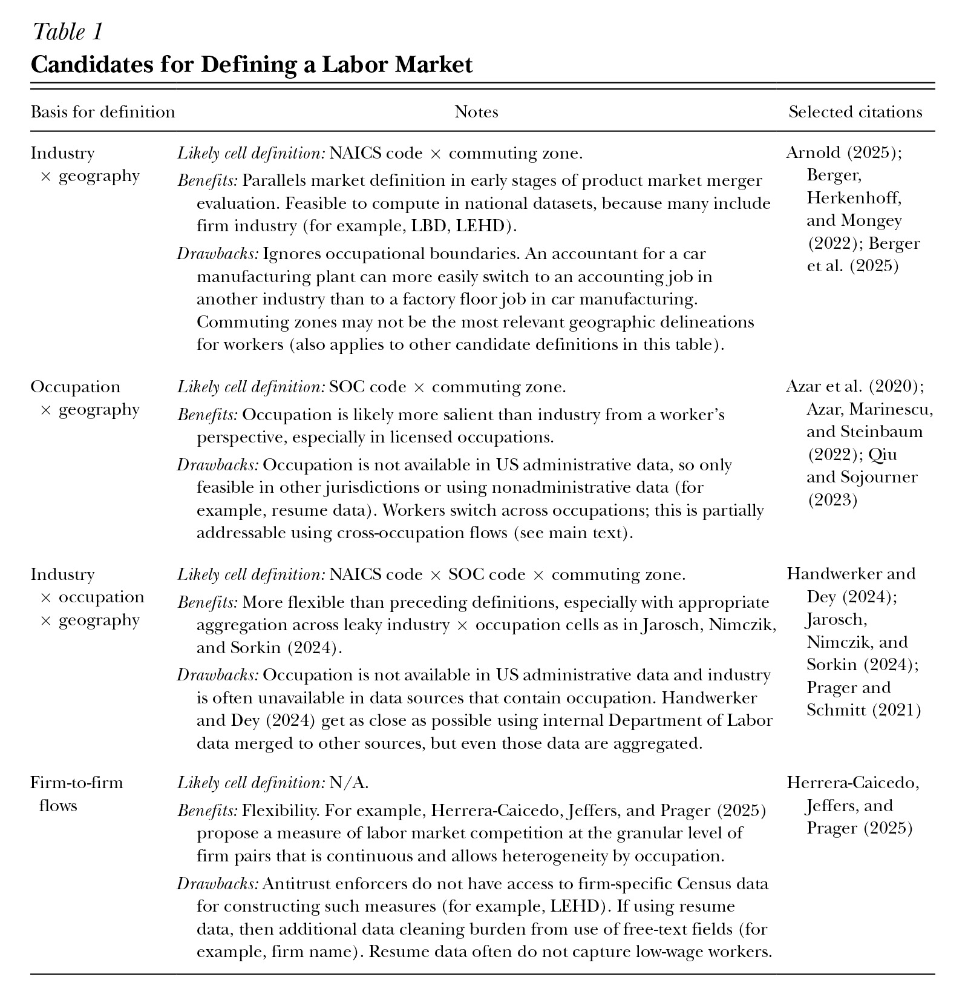
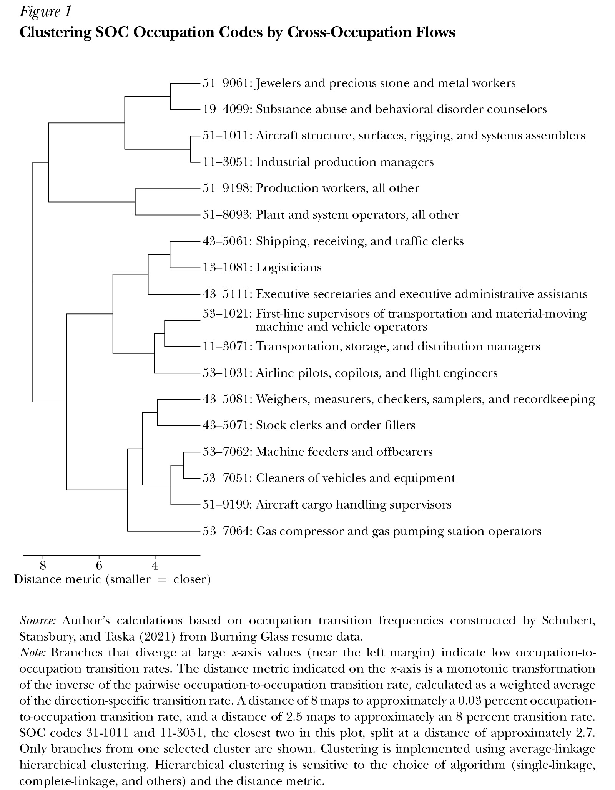

*Elena Prager*

```json
{
"article_id": "20241446",
"title": "Antitrust Enforcement in Labor Markets",
"type": "Symposium",
"symposium_name": "Labor Markets",
"authors": [
	"Elena Prager (U of Rochester)"
],
"pages": "115–138",
"doi": "https://doi.org/10.1257/jep.20241446",
"miniabstract": "Antitrust enforcement in labor markets has grown substantially since 2010 as evidence emerged that employer market power frequently stems from actionable conduct, yet key challenges around market definition and concentration modeling still limit its effectiveness.",
"figures_titles": [
	"Table 1: Candidates for Defining a Labor Market",
	"Figure 1: Clustering SOC Occupation Codes by Cross-Occupation Flows"
],
"abstract_url": "https://liegroup-dartmouth.github.io/working-aea-jep/papers/v40n1/prager/abstract.html",
"paper_url": "https://liegroup-dartmouth.github.io/working-aea-jep/papers/v40n1/prager/paper.xhtml",
"figures": [
	"https://liegroup-dartmouth.github.io/working-aea-jep/papers/v40n1/prager/image/23.jpg",
	"https://liegroup-dartmouth.github.io/working-aea-jep/papers/v40n1/prager/image/24.jpg"
],
"figures_data": [
	"https://liegroup-dartmouth.github.io/working-aea-jep/papers/v40n1/prager/image-data/23.csv",
	"https://liegroup-dartmouth.github.io/working-aea-jep/papers/v40n1/prager/image-data/24.csv"
]
}
```

In 2021, the world's largest book publisher, Penguin Random House, proposed buying another of the "big five" US book publishers, Simon & Schuster. The US Department of Justice sued to block the merger on the grounds that it would harm competition. The US District Court for the District of Columbia agreed, blocking the merger in 2022 (*US v. Bertelsmann 2022*). The case was extraordinary because the primary argument for blocking the merger was not the conventional concern that the merged firm would gain monopoly power and raise prices for the books sold to readers. Instead, the court agreed with the concern of the Department of Justice that the merged firm would gain *monopsony* power that could "substantially lessen competition to acquire 'the publishing rights to anticipated top-selling books.'" The book publishing case thus became the first US merger case to be brought—and won—primarily on the grounds of harm to labor market competition. Such a case would likely have been unthinkable a mere decade earlier.

For many decades, the US antitrust laws that exist to protect competitive markets and the welfare gains that flow from competition were almost exclusively applied to markets for output. They were almost never applied to markets for labor. Proposed corporate mergers were not evaluated on whether they were likely, say, to give the merged firm power to suppress compensation for its employees by absorbing a key competitor. Consider, for instance, a merger between two hospitals that together dominate a local labor market for nurses. Antitrust authorities would have considered whether such a merger might raise prices for patients and insurers, but not whether it would reduce competition for hiring nurses, potentially resulting in lower wages or worsened working conditions. In the last decade or so, antitrust authorities have begun to take labor market power more seriously, as have many academic researchers. A loose consensus has emerged that labor market concentration and related sources of labor market power can meaningfully harm labor market competition. But controversy remains on whether antitrust tools are actually capable of protecting competition in labor markets. Until recently, there was little empirical evidence on the consequences of the types of labor market power that are actionable under antitrust law. The literature on labor market power historically focused on search frictions, which are typically not actionable through the tools of antitrust. That evidence gap is rapidly being filled. As discussed below, the evidence shows that harms to labor market competition can indeed arise through mechanisms that antitrust enforcement can tackle.

Antitrust enforcement activity has begun to reflect antitrust law's preexisting, but previously dormant, jurisdiction over labor market competition. The most important antitrust enforcers in the United States are the Federal Trade Commission (FTC) and the Antitrust Division of the Department of Justice (DOJ). Across various areas of antitrust enforcement, the number of FTC and DOJ actions with a labor market component has risen from one in 2010–2014 to seven in 2020–2024 (Kariel, Schneebacher, and Walker 2024). To put these low counts in perspective, consider that the FTC and DOJ collectively bring only 25 to 30 merger cases in a typical year (Thurman Arnold Project 2020).

The uptick in labor market enforcement activity is mirrored in policy documents, staffing decisions, and court cases. For example, the Federal Trade Commission and the Department of Justice have been jointly issuing the Merger Guidelines since 1968, with subsequent revisions once or twice a decade. For over 50 years, the Merger Guidelines have included a discussion of input markets, but without mentioning labor inputs, despite labor's outsized importance to production. The most recent 2023 revision of the Merger Guidelines is the first to call out labor markets, stating explicitly that the agencies will consider labor market impacts in merger evaluation (DOJ and FTC 2023). Agency staffing decisions also reflect a new focus on labor markets. In 2022, for the first time, the DOJ brought in a labor economist to serve in a high-level antitrust position. In 2025, the FTC launched a new task force on labor market competition.

The aim of this essay is to explain how antitrust regulation is beginning to be used in labor markets, the evidence for and against its use, and the remaining evidence gaps standing in the way of more effective use. I begin with a brief primer on antitrust law and the recent sea change in its application to labor markets. The following section describes the key economic theories of labor market competition and the state of the empirical evidence, as they relate to antitrust enforcement. Finally, I turn to the practical issues that arise when applying antitrust tools to labor markets and some key open questions where additional research is needed to inform enforcement.

## The History of Antitrust (Non)Enforcement in Labor Markets

This section reviews the recent evolution in antitrust enforcement's approach to labor market power, first in a US context and then with a brief look at Europe.

### US Antitrust Enforcement

The United States has two keystone pieces of antitrust legislation: the Sherman Act of 1890 and the Clayton Act of 1914. Together, these acts prohibit collusion between firms: monopolization, which is defined as the gaining or maintenance of monopoly power through anticompetitive (loosely speaking, "unnatural") means such as predatory pricing; and mergers that would harm competition. The rationale for these prohibitions is that increases in monopoly power and behaviors like collusion prevent society from reaping the full benefits of competition.

Notably, the mere possession of monopoly power is not prohibited by antitrust law. Enforcers do not have authority over high *levels* of concentration and cannot easily break up large firms or undo consummated mergers.<sup><a id="footnote-043-backlink" href="#footnote-043">1</a></sup> The hope is that when a market is characterized by monopoly power, the market will self-correct by attracting new entrants that seek a share of the monopoly profit. This reliance on the efficacy of entry explains why barriers to entry also fall under the purview of antitrust enforcement. In practice, evidence is mixed on how effectively entry disciplines market power. For example, in a classic paper using data on entry, growth, and exit of US manufacturing firms during 1963–1982, Dunne, Roberts, and Samuelson (1988) find that most entrants do not survive for long. On the other side, Starc and Wollmann (2025) find that entry in the generic drug manufacturing industry dissipates the harms from collusion.

Many areas of antitrust enforcement rely on economics. Certain conduct is *per se* illegal, which means that it is unlawful regardless of the magnitude of its effects. Examples include blatant price fixing and market allocation. In such cases, antitrust enforcement makes little use of economics because the law is unambiguous. However, much of antitrust law concerns outcomes that are theoretically or legally ambiguous. For example, a corporate merger may or may not be anticompetitive, depending on many factors including how closely the merging firms currently compete. An "exclusive dealing" contract in which one firm agrees to buy a product from only one supplier, or a supplier agrees to sell to only one buyer, may be anticompetitive if its primary effect is to erect barriers to entry, or it may be procompetitive if it resolves principal-agent problems between a supplier and a distributor. Adjudication of such ambiguous cases relies heavily on economics, including sophisticated modeling and data analyses, to determine the effects of competition. However, there are also situations in which antitrust law diverges from the underlying economics, such as the treatment of tacit collusion (a subject to which I will return).

Economics is used particularly heavily in the evaluation of corporate mergers. The Hart-Scott-Rodino (HSR) Antitrust Improvements Act of 1976 requires that firms planning a merger or acquisition first notify the federal government of intended transactions above a certain size (in 2025, the threshold was $126.4 million). The firms must also provide basic information about their competitive positions and product portfolios. This information is reviewed by the Federal Trade Commission or the Department of Justice, depending on the industry and other details of the proposed transaction. If further investigation seems warranted, the reviewing antitrust agency obtains additional data, documents, and testimony from the merging parties and other industry participants. If this information offers a *prima facie* case that the merger might be harmful, then more sophisticated economic analysis is often performed before challenging a merger. Few proposed mergers reach this stage: of the thousands of intended and completed mergers in the United States each year, only a few dozen are investigated in depth, and only about half of those are challenged in court (Thurman Arnold Project 2020).

In principle, antitrust law applies to labor markets, because the law is agnostic as to market type. The text of the law does not privilege competition in product markets over competition in labor or other input markets.<sup><a id="footnote-042-backlink" href="#footnote-042">2</a></sup> Until recently, however, the cases chosen for enforcement by the Federal Trade Commission and the Department of Justice almost never involved protecting labor market competition. No corporate merger case had ever been challenged primarily on grounds of harm to labor market competition until the 2021 proposed merger of the book publishers Penguin Random House and Simon & Schuster. Only a handful of labor market collusion cases were brought over the century following the passage of the Sherman and Clayton Acts. In fact, in the first few decades after the Sherman Act of 1890, antitrust law was used in support of employers against labor unions, with unions viewed as cartels. Clarifications in the Clayton Act of 1914 and the Norris-Laguardia Act of 1932 eventually put this practice to rest.

As discussed in the introduction, antitrust enforcement has recently begun to be used to protect labor market competition. However, using antitrust enforcement in this way creates a potential tension: What if the higher wages from stronger labor market competition are passed through to consumers in the form of higher prices? Existing US antitrust law is clear on this point. Mergers that substantially harm competition in at least one market are illegal, even if they are procompetitive in other markets. Specifically, Section 7 of the Clayton Act prohibits mergers that substantially lessen competition "in any line of commerce in any section of the country." To put it another way, a merger that benefits consumers by reducing prices could be illegal—if it does so through anticompetitive reductions in wages (or other input costs).

The public discourse around this point has been muddled by a misunderstanding of the welfare standard used in merger law. The United States uses the so-called "consumer welfare" standard, which is often erroneously interpreted as meaning that only harms to final consumers are a valid reason to block a merger. In actuality, the consumer welfare standard should be understood to mean the welfare of trading partners opposite the merging parties (Kaplow 2024). In many merger cases, those trading partners are indeed consumers. In a merger of firms that draw upon the same labor pool, the parties opposite the merger may be workers. The existing consumer welfare standard should therefore be understood as consistent with concerns about the effects of mergers on competition in labor markets. Moreover, it is not obvious that a merger that reduces labor market competition will generally benefit consumers. I return to this point below in the section on merger enforcement.

Even as US antitrust authorities are beginning to include labor market competition in evaluations of proposed mergers, they have also brought several cases against alleged illegal suppression of competition for workers.<sup><a id="footnote-041-backlink" href="#footnote-041">3</a></sup> These cases, which all involved allegations of wage-fixing or labor market allocation, have spanned a range of industries including tech (the Silicon Valley no-poaching case); no-poaching and wage-fixing cases in health care (the *DaVita*, *Manahe*, *Jindal*, *VDA*, and *Lopez* cases); aerospace (Raytheon); poultry processing (*Cargill*); and e-sports (*Activision Blizzard*).<sup><a id="footnote-040-backlink" href="#footnote-040">4</a></sup> For an excellent summary of recent labor market cases pursued by the Department of Justice, see Athey et al. (2023, 2024).

Some of these cases involved egregious actions by firms, such as text message trails stating "We all have a mutual agreement [ . . . ] stay within the same hourly rate" for worker pay (*U.S. v. Lopez 2023*). However, taken as a group, the antitrust cases focused on no-poaching and wage-fixing have had mixed success in court. The federal government's antitrust agencies lost the Raytheon no-poaching case, despite the courts' recognition that labor market allocation took place (Posner 2023), and lost several of the health care cases (the *DaVita*, *Manahe*, and *Jindal* cases). The government obtained a guilty plea in the *VDA* case, settlements in the Silicon Valley and *Cargill* cases, and a consent decree in the *Activision Blizzard* case. The government obtained its first criminal conviction for wage-fixing in the *Lopez* case. The *Lopez* conviction was viewed as an important win for the agencies, because criminal liability is generally viewed as a stronger deterrent than civil liability.

US law is precedent-based, meaning that these early successes and failures of antitrust enforcement in labor markets will affect future enforcement. In some other countries, certain antitrust cases are handled administratively, with cases evaluated by specialized technical experts. By contrast, a judge hearing an antitrust case in the United States typically has limited experience with antitrust cases and no formal training in economics, which makes US enforcement particularly reliant on arguments and methods that are already accepted by the courts as precedent. The US legal system can therefore be slow to change in response to new methods and evidence, which makes it difficult to bring cases on novel grounds, such as labor market harms.

### Other Jurisdictions

Interest in labor market antitrust enforcement has also been increasing outside the United States in recent years, with European jurisdictions playing an outsized role. The European Union's Directorate General for Competition (DG COMP) and the United Kingdom's Competition and Markets Authority (CMA) have organized workshops on labor market competition, and the CMA published a first-of-its-kind report on the state of labor market competition in 2024 (CMA Microeconomics Unit 2024). The pace of labor market–related cases and actions has risen dramatically across the globe, though the absolute counts remain low, rising from 3 in 2010–2014 to 19 in 2020–2024 (Kariel, Schneebacher, and Walker 2024). Kariel, Schneebacher, and Walker (2024) provide a more comprehensive overview of recent developments outside the United States. As in the United States, enforcers have recently acted on labor market collusion in a wide range of industries, including sports, retail, health care, and beauty services.

Naturally, the details of antitrust law and the legal system vary by jurisdiction. The most important departures from the US system are in merger enforcement. In both the United Kingdom and European Union, a large fraction of merger enforcement is conducted administratively, outside the general court system. The United Kingdom's CMA reviews and makes decisions on mergers internally, without arguing before a court. The European Union's DG COMP issues its own decisions as well, although they are subject to review by a general court. These structures expand the scope for novel economic analyses relative to US merger cases. Of course, European antitrust enforcement does not set a formal legal precedent for US regulators and courts. However, there is a longstanding culture of cooperation among the key antitrust authorities, such that antitrust ideas often diffuse across jurisdictions. Indeed, antitrust law in other large economies is broadly similar to the United States.

## Evidence on Actionable Labor Market Power

Are the actions available to antitrust enforcers actually capable of protecting competition in labor markets? The answer is not immediately obvious. Several threats to competition are not actionable to enforcers. Market power is only actionable by antitrust enforcers if it is being abused in specific ways, or if it is being increased through collusion or a proposed merger.

Theoretical models propose two distinct classes of explanations for how labor market power might arise. The first class, search-and-matching models, shows how upward-sloping residual labor supply curves can arise from natural market frictions such as job search costs. In these models, firms are typically infinitesimal, leaving no role for collusion, mergers, or other behavior that would be actionable under antitrust law. The second class of models takes seriously that firms can be large enough for meaningful strategic interactions. In turn, strategic interactions and concentration create a role for antitrust enforcement.

Until recently, however, there was little empirical evidence on this second class of explanations. This section first reviews both classes of models, and then turns to the recent empirical evidence. The recent research finds that harms to labor market competition can indeed arise through mechanisms that are actionable under antitrust law. These research findings have plainly played a part in the direction of enforcement. For example, during the writing of the 2023 Merger Guidelines, senior federal officials appealed to specific research papers in explaining why they no longer view labor markets as inherently competitive (Kades 2023; Kanter 2023).

### Search-and-Matching Models

For many decades, search-and-matching models were the primary lens through which labor economists understood labor market power. In a perfectly competitive market, workers would be paid a wage equal to their marginal revenue product of labor (often called the marginal product of labor for short). Search-and-matching models take seriously frictions in the labor market. In a frictional labor market, even if there are infinitely many employers, wages will be marked down relative to the marginal product of labor. The literature proposes many sources of the wage markdown, but they share a core idea: workers cannot simultaneously and costlessly solicit job offers from all employers. As a result, an employer can pay a worker a wage slightly below marginal product, because the worker does not always have access to a competing job offer that would cause that worker to leave (Burdett and Mortensen 1998) or force the incumbent employer to bid up the existing wage (Postel-Vinay and Robin 2002).

There is a rich literature on search-and-matching models; for excellent reviews, see Mortensen and Pissarides (1999) and Kline (2025). The literature convincingly documents the existence of labor market power arising from search-and-matching frictions. For the purposes of this article, however, this source of labor market power is of secondary interest. Antitrust enforcement cannot act directly on natural labor market frictions, unless they are amplified by specific prohibited conduct such as agreements between employers to avoid bidding wars.

### Industrial Organization Models

Evidence from industrial organization models bears more directly on antitrust questions. The most relevant subset is a class of models that relates prices and quantities—or, in the case of labor markets, wages and employment—to the concentration of (noninfinitesimal) firms within a market. In a product market context, these models are familiar from undergraduate economics. As is well known, a monopolist seller of a good need not price at marginal cost in order to prevent consumers from switching to other sellers. The monopolist will therefore sell at a price above the competitive level, which also entails selling fewer units than the competitive quantity because demand is downward-sloping. Robinson (1933) was the first to apply this principle to labor markets, popularizing the term "monopsonist" to refer to a single employer that controls all the jobs in a given market (Thornton 2004). Like a monopolist, a labor monopsonist will set quantity (employment) below the competitive level. Because labor supply curves in this context are upward-sloping—offering higher (lower) wages will attract more (fewer) workers—this also entails wages below the competitive level. Perfect competition results in wages being bid up to the marginal product of labor. No employer will pay above the marginal product of labor because that would involve losing money on each worker, but no employer will pay below the marginal product of labor because then workers would switch to a competing employer that does pay the marginal product of labor.

A monopsonist, however, will find it profitable to pay a wage strictly below the marginal product of labor. In this model, if the firm raises the wage in order to attract an additional worker, it will also have to raise the wages of all its incumbent workers, increasing the effective cost of hiring the additional worker beyond the higher wage paid to that specific worker. The firm will internalize the fact that hiring an additional worker will raise the prevailing market wage, and therefore strategically set employment below the competitive level—or equivalently, set a wage below the marginal product of labor.

In practice, relatively few labor markets have just a single employer. However, many labor markets are concentrated, that is, dominated by a few large employers. The basic insights of the Robinsonian monopsony model extend to these more realistic cases. In a concentrated labor market, with a finite number of noninfinitesimal employers, each sizable employer affects the prevailing market wage. The firms will again internalize their impact on the prevailing wage, so they will strategically hire fewer workers than the competitive level, pushing wages below the marginal product of labor. Industrial organization models derive a tight relationship between market concentration and prices (for product markets) or wages (for labor markets). Under Cournot competition, the wage markdown (the marginal product of labor minus wages, divided by wages) is proportional to firm concentration.<sup><a id="footnote-039-backlink" href="#footnote-039">5</a></sup> Concentration is measured by the Herfindahl-Hirschman Index (HHI), defined as the sum of the squared market shares of all firms in a market. In this literature, a market is typically defined as combining a local area and a specific industry or occupation. Concentration-based models predict that concentration will reduce wages even in the absence of search-and-matching frictions.

In addition to concentration-based models of market power, another class of industrial organization models shows how market power can arise from firms producing differentiated products, which consumers view as imperfect substitutes. Consumers are then willing to pay a slightly higher price to buy a particular product whose characteristics they value more. A nascent empirical literature finds evidence that jobs, too, have an array of differentiated characteristics, so that employers can hire workers who are willing to accept a slightly lower wage for a particular job whose characteristics they value more. As a result, firms are able to pay workers a wage below the marginal product of labor (Azar, Berry, and Marinescu 2022; Lamadon, Mogstad, and Setzler 2022; Roussille and Scuderi 2025). Although the reality of differentiated jobs is not susceptible to policy intervention, this argument does nonetheless have implications for merger enforcement. If two merging firms that offer observably similar jobs in the same geographic area are not perfect substitutes from a worker's perspective, then a merger between these firms may not be as harmful to labor market competition as initially supposed. On the other hand, the definition of a labor market relevant to a worker may be narrower than the set of firms that offer observably similar jobs, in which case a merger may be more harmful to labor market competition.

## Measuring Actionable Labor Market Power

Within the last decade or so, labor market power has begun to be understood more expansively than search-and-matching models alone (Card 2022). A series of recent papers document that many labor markets are concentrated. For example, Azar et al. (2020) and Azar, Marinescu, and Steinbaum (2022) construct measures of labor market concentration using shares of job postings as the definition of an employer's market share. They find that the average labor market is highly concentrated according to thresholds of the Herfindahl-Hirschman Index typically used in antitrust applications. For example, the average labor market HHI is 3,200 in CareerBuilder vacancy data (Azar, Marinescu, and Steinbaum 2022) or 4,400 in BurningGlass vacancy data (Azar et al. 2020). Under the 2023 Merger Guidelines, markets with an HHI above 1,800 are considered highly concentrated; this threshold was 2,500 under the 2010 Horizontal Merger Guidelines. Because large labor markets tend to be less concentrated, the average *worker* does not work in a highly concentrated labor market, defined as having an HHI above 2,500. The fraction of markets above this threshold is 60 percent, accounting for 16 percent of workers (Azar et al. 2020). These concentration calculations also use a labor market definition with a narrow definition of occupation (based on six-digit Standard Occupation Classification, or SOC, codes) that may raise the concentration beyond what would be experienced by a worker who could switch to a closely related occupation. These six-digit SOC codes are fairly granular: there are more than 850 of them. A countervailing argument is that commuting zones, the geographic component of the local market definition used in these (and many other) papers, often cover multiple counties and in that sense are likely too broad for many workers. Nevertheless, these important papers challenge the long-held view that labor market concentration is negligible.

These authors and others then go a step further, studying the relationship between concentration and wages. An immediate challenge here is to find an exogenous source of variation for concentration. Azar, Marinescu, and Steinbaum (2022) use an instrumental variable approach, based on the number of posting employers in other geographic markets for the same occupation in a given quarter, which is intended to capture variation in market concentration driven by national-level rather than local factors. They find that going from the 25th to the 75th percentile of concentration within an occupation reduces posted wages by 17 percent.

This negative relationship between concentration and wages persists when using measures of actual worker pay rather than (incomplete) measures of wages from job postings. Other studies with related approaches and different data have found similar results, while offering additional insights. The concentration measures of these other studies map more cleanly to traditional product market concentration measures, because they use realized employment rather than job postings to calculate employer market shares. For example, Rinz (2022) uses actual earnings from individual tax filing data. Rinz's labor market definition uses industry (four-digit NAICS code) rather than occupation, and using the Longitudinal Business Database from 1976 to 2015 allows the author to document trends in within-industry labor market concentration over several decades. Although labor market concentration has been rising since the early 1990s when measured nationally, local concentration has been steadily falling since at least the mid-1970s, because much of the national increase is explained by large firms expanding across space. Again using an instrumental variable approach based on national-level variation, he finds that going from the 50th to the 75th percentile of concentration reduces earnings by about 10 percent. In another example, Qiu and Sojourner (2023) use earnings and health insurance benefits measured from the American Communities Survey and are able to control for product market concentration using data from Dun & Bradstreet. Controlling for product market concentration helps with the concern that large firms may increase both labor and product market concentration, with product market concentration potentially leading to higher product prices that can be passed through to higher wages. Using an instrumental variable approach similar to Azar, Marinescu, and Steinbaum (2022) and Rinz (2022), they find that moving up one standard deviation in labor market concentration lowers wages by 14 percent.

The constellation of findings from these early papers shows that there is a robust negative relationship between labor market concentration and wages. However, to determine whether this observed negative relationship offers a rationale for antitrust enforcement in labor markets, we need to reckon with the fact that concentration and wages are both equilibrium outcomes (Bresnahan 1989; Miller et al. 2022). Both are determined by other underlying parameters, such as firm productivity. If the smallest firm in a market suddenly becomes more productive, then it will be able to pay higher wages and its market share will increase due to attracting more workers, which will reduce concentration. If, instead, the largest firm becomes more productive, then its market share will increase further, which will increase concentration while also increasing wages. In these examples, wages move in the same direction while concentration moves in opposite directions. The more fundamental point, however, is that neither one causes the other; they are both ultimately caused by changes in the firms' demand for labor. Thus, an observed negative relationship between concentration and wages may not be sufficient to conclude that reducing concentration truly causes wages to rise. This fundamental ambiguity remains even if one instruments for concentration (Miller et al. 2022), as the pioneering papers in the preceding paragraphs do.

The goal is then to isolate changes in the number or size of employers that change concentration but do not directly affect wages, except through their effect on labor market power. Some recent papers use mergers between employers in the same market to provide supporting evidence that higher employer concentration, rather than merely being correlated with lower wages, causes them. Prager and Schmitt (2021) study the effects of employer mergers on wages using a decade of hospital mergers. The authors find that the mergers that substantially increase labor market concentration cause subsequent annual wage growth to slow by one to two percentage points, or approximately one-quarter of baseline wage growth rates. However, they find no effects of mergers that only moderately increase concentration and no effects on occupations that are not specific to the hospital industry. Of course, focusing on the hospital industry limits generalizability. Using Census data to study employer mergers across the economy, Arnold (2025) finds that mergers that substantially increase labor market concentration cause earnings reductions of more than 2 percent. One complexity in merger-based studies is that a merger may also increase product market power, which allows firms to raise prices, thereby raising the marginal revenue product of labor. But when Arnold (2025) carries out separate estimates for tradeable industries, where product market power is unlikely to be meaningfully affected by a local merger, the negative effect of mergers on wages persists.

Additional papers that leverage mergers include Benmelech, Bergman, Kim (2022) and Guanziroli (2022), which similarly find slowdowns in wages, although Arnold et al. (2023) find declines only among workers at the acquired employer. The literature on how mergers affect labor markets is still young. Many important questions remain largely unanswered, such as distributional consequences, the interaction with product market power, and the role of organized labor.

A variety of other methods have been used to study the relationship between antitrust-actionable labor market power and wages. Several authors have built models that combine concentration and search-and-matching frameworks. When these authors bring their models to data, they find that concentration reduces wages. For example, Jarosch, Nimczik, and Sorkin (2024) develop and calibrate a model that marries concentration and search frictions. They show that if employers can commit not to make new offers to the same worker in the future, then higher concentration results in lower wages. In another example, Berger, Herkenhoff, and Mongey (2022) marry concentration and job differentiation. Their model uses a representative household in a Cournot competition framework to show that both job differentiation and concentration result in lower wages. In both papers, the relevant measure of concentration is closely related to the standard Herfindahl-Hirschman Index measure.

Other studies turn to international and historical data. Delabastita and Rubens (2025) use a productivity estimation framework to estimate that collusion among nineteenth-century Belgian coal mines reduced wages by 6 to 17 percent. Sharma (2025) uses structural conduct testing methods to estimate that collusion among Indian textile firms suppresses wages by 10 percent. Gibson (2024) uses reduced-form methods to estimate that collusion among US tech companies in the mid-2000s reduced wages by 6 percent. Several studies show that noncompete agreements, which effectively increase labor market concentration by tying a worker to their current employer, seem to reduce wages.<sup><a id="footnote-038-backlink" href="#footnote-038">6</a></sup> The evidence on noncompete agreements is discussed in more detail in the paper by Starr in this symposium.

Taken together, these results provide strong evidence for the existence of labor market power that is within the purview of antitrust enforcers. Many sources of labor market power—high levels of concentration, search frictions, differentiated jobs—are outside the jurisdiction of antitrust law unless they are combined with specific violations. However, mergers, collusion, and other agreements to restrain competition are squarely within its jurisdiction.

## Labor Market Considerations in Merger Enforcement

This article discusses two natural areas for antitrust enforcement in labor markets. This section discusses proposed mergers that might affect labor markets, and the next section discusses collusive agreements among employers to hold down wages or working conditions.<sup><a id="footnote-037-backlink" href="#footnote-037">7</a></sup> In each of these areas, there are unresolved issues that affect the practical implementation of enforcement.

Some have argued against considering labor market effects in merger review at all. The rationale is that protecting labor market competition will raise labor costs, which will be passed through to higher prices and harm consumers. It is not obvious, however, that a merger that reduces labor market competition will generally benefit consumers. A key mechanism by which merging firms achieve wage reductions is to restrict the quantity of labor (Robinson 1933). Maintaining wages below the competitive level requires employing fewer workers, because the supply of workers is upward-sloping. Employing fewer workers also typically means producing less output, which then puts upward pressure on the final prices paid by consumers. Furthermore, labor market competition is important for allocative efficiency. Suppose, for example, that decades of hospital mergers weaken competition in the nursing labor market. Then in the long run, inefficiently few people may enter the nursing profession, because nurse compensation will be below the marginal product of nurse labor—which will likely make consumers worse off.

The exercise of labor market power could also manifest itself in lower wages, without a corresponding reduction in employment or output. A firm exercising labor market power will need employment reductions as a mechanism for lower wages only in markets where workers doing the same job are paid similarly to one another. Even in circumstances where pay is negotiated individually, however, the allocative efficiency argument still applies. Of course, long-run allocative efficiency effects are difficult for courts to evaluate. Nonetheless, they provide a principled economic argument in favor of applying merger enforcement tools to labor markets.

Antitrust enforcers have a set of standard tools to evaluate how a merger is likely to affect downstream purchasers, whether consumers or other firms. These tools can also be extended to how a merger might affect the market for inputs in general, and the market for labor inputs in particular. However, this last extension is not always straightforward. This section discusses the outstanding implementation questions that I view as most pressing or most difficult: in particular, issues related to market definition, what level of concentration should trigger scrutiny, and how to model job choice.

### Market Definition

Plausible market definitions can be narrow or broad. A narrower market definition, such as Pilates studios in downtown Boston, can more easily result in the merging parties being seen as competing in a concentrated market. A broader market definition, such as all gyms and exercise classes in the Boston metropolitan area, results in the market being seen as less concentrated and therefore less likely to be harmed by a merger. To challenge a merger successfully, the antitrust agencies must typically show that the merger will harm competition in at least one "relevant" market. Mergers are therefore more likely to be allowed when the court accepts a broad market definition; indeed, the way in which a market is defined can, in effect, settle the question of whether a merger will raise anticompetitive concerns.<sup><a id="footnote-036-backlink" href="#footnote-036">8</a></sup>

In output market settings, the "hypothetical monopolist" test is often used to discipline which candidate market definitions can be considered relevant. This test deems a market definition valid if a hypothetical monopolist seller controlling the entire market would find it profitable to increase prices by some amount (typically 5 percent). The test is also sometimes referred to as the SSNIP test, because it relies on the calculation of a "small but significant and non-transitory increase in price." This test can be adapted for a labor market setting into the hypothetical monopsonist test (Naidu, Posner, and Weyl 2018). The test then asks whether a monopsonist employer would find it profitable to reduce wages by some amount. However, implementation of the test in a labor market setting is not straightforward. It requires estimation of the cross-employer wage elasticity of labor supply, which is complicated by the two-sided nature of labor markets (as discussed below in the section on models of job choice). In practice, the choice of market definition will often depend on the specifics of each case.

It is not always possible or desirable to invest in a bespoke labor market definition. At the initial stage of deciding whether to investigate a proposed merger, the antitrust agencies need an easily implementable labor market definition. If the merger is challenged in court, it is often desirable for the market definition to consist of standard components that are comprehensible to the judge and replicable by the opposing party. [Table 1](#_idTextAnchor028) summarizes some natural candidate definitions that are useful points of departure, although the most suitable definition may well vary on a case-by-case basis.

<a id="_idTextAnchor028"></a>



The choice of a definition necessitates trading off flexibility and accuracy against feasibility. Most of the candidate definitions in Table 1 rely on standard classification systems for industries, occupations, and geographies. Some of these classification systems, such as North American Industry Classification System (NAICS) codes and Standard Occupational Classification (SOC) codes, allow a choice of the level of granularity, because these codes are defined as broad categories divided into several levels of greater detail.

Each of these classification systems is subject to the criticism that it is not possible to partition labor markets fully: people do similar jobs across industries, switch occupations, and migrate across geographies. It may therefore be desirable to aggregate some cells into a coarser partition.<sup><a id="footnote-035-backlink" href="#footnote-035">9</a></sup> Consider the occupation dimension of labor market definition. One method for aggregation is to aggregate from the most granular six-digit SOC codes to broader five-, three-, or two-digit SOC codes. However, the degree of across-occupation switching is highly heterogeneous, and this is not always reflected in the nested structure of SOC codes.

An alternative method for aggregation is to construct a measure of occupation closeness. [Figure 1](#_idTextAnchor029) displays a subset of the results of a hierarchical clustering algorithm that groups occupations based on the frequency of occupation-to-occupation switches. The farther to the right two branches split, the more switching there is between the occupations in those branches. Some occupations with similar SOC codes, such as machine feeders and offbearers (53-7062) and cleaners of vehicles and equipment (53-7051), do indeed have very high occupation-to-occupation switching rates, as indicated by the short horizontal distance of the final branches that separate them. However, some occupations are very closely related despite being in different two-digit SOC codes, the highest level of SOC code aggregation. For example, shipping, receiving, and traffic clerks (43-5061) are closely related to logisticians (13-1081). Aggregation approaches such as this one provide a principled way to group together close SOC codes while leaving isolated codes in their own single-code groups (these are omitted from the figure for brevity). They can be combined with any of the candidate definitions in Table 1 that have an occupation component. This and other types of aggregation can be applied to other dimensions of labor market definition besides occupation. For example, a similar idea is used by Herrera-Caicedo, Jeffers, and Prager (2025) to provide a continuous measure of how closely a pair of firms compete in the labor market.

<a id="_idTextAnchor029"></a>



Conversely, standard classifications are sometimes too broad. For example, French professors and Hindi professors, who likely compete for different jobs, are pooled into a single SOC code (25-1124), even when using the most granular (six-digit) SOC classification. The most commonly used geographic delineation, the commuting zones constructed by the US Department of Agriculture to capture cross-county commuting patterns, lacks a nested structure altogether, thus making it impossible to consider whether it is under- or over-inclusive. One end of a large urban commuting zone rarely sends commuters to the other end, even if both ends send commuters into the same central business district. Some workers living near borders may partially "belong" to more than one commuting zone. Moreover, workers migrate, and willingness to migrate is highly heterogeneous by age and education (Jia et al. 2023), and likely by occupation. On balance, the evidence that jobs are meaningfully differentiated even within industry-geography or occupation-geography cells (Azar, Berry, and Marinescu 2022; Lamadon, Mogstad, and Setzler 2022; Roussille and Scuderi 2025) points to appropriate labor markets being narrower than is typically assumed.

### Labor Market Concentration Thresholds

The likelihood of a merger being challenged by US antitrust agencies increases substantially when the merger-induced increase in product market concentration and the post-merger level of concentration exceed thresholds set out in the Merger Guidelines. Under the most recent 2023 Guidelines, the thresholds for closer inspection of a proposed merger are a post-merger Herfindahl-Hirschman Index level above 1,800 and an HHI increase above 100.<sup><a id="footnote-034-backlink" href="#footnote-034">10</a></sup> While no single threshold is likely to be policy-optimal across all industries and markets, there is some support for the use of these thresholds for evaluating product market effects of mergers (Nocke and Whinston 2022).<sup><a id="footnote-033-backlink" href="#footnote-033">11</a></sup>

When it comes to labor markets, however, there is almost no evidence about the appropriate thresholds for concentration levels or increases. One possibility is that labor market harms begin at lower concentrations than product market harms, because labor markets may be characterized by greater market power. For example, information frictions are more severe than in most product markets. Unlike a product market where all prices are observable to consumers, labor markets are characterized by difficult-to-observe wages and working conditions. Learning these job attributes often requires not only completing a costly interview process but also securing a job offer. As noted earlier, these search frictions generate employer market power.

In the study of local hospital mergers mentioned earlier, Prager and Schmitt (2021) find harms to labor market competition at Herfindahl-Hirschman Index increases of several hundred using a labor market definition with a narrow industry (hospitals) or approximately 100 using a broader industry (all health care). These estimates may be specific to the health care sector, which has low across-occupation mobility. Calibrating a model to many industries, Berger et al. (2025) provide suggestive evidence that the existing product market thresholds are in the right ballpark for labor markets.

Much more research is needed to determine the appropriate Herfindahl-Hirschman Index thresholds for evaluating labor market effects. The appropriate threshold will also be a function of the chosen labor market definition: a narrower market definition will produce a higher optimal threshold. Research that simultaneously considers labor market definition and HHI thresholds would therefore be especially valuable.

Alternatively, the constraints of legal precedent may mean that the same thresholds for concentration must be applied to both product and labor markets. The courts may be reluctant to recognize a separate set of thresholds for labor markets. One possible solution to this practical problem is to choose labor market definitions that are internally consistent with existing HHI thresholds, rather than to develop new thresholds.

### Models of Job Choice

The final stages of a merger review can involve estimating a model of the markets in question in order to simulate the likely effects on prices, quantities, and sometimes other outcomes. Many merger cases, even many of those that eventually make it to court, do not involve such merger simulation. Merger simulation is costly and can be unnecessary in cases where other types of evidence clearly point to the merger eliminating or reducing strong competition. It is also sometimes infeasible given available data. Nevertheless, simulation of the relevant market remains one important tool for merger evaluation.

When merger simulation is undertaken, it is closely connected to economic theory and often resembles well-executed empirical industrial organization research. In standard product market merger cases, discrete choice models of product demand are often used. The direct labor market analog is to estimate a discrete choice model of workers' demand for jobs, likely allowing for some job differentiation, as in Azar, Berry, and Marinescu (2022). A worker is then modeled as choosing among a list of jobs with known wages and nonwage characteristics.

But even at a basic conceptual level, there are at least two difficulties with this analog. First, labor markets are matching markets. Unlike consumers choosing which of the available products to purchase, workers cannot choose among all existing jobs, because not every employer wants to hire a given worker. In typical datasets, it is difficult to infer for which jobs a worker would have been eligible. If the set of attainable jobs is defined too broadly, estimates of the wage elasticity of labor supply will be biased downward, yielding incorrect predictions about harms from the merger. New models of job choice that combine the discrete choice approach with the matching nature of labor markets would be valuable for antitrust enforcers.

A second difficulty is that the relevant characteristics of a job are not easily observable to the analyst, and some are not even observable to the worker. Unlike in most product markets, the labor market analog of prices—that is, wages—is typically somewhat hidden from workers until after they have applied for and been offered a job. Given that workers do not know with certainty a key characteristic of most of the jobs that exist, it is difficult to estimate how they will respond when a characteristic changes due to a merger. Even if job characteristics were more fully known to workers, important dimensions such as the corporate culture, work hours, and schedule flexibility are often difficult for the analyst to measure. These information frictions complicate the estimation of discrete choice models. The industrial organization literature has made some progress toward incorporating such complications in product market settings, such as the literature on "consideration sets" that are used to study consumer choices between goods (Honka, Hortaçsu, and Wildenbeest 2019), but these tools have not yet been appropriately extended to labor market contexts.

### Additional Considerations

Of the many other outstanding questions related to merger review of labor market power, I will mention three. First, there is evidence that labor unions mitigate the negative wage effects of employer power (Prager and Schmitt 2021; Benmelech, Bergman, and Kim 2022) and increase pass-through of employer product market power to higher wages (Dodini, Salvanes, and Willén 2024; CMA Microeconomics Unit 2024). An open question is whether and how merger evaluation should differ as a function of countervailing worker power.

Second, there is increasing attention paid to nonprice, nonquantity market outcomes such as quality and innovation in the evaluation of product market effects of mergers. The labor market analog is nonwage job amenities (for a review of the relevant literature, see Mas 2025). How to incorporate nonwage job amenities into merger analysis is an open question.

Finally, adding a labor market component to merger review is costly. The resource constraints of antitrust agencies are already binding (Brot et al. 2024), so adding this new component would crowd out other enforcement activity. Whether this resource shift is efficient hinges on what fraction of mergers that are not already flagged on other grounds would, upon investigation, turn out to be concerning on labor market grounds. This fraction is not known, although a promising early step toward calibrating it through the lens of a model is Hosken, Larson-Koester, and Taragin (2023). Nor is there a data infrastructure for easily evaluating the trade-offs. As noted earlier, substantial proposed mergers must be reported to the antitrust agencies for an initial review under the Hart-Scott-Rodino (HSR) premerger notification requirement. However, the HSR form only asks firms for information that indicates whether the merging parties have a substantial competitive overlap in product markets (often measured by industry codes and key product information). A proposed 2024 revision to the HSR form would have begun to collect labor-related information (FTC 2024), but that portion of the revision was scuttled during the political process.

## Restrictive Agreements among Employers

Agreements among employers that suppress competition for workers can be collusive. Typical examples include wage-fixing agreements and no-poaching agreements. Enforcement against collusion relies less heavily on detailed economic modeling than does merger enforcement, because the laws prohibiting collusion make it *per se* illegal: that is, illegal regardless of the magnitude or measurability of the harms. The *per se* prohibition is grounded in a robust prediction from economics that collusion harms markets, but the very strength of that prediction—through the *per se* prohibition—obviates the need for detailed empirical analysis. As such, the open questions are not so much about how to enforce laws against labor market collusion as they are about resource allocation. If labor market collusion is pervasive and easily detected, and its harms are large, then using limited antitrust enforcement resources on it is justified. If it is rare, minimally harmful, or very costly to detect, then limited resources should perhaps be targeted elsewhere.

An important caveat is that even these types of agreements may not constitute illegal collusion if they are "ancillary" to competition—that is, required for a procompetitive business relationship. For example, two firms engaging in a procompetitive joint venture may argue that without an agreement not to poach one another's relevant workers, they would not enter the joint venture in the first place.

### Prevalence and Harms

The empirical evidence on the prevalence of labor market collusion and any resulting economic harms is in its infancy. Collusion in any market is difficult to study, because firms have a strong incentive to hide actions that are likely to be found illegal. This same property also makes its prevalence difficult to estimate. Nonetheless, there are documented instances of employer collusion dating as far back as the mid-1800s, as in the Delabastita and Rubens (2025) study of employer collusion between 227 Belgian coal firms in 1845–1913, and all the way up to modern times. Some recent examples include studies of the no-poaching agreements among prominent Silicon Valley firms (Gibson 2024; Herrera-Caicedo, Jeffers, and Prager 2025) and how large employers in India's textile and clothing industry organized into industry associations to hold down wages (Sharma 2025). The few empirical papers that exist in this area find wage reductions in the neighborhood of 5 to 15 percent. Whether this range is representative remains an open question. With this dearth of evidence on employer collusion, the appropriate level of enforcement resources remains uncertain.

### Detection

When enforcement against collusive employer agreements does occur, it does not follow the definition of "collusion" used in economics. Economists tend to focus on whether collusive outcomes were reached, without regard to whether explicit communication was involved in reaching them. For example, consider two airlines that refrain from lowering prices on routes where they directly compete, even when it would be individually profitable for them to lower prices. For economists, the outcome would be regarded as collusive regardless of whether the collusion was explicit (involving direct communication) or tacit. In contrast, the legal standard requires explicit communication or agreements between the firms. Direct communication likely makes collusion both easier and more effective (Green, Marshall, and Marx 2014; Awaya and Krishna 2016; Asker and Nocke 2021), so perhaps the welfare losses from allowing tacit collusion are comparatively small. However, collusion without direct communication is still feasible, so this legal standard leaves open legal avenues for welfare-reducing collusion (Harrington 2012; Byrne and de Roos 2019; Chassang and Ortner 2023). For example, a firm can experiment with keeping prices high in the face of falling demand in order to test whether its rival will also refrain from dropping prices.

Given these differences in how collusion is defined, the burden of proof for prosecuting collusion can seem quite high from an economist's perspective. It is not sufficient (or even necessary) to show that firms achieved collusive prices or other collusive outcomes; a history of communication must be shown. This high burden of proof applies to collusion in labor markets, as well. Historically, when antitrust enforcement in labor markets was weak, employers may have been rationally careless in failing to obfuscate their explicitly collusive behavior in labor markets. This may have given antitrust enforcers a temporary advantage in the labor market context, with employers leaving clear paper trails as described in Herrera-Caicedo, Jeffers, and Prager (2025).

It is reasonable to expect that the increasing focus of antitrust enforcement on labor markets will make firms both more reluctant to engage in labor market collusion and more motivated to hide it. An important question for researchers is therefore how to test for labor market collusion in the absence of a paper trail. In a product market context, many of the existing detection tools rely on suspicious pricing patterns, especially suspiciously stable prices (Harrington 2008). In labor markets, such tests may be made less useful by the fact that wage stability may naturally result from noncollusive sources such as downward wage stickiness, collective bargaining, and labor laws. Even after decades of research, detection of collusion in product markets remains challenging (Asker and Nocke 2021). Enforcers may have no choice but to rely more heavily on existing leniency programs. These programs have been successful in encouraging reporting by promising reduced penalties for the first firm that blows a whistle on collusion in which it is a participant (OECD 2003). In order for whistleblowing to be an attractive option, the penalties ordinarily imposed must be large. Under US law, fines for federally prosecuted collusion cannot exceed two times the firms' gain from the collusion (Hammond 2010). Even under these comparatively small fines, whistleblower programs have been effective (Miller 2009), but some argue that the fines should be larger (OECD 2003).

## Conclusion

A decade ago, antitrust cases with a primary focus on labor markets were vanishingly rare. Labor market considerations now play a growing—though still small—role in antitrust enforcement. A recent research literature shows that labor market competition is less robust, and also more amenable to antitrust tools, than previously thought. New empirical evidence and modeling approaches that make progress on these questions can have a real impact on policy.

■ I thank Susan Athey, Ioana Marinescu, Jeanine Miklos-Thal, Eric Posner, Kevin Rinz, and the JEP editorial team for helpful feedback.

## References

**Arnold, David.** 2025. "Mergers and Acquisitions, Local Labor Market Concentration, and Worker Outcomes." Unpublished.

**Arnold, David, Kevin S. Milligan, Terry Moon, and Amirhossein Tavakoli.** 2023. "Job Transitions and Employee Earnings after Acquisitions: Linking Corporate and Worker Outcomes." NBER Working Paper 31866.

**Asker, John, and Volker Nocke.** 2021. "Collusion, Mergers, and Related Antitrust Issues." In *Handbook of Industrial Organization*, Vol. 5, edited by Kate Ho, Ali Hortaçsu, and Alessandro Lizzeri, 177–279. North-Holland.

**Athey, Susan, Mark Chicu, Malika Krishna, and Ioana Marinescu.** 2023. "The Year in Review: Economics at the Antitrust Division, 2022–2023." *Review of Industrial Organization* 63 (4): 525–44.

**Athey, Susan, Alex Gross, Ioana Marinescu, and Jennifer Shanefelter.** 2024. "The Year in Review: Economics at the Antitrust Division 2023–2024." *Review of Industrial Organization* 65 (4): 809–29.

**Awaya, Yu, and Vijay Krishna.** 2016. "On Communication and Collusion." *American Economic Review* 106 (2): 285–315.

**Azar, José A., Steven T. Berry, and Ioana Marinescu.** 2022. "Estimating Labor Market Power." NBER Working Paper 30365.

**Azar, José, Ioana Marinescu, and Marshall Steinbaum.** 2022. "Labor Market Concentration." *Journal of Human Resources* 57 (S): S167–99.

**Azar, José, Ioana Marinescu, Marshall Steinbaum, and Bledi Taska.** 2020. "Concentration in US Labor Markets: Evidence from Online Vacancy Data." *Labour Economics* 66: 101886.

**Benmelech, Efraim, Nittai K. Bergman, and Hyunseob Kim.** 2022. "Strong Employers and Weak Employees: How Does Employer Concentration Affect Wages?" *Journal of Human Resources* 57 (S): S200–50.

**Berger, David, Thomas Hasenzagl, Kyle Herkenhoff, Simon Mongey, and Eric A. Posner.** 2025. "Merger Guidelines for the Labor Market." *Journal of Monetary Economics* 153: 103785.

**Berger, David, Kyle Herkenhoff, and Simon Mongey.** 2022. "Labor Market Power." *American Economic Review* 112 (4): 1147–93.

**Bresnahan, Timothy F.** 1989. "Empirical Studies of Industries with Market Power." In *Handbook of Industrial Organization*, Vol. 2, edited by Richard Schmalensee and Robert Willig, 1011–57. North-Holland.

**Brot, Zarek, Zack Cooper, Stuart V. Craig, and Lev Klarnet.** 2024. "Is There Too Little Antitrust Enforcement in the US Hospital Sector?" *American Economic Review: Insights* 6 (4): 526–42.

**Burdett, Kenneth, and Dale T. Mortensen.** 1998. "Wage Differentials, Employer Size, and Unemployment." *International Economic Review* 39 (2): pp. 257–73.

**Byrne, David P., and Nicolas de Roos.** 2019. "Learning to Coordinate: A Study in Retail Gasoline." *American Economic Review* 109 (2): 591–619.

**Card, David.** 2022. "Who Set Your Wage?" *American Economic Review* 112 (4): 1075–90.

**Chassang, Sylvain, and Juan Ortner.** 2023. "Regulating Collusion." *Annual Review of Economics* 15: 177–204.

**CMA Microeconomics Unit.** 2024. *Competition and Market Power in UK Labour Markets*. Competition and Markets Authority.

**Delabastita, Vincent, and Michael Rubens.** 2025. "Colluding against Workers." *Journal of Political Economy* 133 (6): 1796–839.

**Dodini, Samuel, Kjell Salvanes, and Alexander Willén.** 2024. "The Dynamics of Power in Labor Markets: Monopolistic Unions versus Monopsonistic Employers." Unpublished.

**Dunne, Timothy, Mark J. Roberts, and Larry Samuelson.** 1988. "Patterns of Firm Entry and Exit in US Manufacturing Industries." *RAND Journal of Economics* 19 (4): 495–515.

**FTC.** 2024. *16 CFR Parts 801 and 803. RIN 3084-AB46. Premerger Notification; Reporting and Waiting Period Requirements*. Federal Trade Commission, Billing Code 6750-01-P.

**Gibson, Matthew D.** 2024. "Employer Market Power in Silicon Valley." Upjohn Institute Working Paper 24–398.

**Green, Edward J., Robert C. Marshall, and Leslie M. Marx.** 2014. "Tacit Collusion in Oligopoly." In *The Oxford Handbook of International Antitrust Economics*, Vol. 2, edited by Roger D. Blair and D. Daniel Sokol, 464–97. Oxford University Press.

**Guanziroli, Tomas.** 2022. "Does Labor Market Concentration Decrease Wages? Evidence from a Retail Pharmacy Merger." Unpublished.

**Hammond, Scott D.** 2010. "The Evolution of Criminal Antitrust Enforcement Over the Last Two Decades." Speech, presented at the Twenty-Fourth Annual National Institute on White Collar Crime, Miami, FL, February 25, 2010. [https://www.justice.gov/d9/atr/speeches/attachments/2015/06/25/the_evolution_of_criminal_antitrust_enforcement_over_the_last_two_decades.pdf](https://www.justice.gov/d9/atr/speeches/attachments/2015/06/25/the_evolution_of_criminal_antitrust_enforcement_over_the_last_two_decades.pdf).

**Handwerker, Elizabeth Weber, and Matthew Dey.** 2024. "Some Facts about Concentrated Labor Markets in the United States." *Industrial Relations: A Journal of Economy and Society* 63 (2): 132–51.

**Harrington, Joseph E., Jr.** 2008. "Detecting Cartels." In *Handbook of Antitrust Economics*, edited by Paolo Buccirossi, 213–58. MIT Press.

**Harrington, Joseph.** 2012. "Game-Theoretic Ruminations on Section 1 of the Sherman Act." Speech, Bayard Wickliffe Heath Memorial Lecture, University of Florida Levin College of Law, March 30, 2012.

**Herrera-Caicedo, Alejandro, Jessica Jeffers, and Elena Prager.** 2025. "Collusion through Common Leadership." NBER Working Paper 33866.

**Honka, Elisabeth, Ali Hortaçsu, and Matthijs Wildenbeest.** 2019. "Empirical Search and Consideration Sets." In *Handbook of the Economics of Marketing*, Vol. 1, edited by Jean-Pierre Dubé and Peter E. Rossi, 193–257. North-Holland.

**Hosken, Daniel, Miriam Larson-Koester, and Charles Taragin.** 2023. "Labor and Product Market Effects of Mergers." Unpublished.

***In re: High-Tech Employee Antitrust Litigation*.** US District Court for the Northern District of California, No. 5:11-cv-02509 (2011).

**Jarosch, Gregor, Jan Sebastian Nimczik, and Isaac Sorkin.** 2024. "Granular Search, Market Structure, and Wages." *Review of Economic Studies* 91 (6): 3569–607.

**Jia, Ning, Raven Molloy, Christopher Smith, and Abigail Wozniak.** 2023. "The Economics of Internal Migration: Advances and Policy Questions." *Journal of Economic Literature* 61 (1): 144–80.

**Kades, Michael.** 2023. "Antitrust Division Deputy Assistant Attorney General's Remarks." Speech, Annual CRA Brussels Conference, Brussels, December 7, 2023. [https://www.justice.gov/archives/opa/speech/antitrust-division-deputy-assistant-attorney-general-michael-kades-gives-remarks-annual](https://www.justice.gov/archives/opa/speech/antitrust-division-deputy-assistant-attorney-general-michael-kades-gives-remarks-annual).

**Kanter, Jonathan.** 2023. "Assistant Attorney General's Remarks." Speech, Georgetown Antitrust Law Symposium, Washington, DC, September 19, 2023. [https://www.justice.gov/archives/opa/speech/assistant-attorney-general-jonathan-kanter-delivers-remarks-2023-georgetown-antitrust](https://www.justice.gov/archives/opa/speech/assistant-attorney-general-jonathan-kanter-delivers-remarks-2023-georgetown-antitrust).

**Kaplow, Louis.** 2024. *Rethinking Merger Analysis*. MIT Press.

**Kaplow, Louis.** 2025. "Improving Economic Analysis in Merger Guidelines." *Journal of Economic Perspectives* 39 (1): 29–52.

**Kariel, Joel, Jakob Schneebacher, and Mike Walker.** 2024. "Competition Policy and Labour Market Power: New Evidence and Open Questions." *Oxford Review of Economic Policy* 40 (4): 787–807.

**Kline, Patrick M.** 2025. "Labor Market Monopsony: Fundamentals and Frontiers." NBER Working Paper 33467.

**Lamadon, Thibaut, Magne Mogstad, and Bradley Setzler.** 2022. "Imperfect Competition, Compensating Differentials, and Rent Sharing in the US Labor Market." *American Economic Review* 112 (1): 169–212.

**Mas, Alexandre.** 2025. "Non-wage Amenities." NBER Working Paper 33643.

**Miller, Nathan H.** 2009. "Strategic Leniency and Cartel Enforcement." *American Economic Review* 99 (3): 750–68.

**Miller, Nathan, Steven Berry, Fiona Scott Morton, Jonathan Baker, Timothy Bresnahan, Martin Gaynor, Richard Gilbert, et al.** 2022. "On the Misuse of Regressions of Price on the HHI in Merger Review." *Journal of Antitrust Enforcement* 10 (2): 248–59.

**Mortensen, Dale T., and Christopher A. Pissarides.** 1999. "New Developments in Models of Search in the Labor Market." In *Handbook of Labor Economics*, Vol. 3, edited by Orley C. Ashenfelter and David Card, 2567–627. North-Holland.

**Naidu, Suresh, Eric A. Posner, and Glen Weyl.** 2018. "Antitrust Remedies for Labor Market Power." *Harvard Law Review* 132 (2): 536–601.

**Nocke, Volker, and Michael D. Whinston.** 2022. "Concentration Thresholds for Horizontal Mergers." *American Economic Review* 112 (6): 1915–48.

**OECD.** 2003. *Hard Core Cartels: Recent Progress and Challenges Ahead*. OECD.

**Posner, Eric A.** 2023. "The New Labor Antitrust." *Antitrust Law Journal* 86 (2): 503–78.

**Postel-Vinay, Fabien, and Jean-Marc Robin.** 2002. "Equilibrium Wage Dispersion with Worker and Employer Heterogeneity." *Econometrica* 70 (6): 2295–350.

**Prager, Elena.** 2026. *Data and Code for: "Antitrust Enforcement in Labor Markets."* Nashville, TN: American Economic Association; distributed by Inter-university Consortium for Political and Social Research, Ann Arbor, MI. [https://doi.org/10.3886/E241085V1](https://doi.org/10.3886/E241085V1).

**Prager, Elena, and Matt Schmitt.** 2021. "Employer Consolidation and Wages: Evidence from Hospitals." *American Economic Review* 111 (2) 397–427.

**Qiu, Yue, and Aaron Sojourner.** 2023. "Labor-Market Concentration and Labor Compensation." *ILR Review* 76 (3): 475–503.

**Rinz, Kevin.** 2022. "Labor Market Concentration, Earnings, and Inequality." *Journal of Human Resources* 57 (S): S251–83.

**Robinson, Joan.** 1933. *The Economics of Imperfect Competition*. Macmillan.

**Roussille, Nina, and Benjamin Scuderi.** 2025. "Bidding for Talent: A Test of Conduct in a High-Wage Labor Market." NBER Working Paper 33848.

**Schubert, Gregor, Anna Stansbury, and Bledi Taska.** 2021. *Occupational mobility dataset for "Employer Concentration and Outside Options."* Distributed by: Author's website, [https://annastansbury.github.io/website/Occ%20Transitions%20Public%20Data%20Set%20%28Jan%202021%29](https://annastansbury.github.io/website/Occ%20Transitions%20Public%20Data%20Set%20%28Jan%202021%29) (accessed June 25, 2025).

**Sharma, Garima.** 2025. "Collusion among Employers in India." Unpublished.

**Starc, Amanda, and Thomas G. Wollmann.** 2025. "Does Entry Remedy Collusion? Evidence from the Generic Prescription Drug Cartel." *American Economic Review* 115 (5): 1400–438.

**Thornton, Robert J.** 2004. "Retrospectives: How Joan Robinson and BL Hallward Named Monopsony." *Journal of Economic Perspectives* 18 (2): 257–61.

**Thurman Arnold Project.** 2020. "Modern Antitrust Enforcement." [https://som.yale.edu/centers/thurman-arnold-project-at-yale/modern-antitrust-enforcement](https://som.yale.edu/centers/thurman-arnold-project-at-yale/modern-antitrust-enforcement).

***United States v. Activision Blizzard*,** 1:23-cv-00895 (2023).

***United States v. Bertelsmann SE and CO KGaA, et al.*,** 21-2886-FYP (2022).

***United States v. Cargill*,** 1:22cv-01821 (D. Md. 2022).

***United States v. DaVita Inc.*,** 1:21-cr00229, (D. Colo. 2021).

***United States v. Jindal*,** 4:20-cr-358 ALM/KPJ (2020).

***United States v. Lopez*,** 22-40121 (5th Cir. 2023).

***United States v. Manahe*,** 2:22-cr-00013, (D. Me. 2023).

***United States v. Mahesh Patel, et al.*,** 3:21-cr-220 (VAB) (2021).

***United States v. VDA, OC, LLC, formerly Advantage on Call, LLC*,** 2:21-cr-00098-RFB-BNW (2021).

**US Department of Justice, and Federal Trade Commission.** 2023. *2023 Merger Guidelines*. US Department of Justice and the Federal Trade Commission.

■ Elena Prager is Assistant Professor of Economics, University of Rochester Simon Business School, Rochester, New York. She is also Faculty Research Fellow, National Bureau of Economic Research, Cambridge, Massachusetts. Her email address is [eprager@simon.rochester.edu](mailto:eprager@simon.rochester.edu).

For supplementary materials such as appendices, datasets, and author disclosure statements, see the article page at [https://doi.org/10.1257/jep.20241446](https://doi.org/10.1257/jep.20241446).

## Footnotes

<p id="footnote-043"><sup><a href="#footnote-043-backlink">1</a></sup> The most notable exceptions are the forced breakups of Standard Oil in 1911 and of AT&T in 1984. As of this writing, the antitrust case against Alphabet includes discussions of breaking up firms under arguments of monopolization; however, courts rejected similar claims by the government in its case against Meta in November 2025.</p>

<p id="footnote-042"><sup><a href="#footnote-042-backlink">2</a></sup> Section 8 of the Clayton Act is explicitly about output market competition. This is the exception rather than the rule.</p>

<p id="footnote-041"><sup><a href="#footnote-041-backlink">3</a></sup> Additional conduct cases have been brought by private plaintiffs, including in education and sports. For example, a case against Duke University and the University of North Carolina for a no-poaching agreement that suppressed faculty wages was settled for a payment of $73 million. A series of lawsuits against the National Collegiate Athletics Association (NCAA) in recent years has led to players being able to receive payments from sponsors and from universities directly, as well as to transfer between schools more easily. There is currently a lawsuit brought by several professional tennis players and the Professional Tennis Players Association against the Association of Tennis Professionals (ATP) that governs men's tennis and the Women's Tennis Association (WTA) that governs women's tennis that they operate as a cartel and suppress players' earnings. Private litigation plays an important role in antitrust enforcement, but is beyond the scope of this article.</p>

<p id="footnote-040"><sup><a href="#footnote-040-backlink">4</a></sup> The key allegations in these cases were as follows: In the Silicon Valley case, Apple, Google, and several other tech firms were accused of allocating the market for labor by agreeing not to recruit one another's employees (*In re: High-Tech Employee Antitrust Litigation* (2011) and additional court cases). DaVita is a dialysis company accused of allocating the market for certain employees (*US v. DaVita Inc.* 2021). The *Manahe*, *Jindal*, *VDA*, and *Lopez* cases all involved accusations of fixing wages for various health care professions: home health aides (*US v. Manahe* 2023), physical therapists (*US v. Jindal* 2020), and nurses (*US v. VDA* 2021; *US v. Lopez* 2023). Raytheon is an aerospace company accused with others of an alleged attempt to limit wages and mobility of aerospace engineers (*U.S. v. Patel* 2021). Cargill, Hormel, and other poultry processing companies were accused of sharing wage information in an effort to hold down wages (*US v. Cargill* 2022). Activision Blizzard is a video game company accused of illegally limiting compensation to professional e-sports players (*US v. Activision Blizzard* 2023).</p>

<p id="footnote-039"><sup><a href="#footnote-039-backlink">5</a></sup> Cournot competition refers to cases where firms compete by setting quantities. Firms can also compete by setting prices (Bertrand competition) or in more complex ways, but it is Cournot competition that generates a well-motivated theoretical link between concentration and wages.</p>

<p id="footnote-038"><sup><a href="#footnote-038-backlink">6</a></sup> Noncompete agreements are distinct from the no-poaching agreements studied by Gibson (2024). Noncompete agreements are between an employer and a worker and, at least in principle, observable to the worker. No-poaching agreements are between employers and typically kept secret from workers.</p>

<p id="footnote-037"><sup><a href="#footnote-037-backlink">7</a></sup> A third natural area is noncompete agreements between employers and workers, mentioned in the previous footnote. Another possible area is (the labor market analog of) monopolization, the gaining or maintenance of monopoly power through means other than "natural" sources of competitive advantage. An example might be predatory wage-setting: hiring away a competitor's key workers at a wage above the equilibrium wage the firm would pay if not for its attempt to gain market power by driving the competitor out of business. Little is known about the prevalence or effects of such conduct in labor markets, so it is omitted from this article.</p>

<p id="footnote-036"><sup><a href="#footnote-036-backlink">8</a></sup> There are principled arguments against the entire exercise of market definition (Kaplow 2025), but due to the ongoing centrality of market definition to merger enforcement, this section takes as given the need for adapting it to labor markets.</p>

<p id="footnote-035"><sup><a href="#footnote-035-backlink">9</a></sup> Aggregations with a continuous component, as in Arnold (2025) or Jarosch, Nimczik, and Sorkin (2024), may have difficulty gaining acceptance by a US court under current precedent.</p>

<p id="footnote-034"><sup><a href="#footnote-034-backlink">10</a></sup> This is a change from the 2010 Horizontal Merger Guidelines, whose thresholds were a post-merger HHI above 2,500 and an HHI increase above 200. The 2023 Guidelines revision returns to the 1982 Guidelines thresholds of 1,800 and 100.</p>

<p id="footnote-033"><sup><a href="#footnote-033-backlink">11</a></sup> Even in product markets, the optimal thresholds are sensitive to assumptions, and the very concept of an HHI threshold is subject to the same critiques as market definition (Kaplow 2024). Given that the use of HHI thresholds is likely to persist for the foreseeable future, however, this article considers how best to implement them in labor markets.</p>