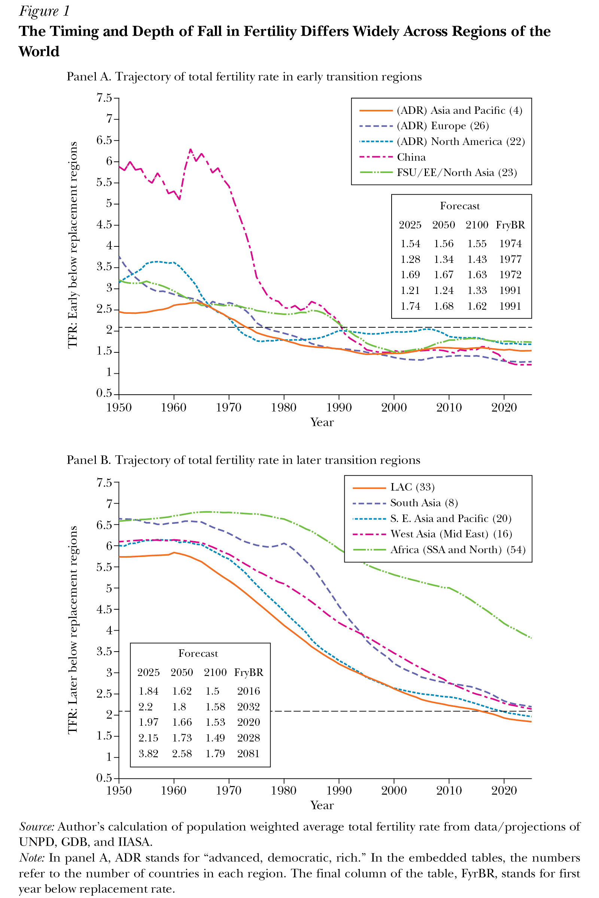
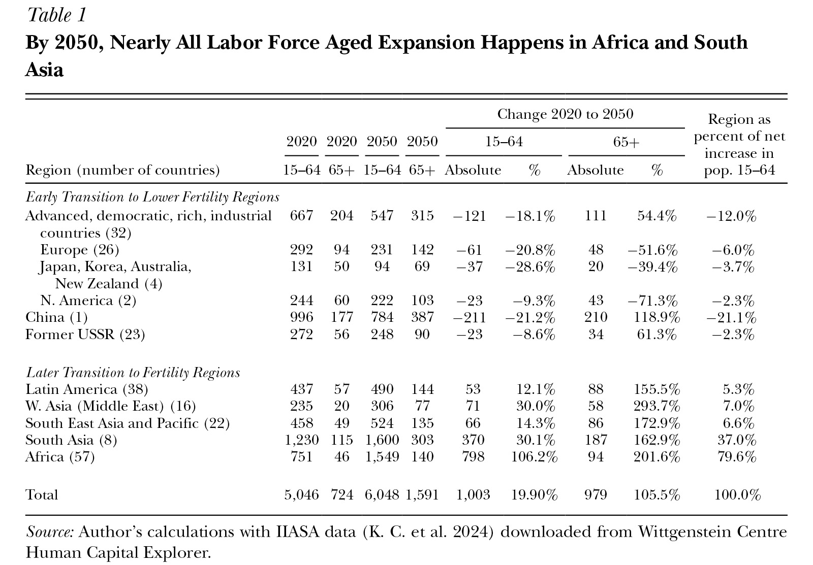
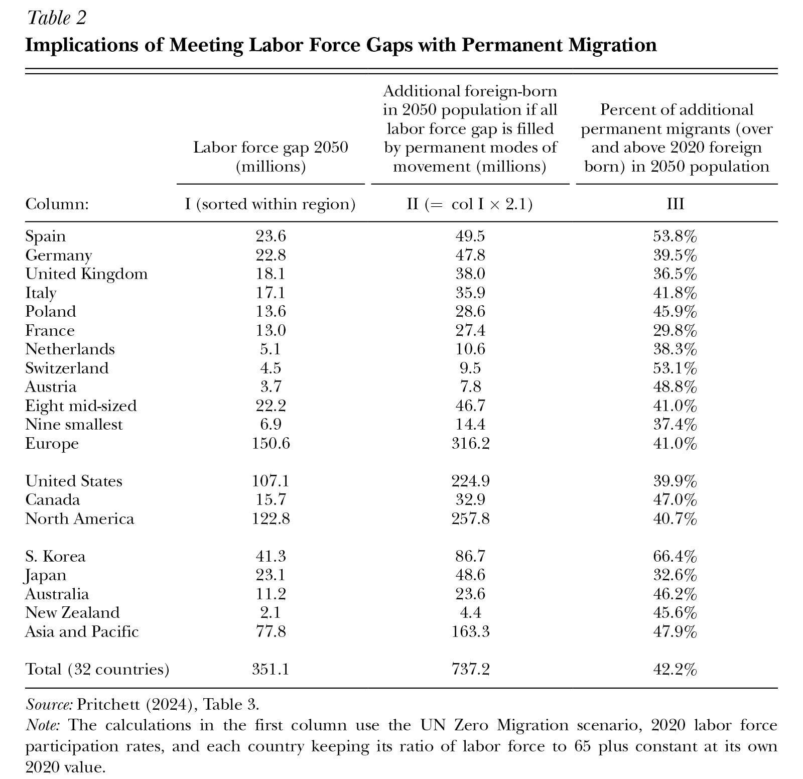

*Lant Pritchett*

```json
{
"article_id": "20251461",
"title": "Global Labor Mobility between Shrinking and Growing Labor Forces",
"type": "Symposium",
"symposium_name": "Fertility",
"authors": [
	"Lant Pritchett (London School of Economics and Political Science)"
],
"pages": "71–92",
"doi": "https://doi.org/10.1257/jep.20251461",
"miniabstract": "Demographic divergence—absolute labor force declines in rich countries versus Africa's 800-million-worker expansion by 2050—creates trillion-dollar potential gains from legal pathways enabling migration from low-productivity, labor-abundant regions to high-productivity, labor-scarce ones.",
"figures_titles": [
	"Figure 1: The Timing and Depth of Fall in Fertility Differs Widely Across Regions of the World",
	"Table 1: By 2050 Nearly All Labor Force Aged Expansion Happens in Africa and South Asia",
	"Table 2: Implications of Meeting Labor Force Gaps with Permanent Migration"
],
"abstract_url": "https://liegroup-dartmouth.github.io/working-aea-jep/papers/v40n1/pritchett/abstract.html",
"paper_url": "https://liegroup-dartmouth.github.io/working-aea-jep/papers/v40n1/pritchett/paper.xhtml",
"figures": [
	"https://liegroup-dartmouth.github.io/working-aea-jep/papers/v40n1/pritchett/image/18.jpg",
	"https://liegroup-dartmouth.github.io/working-aea-jep/papers/v40n1/pritchett/image/19.jpg",
	"https://liegroup-dartmouth.github.io/working-aea-jep/papers/v40n1/pritchett/image/20.jpg"
],
"figures_data": [
	"https://liegroup-dartmouth.github.io/working-aea-jep/papers/v40n1/pritchett/image-data/18.csv",
	"https://liegroup-dartmouth.github.io/working-aea-jep/papers/v40n1/pritchett/image-data/19.csv",
	"https://liegroup-dartmouth.github.io/working-aea-jep/papers/v40n1/pritchett/image-data/20.csv"
]
}
```

Almost a half-century ago, Robert McNamara (1977), then president of the World Bank, stoked "population bomb" fears saying: "Short of thermonuclear war itself, population growth is the gravest issue the world faces over the decades immediately ahead." With the total fertility rate in most countries already below, or rapidly nearing, replacement, such predictions seem quaint. Perhaps the new threat to humankind's very long-run prosperity (Jones 2022) and even very long-run survival could be a depopulation bomb (Eberstadt 2022; Spears and Geruso 2025). But the most pressing "new population bomb" (Goldstone 2010), one coming with near certainty in the medium-run (defined, per Keynes, as the period over which the median reader is not dead), is not total global population but aging in the richest countries and youth bulges in some developing country regions, which dramatically shifts the global composition of the labor force aged population.

The total fertility rate fell below 2.1 (a rough and ready estimate of the replacement rate) in the rich countries before 1980 and has fallen even further. As a consequence of this and extensions of lifespan, the nonmigrant working-aged population is headed for a substantial decline, and yet the number of elderly citizens will continue to rise. This same aging will affect, even more sharply, China. In contrast, most low-income countries have experienced fertility declines recently and are now, or are near to, reaching replacement levels in fertility. Momentum will lead to rising working-aged populations and rapid aging. Africa is distinctive in that total fertility rates are still well above replacement and hence the young and labor force aged populations will rise sharply to 2050.

With working-aged population falling in high-labor-productivity places and rising in low-productivity places, the potential gains from allowing workers to move from low-productivity, youth-bulge regions to high-productivity, labor-scarcity regions are in the trillions of dollars (Clemens 2011). Over the next few decades, relaxing the current constraints on this movement is by far the largest known policy-based economic opportunity for improving global human well-being.<sup><a id="footnote-032-backlink" href="#footnote-032">1</a></sup> But this potential economic gain is unlikely to become a reality unless the politics in the rich world can adopt pathways for "rotational" labor migration that are potentially more politically palatable than permanent migration.

## Fertility and Labor Force, by Region

Looking ahead to 2050, in one group of countries that includes all of the world's richest economies, China, and (most of the) former Soviet Union, the *absolute* number of youth is going to fall and the *absolute* number of those over 65 is going to rise, and hence population growth rate is going to gradually fall and become negative. In the absence of migration, these changes will push all these countries into demographic *terra incognita.* No human society has even seen the degree of inverted demographic pyramids, and the accompanying high ratios of those 65+ to labor force aged, that these countries will experience. In the second group, which includes most of the rest of the world less Africa, the falls in fertility are more recent and hence momentum will cause absolute increases in youth, but at a slowing pace, along with large increases in those 65+. In Africa, the fall in fertility has come later and has not been as rapid. Hence, in these countries the absolute number of those of labor force age is going to more than double by 2050—and yet there will be still be population aging as those 65+ will triple in Africa. In this section, I explore the dynamics and determinants of these population shifts.

### The Fertility Decline, by Region

There are three major sources of country specific data on recent past and projected fertility. The UN Population Division produces World Population Projections, which, for all their past faults, have been the standard source (UN 2024). The Institute for Applied Systems Analysis (IIASA), as part of their Shared Socioeconomic Pathways (SSP) scenarios, produces forecasts of fertility and population by age and by level of schooling (K. C. et al. 2024). The Global Burden of Disease (GBD) project, as part of its effort to estimate future health conditions, produces estimates of fertility and population by age (GBD 2024). As they all rely on roughly the same original country sources, the cross-national correlations of their estimates of past changes are very high, and medium-run projections are quite high as well. Only the very long-run fertility predictions differ substantially: the IIASA has nearly all countries converging on a similar total fertility rate by 2100, which produces a weak correlation with either the UN or GBD projections.

Using the simple average total fertility rate from the three sources for each country, [Figure 1](#_idTextAnchor021) shows the annual population weighted total fertility rate for ten geographic regions from 1950 to 2025, with the embedded tables showing average fertility forecasts for 2050 and 2100.

<a id="_idTextAnchor021"></a>



Panel A of Figure 1 shows the five regions where total fertility rate fell below 2.1 before 1991. Three of those regions can be categorized as advanced, democratic, and rich industrial countries: *Asia and Pacific* (Japan, Korea, Australia, New Zealand), *Europe* (26 countries), and *North America* (United States and Canada). Adding "democratic" and "industrial" countries to high GDP per capita divides the historical "developed" economies from the oil-rich Gulf states and Singapore, which have quite distinct demographic patterns and much higher labor mobility. *China* is its own region. The fifth region is an amalgam of the former Soviet Union and Eastern Europe along with Mongolia and North Korea.

Panel B of Figure 1 shows the five regions which transitioned to lower fertility more recently: *Latin America and the Caribbean* (LAC), *South Asia*, *South East Asia and Pacific* (excluding the four Asia and Pacific countries included above), *Africa* (both sub-Saharan and North, hence including Morocco to Egypt), and the region the United Nations refers to as *West Asia* and the World Bank and others call the Middle East, which includes Israel, Syria, and Lebanon as well as Turkey and Iran.

Panels A and B of Figure 1 jointly illustrate four facts about the recent history and projections of fertility.

First, the total fertility rate (TFR) in all three advanced, democratic, and industrialized regions (and in each of the 32 countries individually) fell below 2.1 before 1980 (more than 45 years ago). TFR has not rebounded significantly from its lowest point in any of these countries: all are still well below replacement.<sup><a id="footnote-031-backlink" href="#footnote-031">2</a></sup> Moreover, the projections (shown in the embedded tables in Figure 1) show these regions remaining at least half a birth per woman below 2.1 in 2100. Projections 75 years into the future necessarily have large uncertainty, but simple extrapolations of the recent past, where TFR has been low and stable or declining, and the methods used in all three sources (the UN Population Division, the Institute for Applied Systems Analysis, and the Global Burden of Disease) tell the same basic story.

Second, China is an important and distinctive story: important, because it is a population behemoth with more than one-sixth of global population; distinctive, because of its recent rapid trajectory from very high fertility (a total fertility rate of 5.42 as late as 1970) to very low (a TFR of 1.21 in 2025). The common phrase that "China will get old before it gets rich" is the result of hitting replacement fertility at levels of income much lower than the advanced, democratic, and rich industrial countries: China's GDP per capita in the first year it hit TFR of 2.1 was only \$2,600 (using a purchasing power parity exchange rate). Also distinctive are the waves in China's decline in TFR: a very rapid fall from 1970s to 1980s, a plateau in the 1980s, another decline, another plateau from late 1990s to late 2010s, and then another decline. The speed of China's fertility decline makes its aging up to 2050 similarly much more rapid.

Third, outside of Africa, all regions (and nearly all countries in those regions) have both experienced large declines and are at or nearing a total fertility rate of 2.1. This fall in fertility does not appear to be tapering off to stop at 2.1. The similarity in the pace in TFR decline and the convergence to similar, near replacement, levels by 2025 in these four developing country regions is striking.

Fourth, Africa's fertility is distinctive: its total fertility decline started later (around 1980 versus 1960s for other regions), from higher levels (around 6.5 in 1980 by which times other regions were much lower), and was more gradual. Hence Africa's total fertility rate in 2025 is 3.82, well above the next highest region (South Asia at 2.2), and is projected to be at 2.58, still well above replacement, in 2050. Not until 2081 is Africa as a region forecast to reach replacement levels: around 100 years later than any of the regions of advanced, democratic, and rich industrial countries, 90 years later than China, and 50 years later than any other developing country region (South Asia is projected to reach 2.1 in 2032).

### Why Fertility Is Unlikely to Rebound

Understanding fertility decline is, to first order, understanding why women (and men) want fewer children. I make no attempt here to review the massive literature, both theoretical and empirical, on correlates and causes of fertility and its decline. Here, I just touch on five themes to emphasize that the global secular decline in fertility (and its regional pattern) is unlikely to stop or reverse, regardless of whether governments adopt pro-fertility policies.

First, it is widely accepted that country-level secular declines in fertility are almost entirely "accounted for" in a correlation sense by changes in GDP per capita, female schooling, and child mortality, although sub-Saharan Africa's slow fertility transition appears to have followed a moderately different pattern of economic structural transformation (Büttner et al. 2024).<sup><a id="footnote-030-backlink" href="#footnote-030">3</a></sup> This is one of those relatively rare cases where the time series mostly tracks the cross-section as, controlling for progress in these three correlates, there is no secular shift in the total fertility rate.

Second, these three strong cross-country correlates of fertility are widely regarded as normatively good things. In fact, measures of per capita GDP, schooling, and health were the *only* elements of the original UN Human Development Index. No one advocates reducing falls in fertility by stopping progress in education, child health, or economic prosperity.

Third, for many years the estimates of future fertility assumed that fertility higher or lower than 2.1 was on a long-run glide path to the replacement. This was an assumption of convenience to avoid the knife-edged properties of long-run demographic projections, as there never has been any descriptive behavioral model—from any discipline—suggesting that fertility at replacement rates was an equilibrium of individual's choices (Pritchett and Viarengo 2012). Weil's (2024) title summarizes the point succinctly: "Replacement fertility is neither natural nor optimal nor likely." As the assumed recovery of total fertility rates in rich countries upward towards replacement failed to happen, the UN projections have now given up on forcing this convergence to 2.1 into their projections (Weil 2024).

Fourth, using the Demographic and Health Survey data from the World Bank, the case can be made that nearly all differences in child-bearing both across countries in levels and over time are associated with the level and changes in how many children women report they want to have (Pritchett 1994; Gunther and Harttgen 2016, with some caveats about fertility in sub-Saharan Africa). This claim is not uncontroversial, because some have argued that women would prefer fewer children but have an "unmet need" for contraception.<sup><a id="footnote-029-backlink" href="#footnote-029">4</a></sup> My own belief is that the existing measures of "unmet need" actually almost exclusively reflect "demand side" reasons women have for not using contraception rather than "supply side" or "lack of access" constraints (Senderowicz and Maloney 2022). For example, a recent large randomized control trial of providing individuals with vouchers covering 100 percent of contraceptive costs in a high-fertility country, Burkina Faso, found zero impact (with small enough standard errors even modest effects could be ruled out) on live births, pregnancies, or even the use of medical contraception over three years—and, strikingly, this zero impact was found even among women measured as having "unmet need" at the baseline (Dupas et al. 2025).

Taking these factors together, government attempts to raise fertility seem unlikely to have a substantial effect. The "all in" costs and benefits of having a child—monetary, temporal, psychic, social—are very large. Hence, it would be very surprising if there were cheap and effective ways for governments to raise fertility conditional on existing socioeconomic realities individuals and couples face (*The Economist* 2024). The Global Burden of Disease (2024) projections assume (based on the review of the empirical literature about impacts in richer countries of pro-natal policies by Bergsvik, Fauske, and Hart 2021) that the adoption of the known effective pro-natal policies (at feasible levels) would raise the total fertility rate in 2050 by .2, which would, for instance, raise their projected total fertility rate average in the advanced and democratic economies of Europe from 1.34 to 1.54.

Moreover, even if there are policies to change future fertility, these will make very little difference in the next few decades. The demography of the labor force aged in 2050 is pretty "baked in" (Goldstone forthcoming), as everyone who is going to be in the "prime" labor force age bracket of 25 to 49 in 2050 has to be already alive in 2026.

### Growth of the Labor Force Aged (15–64) versus the Elderly (65+)

A global decline in fertility, occurring at different times across regions, leads to differential growth in the size of the labor force aged population (ages 15–64) and the elderly population age 65 and over. The International Institute for Applied Systems Analysis (IIASA) produced estimates of world population by age, sex, and educational status for 201 countries with 2020 as the base year and projections to 2050 and 2100 (K. C. et al. 2024). Here, I use their "Middle of-the-Road/Continuation" scenario with zero migration (SSP2-ZM) but the results are broadly similar using the UN Zero Migration scenario. This zero migration scenario is not a "projection"—there is and will be some level of migration to 2050—but is used to illustrate cleanly the demographic implications of natural increase from births and deaths alone. I calculate the aged 15–64 and the over-65 population for each country.

[Table 1](#_idTextAnchor022) illustrates three key features about the world's medium-term demographic future to 2050, using the ten regions that appeared in Figure 1.

<a id="_idTextAnchor022"></a>



First, the primary demographic challenge to the year 2050 is not rising or declining total population but a shift in the age distribution of the population. For the advanced, democratic, rich, and industrial regions (first three rows) the labor force aged population falls by 121 million, an 18 percent fall, while people 65+ rise by 111 million, a 54 percent increase. In China, the 15–64 population falls by 211 million (20 percent), while its 65+ population rises by 210 million (119 percent). These changes are substantial to dramatic for each age group, but largely offsetting for the total population.

In the early fertility regions, the ratio of working-aged to population over 65 falls substantially from 2020 to 2050 to historically unprecedented levels (Goldstone forthcoming). In 2020 Japan had only 1.98 people aged 15–64 for each person over 65, which is the lowest observed in any country, ever. By 2050 in the advanced economies taken together, this ratio drops from 3.5 to 1.8: the typical advanced country will be at levels lower than seen in human history to date.

In China, the ratio of working-aged to population over 65 falls spectacularly from 5.3 in 2020 to 1.5 in 2050. Within the advanced, democratic, and rich countries are some with "lowest low" fertility (Kohler, Billari, and Ortega 2002; Goldin 2025), and by 2050 this very low fertility leads to ratios of labor force aged to over-65 population even lower than China's projection: Italy to 1.25, Korea to 1.25, Spain to 1.26, and Greece to 1.43.

Second, while the absolute labor force aged population falls in the early fertility regions, more than 100 percent of the *net* increase in the labor force aged population happens in just two regions: South Asia and Africa. From 2020 to 2050, the global net population aged 15–64 rises by one billion. The five early fertility decline regions will see their labor force aged fall by a combined 355 million. The three regions of Latin America, West Asia/Middle East, and South East Asia and Pacific (76 total countries) have a modest combined rise in the aged 15–64 population of 190 million. However, while the fertility evolution in South Asia is similar to these countries, by dint of its massive existing population the workforce-aged population of South Asia grows by 370 million. Africa, the slow fertility transition region (Figure 1, panel B), will see its working-age population growing by 798 million from 2020 to 2050. Africa alone will account for nearly 80 percent of the growth in the world's labor force aged to 2050. Africa and South Asia combined account for a 1.17 billion increase, well more than 100 percent of the net global growth.

Third, the ratio of working-aged to elderly population is falling everywhere, even in regions with continued growth in population and growing workforce-aged. For example, the working-aged population in South Asia grows by 370 million from 2020 to 2050, a 30 percent rise, but that same region will see its 65 and over population rise from 115 million to 305 million, a near tripling. In the Africa region, the working-aged population doubles from 2020 to 2050, but the elderly population triples.

### How Many More Working-Aged People to Maintain the Dependency Ratio?

Let us presume that the projections for the size of the over-65 elderly population (without migration) in 2050 hold true. How many more people would it take to keep the ratio of working-aged to elderly somewhat stable? There are two ways to think about this question: looking at the total working-aged population divided by the number of elderly, or looking at the number of workers—that is, the total working-aged population multiplied by the labor force participation rate and then divided by the number of elderly.

The answers have practical and policy implications. For public finance, in most countries the public pensions for the elderly are financed through taxes on current workers. Thus, when the ratio of workers/elderly falls, the public retirement system comes under stress. More broadly, support for the elderly happens not just though public pensions, but also through support from younger family, friends, and volunteers. A decline in the ratio of the working-aged population (whether actually holding jobs or not) to the elderly makes these nonmonetary support systems harder to sustain as well.

The over-65 population of the advanced, democratic, rich, and industrialized countries (shown in the first three rows of Table 1) is forecast to increase by 111 million from 2020 to 2050. For these countries, the ratio of the working-aged to the elderly population in 2020 for the median country was 3.3. To keep that ratio constant, these countries would need the working-aged population to increase by about 363 million (that is, 3.3 × 111 million). But the workforce-aged population is not going to grow—it is going to shrink by 121 million—so the gap between actual and a constant ratio labor force is 484 million people.<sup><a id="footnote-028-backlink" href="#footnote-028">5</a></sup> To put that number in perspective, the zero-migration projections for the total working-aged population in these advanced countries in 2050 is only 547 million.

Using labor force participation rates by five-year age cohorts and sex, one can convert the purely demographic projections of ratios of age groups into a number of workers and elderly. Following the approach in Pritchett (2024), I work though this exercise for the 32 advanced, democratic, and rich industrial countries using labor force participation data by sex and five-year age groups in 2020 from the International Labour Organization (ILOSTAT 2024).<sup><a id="footnote-027-backlink" href="#footnote-027">6</a></sup>

In the advanced European countries, the over-65 population is projected to grow by 43.3 million from 2020 to 2050. Their current ratio of workers/elderly is 2.4. Thus, to maintain this ratio by 2050 would require roughly 2.4 × 43.3 = 104 million *more* workers. But in the no-migration and constant labor force participation scenario, these countries will actually have 45 million *fewer* workers in 2050. The 2050 population weighted ratio of workers to elderly falls to 1.4 for advanced Europe as a whole, and the ratio in *every* European country—except Sweden at 1.9—is below Japan's 2020 ratio of 1.83. Indeed, in this scenario there are about one or fewer workers for every person over 65 in Spain (1.00), Greece (1.04), and Italy (0.88).

The labor force and aging dynamics of the United States and Canada are quite different from Europe. Their 2020 ratio of labor force to over-65 population is closer to 3. Also, the projected fall in the labor force in the United States from 2020 to 2050 is proportionately much smaller. For example, the United States over this time has 8 million fewer workers from a base of 220 million 2020, a 6 percent fall, whereas Italy has a decline of 7.7 million workers from the smaller base of 38 million in 2020, a 32 percent fall. In the scenario with no immigration and a constant labor force participation rate, the ratio of labor force to over-65 population falls to 1.86 by 2050. The number of additional workers needed depends critically on the ratio sought for 2050. Maintaining the 2020 ratio in North America requires a very large number of additional workers, about 123 million. But falling only to a ratio of 2.11 (the 2020 10th percentile of the rich countries) in 2050 would require only 31 million additional workers.

Japan has been the canary in the coal mine of low fertility and an aging economy and society. Japan's ratio of labor force to elderly had already fallen to 1.83 in 2020, and the future projected decline to 1.24 by 2050 is thus relatively modest, a fall of .59 compared to a projected fall of 1.0 in average in Europe (2.4 to 1.4) and 1.3 (3.0 to 1.7) in North America. For Japan to have a ratio of labor force to elderly of 2.11 by 2050 would require 33 million more workers by 2050.

South Korea is an extreme example of the demographic dynamics of aging. In 2023, Korea's total fertility rate declined to 0.72, with deaths exceeding births by over 100,000. In the projections, Korea's ratio of labor force to elderly falls from 3.46 in 2020 to just 1.16 in by 2050. Hence, the 17.1 million additional workers needed to reach a ratio of 2.11 would be 45 percent of its projected 2050 labor force.

A country seeking to maintain its 2020 ratio of labor force to elderly, or even just to raise those ratios substantially from the projections for 2050, faces a difficult task if it limits itself to domestic policies. It takes 25 years to produce a 25-year-old. Hence, even if the most optimistic changes in fertility took place immediately, these would have little effect on the ratio of the labor force aged population by 2050.

Moreover, there is only limited scope for many countries to exceed their projected labor force for 2050 by raising the labor force participation rates. For prime-aged workers, labor force participation rates are already fairly high. For example, across the 32 advanced, democratic, rich, and industrialized countries, the 2020 labor force participation rate for people aged 40–44 is 93 percent for males and 84 percent for females. Pritchett (2024) shows the needed additional workers across a variety of assumptions about 2050 labor force participation. Germany's projected labor force gap falls from 31.5 million with constant 2020 labor force participation to only 16 million in the "high" scenario for 2050 labor force participation. However, in this "high" scenario, the labor force participation of those over 65 would need to rise in Germany from 21 percent to 72 percent, which seems a social and political impossibility.

## Cross-Border Mobility: Economics and Politics

While there has been a global decline in fertility and a resulting shift toward the elderly across the global population, there is not a global scarcity of labor. Rather, the regional differences in the timing and magnitude of fertility imply that in the next few decades there will be increasingly severe scarcity of young workers in some regions (the rich countries and China) and a youth bulge abundance in others (Africa and South Asia). The challenge of the birth-dearth-induced labor scarcity in the rich world cannot be wholly solved by raising fertility (too late) or increased labor force participation (too little). Policies that allow for movement of working-aged people from labor-abundant, low-productivity places to labor-scarce, high-productivity places is an obvious economic win-win, but sufficient expansion of just existing pathways seems a political nonstarter. New modes of movement are needed.

Many dismiss the idea of substantially *more* movement of people as a response to the coming shifts in the world's demography as not worth discussing, as substantial increases seem so far outside the realm of what is currently politically possible. But the changes in age structure of national populations that will be arriving in the next few decades will be so large that I expect them to shift the boundaries of the politically possible. What will countries be willing to attempt when they face the reality of trying to fund public pensions with a ratio of roughly one worker for every retiree? In particular, I argue that a substantial expansion in legal pathways for time-limited labor mobility can create massive win-win gains for both labor-scarce, high-productivity countries and youth-abundant, low-productivity countries and, if done well, be politically palatable.

### Economics of Movement

The simplest parts of the economics of cross-border movement from poor to rich countries are the wage gains to movers and hence the supply of potential movers. A variety of researchers have found that migrants from lower- to higher-income economies experience large real wage gains, with the ratio of wages for an equivalent low- to moderate-skill worker varying across countries but from three to ten, with a modal value around five.<sup><a id="footnote-026-backlink" href="#footnote-026">7</a></sup> An obvious concern in such studies is how to adjust for potential selection effects and not have average estimates for "migrants" be affected by highly selected "superstar" movers. For workers in "core skill" occupations and/or modest levels of schooling (below tertiary), the selection-corrected results are robust across a wide variety of methods: randomized control trials (McKenzie, Stillman, and Gibson 2010); natural experiments due to different selection mechanisms that affect the possibility of migration (Mobarak, Sharif, and Shrestha 2023; Clemens 2011); econometric methods to estimate bounds on selection effects (Clemens, Montenegro, and Pritchett 2019, relying on Oster 2019 adjustments); wages for the same jobs in the same firms but in different countries (Ashenfelter and Jurajda 2001); and wage differences of workers across countries in the same detailed low-skill occupations (Pritchett and Hani 2020). These microeconomic estimates are consistent with (nearly all) aggregate estimates of total factor productivity differences across countries and their estimates of wage differentials between high- and low-income countries for human capital equivalent labor (Pritchett and Hani 2020).

Perhaps unsurprisingly given these potential wage gains, the supply of people willing to move from low- to high-productivity to work, either permanently or for just a period, is large. As part of its international polling, Gallup asked people: "Ideally, if you had the opportunity, would you like to move permanently to another country, or would you prefer to continue living in this country?" Then, of those who express a desire to move, "To which country would you like to move?" Gallup calculated the youth population in each country if everyone's migration preferences were met. The median expansion of the youth population in the countries in the top one-third of labor compensation per hour was 111 percent (a rough doubling), with the United States at almost exactly the median and some smaller, attractive destinations (like Canada, Switzerland, Australia) more than tripling their youth populations if all respondents moved to their ideal location (Pritchett and Hani 2020). The willingness of workers to move across borders when the wage gains are much smaller, such as inter-regional movements within Africa or Latin America or movements to the Gulf region, is also consistent with an enormous willingness to move at the existing wage differentials between potential low- and high-productivity regions and countries.

Those who would be willing to move from low- to high-productivity countries face border controls and legal constraints. Every high-productivity country imposes and enforces legal restrictions on who can live and work in their country. One gruesome sign of the constraints on the widespread desire to work in a high-productivity country is the over 9,000 deaths in 2024 of people attempting to evade border control while migrating (Missing Migrants Project n. d.).<sup><a id="footnote-025-backlink" href="#footnote-025">8</a></sup>

A harder question concerns the impact of additional movers on the wages of the workers already present. This question is hard, in part because the answer must be "it depends." Because movement is regulated, the number and composition of the foreign-born in any given country is the endogenous aggregation of those who are allowed by the receiving country to be there, either by right or in practice (through lax enforcement). The impact of additional movers on the wages of existing workers must depend on whether the migration constraint was relaxed in a way that produced more movers who were substitutes or complements for existing workers.

Clemens and Lewis (2024) use the fact that US firms' access to foreign-born workers via the H2-B visa for temporary workers is quota-constrained, and hence visas are allocated across firms by lottery. They use this random allocation to estimate the impact of foreign workers on native-born employment and find zero employment effects on the native-born in general and actually positive employment effects in rural areas. This is not a general finding about the employment impact of "migration" because the H2-B visa is constructed to allow domestic firms to hire workers only when native-born workers are not available. Thus, one should expect the expansion at the margin of this program would allow increased employment of workers who are complements for native-born workers by design. Similarly, from 1942 to 1964 the Bracero program in the United States admitted migrants on a temporary basis, mainly to do farm labor. The end of the Bracero program, which reduced the availability of foreign-born agricultural workers in some states and not others, was estimated to have had zero impact on either employment or wages of workers in agriculture in the affected states (Clemens, Lewis, and Postel 2018). Again, the Bracero program was designed to attract workers who were complements in production to US inputs of capital, technology, and native-born labor, and hence the expectation should have been that its elimination would not increase domestic employment.

For the United States, the many studies of the impact of immigration on the wages of native-born have actually created a striking consensus that the effect is really small (NAS 2017). While alternative estimates are slightly on either side of zero (and particularly for subgroups like those with low education), the magnitudes, whether positive or negative, are small.

### Instruments to Targets: "Migration" versus "Mobility"

The idea that high-income countries could use movement of workers from other countries to augment their labor force in response to aging seems a political nonstarter at present. Political pushback against immigration (as it is currently construed) has been strong not only in the United States, but in Germany, France, the United Kingdom, Italy, the Netherlands, and many other countries.

But "immigration" is not the only form of movement of people across borders. When considering such movement, the fundamental policy question is: "Under what terms and conditions (for example, duration of stay, purposes, allowed activities, fiscal entitlements) should our country allow citizens of other countries to be legally present?" Most countries actively attract tourists. Many countries aggressively recruit international students. A more specific policy question is: "Under what terms and conditions are citizens of other countries allowed to be legally present and work (and in what sectors or occupations or even places)?"

There are three distinct types of movers allowed to work.

One type of movers, which is often what is meant by an "immigrant," is people on a pathway to citizenship. This path may be long and contingent, but host societies allow these movers to live and work in a country on the expectation that they form a part of the "future of us."

A second type is "movers of distress," people who the host society allows to move and work out of primarily humanitarian motives. The "mover of distress" is broader than the legalistic concepts "refugee" or "asylum seeker," as these terms tend to be pinned down by specific national or international agreements. While these movers come under different legal provisions, in many cases they are expected to remain in the receiving country for the long term.

A third type of movers is people who move to work on legal authorization that is explicitly time-limited and for which the terms and conditions are narrow, such as limited to a specific occupation. For these movers there is no expectation on either side that this move will be long term or "permanent," or that the mover is on a direct path to citizenship (though it may be a stepping stone). The United States has a number of visa categories of this type: for skilled workers (H-1B), for workers in agriculture (H-2A) or nonagriculture (H-2B), for work as part of "cultural exchange" (such as *au pairs* on a J-1 visa), and for students to work in the United States for a limited period after a master's degree (OPT, an extension of F-1). This type of mover is not an "immigrant" in the usual sense.

I propose an analogy. In the theory of the firm, one can think of the essence of ownership of an asset as residual control rights. In a sophisticated market economy, the owners of an asset can typically enter into a wide variety of contracts for use of their asset without relinquishing any of the residual control rights. As a counterexample, imagine that the only access to use rights of a building was ownership, and that there was no market for leases or rentals that gave access and limited control of a property on a time-limited contractual basis. This would be a massive constraint on the ability of an economy to be productive, because every new enterprise that needed space would need to buy. One source of the high productivity of the rich industrial countries is the ideas of "open access" orders and "market supporting institutions" that create a wide range of contractual forms that allow people (and people as collectives in firms and organizations) to cooperate in the production of value. I am finishing the revisions to this paper sitting in a room rented by the hour by a coworking space firm that intermediates long leases on office space into a flexible variety of short-term contracts.

The citizens of highly productive democracies have collective control rights over access to their territory that are jealously guarded. Citizens can be viewed as the collective owners of a highly productive space with spatially associated rules, norms, institutions, and fixed capital stocks (infrastructure, buildings, and so on) within which people and firms are able to cooperate in the production of value. The idea of "immigration" as "permanent" movement is that untrammeled labor market access (as a subset of being able to enter into any economic contract) and political residual control rights are deeply tied within the idea of "citizenship." The idea of "labor mobility" is that citizens choose to allow citizens (and collectives, firms, or organizations) to contract with noncitizens to reside and work, but without any implication that conditional access gives the temporary worker a path to the political control rights of citizenship. As labor forces contract, the ability to create value in high-productivity places will be increasingly constrained by legal restrictions that prevent combining core-skill workers into highly productive value chains when physical presence is needed. As a crude analogy, citizens can "rent" access to their highly productive spaces with specified terms and conditions (use rights), but without political control rights to people who would massively gain from access to the wage "place premium" of their country.

### The Policy Opportunity

The first column of [Table 2](#_idTextAnchor023) shows the total labor force gap in the UN zero migration scenario, with the assumptions that (1) labor force participation ratios by age and sex are constant at their 2020 levels and (2) countries maintain their 2030 ratio of labor force to over-65 population.

<a id="_idTextAnchor023"></a>



The combination of the wage gains for movers and the numbers of workers needed due to shrinking labor forces relative to the elderly in Table 2 imply massive potential economic gain. Even for low-formal-education or low-skill workers, the typical estimated wage *gain* of a move from a low- to high-productivity country is around \$25,000 (in 2017 purchasing power parity dollar) (Pritchett and Hani 2020). If there were 351 million additional movers with an average gain of \$25,000, this would increase global wages by \$8.7 trillion. To put it another way, keeping the ratio of labor force to over 65 ratios constant would produce wage gains—allowing these magnitudes of mobility would add to wages almost twice the total current GDP of France.

But a "policy opportunity" needs to be a political possibility. However pro-immigration, in the sense of pathways to permanence, you personally might be (and I personally am quite pro-immigration), the labor force gaps are far too large for the combined "permanent" modes of movement ("pathway to citizenship" and "movers of distress") to fully address the gap. If permanent movements alone were allowed to fill the labor force gaps, the magnitudes of movement by 2050 would imply that existing citizens would lose their control of their "future of us."

Because permanent migrants generally are allowed to move with families, I assume 1.1 additional residents for every migrant working, and hence the estimate in column 2 of total movers needed if all are permanent is just column 1 (needed additional workers) times 2.1. Spain, with a labor force gap in 2050 of 23.6 million people, would need (over and above their existing migrant stock in 2020) 49.6 million migrants by 2050. The United States, for example, would need 224 million additional movers.

In Table 2, column 3 shows the incremental movers from 2020 to 2050 in the total population in 2050. Each of the advanced country regions would have more than 40 percent of their population as additional movers since 2020. Adding this increment to the existing foreign-born in 2020 implies that in most countries the foreign-born would be over 50 percent of the population (Pritchett 2024).

The numbers in Table 2 are not intended to be a "projection" or even a "scenario"—just arithmetic. Of course, one can tinker with the arithmetic by changing some parameters. Is maintaining the 2020 ratio of labor force to elderly population the appropriate goal, or could countries perhaps make lower support ratios to the elderly work fiscally through cuts in benefits and increases in taxes? Perhaps policy could increase the labor force participation rates? However one tinkers, the stark arithmetic of demographic consequences of low fertility and hence aging poses a question: "Is it likely that voters in the advanced, democratic, rich, and industrialized countries will choose via their democratic processes to allow permanent movers (pathway to citizenship and movers of distress) from now until 2050 such that the ratio of immigrants to foreign-born increases to meet the labor force gaps?" I think the answer is: "No. Nothing even remotely like that is going to happen."

The 2020 percent of foreign-born from countries other than the 32 advanced, democratic, and rich countries (which nets out within-EU movement and other rich-to-rich migration) is under 10 percent in every European country (Pritchett 2024). Yet tensions over immigration are already remaking the politics of Europe. In 2025 anti-migration parties were part of the government in Hungary, Italy, Poland, and the Netherlands (until March 2025). In August 2025, the parties leading the polls in the three largest countries of Europe, Germany, France, and the United Kingdom, were all strongly anti-migration. The idea that politics would change to allow the existing permanent modes of movement to sustain ratios of foreign born in the population to be three to four times higher than their current levels within the next 25 years seems implausible, at best.

### Can Rotational Migration Add to the Total Stock of Movers?

There is huge scope for rotational or temporary labor mobility, in which the labor-abundant countries benefit from sending workers on an explicitly time-limited basis to help labor-scarce countries address their labor force gaps. This is not "instead of" immigration, because nearly all countries want to maintain permanent migration channels, using permanent migration to build a bright "future of us" and engaging the "global war for talent" (Kapur and McHale 2005). But there are two fundamental reasons why legal pathways for time-limited movement can expand even when politics are leery or hostile to permanent movement.

First, temporary movement of people to work comes without the same social and political implications of permanent pathways. If resistance to immigration is driven not primarily by economic interests (wages and fiscal implications) but rather by its social and political consequences, and "mass" migration is seen to cause an inevitable and permanent loss of the control by the existing citizens over the "future of us," then allowing individuals to arrive on an explicit (and enforced) time-limited basis is a parallel and additional pathway for movers. In line with the analogy of the owning/renting of an asset above, the possibility of "rental" vastly expands the options for owners, as the rental decision comes with enormously lower and obviously less long-lasting consequences than selling.

Second, the authorization of people to be present to do work can come with terms and conditions about occupations, region of residence, fiscal entitlements, and other matters that would be impossible (and unfair) if imposed on permanent movers. As labor force scarcities in the high-income countries increase, it will become clear that there are many needed core-skill jobs that cannot attract sufficient citizens. Nearly all countries already have visas that allow for temporary (often seasonal) workers in specific sectors.

When the terms and conditions for temporary presences for work are decided by the host country, then the objections to allowing low-skill workers due to their wage, employment, or fiscal consequences becomes a matter of policy design rather than a necessary consequence of more permanent movers. For instance, it is true, almost by definition, that in a country with a fiscal (tax and benefits) system that is designed to be redistributive, admitting lower-skill foreign workers will have a higher total fiscal cost than admitting high-skill workers. A recent study in the Netherlands by van de Beek et al. (2024) of the net lifetime fiscal contribution of immigrants varied widely across regions. In their base case estimates by country, the lifetime net contribution of an immigrant to the Netherlands from Germany and Austria had a personal primary income about 89 percent of a Dutch native's and hence was roughly a fiscal wash (lifetime €23,000). In contrast, immigrants from poor countries, like Pakistan, had only about 44 percent the lifetime earnings and hence had a net lifetime fiscal contribution of negative €238,000. But if workers are only present to work for some months to at most a few years, and arrive without additional family members, then core-skill workers can be a fiscal wash or even, depending on the design of the contract, a positive fiscal contribution.

To be politically acceptable, perhaps even popular, the implementation of policies of temporary mobility will need to be, and be seen to be, orderly and legitimate. Two key issues are that a policy of allowing time-limited workers needs to have effective enforcement of return and high compliance. If voters see routine noncompliance and overstay—and the use of temporary and conditional legal access abused as a pathway to permanence—this obviously discredits the entire premise. Similarly, if voters see the use of foreign workers as means of undermining the conditions of work (wages, safety) of citizens or as a means of exploiting movers (for example, by not delivering on contractual obligations to workers) this delegitimizes the idea of mobility.

Effective implementation of massively scaled labor mobility is going to require public and private cooperation between sending and host countries. The five core functions required to mediate a successful move are: (1) *recruitment*, attracting people in a sending country to the opportunity; (2) *preparation,* so that workers arrive in the host country prepared to do the work for which they have contracted; (3) *placement* mechanisms to match movers to jobs that do not create the conditions of exploitation through a firm-linked presence; (4) *protection,* so that movers have ready access means of preventing abuse and exploitation; and (5) *return,* so that there is compliance with the time-limited residence in the host country. Creating an industry that moves people at this scale people is a huge challenge, but not radically more so than the complex cooperation of the airline industry that allows billions of passengers to fly safely or the complex industry of tourism, whereby 1.4 billion people visit other countries every year. These advanced industrial countries have high capability governments and successfully regulate a huge range of complex industries (Pritchett 2023). As a final analogy, the US experience with passage and repeal of Prohibition, the attempt to ban the production and sale of all alcoholic beverages, showed that there can be a "bridge too far" such that enforcement will fail but that legalization of transactions citizens want to engage in (like hiring foreign workers) can bring order and control.

## Conclusion

The simple arithmetic of demography—with births, deaths, and everyone between those two events aging by exactly one year every year—makes the age structure of population, even three decades ahead, quite predictable. Economic or political changes can happen very fast with unpredicted timing, like the post-1978 rise of China, the collapse of the Soviet Union, or the 2008 global financial crisis. But the demographic implications of fallen fertility for the age structure of the population (without migration) out to at least 2050 are already, absent catastrophe, destiny.

Thus, we know with considerable confidence that in the next few decades, nearly all of the expansion in the labor force aged population will happen in countries with low levels of GDP per worker, while the countries with the lowest ratios of working-aged population to retirees will mostly be in the high-income countries of the world (plus China and Russia). One implication of this largely uncontested demographic arithmetic is that the largest, and growing, opportunity for known and reliable policy-driven economic gains for the global population is the creation of legal pathways for safe, regular, orderly, and large-scale movement of labor force aged people from the low-productivity countries where they are going to be born to the high-productivity (and hence high-wage) countries with shrinking labor forces and expanding numbers of elderly.

It seems politically impossible to meet the labor force needs of the aging economies with immigration based exclusively on a "pathway to citizenship" and "movers of distress." Even if these "permanent" migration pathways are expanded to the limits of political acceptability, there remains considerable scope for a vast expansion of the temporary and rotational pathways for legally authorized movement of people to work.

■ I would like to thank Michael Clemens for inspiration and impetus, Rebekah Smith and the Labor Mobility Partnerships team for wisdom gleaned from practical engagement, Timothy Taylor for impressive (and compressive) editing, the Editorial Board and Sam Steyer for comments, and Patrick Collison for pointing me to the study of fiscal impacts.

## References

**Ashenfelter, Orley, and Stepan Jurajda.** 2001. "Cross-Country Comparisons of Wage Rates: The Big Mac Index." Princeton University Economics Department Working Papers 2001–7.

**Bah, Tijan L., and Catia Batista.** 2020. "Understanding Willingness to Migrate Illegally: Evidence from a Lab in the Field Experiment." NovaAfrica Working Paper 1803.

**Barro, Robert and Jong-Wha Lee.** 2013. "A New Data Set of Educational Attainment in the World, 1950-2010." *Journal of Development Economics* (104): 184–98. Accessed May 2025.

**Bergsvik, Janna, Agnes Fauske, and Rannveig Kaldager Hart.** 2021. "Can Policies Stall the Fertility Fall? A Systematic Review of the (Quasi-) Experimental Literature." *Population and Development Review* 47 (4): 913–64.

**Büttner, Nicolas, Michael Grimm, Isabel Günther, Kenneth Harttgen, and Stephan Klasen.** 2024. "The Fertility Transition in Sub-Saharan Africa: The Role of Structural Change." *Demography* 61 (5): 1585–611.

**Clemens, Michael A.** 2011. "Economics and Emigration: Trillion-Dollar Bills on the Sidewalk?" *Journal of Economic Perspectives* 25 (3): 83–106.

**Clemens, Michael A., and Ethan G. Lewis.** 2024. "The Effect of Low-Skill Immigration Restrictions on US Firms and Workers: Evidence from a Randomized Lottery." NBER Working Paper 30589.

**Clemens, Michael A., Ethan G. Lewis, and Hannah M. Postel.** 2018. "Immigration Restrictions as Active Labor Market Policy: Evidence from the Mexican Bracero Exclusion." *American Economic Review* 108 (6): 1468–87.

**Clemens, Michael A., Claudio E. Montenegro, and Lant Pritchett.** 2019. "The Place Premium: Bounding the Price Equivalent of Migration Barriers." *Review of Economics and Statistics* 101 (2): 201–13.

**Dupas, Pascaline, Seema Jayachandran, Adriana Lleras-Muney, and Pauline Rossi.** 2025. "The Negligible Effect of Free Contraception on Fertility: Experimental Evidence from Burkina Faso." *American Economic Review* 115 (8): 2659–88.

**Eberstadt, Nicolas.** 2022. "The De-Population Bomb." Interview with Peter Robinson, Uncommon Knowledge podcast series, September 12. [https://www.youtube.com/watch?v=uNdnlrkx-wg](https://www.youtube.com/watch?v=uNdnlrkx-wg).

**Feenstra, Robert C., Robert Inklaar and Marcel P. Timmer.** 2015. "The Next Generation of the Penn World Table" *American Economic Review* 105 (10): 3150–82. Available for download at [www.ggdc.net/pwt](http://www.ggdc.net/pwt).

**GBD (Global Burden of Disease 2021 Fertility and Forecasting Collaborators).** 2024. "Global Fertility in 204 Countries and Territories, 1950–2021, with Forecasts to 2100: A Comprehensive Demographic Analysis for the Global Burden of Disease Study 2021." *The Lancet* 403 (10440): 2057–99.

**Goldin, Claudia.** 2025. "Babies and the Macroeconomy." *Economica* 92 (367): 675–700.

**Goldstone, Jack.** *Forthcoming.* *10 Billion: How Population Will Change the World in the 21st Century*. Oxford University Press.

**Goldstone, Jack A.** 2010. "The New Population Bomb: The Four Megatrends That Will Change the World." *Foreign Affairs* 89 (1): 31–43.

**Günther, Isabel, and Kenneth Harttgen.** 2016. "Desired Fertility and Number of Children Born across Time and Space." *Demography* 53 (1): 55–83.

**ILOSTAT.** 2024. *Labour force participation rate*. International Labour Organization. [https://ilostat.ilo.org/data/snapshots/labour-force-participation-rate/](https://ilostat.ilo.org/data/snapshots/labour-force-participation-rate/).

**Jones, Charles I.** 2022. "The End of Economic Growth? Unintended Consequences of a Declining Population." *American Economic Review* 112 (11): 3489–3527.

**Kapur, Devesh, and John McHale.** 2005. *Give Us Your Best and Brightest: The Global Hunt for Talent and Its Impact on the Developing World*. Center for Global Development.

**K. C., Samir, Moradhvaj Dhakad, Michaela Potancˇková, Saroja Adhikari, Dilek Yildiz, Marija Mamolo, Tomas Sobotka, et al.** 2024. "Updating the Shared Socioeconomic Pathways (SSPs) Global Population and Human Capital Projections." International Institute for Applied Systems Analysis Working Paper WP-24-003.

**Kohler, Hans-Peter, Francesco C. Billari, and José Antonio Ortega.** 2002. "The Emergence of Lowest-Low Fertility in Europe during the 1990s." *Population and Development Review* 28 (4): 641–80.

**McKenzie, David, Steven Stillman, and John Gibson.** 2010. "How Important Is Selection? Experimental Vs. Non-Experimental Measures of the Income Gains from Migration." *Journal of the European Economic Association* 8 (4): 913–45.

**McNamara, Robert S.** 1977. "Address to the Massachusetts Institute of Technology by Robert S. McNamara President, World Bank (English)." Presidential speech, World Bank Group. [http://documents.worldbank.org/curated/en/701961478757089433](http://documents.worldbank.org/curated/en/701961478757089433).

**Missing Migrants Project.** n. d. "Deaths During Migration Recorded since 2014, by Region of Incident." International Organization for Migration. [https://missingmigrants.iom.int/data](https://missingmigrants.iom.int/data) (accessed November 2025).

**Mobarak, Ahmed Mushfiq, Iffath Sharif, and Maheshwor Shrestha.** 2023. "Returns to International Migration: Evidence from a Bangladesh-Malaysia Visa Lottery." *American Economic Journal: Applied Economics* 15 (4): 353–88.

**NAS (National Academies of Sciences, Engineering, and Medicine).** 2017. *The Economic and Fiscal Consequences of Immigration*. The National Academies Press.

**Oster, Emily.** 2019. "Unobservable Selection and Coefficient Stability: Theory and Evidence." *Journal of Business and Economic Statistics* 37 (2): 187–204.

**Pritchett, Lant H.** 1994. "Desired Fertility and the Impact of Population Policies." Population and Development Review 20 (1): 1–55. [https://doi.org/10.2307/2137629](https://doi.org/10.2307/2137629).

**Pritchett, Lant.** 2018. "Alleviating Global Poverty: Labor Mobility, Direct Assistance, and Economic Growth." HKS Working Paper RWP18-013.

**Pritchett, Lant.** 2023. "The Political Acceptability of Time-Limited Labor Mobility: Five Levers Opening the Overton Window." *Public Affairs Quarterly* 37 (3): 284–306.

**Pritchett, Lant.** 2024. "Rotational labor mobility is the biggest global economic opportunity" Unpublished. [https://lantpritchett.org/wp-content/uploads/2024/07/potential-for-labor-mobility-biggest_firstcomplete.pdf](https://lantpritchett.org/wp-content/uploads/2024/07/potential-for-labor-mobility-biggest_firstcomplete.pdf).

**Pritchett, Lant.** 2026. *Data and Code for: "Global Labor Mobility between Shrinking and Growing Labor Forces."* Nashville, TN: American Economic Association; distributed by Inter-university Consortium for Political and Social Research, Ann Arbor, MI. [https://doi.org/10.3886/E239755V1](https://doi.org/10.3886/E239755V1).

**Pritchett, Lant, and Farah Hani.** 2020. *Oxford Research Encyclopedias*. Oxford University Press.

**Pritchett, Lant, and Martina Viarengo.** 2012. "Why Demographic Suicide? The Puzzles of European Fertility." *Population and Development Review* 38: 55–71.

**Senderowicz, Leigh, and Nicole Maloney.** 2022. "Supply-Side versus Demand-Side Unmet Need: Implications for Family Planning Programs." *Population and Development Review* 48 (3): 689–722.

**Spears, Dean, and Michael Geruso.** 2025. *After the Spike: Population, Progress and the Case for People*. Simon and Schuster.

***The Economist.*** 2024. "Why paying women to have more babies won't work." March 23.

**UN (United Nations).** 2024. *World Population Prospects*. Department of Economic and Social Affairs, Population Division.

**van de Beek, Jan, Joop Hartog, Gerrit Kreffer, and Hans Roodenburg.** 2024. "The Long-Term Fiscal Impact of Immigrants in the Netherlands, Differentiated by Motive, Source Region and Generation." IZA Discussion Paper 17569.

**Weil, David N.** 2024. "Replacement Fertility Is Neither Natural nor Optimal nor Likely." Unpublished.

■ Lant Pritchett is Visiting Professor of Practice, London School of Economics, School of Public Policy, London, United Kingdom. His email address is [lant.hks@gmail.com](mailto:lant.hks@gmail.com). Due to the data editor's inability to find a replicator with access to the software used, the results of this paper were not reproduced. However, the data editor reviewed all instructions and data files, and found them to be in compliance with AEA's Data and Code Availability Policy.

*For supplementary materials such as appendices, datasets, and author disclosure statements, see the article page at* [https://doi.org/10.1257/jep.20251461](https://doi.org/10.1257/jep.20251461)*.*

## Footnotes

<p id="footnote-032"><sup><a href="#footnote-032-backlink">1</a></sup> "Known" is an important quality. If (inclusive) economic growth was sustained at a much higher rate, this would produce similar gains in human wellbeing, but that is comparing an outcome, where the actions to reliably achieve that outcome are far from certain, to a single discrete policy shift.</p>

<p id="footnote-031"><sup><a href="#footnote-031-backlink">2</a></sup> Goldin (2025) analyzes a phenomenon in which the advanced, democratic, and rich industrial countries that have the "lowest low" fertility (like Spain, Italy, Japan, and Korea) had a later onset of rapid growth than did the "early below replacement" countries (like France, Germany, and Sweden), and hence fell faster to a lower level. In the next section, we show that this makes a difference to the magnitude of the coming aging.</p>

<p id="footnote-030"><sup><a href="#footnote-030-backlink">3</a></sup> More formally, a regression of average total fertility rate across all countries for all five-year intervals from 1950 to 2020 on just four indicators (GDP per capita, female years of schooling, and under five mortality rate) using a modestly flexible functional form—cubic in GDP per capita (Feenstra, Inklaar, and Timmer 2015); quadratic in female years of schooling (Barro and Lee 2021) and the under 5 mortality rate (UNICEF 2025), plus a sub-Saharan Africa dummy produces an *R*<sup>2</sup> of .854. For regression results and an illustrative figure, see Pritchett (2026).</p>

<p id="footnote-029"><sup><a href="#footnote-029-backlink">4</a></sup> This controversy continues. The Global Burden of Disease (2024) scenarios for future fertility assume that "unmet need satisfied" is a <em>causal</em> policy driver of fertility. That there is a relatively strong empirical correlation (at country and individual level) between contraceptive use and fertility is not disputed. The controversy is over whether this correlation represents a causal relationship from contraceptive "access" (low cost, in a broad definition of cost) to reduced births or that people who want fewer children are more likely to use contraception.</p>

<p id="footnote-028"><sup><a href="#footnote-028-backlink">5</a></sup> The formula for the demographic gap as a function of a target ratio is straightforward: 

$$\text{Demographic Gap(Target ratio)}_{2050} = \text{(Target} \frac{LFA}{65+} \text{ratio)}_{2050} * \text{pop'l}_{2050}^{65+} - \text{pop'l}_{2050}^{LFA}.$$

<p id="footnote-027"><sup><a href="#footnote-027-backlink">6</a></sup> A primary challenge with implementing this approach that the "top code" of ILO-reported labor force participation rates (LFPR) is for the 65 and over group. But of course, there will be a substantial difference between, say, the LFPR in the 65–70 age group as compared to that of the 85–90 age group. I handle this by assuming that the LFPR for each five-year cohort over is half that of the just younger age group (for example, 80–84 is half that of 75–79) to create a parametric estimate for each category out to 100+, and then adjusting the level of those LFPRs to match the 2020 reported aggregate 65+ LFPR. My base case calculation of the 2050 labor force uses the estimates of the 2050 population age/sex structure from the 2024 UN World Population Prospects Zero Migration scenario and each country's 2020 LFPRs by five-year age groups and sex.</p>

<p id="footnote-026"><sup><a href="#footnote-026-backlink">7</a></sup> All of these reported wage differentials fully adjust for purchasing power differences (that prices are higher in rich countries). Therefore, if movers spend only some of the wage gains in the host country and some at the source country (via remittances or savings), these wage differentials *understate* the consumption gains to movers.</p>

<p id="footnote-025"><sup><a href="#footnote-025-backlink">8</a></sup> One field lab experiment assessed the reported willingness of youth in rural West Africa to attempt migration to Europe where the "intervention" was providing accurate information about the probability of dying in route. When provided the "correct" information that the probability of dying was 1 in 4, the self-reported willingness of youths to take the risk *increased* (Bah and Batista 2020).</p>