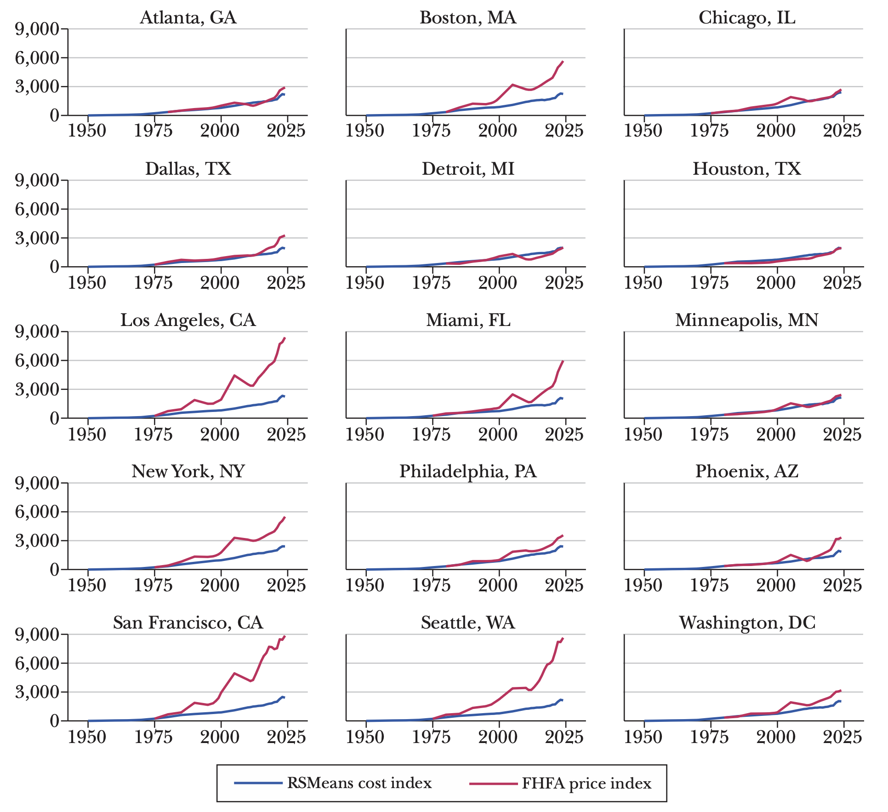
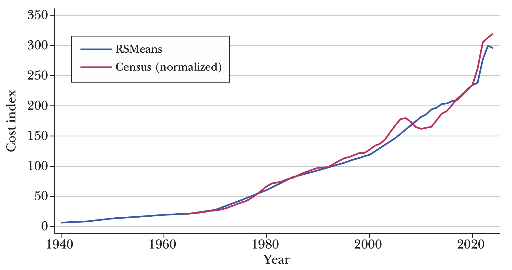
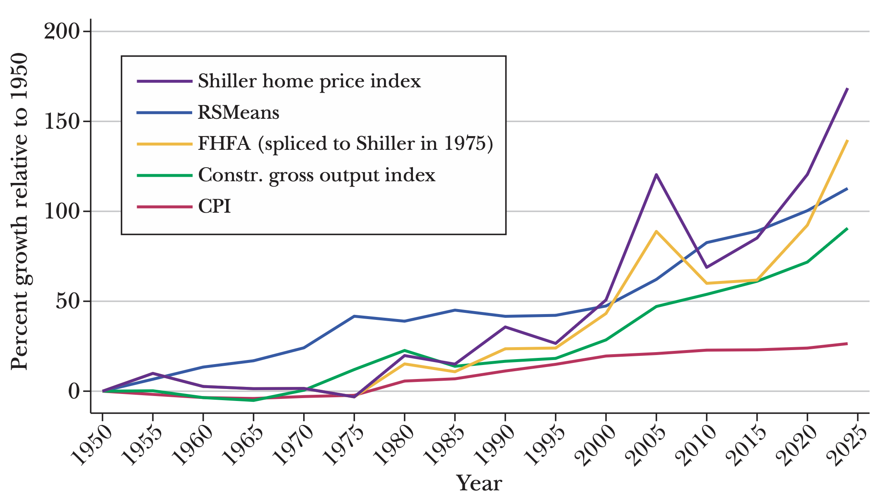
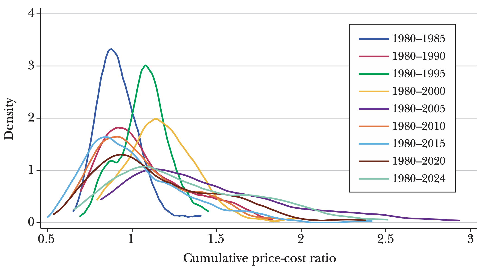
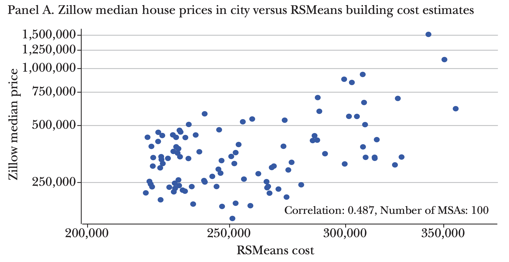
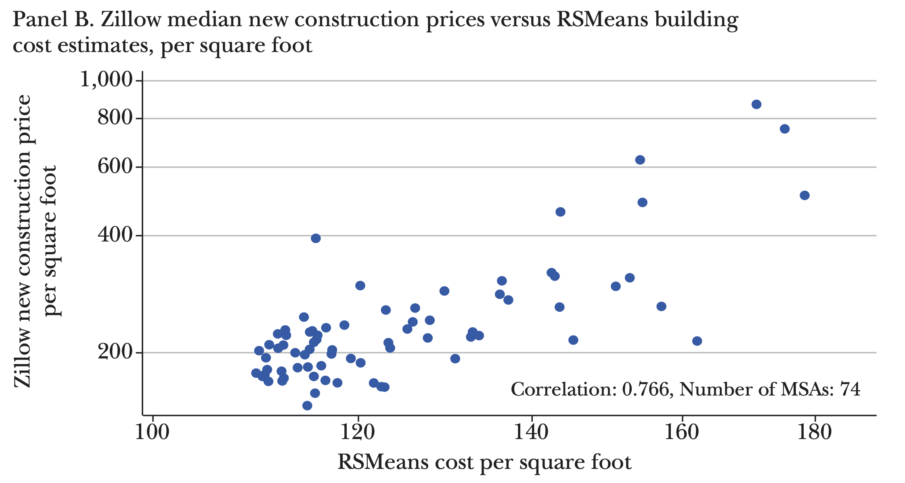

# Building Costs and House Prices

## Brian Potter and Chad Syverson

■ Brian Potter is Senior Infrastructure Fellow, Institute for Progress, Washington, DC. Chad Syverson is Professor of Economics, University of Chicago Booth School of Business, Chicago, Illinois. Their email addresses are briancpotter@gmail.com and chad.syverson@chicagobooth.edu. For supplementary materials such as appendices, datasets, and author disclosure statements, see the article page at https://doi.org/10.1257/jep.20241432.

High and increasing housing prices are an active and sometimes heated topic of policy debate (for instance, US GAO 2023; Bundrick 2024; Casselman 2024). In the United States, what were once a collection of metro-specific housing price outliers have recently morphed into widespread price surges. A broadly similar pattern holds in many other countries as well. For example, implied housing price-to-rent ratios in some other countries like Canada are multiples of their US counterparts, even with the latter at historical highs (*Economist* 2024).

Figure 1 compares housing prices and building costs across a selected group of US cities since 1950. Across-city variations in the gap between price and cost growth are visually obvious. Some cities see price growth adhering closely to building cost growth throughout the period. Others experience modest divergences for five- or ten-year periods (often recently), and still others see early and enormous separation of local house prices from the estimated cost of constructing them. Most notable is the extreme rise in housing prices compared to costs of large coastal metros, including the major cities in California (Los Angeles and San Francisco), Seattle, New York, and Boston. These cities have historically been perceived as failing to build sufficient housing to keep up with demand (Badger and Washington 2022), reflected here as a large cost-price disconnect. Cities that have historically built housing in large volumes, such as Dallas, Houston, Atlanta, and Phoenix (Potter 2021), show a much smaller difference between price and cost. However, over the last ten years many of these cities have seen house prices rise dramatically faster than costs.

*Figure 1* **Selected City-Level RSMeans Housing Cost and FHFA Housing Price Indexes**

*Source:* Authors' creation.

*Note:* The housing cost data come from RSMeans and are shown by the blue lines. Housing price data are from the Federal Housing Finance Agency (FHFA) and are shown by the red lines. These data sources are discussed further later in the paper. The city's FHFA index is normalized to the level of the RSMeans index in the year the FHFA index becomes available, typically 1975 or 1980.

The sources of high house prices are of obvious policy and intellectual interest. A natural candidate explanation is that they reflect high building costs, by which we mean the costs of actually constructing the building itself apart from land acquisition costs. After all, building costs on average account for an estimated 60–70 percent of the full cost of bringing a new house to market in a land-unconstrained area (Glaeser and Gyourko 2018; Lynch 2023). Moreover, the construction sector's poor productivity growth over the past several decades has raised the salience of high and rising building costs in the housing market (D'Amico et al. 2024; Goolsbee and Syverson 2024; Garcia and Molloy 2025). Yet the divergences in Figure 1 suggest that other factors may often be in play.

In this article we take a long, broad, and theoretically agnostic view toward the connection between building costs and house prices in the US housing market. Our intent is to lay out some facts, drawing connections and tentative conclusions when warranted. We hope this essay will serve as an input into future research on cost-price differences in this highly relevant and interesting market.

Perhaps the clearest conclusion of our analysis is that building costs have limited explanatory power over US housing prices, and even the imperfect correlations of the past have weakened further in recent decades along multiple dimensions. This thesis has a clear conceptual antecedent in Glaeser and Gyourko (2018), published in this journal. They used straightforward but powerful economic theory to organize discussion and interpretation of the connection between housing prices and costs in recent decades. We also explore this connection, but we differ by taking an empirical view that is longer (going back three-fourths of a century) and on some dimensions broader in the cross section. Zooming out in this way highlights a pattern that threads itself through our results in multiple ways; namely, that to the extent construction costs explain house price patterns—already tenuous in certain markets as documented by Glaeser and Gyourko (2018)—they are explaining less than they used to.

### **How to Measure Housing Construction Costs**

The core of our empirical analysis compares metrics of house construction costs to house prices. For construction costs, we rely on the Housing Cost database from RSMeans, a company that has been supplying cost estimate data to the construction industry since the mid-twentieth century. RSMeans describes its cost estimates which capture the costs and margins associated with actually constructing a building, but exclude ancillary and land acquisition costs—as being compiled "through a combination of field research, industry surveys, cost modeling, and partnerships with construction professionals and suppliers." The validity of the RSMeans data are reflected in part in their extensive use in the construction and building materials industries. Researchers have used them too. For example, Glaeser and Gyourko (2018), Kakar, Daniels, and Grossman (2018), and Duranton and Puga (2023) use RSMeans data to measure construction costs.[1](#page-2-0) Our version of the data contains detailed building cost estimates and indexes for various US cities.

To better understand how well RSMeans data track actual construction costs, we compare them to two other widely known indexes of housing construction costs.

First, the Census Single-Family Houses under Construction price index tracks the change in cost in single-family homes using home price data from the Census Bureau's Survey of Construction. The Survey measures housing construction activity by sampling from several hundred local permit-issuing offices, as well as canvassing land areas that do not issue permits. The values under construction exclude the cost of land, and thus track actual house construction costs while avoiding potentially confounding land scarcity effects.

*Figure 2* **Census Single-Family Houses under Construction Price Index and RSMeans Cost Index, 1940–2024**

*Source:* Authors' creation.

*Note:* This figure shows two housing cost indexes. The RSMeans index is in blue. The Census Single-Family Houses under Construction index (computed from the Census Bureau's Survey of Construction) is in orange. We normalize the 1965 start of the Census index to the contemporaneous level of the RSMeans index.

[Figure 2](#page-3-0) plots the two series together (we normalize the Census index's 1965 start to the contemporaneous level of the RSMeans index). They track each other closely, with the price volatility around the housing boom and bust in the late 2000s being the times of the greatest departures.

The Census comparison is a useful verification that the RSMeans data track nationwide changes in construction costs, but it would also be worthwhile to compare the RSMeans data for individual cities. For this comparison, we use the Turner and Townsend International Construction Market Survey, which tracks construction costs across a range of building types in major cities around the world.[2](#page-3-1)

We compare the RSMeans and Turner and Townsend data for seven major US cities in 2019 and five major US cities in 2024. Turner and Townsend construct their data through a multi-input process similar to that used by RSMeans. Here is how we build this comparison: We use each dataset to produce cost estimates expressed in dollars, which we then normalize into an index by setting it equal to 1 for Houston, the lowest-cost city in both indexes. The data are in [Table 1](#page-4-0). There are high cross-city correlations between the two measures, ranging from 0.70 to 0.97, though RSMeans indicates somewhat lower costs than Turner and Townsend for the very high-cost cities of New York and San Francisco. While tempered by the fact that the number of comparable cities is small, we take this correspondence as indicating RSMeans data usefully reflect building cost differences across geographies as well.

*Table 1* **Comparison of RSMeans and Turner and Townsend Construction Cost Indexes across Cities**

|                                       | Townhouse | High-rise apartment                    | RSMeans                                  |         |
|---------------------------------------|-----------|----------------------------------------|------------------------------------------|---------|
| Panel A. 2024 (normalized to Houston) |           |                                        |                                          |         |
| Houston                               | 1.00      | 1.00                                   | 1.00                                     |         |
| Chicago                               | 1.06      | 1.42                                   | 1.38                                     |         |
| Los Angeles                           | 1.80      | 1.60                                   | 1.32                                     |         |
| San Francisco                         | 1.85      | 2.25                                   | 1.48                                     |         |
| New York                              | 1.87      | 2.29                                   | 1.47                                     |         |
| Correlation                           | 0.70      | 0.88                                   |                                          |         |
|                             | Townhouse | Single-family home (medium quality) | Single-family home (prestige quality) | RSMeans |
| Panel B. 2019 (normalized to Houston) |           |                                        |                                          |         |
| Houston                               | 1.00      | 1.00                                   | 1.00                                     | 1.00    |
| Phoenix                               | 1.02      | 1.02                                   | 1.02                                     | 1.04    |
| Atlanta                               | 1.04      | 1.04                                   | 1.04                                     | 1.04    |
| Chicago                               | 1.19      | 1.20                                   | 1.40                                     | 1.41    |
| Seattle                               | 1.68      | 1.73                                   | 1.33                                     | 1.25    |
| New York                              | 1.93      | 2.15                                   | 1.43                                     | 1.57    |
| San Francisco                         | 2.45      | 2.09                                   | 1.52                                     | 1.52    |
| Correlation                           | 0.82      | 0.86                                   | 0.97                                     |         |

*Note:* This table compares RSMeans data and the Turner and Townsend International Construction Market Survey data across cities. We use each dataset to produce cost estimates expressed in dollars, which we then normalize into an index by setting it equal to 1 for Houston, the lowest-cost city in both indexes. Further details can be found in the Supplemental Appendix.

We begin exploring the connection between homebuilding costs and house prices with a look at long-run trends. [Figure 3](#page-5-0) shows multiple price indexes over the last three-fourths of a century. In addition to the RSMeans house building cost index already discussed and the Consumer Price Index from the Bureau of Labor Statistics, it also includes several other indexes. The "construction sector gross output price index" is from the Bureau of Economic Analysis (BEA) industry accounts, which the BEA builds to capture the evolution of prices for all of the sector's outputs (including houses, other buildings, and public works). Goolsbee and Syverson (2024) employ this index in their study of construction sector productivity, for example. The housing price index produced by the Federal Housing Finance Agency (FHFA) is constructed from transaction data from Fannie Mae and Freddie Mac using repeat sales or refinancings of the same house. In so doing, it adjusts more thoroughly than cross-sectional samples for quality changes in the housing stock. For examples of research using this index, useful starting points are Guerrieri, Hartley, and Hurst (2013), Charles, Hurst, and Notowidigdo (2018), and Glaeser and Gyourko (2025). We further include the Shiller home price index, which is a composite of Census-division-level single-family home price indices. Like the FHFA index, this is also calculated based on previous sales of the same home. Examples of its use in research include Case and Shiller (2003), Mian and Sufi (2009), and Glaeser, Gottlieb, and Gyourko (2013).

*Figure 3* **Comparison of Price Indexes since 1950 (relative to the GDP deflator)**

*Source:* Authors' creation.

*Note:* The figure compares multiple price indexes: The RSMeans Housing Cost Index, the Consumer Price Index (CPI), the construction sector gross output price index from the Bureau of Economic Analysis industry accounts, the Shiller Home Price Index (calculated based on repeat sales), and the Federal Housing Finance Agency index (which also uses repeat sales, or refinancings). Each of these indexes has been normalized by the GDP deflator over the entire period. The FHFA index only starts in 1975, so we splice it to the level of the Shiller index that year. We use the series values in every fifth year (those ending in "0" or "5").

Each of these indexes has already been normalized by the GDP deflator over the entire period. As such, they reflect trends relative to that deflator. Clearly, each grew faster than the GDP deflator over the period.

Several patterns are apparent here. First, construction-related prices of all sorts—whether captured by building costs, construction output deflators, or house prices—grew faster than the other consumer-related prices in the Consumer Price Index. While the CPI saw cumulative growth of about 20 percent relative to the GDP deflator, construction sector gross output prices almost doubled, and housing construction costs and prices both more than doubled. This outsized growth, at least in the latter two-thirds of the sample period, is consistent with the aforementioned productivity underperformance of the sector relative to the rest of the economy post-1970 (D'Amico et al. 2024; Goolsbee and Syverson 2024; Garcia and Molloy 2025).

Second, for much of the early period, cumulative growth in construction costs, as reflected in the RSMeans data, outpaced housing prices. In fact, cumulative growth in the Shiller house price index over 1950–1975 was 30 percent *less* than comparable change in the RSMeans building cost index. In the late 1970s, however, house prices started rising faster than construction costs. Within the time horizon of the figure, cumulative price growth finally caught up to and surpassed cost growth in the late 1990s.

Third, there were two separate periods where post-1950 cumulative growth in housing prices was notably above the same for building costs: the mid-2000s, during the run-up to the subprime mortgage lending–driven financial crisis; and most recently, from the mid-2010s to the present. While the mid-2000s house price spike did not coincide with a similar acceleration in building costs, this is less true for the contemporaneous bout of price growth. House prices and building costs alike have recently risen substantially faster than their prior growth rates, though housing prices have risen more quickly.

Ultimately, over the entire sweep of the data, house prices cumulatively rose only modestly more than the increase in building costs: about 25 percent more using the Shiller housing price index, and only 10 percent more if we splice the Federal Housing Finance Agency index to the Shiller index in 1975. If we focus on the trends since 1975, however, the differences are starker. Cumulative house price growth using the FHFA index outpaced building costs by over 60 percent; the difference using the Shiller housing index is 80 percent.[3](#page-6-0) This pattern of increasingly divergent building costs and house prices in recent decades will repeat itself in our discussion below. Note, interestingly, that this divergence occurs throughout a period where construction productivity growth was very poor. That is, while building cost inflation may well have contributed to high house price growth in recent years, other factors must have made an additional and substantial contribution.

## **Relationships between Cost and Price Growth in a City Panel**

We next drill below the aggregates to look at patterns of house price and building cost growth at the city level. We match city-specific building cost indexes, using the RSMeans data, with housing price indexes, using the Federal Housing Finance Agency indexes at the level of metropolitan statistical areas.

RSMeans data are not always reported at the level of an entire Census-defined metropolitan statistical area. For instance, there are separate indexes for Boston and Fall River in Massachusetts, despite both being part of the same metropolitan statistical area. Another example includes the separate indexes for New York City, New York, and Jersey City, New Jersey, again in the same metropolitan statistical area. In these cases, we use the index corresponding to the center city. The number of cities covered in the Federal Housing Finance Agency data on housing prices is quite small early in the panel. Only 13 cities are covered from 1975 to 1980. (Earlier in the paper, Figure 1 offered illustrations of the cost and price comparison for some of those cities plus others whose series began in 1980.) Coverage increases considerably to 128 cities from 1980 to 1985 and to 178 cities by the 1995–2000 period, where the number of covered cities stabilizes[.4](#page-7-0)

*Table 2* **Summary Statistics for City-Level Building Cost and House Price (in Percent, Showing Compound Annual Growth Rates by Time Period)**

| Period    | N   | RSMeans mean | RSMeans standard deviation | FHFA mean | FHFA standard deviation |
|-----------|-----|-----------------|-------------------------------|-----------|----------------------------|
| 1975–1980 | 13  | 6.84%           | 1.03                          | 13.26%    | 4.38                       |
| 1980–1985 | 128 | 5.83            | 0.78                          | 3.90      | 3.12                       |
| 1985–1990 | 155 | 2.31            | 0.48                          | 4.76      | 4.17                       |
| 1990–1995 | 174 | 2.24            | 0.53                          | 3.00      | 2.81                       |
| 1995–2000 | 178 | 2.37            | 0.61                          | 4.04      | 1.77                       |
| 2000–2005 | 178 | 4.21            | 0.47                          | 7.15      | 4.20                       |
| 2005–2010 | 178 | 4.55            | 0.51                          | −0.61     | 3.49                       |
| 2010–2015 | 178 | 2.68            | 0.59                          | 1.45      | 2.06                       |
| 2015–2020 | 178 | 2.68            | 0.58                          | 4.78      | 1.89                       |
| 2020–2024 | 178 | 6.27            | 0.52                          | 10.11     | 2.01                       |

*Note: N* is the number of cities in the data for each time period.

As a basis for a broader examination, [Table 2](#page-7-1) reports summary statistics of building cost and house price growth (showing compound annual growth rates over the respective periods) for our entire panel. We noted above that the aggregates indicate house prices began to systematically outgrow building costs after 1975. This is observed at the city level as well. For seven of the ten five-year periods (the last period is shortened to 2020–2024 given data availability), average city-level house price growth rates exceeded average city-level building cost growth rates. The exceptional periods where building costs outstripped price growth were 1980–1985, 2005–2010, and 2010–2015, with low price growth in the latter two periods driven by home price declines following the global financial crisis. The only time in which any of the annual growth rates were negative was for house prices during 2005–2010.

*Table 3* **Cross-Sectional Regressions of Compound Average Growth Rates for House Price on Construction Costs**

| Period    | N   | R2    | Coefficient |
|-----------|-----|-------|-------------|
| 1975–1980 | 13  | 0.641 | 3.420       |
|           |     |       | (0.374)     |
| 1980–1985 | 128 | 0.182 | 1.705       |
|           |     |       | (0.386)     |
| 1985–1990 | 155 | 0.329 | 4.990       |
|           |     |       | (0.629)     |
| 1990–1995 | 174 | 0.110 | −1.750      |
|           |     |       | (0.344)     |
| 1995–2000 | 178 | 0.000 | 0.060       |
|           |     |       | (0.203)     |
| 2000–2005 | 178 | 0.009 | 0.851       |
|           |     |       | (0.569)     |
| 2005–2010 | 178 | 0.015 | 0.831       |
|           |     |       | (0.511)     |
| 2010–2015 | 178 | 0.035 | −0.658      |
|           |     |       | (0.241)     |
| 2015–2020 | 178 | 0.011 | 0.347       |
|           |     |       | (0.197)     |
| 2020–2024 | 178 | 0.020 | 0.551       |
|           |     |       | (0.298)     |

*Note:* House price data are the FHFA metro-specific indexes, and building costs are from RSMeans. Each row is a separate calculation, using data across cities for that time period. Details are available the Supplemental Appendix.

Just as aggregate house price growth has been more volatile over time than aggregate building cost growth, price growth is substantially more variable in the cross section as well. The typical standard deviation across cities of house price growth rates ranges from 2 to 4 percentage points per year, while for building costs it ranges from 0.5 to 1 percentage points. There is very little skewness across cities in the building cost distribution, but a little more among house prices.[5](#page-8-0)

We dig into the cross-sectional correlation of growth rates by running separate cross-sectional regressions for each of these five-year periods. The results are in [Table 3.](#page-8-1) Looking down along the *R*2 of regressions, we observe—at the city level an increasing divergence of building costs and house prices over time. The ability of building cost growth to predict price growth in the cross section falls throughout our panel. In fact, there is a notable step down in 2000 from modest explanatory power to very little, if any, explanatory power (single-digit *R*2 values). The coefficients vary a fair amount from year to year. In fact, from 1990 to 1995—a period where cost growth still explains over 10 percent of price growth—the relationship is negative, hardly the direction implied by simple economic theory.[6](#page-9-0)

#### **Which Cities See the Biggest Divergence between Housing Prices and Building Costs?**

The cities that saw the largest gaps between house price and building cost growth have changed over time. [Table 4](#page-10-0) lists the five cities that saw the largest and smallest price growth in excess of building costs during each five-year time period of our sample.[7](#page-9-1)

During 1980–1985, Massachusetts cities and those in the New York City region dominated the cities whose house prices most exceeded cost growth. Boston was the highest, with annual price growth 7.7 percent higher than local building cost growth. Excess price growth moved west for the late 1980s, with coastal California cities and Honolulu on top (the last experiencing annual price growth 14 percent higher than costs). The most divergent prices shifted to Utah and the Pacific Northwest for 1990–1995. A mishmash of cities experienced fast relative price growth from 1995 to 2000. During 2000–2005, California cities, including some inland, see excess growth to the tune of 14 percent per year. As housing prices collapsed in the latter half of the 2000s, only one city in the country (!) saw price growth above building cost growth: Odessa, Texas, in the midst of a fracking-driven oil and gas boom. Other cities in Texas, plus Huntsville, Alabama, rounded out the top five from 2005 to 2010, though these all exhibited house price declines as a result of the global financial crisis. California cities lead the house price rebound from 2010 to 2015, and the Pacific Northwest (now including Boise, Idaho) saw the fastest relative price growth from 2015 to 2020. The post-Covid price run-up was led by Miami and saw cities from Tennessee, Georgia, and Maine enter the mix for the first time.

As for the locations seeing the slowest relative price growth (which in all cases is negative, meaning that house prices grew more slowly than building costs did) during 1980–1985, they were in deindustrializing Midwestern cities and Eugene, Oregon. Texas, Oklahoma, and Alaska bore the brunt of the oil price collapse from 1985 to 1990. Smaller New England cities and Greater Los Angeles, following the social unrest there in 1992, saw big relative price declines over 1990–1995. In all these cases, the fastest-declining relative price cities saw prices fall some 6 or 7 percent per year relative to building costs. The 1995–2000 and 2000–2005 periods saw an assortment of cities from various regions experiencing the largest relative price declines, though they were smaller drops in magnitude than those of earlier periods. Of course 2005–2010 was a banner period for falling prices, with cities in Nevada and inland California seeing annual price drops of 14 to 18 percent relative to costs, reversing gains of the prior half decade. The 2010–2015 and 2015–2020 periods saw a variety of cities in Illinois and Alabama experience the largest relative price drops, and the COVID-influenced period from 2020–2024 was dominated by Louisiana cities along with Odessa, Texas.

*Table 4* **Top and Bottom Five Cities' House-Price-to-Building-Cost Growth, by Period**

| 1980–1985         |                      | 1985–1990         |                      | 1990–1995         |                       |
|-------------------|---------------------|-------------------|---------------------|--------------------|---------------------|
| City              | %ΔPrice − %ΔCost | City              | %ΔPrice − %ΔCost | City               | %ΔPrice − %ΔCost |
| Boston, MA        | 7.7                 | Honolulu, HI      | 14.1                | Salt Lake City, UT | 9.0                 |
| Worcester, MA     | 6.9                 | San Francisco, CA | 12.2                | Ogden, UT          | 6.9                 |
| Springfield, MA   | 5.3                 | Los Angeles, CA   | 11.4                | Spokane, WA        | 6.3                 |
| New York, NY      | 4.9                 | Oxnard, CA        | 10.9                | Portland, OR       | 6.2                 |
| Newark, NJ        | 3.3                 | Anaheim, CA       | 9.8                 | Eugene, OR         | 5.9                 |
| Eugene, OR        | −6.7                | San Antonio, TX   | −4.9                | Manchester, NH     | −5.8                |
| Detroit, MI       | −6.8                | Oklahoma City, OK | −5.5                | Oxnard, CA         | −5.8                |
| Davenport, IA     | −6.9                | Odessa, TX        | −6.3                | New Haven, CT      | −6.6                |
| Waterloo, IA      | −7.9                | Anchorage, AK     | −7.0                | Los Angeles, CA    | −6.6                |
| Peoria, IL        | −8.7                | Austin, TX        | −7.1                | Hartford, CT       | −7.0                |

| 1995–2000         |                      |2000–2005         |                       |2005–2010          |                       |
|-------------------|---------------------|-------------------|---------------------|--------------------|---------------------|
| City              | %ΔPrice − %ΔCost | City              | %ΔPrice − %ΔCost | City               | %ΔPrice − %ΔCost |
| San Francisco, CA | 9.6                 | Santa Barbara, CA | 14.4                | Odessa, TX         | 2.7                 |
| Boston, MA        | 7.2                 | Riverside, CA     | 14.3                | Austin, TX         | −0.5                |
| Charleston, SC    | 6.6                 | Fresno, CA        | 14.1                | Beaumont, TX       | −0.6                |
| Denver, CO        | 6.0                 | Los Angeles, CA   | 13.5                | El Paso, TX        | −0.8                |
| Seattle, WA       | 5.8                 | Bakersfield, CA   | 13.4                | Huntsville, AL     | −0.8                |
| Buffalo, NY       | −1.6                | Decatur, IL       | −1.2                | Riverside, CA      | −13.8               |
| Camden, NJ        | −1.7                | Charleston, WV    | −1.4                | Reno, NV           | −14.5               |
| Springfield, IL   | −1.7                | Springfield, IL   | −1.5                | Vallejo, CA        | −16.2               |
| Utica, NY         | −2.0                | Memphis, TN       | −1.8                | Las Vegas, NV      | −17.9               |
| Honolulu, HI      | −5.0                | Sioux City, IA    | −3.0                | Stockton, CA       | −17.9               |

| 2010–2015         |                      | 2015–2020        |                       | 2020–2024       |                         |
|-------------------|---------------------|-------------------|---------------------|--------------------|---------------------|
| City              | %ΔPrice − %ΔCost | City              | %ΔPrice − %ΔCost | City               | %ΔPrice − %ΔCost |
| Stockton, CA      | 5.3                 | Boise, ID         | 8.9                 | Miami, FL          | 8.6                 |
| San Francisco, CA | 5.1                 | Spokane, WA       | 7.1                 | Knoxville, TN      | 8.1                 |
| Vallejo, CA       | 4.9                 | Tacoma, WA        | 7.0                 | Camden, NJ         | 8.0                 |
| Denver, CO        | 4.4                 | Tampa, FL         | 6.5                 | Savannah, GA       | 7.5                 |
| Reno, NV          | 4.1                 | Las Vegas, NV     | 6.1                 | Lewiston, ME       | 7.3                 |
| Columbia, SC      | −4.6                | Decatur, IL       | −1.1                | Baton Rouge, LA    | −1.2                |
| Tuscaloosa, AL    | −4.7                | Shreveport, LA    | −1.1                | Shreveport, LA     | −1.8                |
| Mobile, AL        | −5.2                | Lawton, OK        | −1.3                | New Orleans, LA    | −1.9                |
| Rockford, IL      | −5.4                | Springfield, IL   | −1.5                | Odessa, TX         | −2.5                |
| Montgomery, AL    | −5.7                | Peoria, IL        | −1.5                | Lake Charles, LA   | −2.8                |

*Note:* House price data are the FHFA metro-specific indexes, and building costs are from RSMeans. Details are available in the Supplemental Appendix.

While some cities appear in the top or bottom five multiple times, there is a considerable turnover across periods. This suggests relative price-cost growth in a city is not highly persistent. Indeed, formal tests do indeed indicate mean reversion in cities' housing price-cost ratios; that is, faster relative price growth in one period predicts slower relative price growth in the following period, tempering cumulative differences between house prices and building costs. Though as we see below, these differences can still become quite large. If we break this growth rate difference into its price and building cost components, both exhibit mean reversion[.8](#page-11-0)

We can of course add up these period-specific growth differences to obtain a measure of the cumulative gap between building costs and house prices in a city. We compute the ratio of cumulative house price growth to cumulative building cost growth in the city since 1980, and then plot the density of this ratio across cities for the 126 cities that we observe from 1980 to the present in [Figure 4.](#page-12-0) Values above 1 indicate more cumulative growth since 1980 in house prices than in building costs.

Some interesting patterns emerge from inspecting these distributions. Despite the average and median growth rate patterns discussed above, several cities experienced lower cumulative house price growth than building cost growth—as is shown by any values below 1. This is true even at the sample's end in 2024: from 1980 to 2024, 33 of the 128 cities saw faster housing cost growth than price growth. Near the start of the time period, the distributions are relatively condensed; for example, the two curves with the highest density peaks are those for 1985 and 1990. Over time, the distributions became quite skewed. The distribution with the biggest rightward skews is for the average price spike of 2005, but the next three curves most skewed to the right are 2024, 2020, and 2015. For instance, in 2024, the 90th percentile cumulative price-cost ratio was 1.90. It was even larger during the price spike of 2005, at 2.21.

#### **Material versus Installation Costs for Cities**

Since 2007, the RSMeans Index provides separate indexes for "material" and "installation" indexes, which together comprise the overall building cost index. The material index summarizes the prices of building materials: concrete, lumber, drywall, plumbing fixtures, and so on. The installation index reflects costs tied to the assembly of materials into finished buildings, including some kinds of building-related overhead, but not "soft costs" like legal and engineering fees, financing costs, and land acquisition. The index therefore mostly captures costs tied to labor-centered services dominated by the wages of contractors and construction crews.

*Figure 4* **Across-City Density of Cumulative Housing Prices to Costs Ratio Level Ratio**

*Source:* Housing prices are from the FHFA data. Housing costs are from the RSMeans data. *N* is 128 cities for each time period.

We can compare the growth rates of these two cost components to see if there have been systematic differences in the sources of building cost inflation since 2010. The top panel of [Table 5](#page-13-0) reports the compound annual growth rates of the total RSMeans index along with its materials and installation components[.9](#page-12-1)

In the early 2010s, installation cost growth outpaced growth in material costs by roughly one percentage point per year. This pattern flipped in the latter half of the decade, with materials cost growth outpacing installation cost growth by about the same amount, and an overall acceleration in cost growth of about half a percentage point per year. The overall cost inflation rate doubled in the Covid and post-Covid periods. While both components saw price acceleration, inflation in materials far outpaced installation costs, consistent with the well-documented supply chain frictions and the accompanying inflation in goods relative to services (for example, di Giovanni et al. 2022; Comin, Johnson, and Jones 2024).

|                     | Total Cost       | Material                       | Installation         |                                    |
|---------------------|------------------|--------------------------------|----------------------|------------------------------------|
| Panel A. US average |                  |                                |                      |                                    |
| 2010–2015           | 2.35%            | 1.99%                          | 2.83%                |                                    |
| 2015–2020           | 2.81             | 3.30                           | 2.16                 |                                    |
| 2020–2024           | 5.98             | 8.05                           | 2.95                 |                                    |
|                     | Material mean | Material standard deviation | Installation mean | Installation standard deviation |
| Panel B. City-level |                  |                                |                      |                                    |
| 2010–2015           | 2.51%            | 0.38                           | 3.67%                | 2.18                               |
| 2015–2020           | 2.53             | 0.33                           | 3.45                 | 1.92                               |
|                     | 5.98             | 0.53                           | 5.32                 | 1.21                               |

*Table 5* **RSMeans Material and Installation Cost Components Compound Annual Growth Rates, 2010–2024**

We can also compare these separate indexes for cities during this period since 2010. The bottom panel of Table 5 shows the mean and standard deviation of each index across the cities in our RSMeans data. The means of the city-level distribution look much like the aggregate growth rates, with a few differences.[10](#page-13-1) During 2010–2015, the city-level means see the same pattern as in the aggregates of installation cost growth outpacing material cost growth by about one percentage point. From 2015 to 2020, rather than reversing this pattern as the aggregates do, city-level (unweighted) average installation costs continue to grow faster than material costs. As with the aggregates, inflation in both components accelerates in the post-Covid period, and more so for materials. However, the difference between average city-level materials and installation cost growth is smaller than for the aggregates.

An interesting pattern in the city-level numbers that was hidden in the aggregates is the difference in the standard deviations of the cost component growth rates. Installation cost growth varies much more across cities than material cost growth. Before Covid, the ratio of the two components' standard deviations is almost 6. This falls quite a bit after Covid, to around 2 (perhaps because supply chain disruption effects were heterogeneous across geographies), but a clear difference remains.

The greater variance of installation costs may reflect the relative goods intensity of the material index, as opposed to the labor intensity of the installation cost index. Goods are more tradeable, which creates an arbitrage incentive that reduces cross-sectional dispersion in prices. Labor for construction, on the other hand, is a much more local market with higher spatial adjustment costs, and as such it may be easier to for greater price dispersion to arise. It also suggests the primary source of any cross-sectional correlation between building costs and house prices—which again we show above is already rather weak, especially in this latter period—is likely to be because of labor costs.

## **Across-City Housing Cost and Price Level Comparisons**

Having used the RSMeans housing cost index to look at cross-sectional relationships between building cost and house price *growth*, we now use data to explore cross-sectional relationships in building cost and price *levels*. In this case, of course, we cannot compare indexes, so we need different data. For building costs, we stick with RSMeans data products and use their construction cost estimator, which reports the expected building cost in dollars of a home with a particular set of attributes in a particular city. Specifically, we use a two-story home of average building quality, with stucco on wood frame walls/frame and floorspace of 2,000 square feet. Because the prices of different house types are highly correlated across cities, using a different set of attributes would likely yield similar results. For house price data, we use the Zillow median house price reported by city. We use data for 2024 and obtain building cost and house price measures for the 100 largest metro areas[.11](#page-14-0)

[Figure 5,](#page-15-0) panel A, plots the log of the Zillow median house price against the log of the RSMeans building cost estimate. Costs and prices are positively correlated, with the slope from regressing log prices on log costs yielding a coefficient of 1.57 (standard error = 0.33) and an *R*2 of 0.24. As with the correlations in growth rates across cities throughout our panel, costs have explanatory power, but the majority of variation is explained by other factors.[12](#page-14-1)

As one further check on the housing cost-price relationship, we note our RSMeans dollar cost levels for every city are for a house with standardized attributes, including size. If the size of median homes differs systematically across cities, this could be another reason for a wedge between prices and building costs. To check this, we compare both Zillow prices (though just for new construction) and RSMeans cost estimates in terms of dollars per square foot for 74 of the 100 cities in our original sample. The regression coefficient of prices on costs using this per-unit-area data is 2.16 (SE = 0.33), with an *R*2 of 0.59. The corresponding scatter plot is shown in Figure 5, panel B. Adjusting for the fact that RSMeans cost estimates focus on new construction and for differences in house sizes across metros substantially raises the ability of building costs to explain house prices.

*Figure 5* **Across-City Comparisons of Housing Prices and Building Costs**

Panel A. Zillow median house prices in city versus RSMeans building cost estimates

Panel B. Zillow median new construction prices versus RSMeans building cost estimates, per square foot

*Note:* The Zillow data series are available at <https://www.zillow.com/research/data/>. The building cost data are from RSMeans.

That said, even in this best case, almost half of the variation in housing prices remains unexplained. [Table 6](#page-16-0) lists the top and bottom ten cities (of 74 in the sample) in terms of the residual of regressing the median per-square-foot price of newly constructed houses on the estimated building costs per square foot. Cities with positive residuals have high prices relative to those predicted by building costs, while cities with negative residuals have low prices relative to those predicted by building costs.

*Table 6* **Top Ten and Bottom Ten Residuals from Regressing City's Logged Median House Price per Square Foot on Logged RSMeans Building Cost per Square Foot Estimates, and Ranks of Price and Cost**

| City                 | House price residual (%) | Price Rank (of 74) | Cost Rank (of 74) |
|----------------------|--------------------------|--------------------|-------------------|
| Top ten              |                          |                    |                   |
| Miami, FL            | 98.2                     | 7                  | 46                |
| San Jose, CA         | 88.5                     | 1                  | 3                 |
| Los Angeles, CA      | 69.5                     | 3                  | 7                 |
| San Francisco, CA    | 54.5                     | 2                  | 2                 |
| Seattle, WA          | 45.2                     | 6                  | 11                |
| Denver, CO           | 38.7                     | 12                 | 35                |
| Boston, MA           | 31.2                     | 5                  | 6                 |
| Colorado Springs, CO | 27.3                     | 21                 | 56                |
| Sarasota, FL         | 22.2                     | 27                 | 60                |
| Durham, NC           | 21.1                     | 31                 | 66                |
| Bottom ten           |                          |                    |                   |
| El Paso, TX          | −19.1                    | 69                 | 38                |
| Augusta, GA          | −20.6                    | 73                 | 47                |
| Indianapolis, IN     | −24.6                    | 70                 | 33                |
| Columbia, SC         | −25.1                    | 74                 | 54                |
| Omaha, NE            | −25.5                    | 54                 | 21                |
| Baton Rouge, LA      | −27.3                    | 71                 | 32                |
| Greenville, SC       | −27.9                    | 72                 | 31                |
| Philadelphia, PA     | −31.6                    | 17                 | 5                 |
| Minneapolis, MN      | −33.7                    | 38                 | 10                |
| Chicago, IL          | −48.0                    | 39                 | 4                 |

*Note:* The residuals are calculated from regressing the median per-square-foot price of newly constructed houses, using the Zillow data, on the estimated building costs per square foot, from the RSMeans data. The sample has 74 cities. For details, see Potter and Syverson (2025). The residuals were estimated in log points and then converted to percentages for this table.

The highest relative house price cites are in coastal California, the Front Range of Colorado, and Florida, as well as Seattle and Boston. Miami is the highest, with prices per square foot are some 98 percent above what would be predicted by local construction costs.

It is interesting to compare the price and cost ranks of these high-residual cities among the 74 cities in our data. Most of the cities with high price-cost residuals exhibit high house prices overall. The seven highest-residual cities are among the twelve highest-price cities. However, with the exception of Miami and Denver, none of these cities have particularly low building costs. San Jose and San Francisco (second- and fourth-highest house price residuals) actually have the second- and third-highest estimated building costs among all cities, and Boston, Los Angeles, and Seattle are not far behind. These cities therefore have a large price residual despite their building costs, not because of them. The remainder of the top ten—Colorado Springs, Colorado, Sarasota, Florida, and Durham, North Carolina, have prices out of the top ten but above the median. Their high price-cost residual reflects a large gap between their price and cost ranks rather than astronomical prices per se.

The lowest relative price cities are various locations in the Midwest and South as well as Philadelphia. Chicago has the smallest residual of all cities in our data, indicating its house prices are 48 percent less than predicted by building costs, notably larger than Minneapolis's second-lowest residual pointing to prices 34 percent less than that implied by costs.

Looking at these lowest-residual cities' price and cost ranks, we see a range of patterns. Some cities, like Augusta, Georgia, and Columbia, South Carolina, have very low house prices but also below-median costs—just not as low as their prices, obviously. Others have a negative residual not so much because of low prices, but rather quite high costs: Philadelphia, Minneapolis, and Chicago all have cost ranks in the top ten. Chicago's large negative residual is much more due to high costs than low prices.

### **Conclusion**

Looking at nearly 75 years of RSMeans data has allowed us to examine housing construction cost growth over a long period and across many different metro areas. Comparing this with various measures of housing prices offers insights into the relationship between construction costs and housing prices. Despite construction costs being a very large fraction of the costs of new construction, overall construction costs are not a particularly strong predictor of housing prices overall, especially in the very highest-cost metros and in more recent periods. We observe this across a variety of measures, from the increasing divergence in construction costs and housing prices across major metros, to the larger dispersion of installation costs than material costs in building costs, to contemporary Zillow home price data on both new construction and existing houses.

Patterns in both aggregates and in the cross section suggest the cost-price relationship is weakening over time, particularly post-2000. Moreover, some of the relationship that does exist may be due to the circular effects of high housing costs driving up the costs of local labor, a major input to construction costs.

But while the stagnation (or worse, recession) of construction productivity and its concomitant high building costs in general can only add to high housing prices, these factors are mostly and increasingly overshadowed by other effects on house price. The decoupling of house price and replacement cost may have several drivers, including increasingly binding restrictions that prevent housing supply expansion in high-demand areas.

■ We thank Joe Tatarka for excellent research assistance. We are grateful to Jonathan Parker, Timothy Taylor, and Heidi Williams for comments. Syverson is grateful for financial support from the Smith Richardson Foundation under grant #20233172. We have no other relevant financial interests to disclose.

#### References

- Badger, Emily, and Eve Washington. 2022. "The Housing Shortage Isn't Just a Coastal Crisis Anymore." New York Times, July 14. https://www.nytimes.com/2022/07/14/upshot/housing-shortage-us.html.
- **Bundrick, Hal.** 2024. "Why are home prices so high?" *Yahoo! Finance*, November 19. https://finance.yahoo.com/personal-finance/mortgages/article/why-are-house-prices-so-high-184935574.html.
- Case, Karl E., and Robert J. Shiller. 2003. "Is There a Bubble in the Housing Market?" Brookings Papers on Economic Activity 34 (2): 299–362.
- Casselman, Ben. 2024. "The Housing Market Is Weird and Ugly." *New York Times*, June 20. https://www.nytimes.com/2024/06/20/business/economy/housing-market-explained.html.
- Charles, Kerwin Kofi, Erik Hurst, and Matthew J. Notowidigdo. 2018. "Housing Booms and Busts, Labor Market Opportunities, and College Attendance." American Economic Review 108 (10): 2947–94.
- Comin, Diego A., Robert C. Johnson, and Callum J. Jones. 2024. "Supply Chain Constraints and Inflation." NBER Working Paper 31179.
- D'Amico, Leonardo, Edward L. Glaeser, Joseph Gyourko, William R. Kerr, and Giacomo A. M. Ponzetto. 2024. "Why Has Construction Productivity Stagnated? The Role of Land-Use Regulation." NBER Working Paper 33188.
- di Giovanni, Julian, Şebnem Kalemli-Özcan, Alvaro Silva, and Muhammed A. Yildirim. 2022. "Global Supply Chain Pressures, International Trade, and Inflation." NBER Working Paper 30240.
- **Duranton, Gilles, and Diego Puga.** 2023. "Urban Growth and Its Aggregate Implications." *Econometrica* 91 (6): 2219–59.
- *Economist.* 2024. "The House-Price Supercycle Is Just Getting Going." October 1. https://www.economist.com/finance-and-economics/2024/1%1/the-house-price-supercycle-is-just-getting-going.
- Garcia, Daniel, and Raven Molloy. 2025. "Reexamining Lackluster Productivity Growth in Construction" Regional Science and Urban Economics 113: 104107.
- **Glaeser, Edward L., Joshua D. Gottlieb, and Joseph Gyourko.** 2013. "Can Cheap Credit Explain the Housing Boom?" In *Housing and the Financial Crisis*, edited by Edward L. Glaeser and Todd Sinai, 301–16. University of Chicago Press.
- **Glaeser, Edward, and Jospeh Gyourko.** 2018. "The Economic Implications of Housing Supply." *Journal of Economic Perspectives* 32 (1): 3–30.
- **Glaeser, Edward L., and Joseph Gyourko.** 2025. "America's Housing Supply Problem: The Closing of the Suburban Frontier?" NBER Working Paper 33876.
- **Goolsbee, Austan, and Chad Syverson.** 2024. "The Strange and Awful Path of Productivity in the US Construction Sector." In *Technology, Productivity, and Economic Growth*, edited by Susanto Basu, Lucy Eldridge, John Haltiwanger, and Erich Strassner. University of Chicago Press.
- Guerrieri, Veronica, Daniel Hartley, and Erik Hurst. 2013. "Endogenous Gentrification and Housing Price Dynamics." *Journal of Public Economics* 100: 45–60.
- Kakar, Venoo, Gerald Daniels, and Aditi Grossman. 2018. "Jobs and Housing (Im)balance in the San

- Francisco Bay Area." Center for Applied Housing Research Working Paper 2018-3.
- **Lynch, Eric.** 2023. "Cost of Constructing a Home—2022." National Association of Home Builders, February 1. [https://www.nahb.org/-/media/NAHB/news-and-economics/docs/housing-economics-plus/](https://www.nahb.org/-/media/NAHB/news-and-economics/docs/housing-economics-plus/special-studies/2023/special-study-cost-of-constructing-a-home-2022-february-2023.pdf?rev=f771d8b924b14a079010cd59da395406) [special-studies/2023/special-study-cost-of-constructing-a-home-2022-february-2023.pdf?rev=f771d](https://www.nahb.org/-/media/NAHB/news-and-economics/docs/housing-economics-plus/special-studies/2023/special-study-cost-of-constructing-a-home-2022-february-2023.pdf?rev=f771d8b924b14a079010cd59da395406) [8b924b14a079010cd59da395406.](https://www.nahb.org/-/media/NAHB/news-and-economics/docs/housing-economics-plus/special-studies/2023/special-study-cost-of-constructing-a-home-2022-february-2023.pdf?rev=f771d8b924b14a079010cd59da395406)
- **Mian, Atif, and Amir Sufi.** 2009. "The Consequences of Mortgage Credit Expansion: Evidence from the US Mortgage Default Crisis." *Quarterly Journal of Economics* 124 (4): 1449–96.
- **Potter, Brian.** 2021. "60 Years of Homebuilding." Construction Physics, May 3. [https://www.construction](https://www.construction-physics.com/p/60-years-of-homebuilding)[physics.com/p/60-years-of-homebuilding.](https://www.construction-physics.com/p/60-years-of-homebuilding)
- **Potter, Brian, and Chad Syverson.** 2025. *Data and Code for: "Building Costs and House Prices."* Nashville, TN: American Economic Association; distributed by Inter-university Consortium for Political and Social Research, Ann Arbor, MI. <https://doi.org/10.3886/E234046V1>.
- **US GAO (Government Accountability Office).** 2023. "The Affordable Housing Crisis Grows While Efforts to Increase Supply Fall Short." WatchBlog: Following the Federal Dollar, October 12. [https://www.](https://www.gao.gov/blog/affordable-housing-crisis-grows-while-efforts-increase-supply-fall-short) [gao.gov/blog/affordable-housing-crisis-grows-while-efforts-increase-supply-fall-short.](https://www.gao.gov/blog/affordable-housing-crisis-grows-while-efforts-increase-supply-fall-short)

### **Footnotes**

1 RSMeans data are available for general purchase from the Gordian company. See [https://www.rsmeans.](https://www.rsmeans.com/) [com/](https://www.rsmeans.com/) for more details.

2 This data are available from the Turner and Townsend website at [https://www.turnerandtownsend.](https://www.turnerandtownsend.com/insights/international-construction-market-survey-2024/) [com/insights/international-construction-market-survey-2024/.](https://www.turnerandtownsend.com/insights/international-construction-market-survey-2024/)

3 For graphical illustration of these points, see Supplemental Appendix Figures A1a and A1b.

4 We previously noted in the comparison to the Turner and Townsend data that RSMeans might underestimate construction costs in very expensive metros, but in most cases the large price-cost gap in coastal cities remains even if we adjust for this. Specifically, even if we increase the cost index by 50 percent in large coastal cities shown earlier in Figure 1, the normalized price-cost ratio is still above 2.0 in San Francisco, Los Angeles, and Seattle, and it is roughly 1.5 in Atlanta, Phoenix, and Houston.

5 The patterns here are not solely a function of a few highly divergent cities; the medians (not shown here) show similar patterns. Another way of making this point is that the median for compound aggregate growth rates in housing costs and prices do not differ substantially from the means. For details, see the Supplemental Appendix.

6 Supplemental Appendix Table A1 shows a version of Table 3 where we also control for city population growth over the period. This matters little for most of the sample; we cannot reject equality of the coefficients on the construction cost growth rate with and without population growth included for all periods through 2010–2015. However, we can reject equality for the 2015–2020 and 2020–2024 periods. For those periods, controlling for population growth roughly doubles the partial correlation between building cost and house price growth across cities. However, even in those cases, costs have little additional explanatory power over prices. The increase in *R*2 when adding cost growth to a regression of price growth on population growth is 0.001 in both 2015–2020 and 2020–2024.

7 We do not report values for 1975–1980 due to the small number of cities in the panel.

8 Supplemental Appendix Table A2 shows that regressing a city's five-year difference between housing price and building cost growth on the same variable computed five years earlier while including city and period fixed effects yields a coefficient of −0.329 (standard error = 0.027). Looking at housing price growth and cost growth separately, five-year price growth regressed on its lag yields a coefficient of −0.288 (standard error = 0.030). The same specification using building cost growth results in a coefficient on lagged cost growth of −0.157 (standard error = 0.028). Details are available in the Supplemental Appendix.

9 Unlike the US-wide index used in Figure 2, these components do not report a US overall average, but rather separate indexes for a large number of local areas. We construct US overall versions of each as follows. We first restrict the sample to the 30 cities that RSMeans uses to calculate the US average. (We verified that the across-city mean of the total cost index does in fact equal the reported US aggregate.) Then, for each of the 30 cities, we calculate the material and installation shares of total cost. We take the mean of the shares over these 30 cities for each year. (Over 2010–2024, installation accounts for 43 percent and materials for 57 percent of total building costs.) Finally, we multiply the RSMeans historical cost index for the US average by the material and installation shares for each year to create material and installation specific cost indexes.

10 Again, the median growth rates, not shown in Table 5, are quite close to the means, showing that the patterns are not driven by outliers.

11 Zillow data can be downloaded from <https://www.zillow.com/research/data/>. We use *Median Sale Price (Nowcast, All Homes, Monthly), New Construction Median Sale Price (Raw, All Homes, Monthly)*, and *New Construction Median Sale Price per Square Foot (Raw, All Homes, Monthly)*, all at the Metro and US-geography level. We then take the mean over all months in 2024 for each city to get the 2024 values. To further check data quality, we also gathered house price data from [realtor.com](http://realtor.com) ([https://www.realtor.com/](https://www.realtor.com/research/data) [research/data](https://www.realtor.com/research/data)) on metro-level median list prices and list prices per square foot. We download their monthly historical metro data and take the mean over all months in 2024 for each city. These are highly correlated with the Zillow data. The log of prices in the [realtor.com](http://realtor.com) and Zillow have a correlation coefficient of 0.97. Their per-square-foot counterparts have a correlation of 0.93.

12 For details of the calculation, see Supplemental Appendix Table A3. This correlation reflects the relationships between RSMeans cost levels for a city and the median price of all houses in the city. If there is a systematic difference between new construction and the existing housing stock, RSMeans costs for a standardized house might not strongly correlate with overall prices, even if they predict the prices of new construction well. We can check for this possibility, as Zillow also reports median prices for new construction housing for 78 of the metros in our sample. Regressing logged prices on logged building costs in this case yields a coefficient of 2.00 (SE = 0.31) and an *R*2 of 0.53. The corresponding scatterplot is shown in Supplemental Appendix Figure A2. Building costs thus do a better job explaining new construction prices than prices of existing housing. Flipped on its head, this relative inability to explain the prices of existing housing is yet another facet of the generally weak price-cost relationship.
